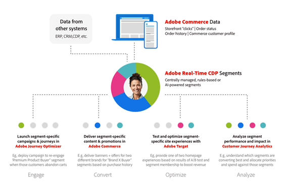

# Adobe Commerce2 月の製品発表

Adobe Commerceは、顧客と緊密に連携し、顧客が迅速に移動し、販売を加速できる新しい経験主導のコマース機能を開発しています。 Hanesbrand のようなお客様は、これらの新機能を使用して、より高速なサイト、より高いコンバージョン率、よりパフォーマンスの高いキャンペーンをすでに活用しています。 Nestle Purina は、統一された開発者体験を活用して、落ち着いた開発をシンプル化しています。 これらの新機能と、この 2 月の製品発表の概要での開始方法について説明します。

{zoomable=&quot;yes&quot;}

## 他の e コマースリーダーから学ぶ

e コマースのリーダーや実務担当者からAdobe Commerceの詳細を学ぶには、以下の対面および仮想イベントにご参加ください。

- **2024 年 3 月 16 日**:Adobe Commerce:Experience-led Commerce Platform の構築（PDT 午前 10 時/午後 6 時）。 [ライブウェビナーへの登録](https://engage.adobe.com/BdgxpComWBR-register.html).

- **2024 年 3 月 26 日～28 日**：数千の e コマースリーダーや実践者がラスベガスのAdobe Summitに住んでいます。 詳細を見る [Adobe Summit](https://business.adobe.com/summit/adobe-summit.html) そして [コマース追跡](https://reg.adobe.com/flow/adobe/as24/sessions/page/catalog?tab.allsessions=1643149273691001NFtR&amp;search.track=1601680652403006TXuG) ～から話を聞いて [Hanesbrands](https://reg.adobe.com/flow/adobe/as24/sessions/page/catalog?tab.allsessions=1643149273691001NFtR&amp;search=S435), [コカコーラ](https://reg.adobe.com/flow/adobe/as24/sessions/page/catalog?tab.allsessions=1643149273691001NFtR&amp;search=S434), [ユニリーバ](https://reg.adobe.com/flow/adobe/as24/sessions/page/catalog?tab.allsessions=1643149273691001NFtR&amp;search=s430)、および [ネスレプリナ](https://reg.adobe.com/flow/adobe/as24/sessions/page/catalog?tab.allsessions=1643149273691001NFtR&amp;search=S437).

以前のイベントの記録：

- [E コマースの合理化](https://experienceleague.adobe.com/docs/events/learn-from-your-peers-recordings/commerce/feb2024/agile-sdlc.html?lang=en):Agile SDLC での通信、要件、テストに重点を置いたアプローチです。 2023 年 2 月 23 日。

- [Hanesbrands：優れたコマースエクスペリエンスのためのデータの活用](https://engage.adobe.com/Q1PersWBR-register1.html). 2023 年 2 月 28 日。

- [Adobe Commerce製品アップデート](https://experienceleague.adobe.com/docs/events/adobe-commerce-product-update-recordings/overview.html?lang=en) 2023 年第 3 四半期および第 4 四半期以降

## App Builder を使用した、合成可能な開発の簡略化

Adobe Commerceは、e コマース機能をより迅速に起動し、サードパーティのシステム間で簡単にデータを共有し、統合やカスタマイズの所有コストを削減するように設計された、合成可能な e コマースプラットフォームです。

従来の合成可能なアプリケーションは、複数のサービス間のポイントツーポイント統合を使用して構築されます。 このアプローチは、技術的債務の増加に伴う脆い統合層につながります。 Adobe Commerceは、包括的な拡張ポイントと、API、イベント、データを調整する拡張プラットフォームを提供し、柔軟に構成可能なアーキテクチャを提供します。 Adobe Commerceプラットフォームには、次のものが含まれます。

- 包括的 [API](https://developer.adobe.com/commerce/webapi/) 対象範囲
- [ウェブフック](https://developer.adobe.com/commerce/extensibility/webhooks/) ネイティブコマースプロセスをカスタマイズする
- [管理 UI](https://developer.adobe.com/commerce/extensibility/admin-ui-sdk/) 拡張性
- 700 以上 [イベント](https://experienceleague.adobe.com/docs/commerce-learn/tutorials/adobe-developer-app-builder/io-events/getting-started-io-events.html)

{align="center" zoomable="yes"}

[Adobe Developer App Builder](https://experienceleague.adobe.com/docs/commerce-learn/tutorials/adobe-developer-app-builder/introduction-to-app-builder.html) Adobe Commerceのは、カスタム機能を構築し、サードパーティソリューションと統合するためのクラウドネイティブな拡張プラットフォームです。 これには、との API オーケストレーションが含まれます。 [API メッシュ](https://experienceleague.adobe.com/docs/commerce-learn/tutorials/adobe-developer-app-builder/api-mesh/getting-started-api-mesh.html)を使用した、スケーラブルなイベントベースのデータルーティング [Adobe I/Oイベント](https://developer.adobe.com/events/docs/)、および [サーバーレスランタイム](https://developer.adobe.com/runtime/docs/guides/overview/howitworks/).

このアプローチにより、開発者は、合成可能なスタックに新しいサービスを追加したり、既存のサービスを置き換えたりする方法が簡素化されます。 App Builder を使用すると、Adobeは App Builder インフラストラクチャのプロビジョニング、拡張、セキュリティを処理しながら、開発者は簡単にアプリや統合を構築できます。 統合された Web コンソール、開発者ツール、ログ、および監視により、優れた開発者エクスペリエンスが提供され、アプリや統合を簡単に作成、実行、管理できます。 最も重要なのは、サードパーティのサービスを App Builder にプラグインして、既存の投資に強力な拡張機能を追加できることです。

>[!TIP]
>
>App Builder の使用を開始する方法については、 [学習パス](https://developer.adobe.com/commerce/extensibility/app-development/learning-path/).

## Web フックと AdminUI SDK の強化

[!BADGE 利用可能]{type=Informative tooltip="利用可能"}

最新のリリースでは、Adobeは、e コマースビジネス向けの合成可能な開発をシンプル化する道を引き続きリードしています。 次の操作を実行できます。 [管理 UI を使用した Web フックの設定](https://developer.adobe.com/commerce/extensibility/webhooks/admin-configuration/) チェックアウトや買い物かごへの追加など、ネイティブなコマースプロセスをさらに簡単に拡張できます。 Web フックを条件付きでトリガーできるようになりました。 例えば、特定の郵便番号に対してのみ、トリガープロセスの出荷計算 Webhook をチェックアウトできます。

開発者は、追加の [列](https://developer.adobe.com/commerce/extensibility/admin-ui-sdk/extension-points/product/grid-columns/), [ボタン](https://developer.adobe.com/commerce/extensibility/admin-ui-sdk/extension-points/order/view-button/)、および [マスアクション](https://developer.adobe.com/commerce/extensibility/admin-ui-sdk/extension-points/order/mass-action/) を既存の管理パネルに追加します。

今年後半に、Adobeにより、API Mesh の可用性が 200 を超えるグローバルな場所に向上し、ネットワークのレイテンシが低減し、計算時間が短縮され、買い物客が全体的により良い体験を提供します。

>[!TIP]
>
>Web フックの使用を開始する方法については、 [ドキュメント](https://developer.adobe.com/commerce/extensibility/webhooks/).

## 統合スターターキットと事前に組み込まれた ERP 統合

[!BADGE 2024 年 6 月に利用可能]{type=Informative tooltip="2024 年 6 月に利用可能"}

e コマースプラットフォームと ERP、OMS、CRM の統合は、ミッションクリティカルな要件です。 企業は、これらの統合を構築するのに数万ドルを費やすことができます。 Adobeは、バックオフィスシステムとの統合コストを削減し、リアルタイム接続の信頼性を向上させるために、統合スターターキットを導入しています。

このキットには、注文、製品、顧客など、一般的に使用されるコマースデータに対するリファレンス統合が含まれています。 また、オンボーディングスクリプトや、開発者が以下のベストプラクティスに基づいて構築するための標準化されたアーキテクチャも含まれます。 スターターキット（現在ベータ版）は、統合作業を最大 50%削減する予定です。

今年後半に、Adobeは、統合スターターキットを使用して、2 つの共通 ERP 用に事前に構築された統合をリリースする予定です。

- [Microsoft Dynamics Finance &amp; Operations](https://www.microsoft.com/en-us/dynamics-365/products/finance)
- [SAP S/4HANA](https://www.sap.com/products/erp/s4hana.html)

これらの参照統合は、開発者がビジネスのニーズに合わせて容易にカスタマイズでき、市場投入までの時間と統合のコストを削減できます。

>[!TIP]
>
>ドキュメントは近日公開予定です。

## Adobe CommerceのEdge Delivery Services

[!BADGE 利用可能]{type=Informative tooltip="利用可能"}

研究は～について示した [買い物客の 64%](https://techreport.com/statistics/website-load-time-statistics-data) Web エクスペリエンスが低い場合は、競合他社のサイトで類似した品目を購入することになります。 逆に、サイトの速度が 0.1 秒に向上するたびに、企業は [平均注文額の 9.2%の増加](https://techreport.com/statistics/website-load-time-statistics-data).

2023 年 [Edge Delivery Services](https://business.adobe.com/products/experience-manager/sites/aem-sites.html) Adobe Experience Managerでは、より迅速で魅力的な web サイトを提供することで、こうした市場の動向に対処するために導入されました。 Adobeは、新しい高性能ストアフロントを備えたこの堅牢なテクノロジーをAdobe Commerceに提供しています。

本当に強力で完全なコマースエクスペリエンスを提供するために、この新しいストアフロントには、 [Edge Delivery Services](https://business.adobe.com/products/experience-manager/sites/aem-sites.html) ドキュメントベースのオーサリング、パフォーマンスに優れたアーキテクチャ、標準のネイティブ実験を使用し、 [Adobe Commerce SaaS](https://experienceleague.adobe.com/docs/commerce-merchant-services/user-guides/home.html) 製品と、オンラインで処理するために必要なコマース機能を提供するドロップインコンポーネントの柔軟性と利便性。

この新しい高性能ストアフロントは、既に、次のようなAdobe Commerceの複数の商人によって正常に操作されています。 [Maidenform](https://business.adobe.com/blog/perspectives/how-hanesbrands-and-adobe-built-one-of-the-fastest-ecommerce-websites-in-the-world):HanesBrands のプロパティ。 その結果は自分で語る。 Maidenform ページは、常に 100 個のGoogle Lighthouse スコアを配信し、 [主要な Web 仮想レポートの結果](https://www.rumvision.com/tools/core-web-vitals-history/www.maidenform.com/?path=/) 業界平均をはるかに上回る

{width=&quot;50%&quot; align=center}

{zoomable=&quot;yes&quot;}

ソース： [https://treo.sh/sitespeed/www.maidenform.com](https://treo.sh/sitespeed/www.maidenform.com)

_「今までと同じくビジネスに反応する夢が実現しました。 「もっと早く何か欲しいと思った？ 世界で最も速い e コマースサイトを持っているかもしれません』」_ - HanesBrands, Inc.、消費者テクノロジー担当副社長兼グローバル・ヘッド、Leo Griffin 氏

Adobe CommerceのEdge Delivery Servicesについて詳しくは、 [Adobe Summit](https://reg.adobe.com/flow/adobe/as24/sessions/page/catalog?tab.format=1643049381306001SAYb&amp;search=masterclass&amp;search.track=1601680652403006TXuG)には、標準搭載のストアフロントコンポーネントが含まれています。これにより、パフォーマンスファーストのアーキテクチャを迅速に採用できます。

また、実践型のサービスも提供しています [ラボセッション](https://reg.adobe.com/flow/adobe/as24/sessions/page/catalog?tab.format=1643049381306001SAYb&amp;search=%5BL445%5D&amp;search.track=1601680652403006TXuG&amp;search.track=option_1636755664165) この新しい店舗の内側の仕事と設定をより深く掘り下げるには

## Adobe Commerceの HIPAA 対応ソリューション

[!BADGE 利用可能]{type=Informative tooltip="利用可能"}

Adobeは、あらゆる規模の医療関連のお客様に対して、HIPAA 対応サービスを導入した経験が豊富です。 支払い業者からプロバイダー、製薬会社、医療技術ベンダーまで、Adobeは責任ある消費者データ管理の基準を設定しています。 この専門知識は、Adobe Commerceクラウドプラットフォームの HIPPA 対応バージョンを備え、急速に成長するヘルスケアデジタルコマース市場にも広がっています。

HIPAA 対応の製品は、Adobe Commerce Managed Servicesのお客様が利用できます。 また、PHI(Electronic Personal Health Information) の保護を確実にするセキュリティとプライバシーに関する管理機能が追加されているため、医療機関やライフサイエンス組織は、コンプライアンス上の義務をより簡単に果たすことができます。 このソリューションは、医療保険、処方箋、所定の医療機器、医療用品など、様々な用途に対応しています。 Adobe Commerceが [Adobe Experience Cloud for Healthcare](https://business.adobe.com/solutions/industries/healthcare.html) ソリューションのスイート。お客様は、消費者の好みに応えながら、安全で優れた患者体験を提供できます。

>[!TIP]
>
>Adobe Commerceの HIPAA 対応の詳細については、 [ドキュメント](https://experienceleague.adobe.com/docs/commerce-admin/start/compliance/hipaa-ready-service.html).

## B2B コマース

[!BADGE 2024 年 4 月に利用可能]{type=Informative tooltip="2024 年 4 月に利用可能"}

Adobe Commerceは、企業アカウント、購入承認ルール、見積もり管理、お客様の価格表など、ミッションクリティカルな B2B エコマース機能を長年に渡って提供してきました。 B2B のエコマースリーダーがそう思う理由は [Watsco](https://business.adobe.com/content/dam/dx/us/en/resources/ebooks/building-better-experiences/building-better-experiences-and-bigger-profits.pdf), [SealedAir](https://business.adobe.com/customer-success-stories/sealed-air-case-study.html), [サンベルトレンタルズ](https://business.adobe.com/customer-success-stories/sunbelt-rentals-case-study.html), [トランサット](https://business.adobe.com/customer-success-stories/transcat-case-study.html), [FoodServiceDirect.com](https://business.adobe.com/customer-success-stories/foodservicedirect-case-study.html)、および [Univar Solutions](https://business.adobe.com/summit/2023/sessions/debunking-top-b2b-commerce-myths-s517.html) Adobe Commerceでグローバルな B2B e コマースチャネルを強化する。

Adobeは、4 月に新しい見積もりと企業管理機能が提供されることを嬉しく思っています。

企業管理機能を使用すると、Adobeの新しい親/子アカウント構造を使用して、B2B2X、コングロマリット、グローバルビジネスをサポートするために必要なあらゆるバイヤー企業構造を設定できます。 また、購入者は、購入を合理化するために、複数の子アカウントを切り替えることもできます。

当社の強力な組み込みの見積もりツールを基に、B2B 販売者は、下書き引用符、重複引用符、分割引用符、見積もりテンプレート、見積もりへの複数管理者アクセスなど、新しい見積もり依頼 (RFQ) ツールを使用して、より迅速に収益を獲得できます。

どちらの機能も、GraphQL API を介したAdobe Commerceのネイティブストアフロントアーキテクチャやヘッドレスコマースのデプロイメントと互換性があります。

>[!TIP]
>
>B2B コマース機能の詳細については、次のドキュメントを参照してください。
>
>- [B2B for Adobe Commerceユーザーガイド](https://experienceleague.adobe.com/docs/commerce-admin/b2b/guide-overview.html)
>- [B2B for Adobe Commerce Developer Guide](https://developer.adobe.com/commerce/webapi/rest/b2b/)

## Adobe CommerceとAdobe Experience Platformの詳細な統合

[!BADGE 2024 年 6 月に利用可能]{type=Informative tooltip="2024 年 6 月に利用可能"}

昨年、Adobe Commerceがリリースされました [データ接続](https://experienceleague.adobe.com/docs/commerce-merchant-services/data-connection/overview.html)：ストアフロントクリック数、バックオフィスの注文ステータス、注文履歴情報など、様々なコマースデータを自動的に収集、マッピング、共有します。 現在、デジタルコマースのリーダーは、データ接続を使用して、データサイロの分類、統合された顧客プロファイルとオーディエンスの作成、カスタマージャーニーのパーソナライズ、豊富な分析の強化をおこなっています。

今年上半期には、Adobeは、 [コマース顧客プロファイル](https://experienceleague.adobe.com/docs/commerce-admin/customers/customer-accounts/manage/update-account.html)、モバイルアプリの動作およびバックオフィスイベントのカスタム属性を使用して、キャンペーンとエクスペリエンスを大規模にパーソナライズできます。

例えば、顧客は、リアルタイムコマースの顧客登録を使用して、 [Adobe Journey Optimizer](https://experienceleague.adobe.com/docs/journey-optimizer/using/get-started/get-started.html).

{align="center" zoomable="yes"}

他のAdobe Experience Cloudソリューションと共に、数百のAdobe Commerceの実装から情報を得て、Adobeが開始されています [ユースケースプレイブック](https://experienceleague.adobe.com/docs/journey-optimizer/using/get-started/playbooks.html)：すぐに利用できる実装アセットで、お客様がすぐに価値を創出できるようにします。

最初のAdobe Commerceプレイブックを使用すると、顧客は、データ設定プロセスを通じて、放棄された買い物かごキャンペーンを簡単に開始できます。 連携すると、顧客はキャンペーンをすばやく開始でき、時間を節約し、売り上げを伸ばすのに役立ちます。 あるグローバル小売業者は、1.9 倍のコンバージョンオンクリック、1 週間に 1,000 人の再エンゲージメント、Adobe CommerceおよびAdobe Journey Optimizerでの放棄キャンペーンの開始に伴う 2 桁の売上高上昇を達成しました。

Adobeは、マーケターがコマースデータを分析し、パーソナライゼーションの機会を見つけ出すのに役立つように、Adobe Experience Platformにコマース固有のダッシュボードを追加しています。

{zoomable=&quot;yes&quot;}

昨年、Adobe Commerceも打ち上げました [Audience Activation](https://experienceleague.adobe.com/docs/commerce-admin/customers/audience-activation.html):Real-Time CDPの統合された顧客プロファイルとオーディエンスを活用して、買い物客のジャーニーをパーソナライズします。 特に、 [Adobe Real-Time CDP](https://experienceleague.adobe.com/docs/experience-platform/rtcdp/intro/rtcdp-intro/get-started.html) Adobe Commerceでコンテンツやプロモーションオファーをターゲット設定するために、コマースデータを他のソースのデータと結び付け、詳細な顧客プロファイルとオーディエンスセグメントを作成します。

今年上半期には、Adobeが拡大しています [Audience Activation](https://experienceleague.adobe.com/docs/commerce-admin/customers/audience-activation.html) マーケターやマーケターがAdobeのReal-Time CDPで定義されたオーディエンスを使用して、Adobe Commerceショッピングエクスペリエンスのより多くの側面をパーソナライズする機能。 [関連製品](https://experienceleague.adobe.com/docs/commerce-admin/marketing/promotions/product-relationships/product-related-rules.html), [promotions](https://experienceleague.adobe.com/docs/commerce-admin/marketing/promotions/cart-rules/price-rules-cart.html)、および [コンテンツブロック](https://experienceleague.adobe.com/docs/commerce-admin/content-design/elements/dynamic-blocks/dynamic-blocks.html). Adobeは、Web チャネルに加えて、Adobe Commerceのネイティブモバイルアプリデプロイメントでのユーザーの行動を追跡するためのサポートもリリースします。

>[!TIP]
>
>Adobe Commerce Data Connection の使用を開始する方法については、 [ドキュメント](https://experienceleague.adobe.com/docs/commerce-merchant-services/data-connection/overview.html):

## Adobe Commerceの支払いサービス

[!BADGE 利用可能]{type=Informative tooltip="利用可能"}

[Adobe Commerceの支払いサービス](https://business.adobe.com/products/magento/payment-services.html) は、支払いを簡素化し、コンバージョンと売上高を増やす SaaS サービスです。 トヨタの北米などの企業が使用し、様々な支払い方法とオプションの詐欺および不正使用保護機能を複数の市場でサポートしています。 これにより、マーチャントは支払いを安全に管理し、効率を高めるために 1 つの管理者エクスペリエンスでデータを注文できます。

最新のリリースは、2023 年の一連の更新に基づいて構築され、Apple Pay と Signifyd の統合、英国、フランス、オーストラリアへの国際的なサポート、企業規模のインフラストラクチャ拡大、トランザクションレポートが追加されました。 新しい機能は、どのストアフロント技術が使用されていても、支払いオプションを拡張し、開始を容易にします。

>[!TIP]
>
>支払いサービスの開始方法については、 [ドキュメント](https://experienceleague.adobe.com/docs/commerce-merchant-services/payment-services/guide-overview.html).

### 支払いサービスのヘッドレスサポート

[!BADGE 利用可能]{type=Informative tooltip="利用可能"}

最新のリリースでは、支払いサービスにGraphQLのサポートが含まれるようになり、マーチャントは、Adobe Experience Managerなどのヘッドレスストアフロント実装で支払いを受け入れ、処理できます。

また、支払いサービスは、より競争力のある支払い処理率のための Interchange++を含む、お客様に適した価格オプションも提供します。 [セルフサービスのオンボーディング](https://experienceleague.adobe.com/docs/commerce-merchant-services/payment-services/get-started/production.html#standard-onboarding) 支払いサービスに対する基本は、世界中の約 200 地域に支払い処理機能を提供します。

>[!TIP]
>
>支払いサービス API の使用開始方法については、 [ドキュメント](https://developer.adobe.com/commerce/webapi/graphql/payment-services/).

### Google Pay for Payment Services

[!BADGE 2024 年第 1 四半期に利用可能]{type=Informative tooltip="2024 年第 1 四半期に利用可能"}

今年上半期までに、Adobe Commerceは、主要なデジタルウォレットであるGoogle・ペイのサポートをリリースする予定です。 Insider Intelligence によると、Google・ペイは、 [3,600 万人の消費者](https://forecasts-na1.emarketer.com/591373e4aeb8830e3829e400/5efc402eac4d4d07841472f9?_gl=1*qmtm8x*_ga*OTEwMjg4NjExLjE3MDY2MzQ2MTk.*_ga_XXYLHB9SXG*MTcwNjk3NjkzNS44LjAuMTcwNjk3NjkzNS42MC4wLjA.*_gcl_au*MTkwNzgzOTY5OS4xNzA2NjM0NjE5LjQ3MzE4MjY5LjE3MDY3MTcwMjUuMTNjcxNzIyNQ...) 2024 年に。 Google Pay の追加により、Apple Pay や PayPal を含む人気のデジタル財布のサポートが終了しました。

これらのデジタル財布は、買い物客に対して適切な支払い方法を提供し、購入の信頼性と購入の完了を高めます。

>[!TIP]
>
>ドキュメントは近日公開予定です。

## ライブ検索を使用した AI を利用したパーソナライゼーション

[!BADGE 利用可能]{type=Informative tooltip="利用可能"}

企業は、顧客が適切な製品を見つけるのを支援し、あらゆるチャネルをまたいでパーソナライズされたキャンペーン、オファー、コミュニケーションを提供することから、購入ジャーニーのあらゆる部分をパーソナライズしようとしています。

[ライブ検索 (powered by Adobe Sensei)](https://business.adobe.com/products/magento/live-search.html)を使用すると、顧客が必要なものを正確に見つける方法をパーソナライズして、コンバージョン率を高めることができます。 実際、ライブ検索のお客様は、ライブ検索を開始した後、コンバージョン率を平均 7%上昇させます。また、15%のお客様が 40%を超えるコンバージョン上昇を経験しています。

Adobeのライブ検索の最新リリースでは、これらの機能を使いやすくすることに重点を置いており、独自のニーズに合わせて検索エクスペリエンスを完全にカスタマイズできます。 これで、特定の [AI 再ランキングルール](https://experienceleague.adobe.com/docs/commerce-merchant-services/live-search/live-search-admin/rules/rules-add.html) 最大ボリューム検索の場合は、デフォルトのフォールバックルールでこれらのルールを補完し、 _その他のすべてのクエリ_.

例えば、マーチャンダイザーは、「dress」というフレーズを含むすべての検索クエリを _トレンド項目_ アルゴリズム。 同じマーチャンダイザーが _購入回数_ アルゴリズムを使用して、他のすべての検索クエリを検索できます。 このアップデートにより、ブランドは検索ごとに上位の製品を表示でき、パーソナライズされたマーチャンダイジングを簡単に実現できます。

{align="center" zoomable="yes"}

Adobeでは、ライブ検索用の新しいカスタマイズオプションも導入されました。 ライブ検索の使用 [PLP ウィジェット](https://experienceleague.adobe.com/docs/commerce-merchant-services/live-search/live-search-storefront/plp-styling.html) および [ポップオーバーウィジェット](https://experienceleague.adobe.com/docs/commerce-merchant-services/live-search/live-search-storefront/storefront-popover.html)を使用すると、カラースウォッチ、製品詳細ページレイアウトオプション、買い物かごへの追加ボタン、価格スライダーなどのライブ検索 UI 機能を低コード設定ツールでデザインできます。 Adobeは、 [コードリポジトリを開く](https://experienceleague.adobe.com/docs/commerce-merchant-services/live-search/onboard/technical-overview.html?lang=en#widget-code-repository)：ベストプラクティスの参照実装として機能します。

>[!TIP]
>
>ライブ検索の基本を学ぶには、 [ドキュメント](https://experienceleague.adobe.com/docs/commerce-merchant-services/live-search/guide-overview.html):

## Zuora を活用したサブスクリプションコマース

[!BADGE 利用可能]{type=Informative tooltip="利用可能"}

金融サービス会社 UBS によると、サブスクリプション経済は、2021 年の 6500 億ドルから 1 兆 5000 億ドルに達する軌道に乗っている。 消費者も企業も、利便性と価値のため、サブスクリプション製品やサービスを購入する際に、より快適になっています。

企業がビジネスにサブスクリプション収益ストリームを追加し、既存の定期的な収益ビジネスモデルをサポートできるように、Adobe Commerceは、業界をリードするサブスクリプション管理プラットフォームである Zuora と提携し、 [Zuora :Adobe Commerceの購読管理](https://commercemarketplace.adobe.com/zuora-revenue-management-with-subcriptions.html) 拡張子。

Adobeの App Builder フレームワークに基づいて構築され、 [Zuora 拡張機能](https://commercemarketplace.adobe.com/zuora-revenue-management-with-subcriptions.html) received [Adobe Commerce App Assurance プログラム](https://developer.adobe.com/commerce/marketplace/guides/sellers/assurance/) React ネイティブのフロントエンドアーキテクチャやAdobe I/Oイベントの使用、AdobeAPI Mesh を含む、合理化可能な開発のベストプラクティスに従って、コアAdobe Commerceプラットフォーム内のカスタマイズを制限する認識です。

>[!TIP]
>
>Zuora 拡張機能の使用を開始する方法については、 [ドキュメント](https://commercemarketplace.adobe.com/media/catalog/product/zuora-revenue-management-with-subcriptions-1-0-0-ece/installation_guides.pdf?1708112475).

## Adobe Experience Manager Assets統合

[!BADGE 2024 年 6 月までにベータ版が利用可能になりました。]{type=Informative tooltip="2024 年 6 月までにベータ版が利用可能になりました。"}

経験豊富なリーディングとは、買い物客に購入を促す高品質の製品画像やビデオを提示することを意味します。 Adobe Commerceは、 [Adobe Experience Manager Assets](https://business.adobe.com/products/experience-manager/assets/aem-assets.html). 製品間でアセットを手動でマッピングおよび更新する代わりに、Adobe Experience Manager Assetsの画像とビデオをAdobe Commerceの対応する製品に自動的に照合して添付する新しい Rules Engine Service を使用できます。 Adobe Experience Manager Assetsに追加された新しい画像や更新された画像は、自動的に照合および共有されます。また、ユーザーは一括照合機能を利用して、季節ごとの更新や新しい製品ラインの紹介を効率的に管理できます。

AdobeExperience Management Manager Assets も、 [Adobe GenStudio](https://business.adobe.com/solutions/adobe-genstudio.html)は、生成 AI とインテリジェントな自動化により、コンテンツサプライチェーン管理を迅速かつシンプル化するエンドツーエンドのソリューションです。 Adobe Commerceをご利用のお客様は、このより広範なソリューションを活用して、 [Adobe Firefly](https://www.adobe.com/products/firefly.html) 販売を促進する、新鮮でパーソナライズされた資産の生成 AI とAdobe Express。

ベータ版の新しいルールエンジンサービスは、今年の 6 月までにリリースされる予定です。 このAdobe Experience Manager Assets統合との統合について詳しくは、 [Adobe Commerce 2024 ロードマップレビュー](https://reg.adobe.com/flow/adobe/as24/sessions/page/catalog?tab.allsessions=1643149273691001NFtR&amp;search=s432) Adobe Summit時のブレークアウトセッション。

>[!TIP]
>
>ドキュメントは近日公開予定です。

## Adobe Commerce 2.4.7 の一般リリース

[!BADGE 2024 年 4 月に利用可能]{type=Informative tooltip="2024 年 4 月に利用可能"}

Adobeのパフォーマンスに対するコミットメントは、4 月に予定されているAdobe Commerce 2.4.7 のリリースで引き続きおこなわれます。 この新しいリリースでは、10 万のアクティブなプロモーションのサポート、1,000 万のアクティブなクーポンのサポート、複数のプロモーションの 1 回の注文に対する交換機能、GraphQLの応答時間の 30%の高速化、GraphQLのキャッシュの向上、1 分あたり 100,000 個の製品を JSON 形式でAdobe Commerceに読み込む機能など、主な改善がサポートされます。 Adobe Commerceがリリースされました [ベータ版](beta.md) 開発者がビルドしてテストできるようにするため。

>[!TIP]
>
>2.4.7 リリースの詳細については、 [ドキュメント](https://experienceleague.adobe.com/docs/commerce-operations/release/notes/adobe-commerce/2-4-7.html).

## 今後について

2024 年にさらに進むにつれて、ストアフロントのパフォーマンスを向上し、AI を利用したパーソナライゼーション機能を使用することで、e コマースのリーダーがエクスペリエンス主導のコマースを提供することが重要です。 また、テクノロジーの専門家は、シンプルで合成可能な開発フレームワークを使用して、迅速に移行する必要があります。 Adobe Commerceのチーム全員が、e コマースビジネスがプラットフォーム上で成長している姿に情熱を持っています。また、最新のリリースでは、プラットフォームの広範な範囲が強調されています。

Adobe Commerceとの関わり方については、次のとおりです。

- [Adobe Commerceの詳細](https://business.adobe.com/products/magento/magento-commerce.html) または一緒に住む [Adobe Summit](https://business.adobe.com/summit/adobe-summit.html) ラスベガス 2024 年 3 月 25 日～28 日
- Adobe Commerce 2024 年 2 月をお読みください [ブログ投稿をリリース](https://business.adobe.com/blog/the-latest/adobe-commerce-continues-investment-in-composable-development-tools-and-ai-powered-personalization)
