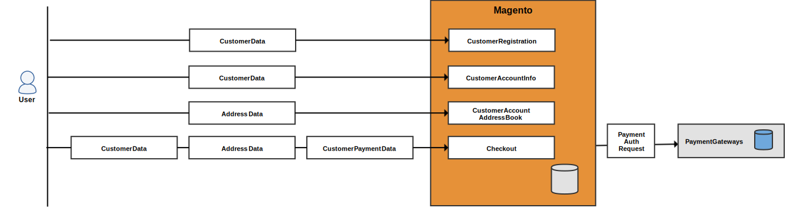
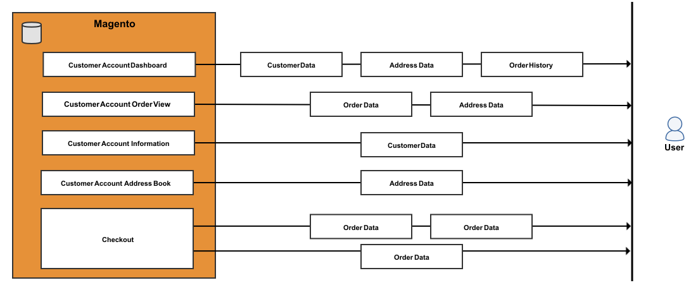
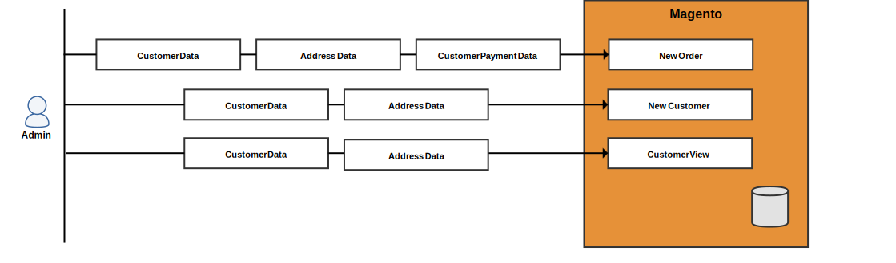
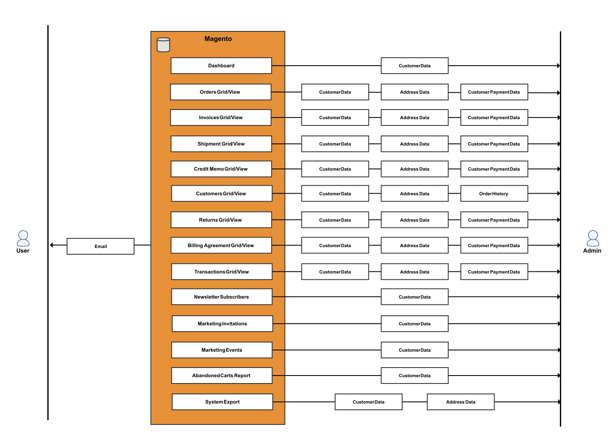

# お客様の個人情報の参照（バージョン 2.x）

>[!NOTE]
>
>これは、Adobe Commerceを利用するマーチャントや開発者が、プライバシー規制に準拠するための準備を整えるのに役立つ、一連のトピックの1つです。 自社が法的義務を果たすべきかどうか、どのように遵守すべきかを判断するには、法務担当者に相談してください。

次のデータフロー図とデータベースエンティティのマッピングを、プライバシー規制に準拠したコンプライアンスプログラムを開発する際に参照してください。

- [GDPR](gdpr.md)
- [CCPA](ccpa.md)

## データフロー図

データフロー図には、顧客と管理者がストアフロントと管理者から入力および取得できるデータの種類が表示されます。

### フロントエンドのデータエントリポイント

利用者は、アカウント登録時、チェックアウト時などのイベントで、顧客、住所、支払い情報を入力することができます。

### フロントエンドのデータアクセスポイント

Adobe Commerceでは、お客様がログインして複数のページを表示したり、チェックアウトしたりすると、お客様の情報が読み込まれます。

### バックエンドのデータエントリポイント

管理者から顧客または注文を作成する際に、加盟店は顧客情報、住所データ、支払いデータを入力できます。

### バックエンドのデータアクセスポイント

Adobe Commerceを使用すれば、顧客に関する情報を自動的に読み込み、グリッドをクリックして詳細を確認したり、その他のさまざまなタスクを実行したりできます。

## データベースエンティティ

Adobe Commerceでは、主に、顧客、住所、注文、見積もり、支払いテーブルに顧客固有の情報が保存されます。 その他のテーブルには、顧客IDへの参照が含まれています。

### 顧客データ

Adobe Commerceでは、次の顧客属性を保存するように設定できます。

- 生年月日
- メール
- 名
- 性別
- 姓
- ミドルネーム/イニシャル
- 名前のプレフィックス
- 名前の接尾辞

>[!NOTE]
>
>現在のセキュリティとプライバシーのベストプラクティスに従って、データを収集または処理する前に、顧客の生年月日（月、日、年）およびその他の個人識別子（氏名など）の保存に関連する潜在的な法的およびセキュリティリスクを必ず認識してください。

#### `customer_entity`および「customer_entity」の参照

`customer_entity` テーブルの次の列には、顧客情報が含まれています。

| 列 | データタイプ |
| ------------ | ------------ |
| `email` | varchar （255） |
| `prefix` | varchar （40） |
| `firstname` | varchar （255） |
| `middlename` | varchar （255） |
| `lastname` | varchar （255） |
| `suffix` | varchar （40） |
| `dob` | 日付 |
| `gender` | smallint （5） |

これらのテーブルは`customer_entity`を参照し、カスタム顧客属性を含めることができます：

| テーブル | 列 | データタイプ |
| -------------------------- | ------- | ------------- |
| `customer_entity_datetime` | `value` | datetime |
| `customer_entity_decimal` | `value` | decimal （12,4） |
| `customer_entity_int` | `value` | int （11） |
| `customer_entity_text` | `value` | テキスト |
| `customer_entity_varchar` | `value` | varchar （255） |

#### `customer_grid_flat` テーブル

`customer_grid_flat` テーブルの次の列には、顧客情報が含まれています。

| 列 | データタイプ |
| -------------------- | ------------ |
| `name` | テキスト |
| `email` | varchar （255） |
| `dob` | 日付 |
| `gender` | int （11） |
| `shipping_full` | テキスト |
| `billing_full` | テキスト |
| `billing_firstname` | varchar （255） |
| `billing_lastname` | varchar （255） |
| `billing_telephone` | varchar （255） |
| `billing_postcode` | varchar （255） |
| `billing_country_id` | varchar （255） |
| `billing_region` | varchar （255） |
| `billing_city` | varchar （255） |
| `billing_fax` | varchar （255） |
| `billing_vat_id` | varchar （255） |
| `billing_company` | varchar （255） |

### アドレスデータ

Adobe Commerceには、次のお客様属性が保存されます。

- 市区町村
- 会社
- 国
- Fax
- 名
- 姓
- ミドルネーム/イニシャル
- 名前のプレフィックス
- 名前の接尾辞
- 電話番号
- 都道府県
- 都道府県ID
- 住所
- VAT番号
- 郵便番号

#### `customer_address_entity`および`customer_address_entity`参照

`customer_address_entity` テーブルの次の列には、顧客情報が含まれています。

| 列 | データタイプ |
| ------------ | ------------ |
| `city` | varchar （255） |
| `company` | varchar （255） |
| `country_id` | varchar （255） |
| `fax` | varchar （255） |
| `firstname` | varchar （255） |
| `lastname` | varchar （255） |
| `middlename` | varchar （255） |
| `postcode` | varchar （255） |
| `region` | varchar （255） |
| `region_id` | int （10） |
| `street` | テキスト |
| `suffix` | varchar （40） |
| `telephone` | varchar （255） |
| `vat_id` | varchar （255） |

これらのテーブルは`customer_address_entity`を参照し、カスタム顧客属性を含めることができます：

| テーブル | 列 | データタイプ |
| ---------------------------------- | ------- | ------------- |
| `customer_address_entity_datetime` | `value` | datetime |
| `customer_address_entity_decimal` | `value` | decimal （12,4） |
| `customer_address_entity_int` | `value` | int （11） |
| `customer_address_entity_text` | `value` | テキスト |
| `customer_address_entity_varchar` | `value` | varchar （255） |

### 注文データ

`sales_order`と関連するテーブルには、顧客名、請求先住所と配送先住所、および関連するデータが含まれています。

#### `sales_order` テーブル

`sales_order` テーブルの次の列には、顧客情報が含まれています。

| 列 | データタイプ |
| --------------------- | ------------ |
| `customer_dob` | datetime |
| `customer_email` | varchar （128） |
| `customer_firstname` | varchar （128） |
| `customer_gender` | int （11） |
| `customer_group_id` | int （11） |
| `customer_id` | int （10） |
| `customer_lastname` | varchar （128） |
| `customer_middlename` | varchar （128） |
| `customer_prefix` | varchar （32） |
| `customer_suffix` | varchar （32） |
| `customer_taxvat` | varchar （32） |
| `quote_address_id` | int （11） |
| `remote_ip` | varchar （32） |
| `x_forwarded_for` | varchar （32） |

#### `sales_order_address` テーブル

`sales_order_address` テーブルに顧客のアドレスが含まれています。

| 列 | データタイプ |
| --------------------- | ------------ |
| `customer_address_id` | int （11） |
| `quote_address_id` | int （11） |
| `region_id` | int （11） |
| `customer_id` | int （11） |
| `fax` | varchar （255） |
| `region` | varchar （255） |
| `postcode` | varchar （255） |
| `lastname` | varchar （255） |
| `street` | varchar （255） |
| `city` | varchar （255） |
| `email` | varchar （255） |
| `telephone` | varchar （255） |
| `country_id` | varchar （2） |
| `firstname` | varchar （255） |
| `suffix` | varchar （255） |
| `company` | varchar （255） |

#### `sales_order_grid` テーブル

`sales_order_grid` テーブルの次の列には、顧客情報が含まれています。

| 列 | データタイプ |
| ---------------------- | ------------ |
| `customer_id` | int （10） |
| `shipping_name` | varchar （255） |
| `billing_name` | varchar （255） |
| `billing_address` | varchar （255） |
| `shipping_address` | varchar （255） |
| `shipping_information` | varchar （255） |
| `customer_email` | varchar （255） |
| `customer_name` | varchar （255） |

### 見積もりデータ

見積もりには、顧客の名前、電子メール、住所、関連情報が記載されています。

#### `quote` テーブル

`quote` テーブルの次の列には、顧客情報が含まれています。

| 列 | データタイプ |
| --------------------- | ------------ |
| `customer_id` | int （10） |
| `customer_email` | varchar （255） |
| `customer_prefix` | varchar （40） |
| `customer_firstname` | varchar （255） |
| `customer_middlename` | varchar （40） |
| `customer_lastname` | varchar （255） |
| `customer_dob` | datetime |
| `remote_ip` | varchar （32） |
| `customer_taxvat` | varchar （255） |
| `customer_gender` | varchar （255） |

#### `quote_address` テーブル

`quote_address` テーブルの次の列には、顧客情報が含まれています。

| 列 | データタイプ |
| ------------- | ------------ |
| `customer_id` | int （10） |
| `email` | varchar （255） |
| `prefix` | varchar （40） |
| `firstname` | varchar （255） |
| `middlename` | varchar （40） |
| `lastname` | varchar （255） |
| `suffix` | varchar （40） |
| `company` | varchar （255） |
| `street` | varchar （255） |
| `city` | varchar （255） |
| `region` | varchar （255） |
| `region_id` | int （10） |
| `postcode` | varchar （20） |
| `country_id` | varchar （30） |
| `telephone` | varchar （255） |
| `fax` | varchar （255） |

### お支払い方法

`sales_order_payment` テーブルには、クレジットカード情報およびその他の取引情報が含まれています。

| 列 | データタイプ |
| ------------------------ | ------------ |
| `cc_exp_month` | varchar （12） |
| `echeck_bank_name` | varchar （128） |
| `cc_last_4` | varchar （100） |
| `cc_owner` | varchar （128） |
| `po_number` | varchar （32） |
| `cc_exp_year` | varchar （4） |
| `echeck_routing_number` | varchar （32） |
| `cc_debug_response_body` | varchar （32） |
| `echeck_account_name` | varchar （32） |
| `cc_number_enc` | varchar （128） |
| `additional_information` | テキスト |

### 招待データ

Adobe Commerceでは、お客様がプライベート セールスやイベントに招待状を送信できるように設定できます。

#### `magento_invitation` テーブル

`magento_invitation` テーブルには、顧客ID、電子メール、および参照IDが含まれています。

| 列 | データタイプ |
| ------------- | ------------ |
| `customer_id` | int （10） |
| `email` | varchar （255） |
| `referral_id` | int （10） |

#### `magento_invitation_track` テーブル

`magento_invitation_track` テーブルには顧客情報も含まれています。

| 列 | データタイプ |
| ------------- | --------- |
| `inviter_id` | int （10） |
| `referral_id` | int （10） |

### 顧客を参照するその他のテーブル

次のテーブルには`customer_id`列が含まれています。

- `catalog_compare_item`
- `catalog_product_frontend_action`
- `downloadable_link_purchased`
- `magento_customerbalance`
- `magento_customersegment_customer`
- `magento_reward`
- `magento_rma`
- `oauth_token`
- `paypal_billing_agreement`
- `persistent_session`
- `product_alert_price`
- `product_stock_alert`
- `report_compared_product_index`
- `report_viewed_product_index`
- `review_detail`
- `salesrule_coupon_usage`
- `salesrule_customer`
- `wishlist`
