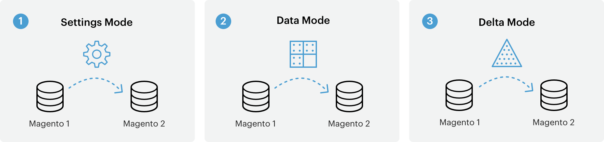
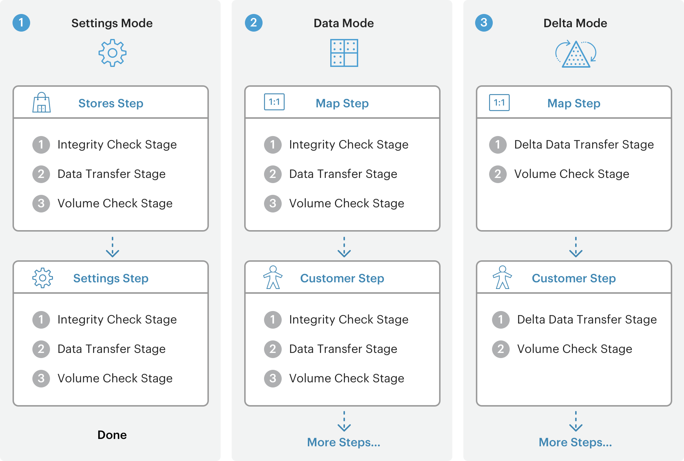
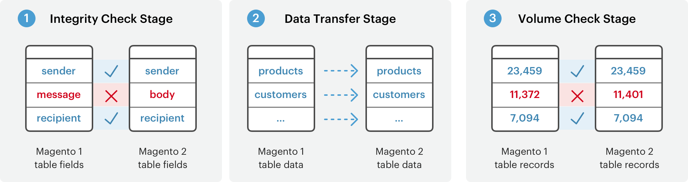
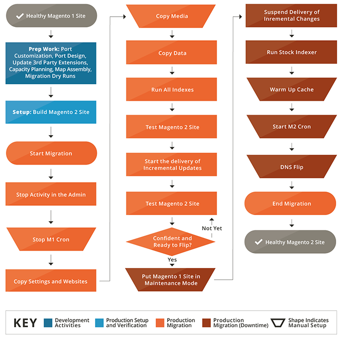

# データ移行の仕組み

このトピックでは、[!DNL Data Migration Tool]を使用してMagento 1からMagento 2にデータを移行する方法の概要を説明します。

[!DNL Data Migration Tool]は、Magento 1からMagento 2へのデータ転送に使用されるコマンドラインインターフェイス（CLI）ツールです。 このツールは、Magento 1と2のデータベース構造（テーブルとフィールド）の整合性を検証し、データ転送の進行状況を追跡し、ログを作成し、データ検証テストを実行します。

## 用語

* **モード** - Magento 1.xからMagento 2.xにデータを移行するための順序付き一連の操作。
* **手順** – 移行するデータの種類を定義するモードのタスク。
* **ステージ** - データを検証、転送、検証する手順のタスク。
* **マップ ファイル** - ステージを完了するためのMagento 1.xとMagento 2.x データ構造間のルールと接続を定義するXML ファイル。

## モード

[!DNL Data Migration Tool]は、Magento 1.xからMagento 2.xにデータを転送して適応させるために、移行プロセスを3つのフェーズまたは&#x200B;*モード*&#x200B;に分割します。 3つのモードは以下に示されており、この順序で実行する必要があります。

1. **設定モード**：システム設定とweb サイト関連の設定を移行します。
1. **データモード**: データベースアセットを一括で移行します。
1. **デルタモード**：新規顧客や注文などの増分変更（前回の実行以降の変更）を移行します。

## 手順

[!DNL Data Migration Tool]は、各モード内の&#x200B;*ステップ*&#x200B;のリストを使用して、特定のタイプのデータを移行します。 例えば、設定モードでは、すべての設定データを移行するために使用される2つの手順があります。ストアステップと設定ステップです。 これらの各手順（および他のモードの手順）で移行される特定のデータに関する詳細については、[[!DNL Data Migration Tool] 技術仕様](technical-specification.md)を参照してください。

## ステージ

各ステップ内には、データが適切に移行されるように、常にこの順序で実行される3つの&#x200B;*ステージ*&#x200B;があります。

1. **整合性チェック**: テーブル フィールド名、型、およびその他の情報を比較して、Magento 1と2のデータ構造の互換性を検証します。
1. **データ転送**: Magento 1および2からテーブルでデータテーブルを転送します。
1. **ボリュームチェック**: テーブル間のレコード数を比較して、転送が成功したことを確認します。

## ファイルをマップ

移行プロセスの最下位レベルには、XML *マップファイル*&#x200B;があります。 [!DNL Data Migration Tool]は、ステップのステージ内でマップファイルを使用して、Magento 1.x テーブルと2.x テーブルの間で異なるデータ構造を変換します。

例えば、Magento Open Source 1.8.0.0 データベースからMagento Open Source 2.x.xにデータを変換する場合、マップファイルは、テーブルの名前が変更されたという事実を考慮し、宛先データベースの名前を変更します。 データ構造またはデータ形式に違いがない場合、[!DNL Data Migration Tool]は、拡張機能で作成されたテーブルのデータを含め、そのままMagento 2 データベースに転送します。

差分がマップ ファイルで宣言されていない場合、[!DNL Data Migration Tool]はエラーを表示し、開始しません。

マッピングファイルについて詳しくは、[[!DNL Data Migration Tool] Technical Specification]を参照してください。

## 移行フロー図

[[!DNL Data Migration Tool]技術仕様](technical-specification.md)

アドビは、世界的な#1 コマース基盤であるMagento 1.xから、将来のプラットフォームであるMagento 2への移行を検討しています。 移行と呼ばれるこのプロセスについて、詳しくお話しできることを嬉しく思います。

## 移行コンポーネント

Magento 2への移行には、データ、拡張機能、カスタムコード、テーマ、カスタマイズの4つのコンポーネントが含まれます。

### データ

**Magento 2[!DNL Data Migration Tool]**&#x200B;は、商品、お客様、注文データ、店舗構成、プロモーションなどをMagento 2に効率的に移行するために開発されました。 このガイドでは、データの移行に使用するツールとベストプラクティスについて説明します。

### 拡張機能とカスタムコード

Magento 2でMagento 1拡張機能を使用できるよう、開発コミュニティと懸命に取り組んでいます。 お気に入りの拡張機能の最新版をダウンロードまたは購入できる[Commerce Marketplace](https://commercemarketplace.adobe.com//)を発表できたことを誇りに思います。

Magento 2の拡張機能の開発について詳しくは、[PHP開発者ガイド ](https://developer.adobe.com/commerce/php/development/)を参照してください。

### テーマとカスタマイズ

Magento 2は、革新的なショッピング体験を構築し、新たなレベルに拡大するための比類のない能力をマーチャントに提供する新しいアプローチとテクノロジーを活用しています。 開発者は、こうした進歩を活用するために、テーマやカスタマイズに変更を加える必要があります。 Magento 2 [ テーマ ](https://developer.adobe.com/commerce/frontend-core/guide/themes)、[ レイアウト ](https://developer.adobe.com/commerce/frontend-core/guide/layouts/)、[ カスタマイズ ](https://developer.adobe.com/commerce/frontend-core/guide/layouts/xml-manage)を作成するためのドキュメントをオンラインで利用できます。

## 移行の試み

1.x バージョン（v1.12からv1.14など）間のアップグレードと同様に、Magento 1からMagento 2への移行の労力レベルは、サイトの構築方法とカスタマイズのレベルによって異なります。
ただし、常に[!DNL Data Migration Tool]を改善しています（詳細は[変更履歴](https://github.com/magento/data-migration-tool/blob/2.3/CHANGELOG.md)を参照）。そのため、移行作業は継続的に減少しています。
