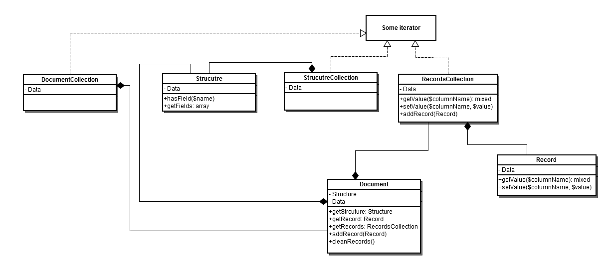

# [!DNL Data Migration Tool]技術仕様

この節では、[!DNL Data Migration Tool]実装の詳細とその機能を拡張する方法について説明します。

## リポジトリ

[!DNL Data Migration Tool] ソースコードにアクセスするには、GitHub [&#x200B; リポジトリ &#x200B;](https://github.com/magento/data-migration-tool)を参照してください。

## 必要システム構成

[!DNL Data Migration Tool]の[必要システム構成](../../installation/system-requirements.md)は、Magento 2と同じです。

## 内部構造

### ディレクトリ構造

次の図は、[!DNL Data Migration Tool]のディレクトリ構造を表しています。

```shell
├── etc                                    --- all configuration files
│   ├── opensource-to-opensource            --- configuration files for migration from Magento Open Source 1 to Magento Open Source 2
│   │   ├── 1.9.1.1
│   │   │   ├── config.xml.dist
│   │   │   └── map.xml.dist
│   │   ├── 1.9.2.0
│   │   │   ├── config.xml.dist
│   │   │   └── map.xml.dist
│   │   ├── ........
│   │   ├── class-map.xml.dist
│   │   ├── deltalog.xml.dist
│   │   └── settings.xml.dist
│   │   ├── ........
│   ├── opensource-to-commerce              --- configuration files for migration from Magento Open Source 1 to Adobe Commerce 2
│   ├── commerce-to-commerce                --- configuration files for migration from Adobe Commerce 1 to Adobe Commerce 2
│   ├── class-map.xsd
│   ├── config.xsd
│   ├── map.xsd
│   └── settings.xsd
├── src
│   └── Migration
│       ├── App                             --- application framework
│       ├── Console
│       ├── Handler                         --- handlers are used by map files
│       │   ├── AbstractHandler.php
│       │   ├── AddPrefix.php
│       │   ├── ConvertIp.php
│       │   ├── ........
│       ├── Logger
│       ├── Reader
│       ├── Mode
│       │   ├── AbstractMode.php
│       │   ├── Data.php
│       │   ├── Delta.php
│       │   └── Settings.php
│       ├── ResourceModel                   --- contains adapter for connection to data storage and classes to work with structured data
│       │   ├── Adapter
│       │   │   └── Mysql.php
│       │   ├── AbstractCollection.php
│       │   ├── AbstractResource.php
│       │   ├── AdapterInterface.php
│       │   ├── Destination.php
│       │   ├── Document.php
│       │   ├── Record.php
│       │   ├── Source.php
│       │   └── Structure.php
│       ├── Config.php
│       ├── Exception.php
│       └── Step                            --- functionality for migrating specific data
│           ├── Eav
│           │   ├── Data.php
│           │   ├── Helper.php
│           │   ├── InitialData.php
│           │   ├── Integrity.php
│           │   └── Volume.php
│           ├── Map
│           │   ├── Data.php
│           │   ├── Delta.php
│           │   ├── Helper.php
│           │   ├── Integrity.php
│           │   └── Volume.php
│           ├── UrlRewrite
│           │   ├── Version11300to2000.php
│           │   ├── Version11410to2000.php
│           │   └── Version191to2000.php
│           ├── ..........
└── tests
    ├── integration
    ├── static
    └── unit
```

## エントリポイント

移行プロセスを実行するスクリプトは次の場所にあります：`magento-root/bin/magento`。

## 設定

設定`config.xsd` ファイルのスキーマは、`etc/` ディレクトリにあります。 Magento 1.xの各バージョンに対して、デフォルトの設定ファイル（`config.xml.dist`）が作成されます。 `etc/`の下の別のディレクトリにあります。

デフォルトの設定ファイルは、カスタム設定ファイルに置き換えることができます（[&#x200B; コマンド構文](migrate-data/overview.md#command-syntax)を参照）。

設定ファイルの構造は次のとおりです。

```xml
<config xmlns:xs="http://www.w3.org/2001/XMLSchema-instance" xs:noNamespaceSchemaLocation="config.xsd">
    <steps mode="settings">
        <step title="Settings step">
            <integrity>Migration\Step\Settings</integrity>
            <data>Migration\Step\Settings</data>
        </step>
    </steps>
    <steps mode="data">
        <step title="Map step">
            <integrity>Migration\Step\Map\Integrity</integrity>
            <data>Migration\Step\Map\Data</data>
            <volume>Migration\Step\Map\Volume</volume>
        </step>
        ...
    </steps>
    <steps mode="delta">
        <step title="Map step">
            <delta>Migration\Step\Map\Delta</delta>
            <volume>Migration\Step\Map\Volume</volume>
        </step>
        ...
    </steps>
    <source>
        <database host="localhost" name="magento1" user="root" password=""/>
    </source>
    <destination>
        <database host="localhost" name="magento2" user="root" password=""/>
    </destination>
    <options>
        <map_file>map-file.xml</map_file>
        <settings_map_file>settings-map-file.xml</settings_map_file>
        <bulk_size>100</bulk_size>
        <custom_option>custom_option_value</custom_option>
        <source_prefix />
        <dest_prefix />
        ...
    </options>
</config>
```

* 手順 – 移行中に処理されるすべての手順を説明します

* source - データソースの設定。 使用可能なソースタイプ：データベース

* destination - データ宛先の設定。 使用可能な宛先タイプ：データベース

* options - パラメーターのリスト。 必須（map_file、settings_map_file、bulk_size）およびオプション（custom_option、resource_adapter_class_name、prefix_source、prefix_dest、log_file）の両方のパラメーターを含みます

Magentoがデータベーステーブルのプレフィックスと共にインストールされている場合は、「プレフィックス」オプションを変更します。 これは、Magento 1およびMagento 2のデータベースに設定できます。 それに応じて、「source_prefix」および「dest_prefix」設定オプションを使用します。

設定データには、`\Migration\Config` クラスを使用してアクセスできます。

## 使用可能な操作の手順

| 文書 | フィールド |
|---|---|
| `step` | Steps ノード内の2番目のレベル ノード。 関連する手順の説明は、`title`属性で指定する必要があります。 |
| `integrity` | 整合性チェックを担当するPHP クラスを指定します。 テーブルのフィールド名、タイプ、およびその他の情報を比較して、Magento 1と2のデータ構造の互換性を検証します。 |
| `data` | データチェックを担当するPHP クラスを指定します。 Magento 1からMagento 2に、テーブルごとにデータを転送します。 |
| `volume` | ボリュームチェックを担当するPHP クラスを指定します。 テーブル間のレコード数を比較して、転送が成功したことを確認します。 |
| `delta` | 差分チェックを実行するPHP クラスを指定します。 完全なデータ移行後、Magento 1からMagento 2に差分を転送します。 |

## Source データベース情報属性

| 文書 | フィールド | 必要ですか？ |
|---|---|---|
| `name` | Magento 1 サーバのデータベース名。 | はい |
| `host` | Magento 1 サーバーのIP アドレスをホストします。 | はい |
| `port` | Magento 1 サーバのポート番号。 | いいえ |
| `user` | Magento 1 データベースサーバーのユーザー名。 | はい |
| `password` | Magento 1 データベース サーバーのパスワード。 | はい |
| `ssl_ca` | SSL証明機関ファイルへのパス。 | いいえ |
| `ssl_cert` | SSL証明書ファイルへのパス。 | いいえ |
| `ssl_key` | SSL キーファイルへのパス。 | いいえ |

## 宛先データベース情報属性

| 文書 | フィールド | 必要ですか？ |
|---|---|---|
| `name` | Magento 2 サーバーのデータベース名。 | はい |
| `host` | Magento 2 サーバーのIP アドレスをホストします。 | はい |
| `port` | Magento 2 サーバのポート番号。 | いいえ |
| `user` | Magento 2 データベース サーバーのユーザー名。 | はい |
| `password` | Magento 2 データベース サーバーのパスワード。 | はい |
| `ssl_ca` | SSL証明機関ファイルへのパス。 | いいえ |
| `ssl_cert` | SSL証明書ファイルへのパス。 | いいえ |
| `ssl_key` | SSL キーファイルへのパス。 | いいえ |

## TLS プロトコルを使用した接続

TLS プロトコルを使用してデータベースに接続することもできます（つまり、公開鍵と秘密鍵を使用します）。 次のオプション属性を`database`要素に追加します。

* `ssl_ca`
* `ssl_cert`
* `ssl_key`

例：

```xml
<source>
    <database host="localhost" name="magento1" user="root" ssl_ca="/path/to/file" ssl_cert="/path/to/file" ssl_key="/path/to/file"/>
</source>
<destination>
    <database host="localhost" name="magento2" user="root" ssl_ca="/path/to/file" ssl_cert="/path/to/file" ssl_key="/path/to/file"/>
</destination>
```

## ステップインターナル

移行プロセスは手順で構成されます。

ステップは、分離されたデータの移行に必要な機能を提供するユニットです。 ステップは、1つ以上のステージ（整合性チェック、データ、ボリュームチェック、デルタ）で構成できます。

デフォルトでは、いくつかの手順（[Map](#map-step)、[EAV](#eav-step)、[URL書き換え](#url-rewrite-step)など）があります。 また、独自のステップを追加することもできます。

ステップ関連のクラスは、src/Migration/Step ディレクトリにあります。

ステップクラスを実行するには、クラスをconfig.xml ファイルで定義する必要があります。

```xml
<config xmlns:xs="http://www.w3.org/2001/XMLSchema-instance" xs:noNamespaceSchemaLocation="config.xsd">
    <steps mode="mode_name">
        <step title="Step Name">
            <integrity>Migration\Step\StepName\Integrity</integrity>  <!-- integrity check stage of the step -->
            <data>Migration\Step\StepName\Data</data>
            <volume>Migration\Step\StepName\Volume</volume>
        </step>
        ...
    </steps>
    ...
</config>
```

各ステージクラスはStageInterfaceを実装する必要があります。

```php
class StageClass implements StageInterface
{
  /**
   * Perform the stage
   *
   * @return bool
   */
  public function perform()
  {
  }
}
```

データ段階でロールバックがサポートされている場合は、`RollbackInterface` インターフェイスを実装する必要があります。

実行中のステップのビジュアライゼーションは、SymfonyのProgressBar コンポーネントによって提供されます（[&#x200B; プログレスバー](https://symfony.com/doc/current/components/console/helpers/progressbar.html)を参照）。 このコンポーネントには、LogLevelProcessorとして手順でアクセスします。

主な使用方法は次のとおりです。

```xml
$this->progress->start();
$this->progress->advance();
$this->progress->finish();
```

## ステップステージ

### 整合性チェック

各ステップでは、データソースの構造（デフォルトではMagento 1）とデータ先の構造（Magento 2）が互換性があるかどうかを確認する必要があります。 そうでない場合 – 互換性のないエンティティを含むエラーが表示されます。 フィールドのデータ型が異なる場合（同じフィールドのデータ型がMagento 1の10進数データ型で、Magento 2の整数である場合）、警告メッセージが表示されます（マップファイルでカバーされている場合を除く）。

### データ転送

整合性チェックに合格した場合、データの転送は実行中です。 エラーが表示された場合は、ロールバックが実行され、Magento 2の以前の状態に戻ります。 ステップクラスが`RollbackInterface` インターフェイスを実装する場合、エラーが発生するとロールバックメソッドが実行されます。

### ボリュームチェック

データが移行された後、ボリュームチェックでは、すべてのデータが正しく転送されたかどうかの追加チェックが行われます。

### 差分配信

デルタ機能は、メイン移行後に追加された残りのデータを配信する役割を担います。

## 実行モード

このツールは、3つのモードで実行する必要があります。

1. 設定 – システム設定の移行
1. データ – データの主な移行
1. 差分 – メイン移行後に追加された残りのデータの移行

各モードには、実行する手順のリストが独自に用意されています。 config.xmlを参照してください

### 設定の移行モード

このツールの設定の移行モードは、次のエンティティの転送に使用されます。

1. web サイト、実店舗、ストアビュー：
1. ストア設定（主にM2のストア/設定またはM1のシステム/設定）

すべてのストア設定では、データはデータベースのcore_config_data テーブルに保持されます。 settings.xml ファイルには、移行プロセス中に適用されるこのテーブルのルールが含まれています。 このファイルは、無視、名前の変更、または値の変更が必要な設定を記述します。 settings.xml ファイルの構造は次のとおりです。

```xml
<?xml version="1.0" encoding="UTF-8"?>
<settings xmlns:xs="http://www.w3.org/2001/XMLSchema-instance" xs:noNamespaceSchemaLocation="settings.xsd">
    <key>
        <ignore>
            <path>path/to/ignore*</path>
        </ignore>
        <rename>
            <path>path/to/rename</path>
            <to>new/path/renamed</to>
        </rename>
    <key>
    <value>
        <transform>
            <path>some/key/to/change</path>
            <handler class="Some\Handler\Class"/>
        </transform>
    </value>
</settings>
```

ノード `<key>`の下には、`core_config_data` テーブルの「パス」列で動作するルールがあります。 `<ignore>`個のルールにより、ツールが一部の設定を転送できません。 このノードでは、ワイルドカードを使用できます。 `<ignore>` ノードにリストされていない他のすべての設定が移行されます。 Magento 2で設定へのパスが変更された場合は、`//key/rename` ノードに追加する必要があります。このノードでは、古いパスは`//key/rename/path` ノードで示され、新しいパスは`//key/rename/to` ノードで示されます。

ノード `<value>`の下には、`core_config_data` テーブルの「value」列で動作するルールがあります。 これらのルールは、ハンドラー（`Migration\Handler\HandlerInterface`を実装するクラス）によって設定の値を変換し、Magento 2に適応させることを目的としています。

### データ移行モード

このモードでは、ほとんどのデータが移行されます。 データ移行前に、整合性チェックの各ステージが実行されます。 整合性チェックに合格すると、[!DNL Data Migration Tool]はdeltalog テーブル （プレフィックス `m2_cl_*`を含む）と対応するトリガーをMagento 1 データベースにインストールし、手順のデータ マイグレーション ステージを実行します。 エラーなしで移行が完了すると、ボリュームチェックでデータの一貫性がチェックされます。 ライブストアを移行すると、警告メッセージが表示される場合があります。 デルタ移行では、この増分データを処理します。 最も価値のある移行手順は、マップ、URL書き換え、EAVです。

#### マップステップ

マップステップは、Magento 1からMagento 2へのほとんどのデータ転送を担当します。 この手順では、（`etc/` ディレクトリにある） map.xml ファイルから手順を読み取ります。 このファイルは、ソース（Magento 1）と宛先（Magento 2）のデータ構造の違いを説明します。 Magento 1に、Magento 2に存在しない拡張機能に属するテーブルまたはフィールドが含まれている場合、これらのエンティティをここに配置してマップステップで無視できます。 それ以外の場合は、エラーメッセージが表示されます。

マップファイルには次の形式があります。

```xml
<?xml version="1.0" encoding="UTF-8"?>
<map xmlns:xs="http://www.w3.org/2001/XMLSchema-instance" xs:noNamespaceSchemaLocation="map.xsd">
    <source>
        <document_rules>
            <ignore>
                <document>some_document2</document>
            </ignore>
            <rename>
                <document>some_document</document>
                <to>some_dest_document</to>
            </rename>
            <log_changes>
                <document key="primary_key">some_dest_document</document>
            </log_changes>
        </document_rules>

        <field_rules>
            <move>
                <field>some_document1.field1</field>
                <to>some_document1.field2</to>
            </move>
            <ignore>
                <field>some_document3.field8</field>
            </ignore>
            <transform>
                <field>some_document1.field1</field>
                <handler class="\Migration\Handler\Convert">
                    <param name="map" value="[value1:value2;value3:value4;value5:value6;]" />
                </handler>
            </transform>
        </field_rules>
    </source>
    <destination>
        <document_rules>
            <ignore>
                <document>some_document8</document>
            </ignore>
        </document_rules>

        <field_rules>
            <transform>
                <field>some_document5.field3</field>
                <handler class="\Migration\Handler\SetValue">
                    <param name="value" value="10" />
                </handler>
            </transform>
        </field_rules>
    </destination>
</map>
```

領域：

* *source* - ソースデータベースのルールが含まれています

* *destination* – 宛先データベースのルールが含まれています

オプション：

* *ignore* – このオプションでマークされた文書、フィールド、またはデータタイプは無視されます

* *名前を変更* – 異なる名前のドキュメント間の名前の関係について説明します。 コピー先のドキュメント名がコピー元のドキュメントと同じでない場合は、「名前を変更」オプションを使用して、コピー先のテーブル名と同様のコピー元のドキュメント名を設定できます

* *move* – 指定したフィールドをソース ドキュメントから移動先ドキュメントに移動するルールを設定します。 メモ：宛先ドキュメント名は、ソースドキュメント名と同じである必要があります。 ソースと宛先のドキュメント名が異なる場合は、移動したフィールドを含むドキュメントに名前変更オプションを使用する必要があります

* *transform* - ハンドラーで説明されている動作に従ってフィールドを移行できるオプションです

* *handler* - フィールドの変換動作について説明します。 ハンドラーを呼び出すには、`<handler>` タグでハンドラークラス名を指定する必要があります。 パラメーター名と値データで`<param>` タグを使用して、ハンドラーに渡します

**Source**&#x200B;の使用可能な操作：

| 文書 | フィールド |
|--- |--- |
| 名前変更を無視 | 変形を無視 |

**宛先**&#x200B;の使用可能な操作：

| 文書 | フィールド |
|--- |--- |
| 無視 | 変形を無視 |

#### ワイルドカード

類似の部分（`document_name_1`、`document_name_2`）を持つドキュメントを無視するには、ワイルドカード機能を使用できます。 繰り返し部分（`document_name_*`）の代わりに`*`記号を付けます。このマスクは、このマスクに一致するすべてのソースまたは宛先ドキュメントをカバーします。

#### URL書き換えステップ

Magento 1で開発されたMagento 2と互換性のない様々なアルゴリズムが数多くあるため、この手順は複雑です。 Magento 1のバージョンごとに、異なるアルゴリズムを使用できます。 したがって、Step/UrlRewrite フォルダーの下には、Magentoの特定のバージョンのために開発されたクラスがあり、Migration\Step\UrlRewrite\Version191to2000はその1つです。 Magento 1.9.1からMagento 2にURL書き換えデータを転送できます。

#### EAV ステップ

このステップでは、すべての属性（product、customer、RMA）をMagento 1からMagento 2に転送します。 データ処理の特定のケースに対して、map.xml ファイル内のルールと類似したルールを含むmap-eav.xml ファイルを使用します。

手順で処理されるテーブルの一部：

* `eav_attribute`
* `eav_attribute_group`
* `eav_attribute_set`
* `eav_entity_attribute`
* `catalog_eav_attribute`
* `customer_eav_attribute`
* `eav_entity_type`

### Delta移行モード

メインマイグレーションの後、Magento 1 データベース（ストアフロントのお客様など）に追加のデータが追加された可能性があります。 このデータをトラッキングするには、移行プロセスの開始時に、テーブルのデータベーストリガーを設定します。 詳しくは、[&#x200B; サードパーティの拡張機能によって作成されたデータの移行](migrate-data/delta.md#migrate-data-created-by-third-party-extensions)を参照してください。

## データソース

Magento 1およびMagento 2のデータソースにアクセスし、そのデータを使用して操作（選択、更新、挿入、削除）するには、リソースフォルダーに多くのクラスがあります。 Migration\ResourceModel\SourceとMigration\ResourceModel\Destinationはメインのクラスです。 あらゆる移行手順で、データを操作するために利用できます。 このデータは、Migration\ResourceModel\Document、Migration\ResourceModel\Record、Migration\ResourceModel\Structureなどのクラスに含まれています。

以下に、これらのクラスのクラス図を示します。



## ログ

移行プロセスの出力を実装し、Magentoで使用されるすべての可能なレベル PSR ロガーを制御するために、適用されます。 ログ機能を提供するために`\Migration\Logger\Logger` クラスが実装されました。 ロガーを使用するには、コンストラクター依存関係インジェクションを使用してロガーをインジェクトする必要があります。

```php
class SomeClass
{
    ...
    protected $logger;

    public function __construct(\Migration\Logger\Logger $logger)
    {
        $this->logger = $logger;
    }
    ...
}
```

その後、このクラスを使用して一部のイベントのログを記録できます。

```php
$this->logger->info("Some information message");
$this->logger->debug("Some debug message");
$this->logger->error("Message about error operation");
$this->logger->warning("Some warning message");
```

ログ情報を書き込む場所をカスタマイズすることもできます。 これは、ロガーのpushHandler （） メソッドを使用してロガーにハンドラーを追加することで可能です。 各ハンドラーは`\Monolog\Handler\HandlerInterface` インターフェイスを実装する必要があります。 今のところ、2つのハンドラーがあります。

* ConsoleHandler: メッセージをコンソールに書き込みます

* FileHandler: &quot;log_file&quot;設定オプションで設定されたログファイルにメッセージを書き込みます

また、追加のハンドラーを実装することも可能です。 Magento フレームワークには一連のハンドラーがあります。 ロガーにハンドラーを追加する例：

```php
// $this->consoleHandler is the object of Migration\Logger\ConsoleHandler class
// $this->logger is the object of Migration\Logger\Logger class
$this->logger->pushHandler($this->consoleHandler);
```

ロガー（現在のモード、テーブル名）の追加データを設定するには、ロガープロセッサーを使用できます。 既存のプロセッサ（MessageProcessor）が1つあります。 これは、メッセージをログに記録するための「追加」データを追加するために作成され、ログメソッドが実行されるたびに呼び出されます。 MessageProcessorが$extra varを保護しました。このvarには、&#39;mode&#39;、&#39;stage&#39;、&#39;step&#39;および&#39;table&#39;の空の値が含まれています。 余分なデータは、ログメソッドの2番目のパラメーター（コンテキスト）としてプロセッサーに渡すことができます。 現在、AbstractStep->runStage （現在のモード、ステージ、およびステップをプロセッサーに渡す）メソッドおよびlogger->debug メソッドを使用するデータクラス （移行テーブル名を渡す）のプロセッサーに追加のデータセットが追加されています。 ロガーにプロセッサーを追加する例：

```php
// $this->processoris the object of Migration\Logger\messageProcessor class
// $this->logger is the object of Migration\Logger\Logger class
$this->logger->pushProcessor([$this->processor, 'setExtra']);
// As a second array value you need to pass method that should be executed when processor called
```

冗長さのレベルを設定する可能性があります。 今のところ、3つのレベルがあります：

* `ERROR` （ログにエラーのみを書き込む）
* `INFO` （重要な情報のみがログに書き込まれます。既定値）
* `DEBUG` （すべてが書き込まれます）

冗長ログレベルは、`setLevel()` メソッドを呼び出して、各ハンドラーに個別に設定できます。 コマンドラインパラメーターを使用して冗長レベルを設定する場合は、アプリケーション起動時に「冗長」オプションを変更する必要があります。

モノログフォーマッタを使用してログメッセージをフォーマットできます。 フォーマッター機能を機能させるには、`setFormatter()` メソッドを使用してログハンドラーを指定する必要があります。 現在、メッセージの処理中（ハンドラーから実行される`format()` メソッドを通じて）に特定の形式を設定するフォーマッタークラス （`MessageFormatter`）が1つあります。

ロガーの操作（ハンドラーとプロセッサーの追加）と詳細モードでの処理は、`Migration\Logger\Manager` クラスの`process()` メソッドで実行されます。 メソッドは、アプリケーションの開始時に呼び出されます。

## 自動テスト

[!DNL Data Migration Tool]には3種類のテストがあります。

* 静的
* ユニット
* 統合

これらは、ツールの`tests/` ディレクトリにあります。これは、テストのタイプと同じです（単体テストは`tests/unit` ディレクトリにあります）。 テストを起動するには、phpunitをインストールしておく必要があります。 現在のディレクトリをテストディレクトリに変更し、phpunitを起動します。 例：

```shell
[10:32 AM]-[vagrant@debian-70rc1-x64-vbox4210]-[/var/www/magento2/vendor/magento/data-migration-tool]-[git master]
$ cd tests/unit
```

```shell
[10:33 AM]-[vagrant@debian-70rc1-x64-vbox4210]-[/var/www/magento2/vendor/magento/data-migration-tool/tests/unit]-[git master]
$ phpunit
PHPUnit 8.1.0 by Sebastian Bergmann.
....
```
