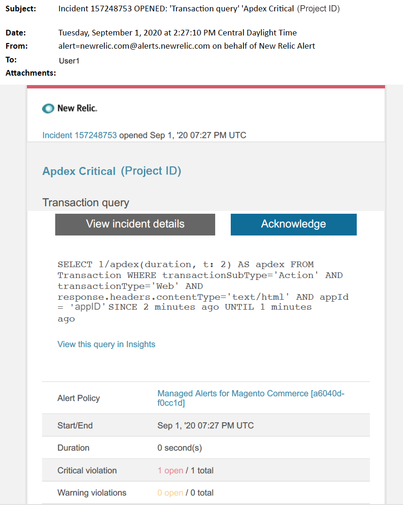

# Adobe Commerceの管理アラート：[!DNL Apdex] クリティカルアラート

この記事では、[!DNL New Relic]でAdobe Commerceの[!DNL Apdex] クリティカルアラートを受け取った場合のトラブルシューティング手順について説明します。 [!DNL Apdex] スコアは、web アプリケーションとサービスの応答時間に対するユーザーの満足度を測定します。 この問題を解決するには早急な行動が必要だ。 選択したアラート通知チャネルに応じて、アラートは次のようになります。

{width="500"}

## 影響を受ける製品とバージョン

* Adobe Commerce on cloud infrastructure Pro プランアーキテクチャ
* Adobe Commerce on cloud infrastructure スタータープランアーキテクチャ

## イシュー

Adobe Commerce[&#128279;](managed-alerts-for-magento-commerce.md)の管理対象アラートにサインアップし、1つ以上のアラートしきい値を超えた場合、[!DNL New Relic]に管理対象アラートが届きます。 これらのアラートは、Adobeが開発したもので、サポートとエンジニアリングからのインサイトを利用して、マーチャントに標準セットを提供します。

<u> **実行！** </u>

* このアラートがクリアされるまでスケジュールされたデプロイメントをすべて中止します。
* サイトが完全に応答しない、または応答しなくなった場合は、すぐにメンテナンスモードにします。 手順については、『Commerce インストールガイド』の「[&#x200B; メンテナンスモードを有効または無効にする](https://experienceleague.adobe.com/ja/docs/commerce-operations/installation-guide/tutorials/maintenance-mode)」を参照してください。 トラブルシューティングのためにサイトにアクセスできるように、IPを免除IP アドレスリストに追加してください。 手順については、Commerce インストールガイドの「[除外IP アドレスのリストを管理する](https://experienceleague.adobe.com/ja/docs/commerce-operations/installation-guide/tutorials/maintenance-mode#maintain-the-list-of-exempt-ip-addresses)」を参照してください。

<u>**やめて！**</u>

* 追加のページビューをサイトに呼び込む可能性のある、追加のマーケティング施策を開始します。
* CPUまたはディスクに負荷がかかる可能性があるインデクサーまたは別のクローンを実行します。
* 主要な管理作業（Commerce管理者、データの読み込み/書き出しなど）を行います。
* キャッシュをクリアします。

重大なアラートを受信した場合に上記を実行すると、アラートの原因をトラブルシューティングする前に、サイトの停止がまだ発生していない場合、サイトが応答しなくなる可能性があります。

## Solution

以下の手順に従って、原因を特定し、トラブルシューティングします。

>[!WARNING]
>
>これは重大なアラートであるため、問題のトラブルシューティングを行う前に&#x200B;**手順1**&#x200B;を完了することを強くお勧めします（手順2以降）。

1. Adobe Commerce サポートチケットが存在するかどうかを確認します。 手順については、Commerce サポート サポート サポート サポート サポート技術情報の[&#x200B; サポートチケットの追跡](https://experienceleague.adobe.com/ja/docs/commerce-knowledge-base/kb/help-center-guide/magento-help-center-user-guide#track-support-case)を参照してください。 サポートは、[!DNL New Relic]しきい値のアラートを受け取り、チケットを作成し、問題に取り組み始めた可能性があります。 チケットが存在しない場合は、チケットを作成します。 チケットには次の情報が必要です。
   * 連絡先の理由：**[!UICONTROL New Relic CRITICAL alert received]**&#x200B;を選択してください。
   * アラートの説明。
   * [[!DNL New Relic]  インシデントリンク &#x200B;](https://docs.newrelic.com/docs/alerts-applied-intelligence/new-relic-alerts/alert-incidents/view-violation-event-details-incidents)。 これは、Adobe Commerce[&#128279;](managed-alerts-for-magento-commerce.md)の管理済みアラートに含まれています。
1. 問題の原因を特定するには、[[!DNL New Relic] APMのトランザクションページ &#x200B;](https://docs.newrelic.com/docs/apm/applications-menu/monitoring/transactions-page-find-specific-performance-problems)を使用して、パフォーマンスの問題を伴うトランザクションを特定します。
   * [!DNL Apdex] スコアを昇順で並べ替えます。 [[!DNL Apdex]](https://docs.newrelic.com/docs/apm/new-relic-apm/apdex/apdex-measure-user-satisfaction)は、web アプリケーションおよびサービスの応答時間に対するユーザー満足度を指します。 [!DNL Apdex] スコアが低い場合は、（応答時間が長いトランザクション）ボトルネックが発生している可能性があります。 通常は、データベース、[!DNL Redis]、またはPHPです。 手順については、[[!DNL New Relic] Apdexの不満が最も高いトランザクションを表示](https://docs.newrelic.com/docs/apm/new-relic-apm/apdex/apdex-measure-user-satisfaction/#dissatisfaction)を参照してください。
   * 最も高いスループット、最も遅い平均応答時間、最も時間がかかるその他のしきい値などによってトランザクションを並べ替えます。 手順については、[[!DNL New Relic] 特定のパフォーマンスの問題を見つける](https://docs.newrelic.com/docs/apm/applications-menu/monitoring/transactions-page-find-specific-performance-problems)を参照してください。 まだ問題を特定するのに苦慮している場合は、[[!DNL New Relic] APMのインフラストラクチャ ページ &#x200B;](https://docs.newrelic.com/docs/infrastructure/infrastructure-ui-pages/infra-hosts-ui-page/)を使用してください。
1. [[!DNL New Relic] APMのインフラストラクチャ ページ &#x200B;](https://docs.newrelic.com/docs/infrastructure/infrastructure-ui-pages/infra-hosts-ui-page/)を使用して、リソース集約的なプロセスを特定します。 手順については、[[!DNL New Relic]  インフラストラクチャ監視ホスト ページ：[!UICONTROL Processes tab]](https://docs.newrelic.com/docs/infrastructure/infrastructure-ui-pages/infra-hosts-ui-page/#processes)を参照してください。
1. [!DNL Redis]やMySQLなどのサービスがメモリ消費の上位ソースである場合は、次の操作を試してください。
   * 最新バージョンであることを確認してください。 新しいバージョンでは、メモリリークを修正できることがあります。 最新バージョンを使用していない場合は、アップグレードを検討してください。 手順については、Commerce on Cloud ガイドの[Change Services](https://experienceleague.adobe.com/docs/commerce-cloud-service/user-guide/configure/service/services-yaml.html?lang=ja)を参照してください。
   * 長時間実行中のクエリ、プライマリキーが定義されていない、重複したインデックスなど、MySQLの問題を確認します。 手順については、Commerce実装プレイブックの「[&#x200B; クラウドインフラストラクチャ上のAdobe Commerceの最も一般的なデータベースの問題](https://experienceleague.adobe.com/docs/commerce-operations/implementation-playbook/best-practices/maintenance/resolve-database-performance-issues.html?lang=ja)」を参照してください。
   * PHPの問題を確認します。 CLI/ターミナルで`ps aufx`を実行して、実行中のプロセスを確認します。 ターミナル出力には、現在実行中のcron ジョブとプロセスが表示されます。 プロセスの実行時間の出力を確認します。 実行時間が長いcronがある場合は、cronがぶら下がっている可能性があります。 トラブルシューティングの手順については、Commerce サポート サポート ナレッジベースの「[&#x200B; パフォーマンスが遅い、実行が遅い](https://experienceleague.adobe.com/ja/docs/commerce-knowledge-base/kb/troubleshooting/miscellaneous/slow-performance-slow-and-long-running-crons)、実行が長い[Cron ジョブが「実行中」ステータス &#x200B;](https://experienceleague.adobe.com/ja/docs/commerce-knowledge-base/kb/troubleshooting/miscellaneous/cron-job-is-stuck-in-running-status)で停止する」を参照してください。

1. ソースが特定されたら、環境にSSHで接続して、さらに調査します。 手順については、『Commerce on Cloud Guide 』の「[SSH into your environment](https://experienceleague.adobe.com/ja/docs/commerce-cloud-service/user-guide/develop/secure-connections#ssh)」を参照してください。
1. ソースの特定に苦慮している場合は、最近のトレンドを確認して、最近のコードのデプロイや設定の変更（新しい顧客グループやカタログの大幅な変更など）に関する問題を特定します。 コードのデプロイメントまたは変更の相関関係については、過去7日間のアクティビティを確認することをお勧めします。
1. 合理的な時間内にソリューションが見つからない場合は、まだ行っていない場合は、アップサイズを要求するか、サイトをメンテナンスモードに配置します。 手順については、Commerce サポート サポート ナレッジベースの[一時サイズ変更をリクエストする方法](https://experienceleague.adobe.com/ja/docs/commerce-knowledge-base/kb/how-to/how-to-request-temporary-magento-upsize)およびCommerce インストールガイドの[&#x200B; メンテナンスモードを有効または無効にする](https://experienceleague.adobe.com/ja/docs/commerce-operations/installation-guide/tutorials/maintenance-mode)を参照してください。
1. アップサイズによってサイトが通常の動作に戻る場合は、永続的なアップサイズをリクエストするか（Adobeのアカウントチームにお問い合わせください）、負荷テストを実行してクエリを最適化するか、サービスへのプレッシャーを軽減するコードを実行して、専用ステージングで問題を再現してみてください。 Commerce on Cloud ガイドの[負荷および負荷テスト &#x200B;](https://experienceleague.adobe.com/ja/docs/commerce-cloud-service/user-guide/develop/test/staging-and-production#load-and-stress-testing)を参照してください。
