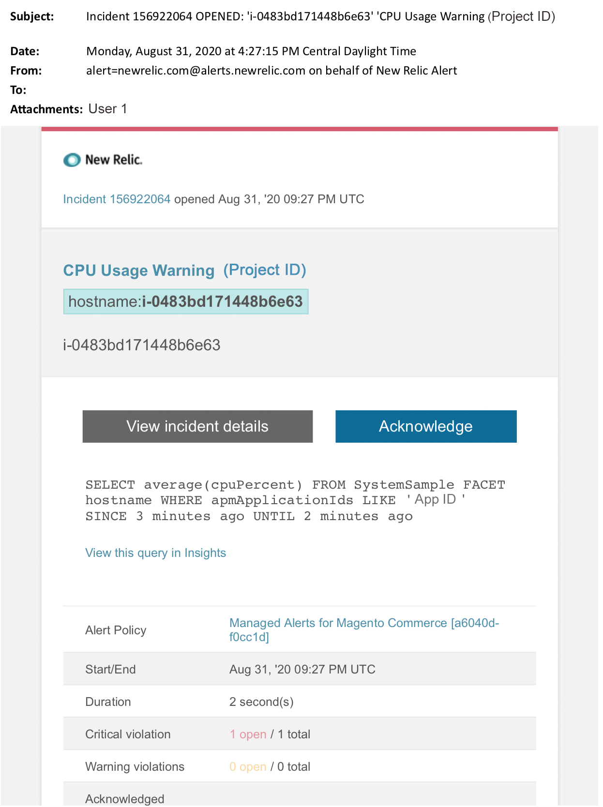

# Adobe Commerceの管理されたアラート：CPUの警告アラート

この記事では、[!DNL New Relic]でAdobe CommerceのCPU警告アラートを受け取った場合のトラブルシューティング手順について説明します。 この問題を解決するには早急な行動が必要だ。 選択したアラート通知チャネルに応じて、アラートは次のようになります。

{width="500"}

## 影響を受ける製品とバージョン

Adobe Commerce on cloud infrastructure Pro プランアーキテクチャ

## イシュー

Adobe Commerce](managed-alerts-for-magento-commerce.md)の[管理対象アラートにサインアップし、1つ以上のアラートしきい値を超えた場合、[!DNL New Relic]にアラートが届きます。 これらのアラートは、サポートとエンジニアリングからのインサイトを使用して、お客様に標準セットを提供するためにAdobeによって開発されました。

<u> **実行！** </u>

* このアラートがクリアされるまでスケジュールされたデプロイメントをすべて中止します。
* サイトの応答性が低下した場合は、すぐにメンテナンスモードにします。 手順については、『Commerce インストールガイド』の「[ メンテナンスモードを有効または無効にする](https://experienceleague.adobe.com/en/docs/commerce-operations/installation-guide/tutorials/maintenance-mode)」を参照してください。 トラブルシューティングのためにサイトにアクセスできるように、IPを免除IP アドレスリストに追加してください。 手順については、Commerce インストールガイドの「[除外IP アドレスのリストを管理する](https://experienceleague.adobe.com/en/docs/commerce-operations/installation-guide/tutorials/maintenance-mode#maintain-the-list-of-exempt-ip-addresses)」を参照してください。

<u>**やめて！**</u>

* 追加のページビューをサイトに呼び込む可能性のある、追加のマーケティング施策を開始します。
* CPUまたはディスクに負荷がかかる可能性があるインデクサーまたは別のクローンを実行します。
* 主要な管理作業（Commerce管理者、データの読み込み/書き出しなど）を行います。
* キャッシュをクリアします。

## Solution

以下の手順に従って、原因を特定し、トラブルシューティングします。

1. [[!DNL New Relic] APMのトランザクションページ ](https://docs.newrelic.com/docs/apm/applications-menu/monitoring/transactions-page-find-specific-performance-problems)を使用して、パフォーマンスに関する問題を含むトランザクションを特定します。
   * [!DNL Apdex] スコアを昇順で並べ替えます。 [[!DNL Apdex]](https://docs.newrelic.com/docs/apm/new-relic-apm/apdex/apdex-measure-user-satisfaction)は、web アプリケーションおよびサービスの応答時間に対するユーザー満足度を指します。 [ スコアが低い [!DNL Apdex]  スコア ](https://experienceleague.adobe.com/en/docs/commerce-knowledge-base/kb/troubleshooting/miscellaneous/troubleshoot-performance-using-new-relic-on-magento-commerce)は、ボトルネック（応答時間が長いトランザクション）を示している可能性があります。 通常は、データベース、[!DNL Redis]、またはPHPです。 手順については、[!DNL New Relic] [最も高いトランザクションを表示 [!DNL Apdex] 不満](https://docs.newrelic.com/docs/apm/new-relic-apm/apdex/apdex-measure-user-satisfaction/#apdex-dissat)を参照してください。
   * 最も高いスループット、最も遅い平均応答時間、最も時間がかかるその他のしきい値などによってトランザクションを並べ替えます。 手順については、[[!DNL New Relic] 特定のパフォーマンスの問題を見つける](https://docs.newrelic.com/docs/apm/applications-menu/monitoring/transactions-page-find-specific-performance-problems)を参照してください。
1. まだソースの特定に苦慮している場合は、[[!DNL New Relic] APMのインフラストラクチャページ ](https://docs.newrelic.com/docs/infrastructure/infrastructure-data/infrastructure-ui-pages/infra-hosts-ui-page/)を使用して、リソース量の多いサービスを特定してください。 手順については、[!DNL New Relic] [ インフラストラクチャ監視ホスト ページ：[!UICONTROL Processes tab]](https://docs.newrelic.com/docs/infrastructure/infrastructure-ui-pages/infra-hosts-ui-page/#processes)を参照してください。
1. ソースを特定した場合は、環境にSSHで接続して、さらに調査します。 手順については、『Commerce on Cloud Guide 』の「[SSH into your environment](https://experienceleague.adobe.com/en/docs/commerce-cloud-service/user-guide/develop/secure-connections#ssh)」を参照してください。
1. ソースの特定に苦慮している場合：
   * 最近の傾向を確認して、最近のコードのデプロイや設定の変更（新しい顧客グループやカタログの大幅な変更など）に関する問題を特定します。 コードのデプロイメントまたは変更の相関関係については、過去7日間のアクティビティを確認することをお勧めします。
   * フラットカタログのチェックと無効化を検討してください。 手順については、Commerce サポート サポート サポート技術情報の「[ パフォーマンスが遅い、動作が遅い、動作が長い](https://experienceleague.adobe.com/en/docs/commerce-knowledge-base/kb/troubleshooting/miscellaneous/slow-performance-slow-and-long-running-crons)」を参照してください。
   * DDoS攻撃が疑われる場合は、ボットトラフィックのブロックを試してください。 手順については、Commerce サポート サポート ナレッジベースの「[Fastly レベルでAdobe Commerceの悪意のあるトラフィックをブロックする方法](https://experienceleague.adobe.com/en/docs/commerce-knowledge-base/kb/how-to/block-malicious-traffic-for-magento-commerce-on-fastly-level)」を参照してください。
1. 問題が一時的なものと思われる場合は、アップサイズなどの軽減手順を実行するか、サイトをメンテナンスモードに移行します。 手順については、Commerce サポート サポート サポート技術情報の[一時サイズ変更をリクエストする方法](https://experienceleague.adobe.com/en/docs/commerce-knowledge-base/kb/how-to/how-to-request-temporary-magento-upsize)、およびCommerce インストールガイドの[ メンテナンスモードを有効または無効にする](https://experienceleague.adobe.com/en/docs/commerce-operations/installation-guide/tutorials/maintenance-mode)を参照してください。 アップサイズによってサイトが通常の動作に戻る場合は、永続的なアップサイズをリクエストするか（Adobeのアカウントチームにお問い合わせください）、読み込みテストを実行してクエリを最適化するか、サービスへのプレッシャーを軽減するコードを実行して、専用ステージングの問題を再現してみてください。 手順については、Commerce on Cloud ガイドの[負荷テストと負荷テスト ](https://experienceleague.adobe.com/en/docs/commerce-cloud-service/user-guide/develop/test/staging-and-production#load-and-stress-testing)を参照してください。
