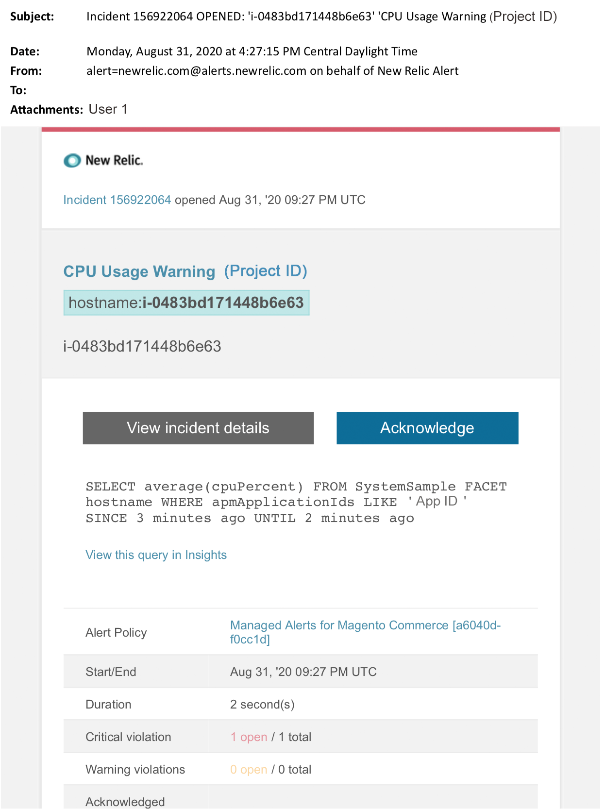

# Adobe Commerceの管理アラート：CPU警告アラート

この記事では、[!DNL New Relic] でAdobe CommerceのCPU警告アラートを受け取った場合のトラブルシューティング手順を説明します。 この問題を修正するには、直ちに対処する必要があります。 選択したアラート通知チャネルに応じて、アラートは次のようになります。

{width="500"}

## 影響を受ける製品とバージョン

Adobe Commerce on cloud infrastructure Pro プランアーキテクチャ

## 問題

[Adobe Commerceの Managed アラート ](managed-alerts-for-magento-commerce.md) にサインアップし、1 つ以上のアラートしきい値を超えた場合、[!DNL New Relic] でアラートが届きます。 これらのアラートは、サポートおよびエンジニアリングのインサイトを使用して、標準セットをお客様に提供するために、Adobeで開発されました。

<u> **動け！**</u>

* このアラートがクリアされるまで、スケジュールされている展開を中止します。
* サイトが完全に応答しない場合は、すぐにサイトをメンテナンスモードにします。 手順については、『Commerce インストールガイド』の [ メンテナンスモードの有効化または無効化 ](https://experienceleague.adobe.com/ja/docs/commerce-operations/installation-guide/tutorials/maintenance-mode) を参照してください。 トラブルシューティングのためにサイトに引き続きアクセスできるように、IP を除外 IP アドレスリストに追加してください。 手順については、『Commerce インストールガイド』の [ 除外 IP アドレスのリストの管理 ](https://experienceleague.adobe.com/ja/docs/commerce-operations/installation-guide/tutorials/maintenance-mode#maintain-the-list-of-exempt-ip-addresses) を参照してください。

<u>**やめて！**</u>

* 追加のマーケティングキャンペーンを開始すると、サイトに追加のページビューが表示される場合があります。
* インデクサーや追加の Cron を実行すると、CPUやディスクにさらに負荷がかかる場合があります。
* 主要な管理タスク（Commerce管理者、データの読み込み/書き出し）を実行します。
* キャッシュをクリアします。

## 解決策

原因の特定とトラブルシューティングを行うには、次の手順に従います。

1. [[!DNL New Relic] APM のトランザクションページ ](https://docs.newrelic.com/docs/apm/applications-menu/monitoring/transactions-page-find-specific-performance-problems) を使用して、パフォーマンスの問題があるトランザクションを特定します。
   * [!DNL Apdex] スコアの昇順でトランザクションを並べ替えます。 [[!DNL Apdex]](https://docs.newrelic.com/docs/apm/new-relic-apm/apdex/apdex-measure-user-satisfaction) は、web アプリケーションおよびサービスの応答時間に対するユーザー満足度を指します。 [ スコアが低  [!DNL Apdex]  場合 ](https://experienceleague.adobe.com/ja/docs/commerce-knowledge-base/kb/troubleshooting/miscellaneous/troubleshoot-performance-using-new-relic-on-magento-commerce)、ボトルネック（応答時間の長いトランザクション）を示している可能性があります。 通常は、データベース、[!DNL Redis]、または PHP です。 手順については、[!DNL New Relic][ 不満が最も高いトランザクションの表示 ](https://docs.newrelic.com/docs/apm/new-relic-apm/apdex/apdex-measure-user-satisfaction/#apdex-dissat) を参照  [!DNL Apdex]  てください。
   * スループット、平均応答時間が遅い、時間がかかる、その他のしきい値の高い順にトランザクションを並べ替えます。 手順については、[[!DNL New Relic]  特定のパフォーマンスの問題の検索 ](https://docs.newrelic.com/docs/apm/applications-menu/monitoring/transactions-page-find-specific-performance-problems) を参照してください。
1. ソースの特定に依然として苦労している場合は、[[!DNL New Relic] APM のインフラストラクチャページ ](https://docs.newrelic.com/docs/infrastructure/infrastructure-data/infrastructure-ui-pages/infra-hosts-ui-page/) を使用して、リソース負荷の高いサービスを特定します。 手順については、[ インフラストラクチャ監視ホスト [!DNL New Relic] ページ：[!UICONTROL Processes tab]](https://docs.newrelic.com/docs/infrastructure/infrastructure-ui-pages/infra-hosts-ui-page/#processes) を参照してください。
1. ソースを特定した場合は、環境に SSH で接続して詳細を調べます。 手順については、Commerce on Cloud ガイドの [SSH into your environment](https://experienceleague.adobe.com/ja/docs/commerce-cloud-service/user-guide/develop/secure-connections#ssh) を参照してください。
1. ソースの特定に苦労する場合：
   * 最近のトレンドを確認して、最近のコードのデプロイメントや設定の変更に関する問題を特定します（例えば、新しい顧客グループやカタログの大幅な変更）。 コードのデプロイメントまたは変更における相関関係について、過去 7 日間のアクティビティを確認することをお勧めします。
   * フラットカタログの確認と無効化を検討します。 手順については、Commerce サポートナレッジベースの [ パフォーマンスが遅い、動作が遅い、動作が長い ](https://experienceleague.adobe.com/ja/docs/commerce-knowledge-base/kb/troubleshooting/miscellaneous/slow-performance-slow-and-long-running-crons) を参照してください。
   * DDoS 攻撃が発生していると思われる場合は、ボットトラフィックをブロックしてみてください。 手順については、Commerce サポートナレッジベースの [Fastly レベルでAdobe Commerceの悪意のあるトラフィックをブロックする方法 ](https://experienceleague.adobe.com/ja/docs/commerce-knowledge-base/kb/how-to/block-malicious-traffic-for-magento-commerce-on-fastly-level) を参照してください。
1. 問題が一時的であると思われる場合は、アップサイズなどの軽減手順を実行するか、サイトをメンテナンスモードにします。 手順については、Commerce サポートナレッジベースの [ 一時サイズ変更のリクエスト方法 ](https://experienceleague.adobe.com/ja/docs/commerce-knowledge-base/kb/how-to/how-to-request-temporary-magento-upsize) および『Commerce インストールガイド』の [ メンテナンスモードの有効化または無効化 ](https://experienceleague.adobe.com/ja/docs/commerce-operations/installation-guide/tutorials/maintenance-mode) を参照してください。 アップサイズによってサイトが通常の処理に戻った場合は、永続的なアップサイズを要求すること（Adobe アカウントチームに問い合わせてください）を検討するか、負荷テストを実行してクエリまたはサービスの負荷を軽減するコードを最適化し、専用のステージングで問題を再現してみてください。 Commerce手順については、Cloud ガイドの [ 負荷とストレステスト ](https://experienceleague.adobe.com/ja/docs/commerce-cloud-service/user-guide/develop/test/staging-and-production#load-and-stress-testing) を参照してください。
