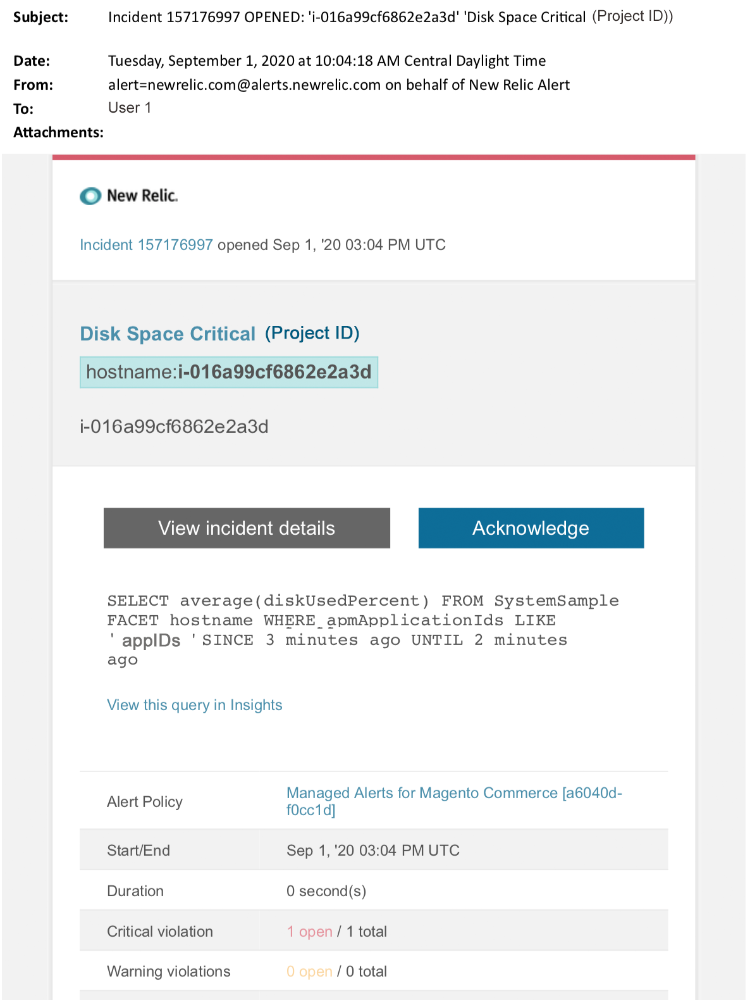

# Adobe Commerceの管理アラート：ディスククリティカルアラート

この記事では、[!DNL New Relic]でAdobe Commerceのクリティカルディスクアラートを受け取った場合のトラブルシューティング手順について説明します。 この問題を解決するには早急な行動が必要だ。 選択したアラート通知チャネルに応じて、アラートは次のようになります。

{width="500"}

## 影響を受ける製品とバージョン

Pro プランアーキテクチャ上のAdobe Commerce クラウドインフラストラクチャ

## イシュー

Adobe Commerce[&#128279;](managed-alerts-for-magento-commerce.md)の管理対象アラートにサインアップし、1つ以上のアラートしきい値を超えた場合、[!DNL New Relic]にアラートが届きます。 これらのアラートは、サポートとエンジニアリングからのインサイトを使用して、お客様に標準セットを提供するためにAdobeによって開発されました。

<u> **実行！** </u>

* このアラートがクリアされるまでスケジュールされたデプロイメントをすべて中止します。
* サイトが完全に応答しない、または応答しなくなった場合は、すぐにメンテナンスモードにします。 手順については、[&#x200B; メンテナンスモードを有効または無効にする](https://experienceleague.adobe.com/ja/docs/commerce-operations/installation-guide/tutorials/maintenance-mode)を参照してください。 トラブルシューティングのためにサイトにアクセスできるように、IPを免除IP アドレスリストに追加してください。 手順については、[除外IP アドレスのリストの管理](https://experienceleague.adobe.com/ja/docs/commerce-operations/installation-guide/tutorials/maintenance-mode#maintain-the-list-of-exempt-ip-addresses)を参照してください。

**やめて！**

* 追加のページビューをサイトに呼び込む可能性のある、追加のマーケティング施策を開始します。
* CPUまたはディスクに負荷がかかる可能性があるインデクサーまたは別のクローンを実行します。
* 主要な管理作業（Commerce管理者、データの読み込み/書き出しなど）を行います。
* キャッシュをクリアします。

アラートの原因を調査して解決する前に「実行しない」アクションのいずれかを実行すると、サイトが応答しなくなる可能性があります（サイトの停止がまだ発生していない場合）。

## Solution

以下の手順に従って、原因を特定し、トラブルシューティングします。

>[!WARNING]
>
>これは重大なアラートであるため、問題のトラブルシューティングを行う前に&#x200B;**手順1**&#x200B;を完了することを強くお勧めします（手順2以降）。

1. Adobe Commerce サポートチケットが存在するかどうかを確認します。 手順については、Commerce サポート サポート サポート サポート サポート技術情報の[&#x200B; サポートチケットの追跡](https://experienceleague.adobe.com/ja/docs/commerce-knowledge-base/kb/help-center-guide/magento-help-center-user-guide#track-support-case)を参照してください。 サポートは、[!DNL New Relic]しきい値のアラートを受け取り、チケットを作成し、問題に取り組み始めた可能性があります。 チケットが存在しない場合は、チケットを作成します。 チケットには次の情報が必要です。
   * 連絡先の理由：**[!UICONTROL New Relic CRITICAL alert received]**&#x200B;を選択してください。
   * アラートの説明。
   * [[!DNL New Relic]  インシデントリンク &#x200B;](https://docs.newrelic.com/docs/alerts/incident-management/view-event-details-incidents/)。 これは、Adobe Commerce[&#128279;](managed-alerts-for-magento-commerce.md)の管理済みアラートに含まれています。
1. [!DNL New Relic]で、最も使用頻度の高いディスクを確認します。 手順については、[[!DNL New Relic]  インフラストラクチャ監視ホストページの&#x200B;**[!UICONTROL Storage]** タブを参照してください：[!UICONTROL Storage] タブ &#x200B;](https://docs.newrelic.com/docs/infrastructure/infrastructure-ui-pages/infra-hosts-ui-page/#storage):
   * [!DNL New Relic]でディスク使用量の増加が遅い場合は、次のオプションを試してください。
      * スペース配分を調整してディスク容量を最適化する。 手順については、Commerce on Cloud ガイドの「[&#x200B; ディスク領域を管理](https://experienceleague.adobe.com/docs/commerce-cloud-service/user-guide/develop/storage/manage-disk-space.html?lang=ja)」を参照してください。 また、追加のディスク容量をリクエストする必要がある場合もあります（Adobeのアカウントチームにお問い合わせください）。
      * MySQL用のディスク領域をクリアします。 手順については、Commerce サポート サポート技術情報の[MySQL ディスク領域が少ない](https://experienceleague.adobe.com/ja/docs/commerce-knowledge-base/kb/troubleshooting/database/mysql-disk-space-is-low-on-magento-commerce-cloud)を参照してください。
      * [!DNL New Relic]でディスク使用量が急速に増加している場合は、ディレクトリ内でファイルが非常に急速に増加している問題があることを示している可能性があります。 次のチェックを実行します。
         1. CLI/ターミナルで次のコマンドを実行して、全体的なディスク容量を確認し、問題を特定します：`df -h`
         1. 予期せず大きくなり、ディスク使用量が増加するディレクトリを特定したら、影響を受けるファイルシステムを確認する必要があります。 次の例は、ファイルディレクトリ `pub/media/`を確認する方法を示しています。 これは、Commerceがログとビッグメディアファイルを保存するために使用するディレクトリです。 ただし、予期しないディスク使用量を示すディレクトリに対しては、このコマンドを実行する必要があります：`du -sch ~/pub/media/*`

ターミナルからの出力で、これらのディレクトリのいずれかにファイルが表示され、ディスク使用量が急速に増加し、ファイルの内容が必要でないことがわかっている場合は、ファイルの削除を検討してください。 この操作に慣れていない場合は、[Adobe Commerce サポートチケットを送信](https://experienceleague.adobe.com/ja/docs/commerce-knowledge-base/kb/help-center-guide/magento-help-center-user-guide#support-case)してください。
