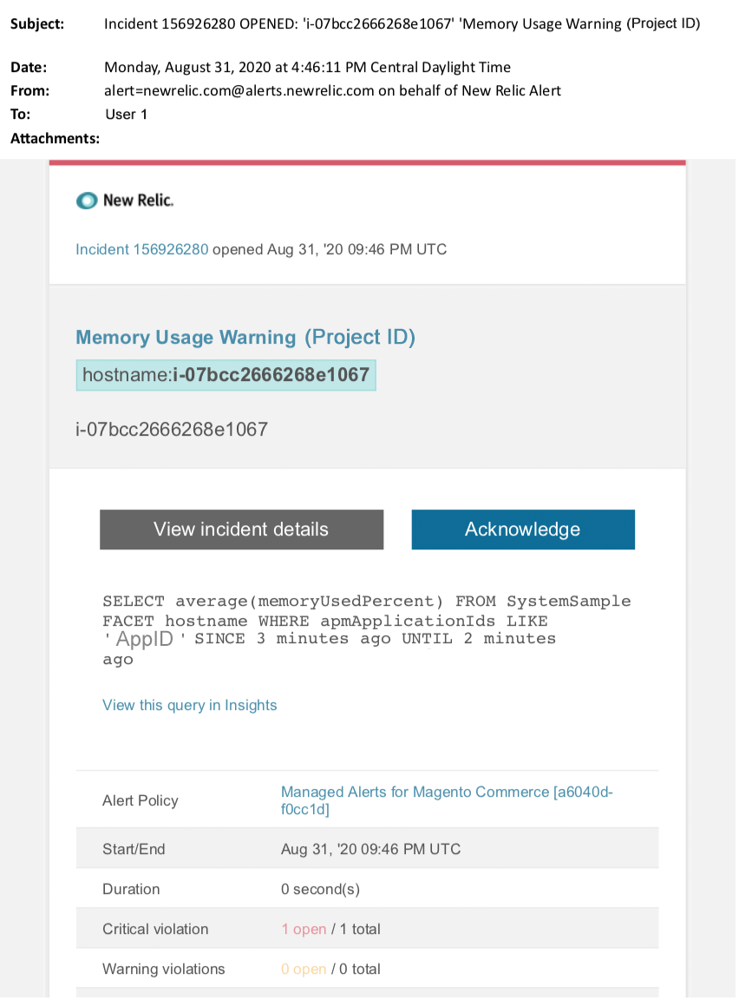

# Adobe Commerceの管理されたアラート：メモリ警告アラート

この記事では、[!DNL New Relic]でAdobe Commerceのメモリ警告アラートを受け取った場合のトラブルシューティング手順について説明します。 この問題を解決するには早急な行動が必要だ。 選択したアラート通知チャネルに応じて、アラートは次のようになります。

{width="500"}

## 影響を受ける製品とバージョン

Adobe Commerce on cloud infrastructure Pro プランアーキテクチャ

## イシュー

Adobe Commerce[&#128279;](managed-alerts-for-magento-commerce.md)の管理対象アラートにサインアップし、1つ以上のアラートしきい値を超えた場合、[!DNL New Relic]にアラートが届きます。 これらのアラートは、サポートとエンジニアリングからのインサイトを使用して、お客様に標準セットを提供するためにAdobe Commerceによって開発されました。

<u>**実行！**</u>:

* このアラートがクリアされるまでスケジュールされているデプロイメントを中止することをお勧めします。
* サイトが完全に応答しない、または応答しなくなった場合は、すぐにメンテナンスモードにします。 手順については、『Commerce インストールガイド』の「[&#x200B; メンテナンスモードを有効または無効にする](https://experienceleague.adobe.com/ja/docs/commerce-operations/installation-guide/tutorials/maintenance-mode)」を参照してください。 トラブルシューティングのためにサイトにアクセスできるように、IPを免除IP アドレスリストに追加してください。 手順については、Commerce インストールガイドの「[除外IP アドレスのリストを管理する](https://experienceleague.adobe.com/ja/docs/commerce-operations/installation-guide/tutorials/maintenance-mode#maintain-the-list-of-exempt-ip-addresses)」を参照してください。

<u>**やめて！**</u>:

* 追加のページビューをサイトに呼び込む可能性のある、追加のマーケティング施策を開始します。
* インデクサーまたは別のクローンを実行すると、CPUまたはディスクに負荷がかかる場合があります。
* 主要な管理タスク（管理者、データの読み込み/書き出し）を実行します。
* キャッシュをクリアします。

## Solution

以下の手順に従って、原因を特定し、トラブルシューティングします。

1. [[!DNL New Relic] APMのインフラストラクチャ ページ &#x200B;](https://docs.newrelic.com/docs/infrastructure/infrastructure-ui-pages/infra-hosts-ui-page/)を使用して、メモリを多用する上位プロセスを特定します。 手順については、[[!DNL New Relic] [ インフラストラクチャ監視ホスト ページ：[!UICONTROL Processes] タブ ]](https://docs.newrelic.com/docs/infrastructure/infrastructure-ui-pages/infra-hosts-ui-page/#processes)を参照してください。 [!DNL Redis]やMySQLなどのサービスがメモリ消費の上位ソースである場合は、次の操作を試してください。

   * 最新バージョンであることを確認してください。 新しいバージョンでは、メモリリークを修正できることがあります。 最新バージョンを使用していない場合は、アップグレードを検討してください。 手順については、Commerce on Cloud ガイドの[Change Services](https://experienceleague.adobe.com/ja/docs/commerce-on-cloud/user-guide/configure/service/services-yaml)を参照してください。
   * それでもメモリ消費量の増加の原因を特定できない場合は、長時間実行しているクエリ、プライマリキーが定義されていない、インデックスが重複しているなどのMySQLの問題を確認してください。 手順については、Commerce実装プレイブックの「[&#x200B; クラウドインフラストラクチャ上のAdobe Commerceの最も一般的なデータベースの問題](https://experienceleague.adobe.com/docs/commerce-operations/implementation-playbook/best-practices/maintenance/resolve-database-performance-issues.html?lang=ja)」を参照してください。
   * MySQLの問題がない場合は、PHPの問題を確認してください。 CLI/ターミナルで`ps aufx`を実行して、実行中のプロセスを確認します。 ターミナル出力には、現在実行中のcron ジョブとプロセスが表示されます。 プロセスの実行時間の出力を確認します。 実行時間が長いcronがある場合は、cronがぶら下がっている可能性があります。 トラブルシューティングの手順については、Commerce サポート ナレッジベースの「[&#x200B; パフォーマンスが遅く、動作が遅く、動作が長いcron](https://experienceleague.adobe.com/ja/docs/commerce-knowledge-base/kb/troubleshooting/miscellaneous/slow-performance-slow-and-long-running-crons)」および「[Cron ジョブが「実行中」ステータス &#x200B;](https://experienceleague.adobe.com/ja/docs/commerce-knowledge-base/kb/troubleshooting/miscellaneous/cron-job-is-stuck-in-running-status)」に留まっている」を参照してください。

1. 問題の原因を特定するのに苦慮している場合は、[[!DNL New Relic] APMのトランザクションページ &#x200B;](https://docs.newrelic.com/docs/apm/applications-menu/monitoring/transactions-page-find-specific-performance-problems)を使用して、パフォーマンスの問題を伴うトランザクションを特定します。

   * [!DNL Apdex] スコアを昇順で並べ替えます。 [[!DNL Apdex]](https://docs.newrelic.com/docs/apm/new-relic-apm/apdex/apdex-measure-user-satisfaction)は、web アプリケーションおよびサービスの応答時間に対するユーザー満足度を指します。 [低 [!DNL Apdex]  スコア &#x200B;](managed-alerts-for-magento-commerce-apdex-warning-alert.md)は、ボトルネック（応答時間が長いトランザクション）を示している可能性があります。 通常は、データベース、[!DNL Redis]、またはPHPです。 手順については、New Relic [最も高いトランザクションを表示 [!DNL Apdex] 不満](https://docs.newrelic.com/docs/apm/new-relic-apm/apdex/view-your-apdex-score#apdex-dissat)を参照してください。
   * 最も高いスループット、最も遅い平均応答時間、最も時間がかかるその他のしきい値などによってトランザクションを並べ替えます。 手順については、[[!DNL New Relic] 特定のパフォーマンスの問題を見つける](https://docs.newrelic.com/docs/apm/applications-menu/monitoring/transactions-page-find-specific-performance-problems)を参照してください。 まだ問題の特定に苦慮している場合は、[[!DNL New Relic] APMのインフラストラクチャページ &#x200B;](https://docs.newrelic.com/docs/infrastructure/infrastructure-ui-pages/infra-hosts-ui-page/)を使用してください。

1. メモリ消費量の増加の原因を特定できない場合は、最近の傾向を確認して、最近のコードのデプロイや設定の変更（新しい顧客グループやカタログの大規模な変更など）に関する問題を特定します。 コードのデプロイメントまたは変更の相関関係については、過去7日間のアクティビティを確認することをお勧めします。

1. 上記の方法で合理的な時間内に原因や解決策を見つけられない場合は、アップグレードをリクエストするか、まだメンテナンスモードにサイトを配置してください。 手順については、Commerce サポート サポート サポート技術情報の[一時サイズ変更をリクエストする方法](https://experienceleague.adobe.com/ja/docs/commerce-knowledge-base/kb/how-to/how-to-request-temporary-magento-upsize)およびCommerce インストールガイドの[&#x200B; メンテナンスモードを有効または無効にする](https://experienceleague.adobe.com/ja/docs/commerce-operations/installation-guide/tutorials/maintenance-mode)を参照してください。

1. アップサイズによってサイトが通常の動作に戻る場合は、永続的なアップサイズをリクエストするか（Adobeのアカウントチームにお問い合わせください）、負荷テストを実行してクエリを最適化するか、サービスへのプレッシャーを軽減するコードを実行して、専用ステージングで問題を再現してみてください。 Commerce on Cloud ガイドの[負荷および負荷テスト &#x200B;](https://experienceleague.adobe.com/ja/docs/commerce-cloud-service/user-guide/develop/test/staging-and-production#load-and-stress-testing)を参照してください。
