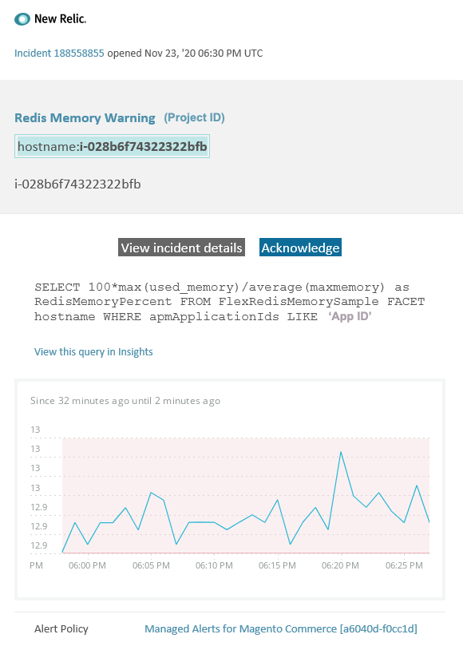

# Adobe Commerceの管理されたアラート：[!DNL Redis] メモリ警告アラート

この記事では、[!DNL New Relic]でAdobe Commerceの[!DNL Redis]警告アラートを受け取った場合のトラブルシューティング手順について説明します。 この問題を解決するには、ただちに行動を起こす必要があります。 選択したアラート通知チャネルに応じて、アラートは次のようになります。



## 影響を受ける製品とバージョン

Adobe Commerce オンクラウドインフラストラクチャ Pro プランアーキテクチャのすべてのバージョン。

## イシュー

Adobe Commerce](managed-alerts-for-magento-commerce.md)の[管理対象アラートにサインアップし、1つ以上のアラートしきい値を超えた場合、[!DNL New Relic]にアラートが届きます。 これらのアラートは、Adobe Adobeが開発したもので、サポートとエンジニアリングから得たインサイトを活用して、標準的なアラートを顧客に提供します。

**<u>実行！</u>**

* このアラートがクリアされるまで、スケジュールされているデプロイメントを中止することをお勧めします。
* サイトが完全に応答しない、または応答しなくなった場合は、ただちにメンテナンスモードに移行します。 手順については、『Commerce インストールガイド』の「[ メンテナンスモードを有効または無効にする](/help/installation/tutorials/maintenance-mode.md)」を参照してください。
* トラブルシューティングのためにサイトにアクセスできるように、IPを免除IP アドレスリストに追加してください。 手順については、Commerce インストールガイドの「[除外IP アドレスのリストを管理する](/help/installation/tutorials/maintenance-mode.md#maintain-the-list-of-exempt-ip-addresses)」を参照してください。

**<u>やめて！</u>**

* 追加のページビューをサイトに呼び込む可能性のある、追加のマーケティング施策を開始します。
* CPUまたはディスクに負荷がかかる可能性があるインデクサーまたは別のクローンを実行します。
* 主要な管理作業（データの読み込み/書き出し、メディアのフラッシュ、割り当てられた多数の製品を含むカテゴリの保存、一括更新など、Commerce管理者の主要なアクション）を実行します。
* キャッシュをクリアします。

## Solution

以下の手順に従って、原因を特定し、トラブルシューティングします。

1. [!DNL Redis]使用済みメモリが増加または減少しているかどうかを確認するには、[one.newrelic.com](https://login.newrelic.com/login) > **インフラストラクチャ** > **サードパーティサービス** ページに移動し、[!DNL Redis] ダッシュボードを選択します。 安定または増加している場合は、[ サポートチケット ](https://experienceleague.adobe.com/en/docs/support-resources/adobe-support-tools-guide/adobe-commerce-support/adobe-commerce-help-center-user-guide#support-case)を送信してクラスターをアップグレードするか、`maxmemory`制限を次のレベルに増やします。
1. メモリ消費量が[!DNL Redis]増加する原因を特定できない場合は、最近の傾向を確認して、最近のコードのデプロイや設定の変更（新しい顧客グループやカタログの大規模な変更など）に関する問題を特定します。 コードのデプロイメントまたは変更の相関関係については、過去7日間のアクティビティを確認することをお勧めします。
1. サードパーティの拡張機能が正しく動作しないか確認してください：
   * 最近インストールされたサードパーティの拡張機能と問題が発生した時間との相関関係を確認してください。
   * Adobe Commerce キャッシュに影響を与え、キャッシュが迅速に拡張される可能性がある拡張機能を確認します。 たとえば、カスタムレイアウトブロック、キャッシュ機能の上書き、大量のデータのキャッシュへの保存などです。
1. 上記の手順で問題の原因を特定またはトラブルシューティングできない場合は、L2 キャッシュを有効にしてアプリと[!DNL Redis]間のネットワークトラフィックを削減することを検討してください。 L2 キャッシュの概要については、『Commerce Configuration Guide 』の「[L2 caching in the Adobe Commerce application](/help/configuration/cache/level-two-cache.md)」を参照してください。 クラウドインフラストラクチャのL2 キャッシュを有効にするには、次の手順を実行します。
   * 2002.1.2 バージョン未満の場合は、ECE ツールをアップグレードします。
   * [REDIS\_BACKEND変数](https://experienceleague.adobe.com/en/docs/commerce-on-cloud/user-guide/configure/env/stage/variables-deploy#redis_backend)を使用して`.magento.env.yaml` ファイルを更新し、L2 キャッシュを設定します。

   ```yaml
   stage:
      deploy:
          REDIS_BACKEND: '\Magento\Framework\Cache\Backend\RemoteSynchronizedCache'
   ```
