# 「[!UICONTROL bots]」タブ

このタブには、サイトの問題を引き起こしているかどうか、および何の[!DNL bots]を特定する方法を説明する情報があります。

## [!DNL bots]の概要：

* [!DNL bot]は、反復的な自動化タスクを実行するソフトウェアの一部です。 AIとマシンラーニングの進化に伴い、[!DNL bots]のタスク、方法、インタラクションは変化しています。 サイトをクロールしてインターネット検索エンジンに追加することで、サイトにメリットをもたらす&#x200B;*good* [!DNL bots]があります。 その結果、インターネットユーザーは検索エンジンの結果を通じてサイトに誘導されます。 *good* [!DNL bot]は、通常、`robots.txt` ファイルまたは検索エンジンコンソールの設定によって[!DNL bot]に配置された境界を尊重します。 境界は、サイトまたはサイトの一部へのアクセスを制限できます。
* 悪意のある[!DNL bots]は`robots.txt` ファイルを無視するか、HTTP リクエストデータのリクエストユーザーエージェントフィールドを通じて良い[!DNL bot]をスプーフィングする可能性があります。 悪意のある[!DNL bots]が実行する一部のアクション：
   * サイトに読み込みを追加して、正当なユーザーによるサイトへのアクセスを拒否します。
   * コンテンツを勝手にスクレイピングして再利用。
   * 偽アカウントを登録して、メールサービスやアドレスをフラッディングしたり、他のサイト （[!DNL SPAM bots]）にリダイレクトしたりします。
   * 偽のビュー（[!DNL Viewbots]）を作成します。
   * 製品またはチケットを購入します（[!DNL Focused bots]）。
* [!DNL bots]の管理
   * [!DNL Observation for Adobe Commerce]には、[!DNL bot] トラフィックのビューがあります：
      * キャッシュされていない合計[!DNL bot] アクティビティが表示され、[!DNL bot]がサイトに追加している負荷と、その負荷がいつ発生しているかが表示されます。
      * エラーを生成している[!DNL bots]が表示されます。 通常、[!DNL bot]がサイトの問題を引き起こす読み込みを追加している場合、その[!DNL bot]またはIP アドレスはエラーの頻度が最も高くなります。
      * 次の方法で管理する[!DNL bot]名（リクエストユーザーエージェントフィールド値）とIP アドレスが表示されます。
         * [!DNL Fastly] （IP アドレス、範囲、または名前値で[!DNL bots]をブロックするレート制限または[!DNL VCLs]）。
         * `robots.txt field`に良好な[!DNL bot]情報を追加して、サイト アクセスの速度を制限または制限します。
         * 検索エンジンコンソールで[!DNL Bing]または[!DNL Google bots]を管理しています。

## [!UICONTROL Experimental Potential Malicious Bots frame]

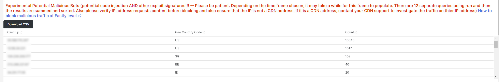

**[!UICONTROL Experimental Potential Malicious Bots frame]** フレームは、12個の独立した複雑なクエリで実行されます。 悪意のあるIP リクエストの署名を検出し、結果を集計し、合計し、降順で数で並べ替えます。 クエリには、CVE エクスプロイトおよびその他の悪意のあるリクエストの多数のデータ署名が含まれています。 セキュリティの修正やパッチによって攻撃がブロックされ、サイトに対する脅威ではない場合でも、そのリクエストはweb サイトで処理する必要があります。 リクエスト数は短期間で大幅に増加する可能性があります。 このフレームには、IP アドレスからのリクエストの合計数は表示されませんが、リクエストが疑わしい意図を持っていることを示すシグナルを持つリクエストが表示されます。

トラフィックが疑わしいものであり、有効なリクエストを配信している可能性のある[!DNL Content Distributed Network] （CDN）アドレスから送信されていないことを確認してください。 リクエストがCDN IP アドレスからのものであると判断された場合は、そのネットワークを介した疑わしいトラフィックのブロックを支援するために、そのサービスサプライヤーに連絡してください。 アドレスまたはリクエスト URLをブロックする必要がある場合は、Adobe Commerce サポート サポート ナレッジベースの [!DNL Fastly]  レベル [&#128279;](https://experienceleague.adobe.com/docs/commerce-knowledge-base/kb/how-to/block-malicious-traffic-for-magento-commerce-on-fastly-level.html)のAdobe Commerceの悪意のあるトラフィックをブロックするを参照してください。

## [!UICONTROL Rate of HTTP request per second (top 25) during requested time period]

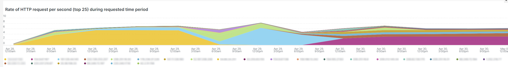

**[!UICONTROL Rate of HTTP request per second (top 25) during requested time period]** フレームは、選択した時間枠の中で最も高いリクエスト/秒のIP アドレスを示します。 これらのアドレスが上記の表にもある場合は、CDN アドレスおよび悪意のあるアドレスでないことを確認し、[!DNL Fastly]を介してそれらをブロックします。

## [!UICONTROL Total Bot traffic by bot name]:

選択した期間のボット名による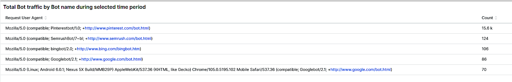

**[!UICONTROL Total Bot traffic by bot name during selected time period]** テーブルには、[!UICONTROL request_user_agent] フィールドの値に[!DNL bots]の文字列が含まれている、キャッシュされていない要求の集計数が含まれています。 これは、[!UICONTROL request_user_agent] フィールドの値を偽装できるため、名前付き[!DNL bot]である可能性があります。 [!UICONTROL Count]列の値が最も重要です。

## [!UICONTROL Total Bot Traffic by Bot name/IP address]

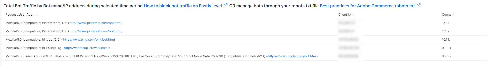

**[!UICONTROL Total Bot Traffic by Bot name/IP address during selected time period How to block bot traffic on Fastly level OR manage bots through your robots.txt file Best practices for Adobe Commerce robots.txt]** テーブルには、前のテーブルと同じデータが表示されますが、名前の付いた[!DNL bot]に代わってリクエストを行うIP アドレスが追加されます。 悪意のある[!DNL bots]が良い[!DNL bots]を偽装しているため、IP アドレスは、不正なIP アドレスを識別するWeb サイトまたは&#x200B;*whois* サービスまたは[!DNL DNS lookups]を通じて検証する必要があります。 例えば、[!DNL Google]は[[!DNL googlebot] IP アドレス &#x200B;](https://developers.google.com/search/apis/ipranges/googlebot.json)を公開し、[!DNL Microsoft]には[[!DNL Bingbots]](https://www.bing.com/webmasters/help/Verify-Bingbot-2195837f)の検証ツールがあります。

## [!UICONTROL Graph - Bots with HTTP status errors]

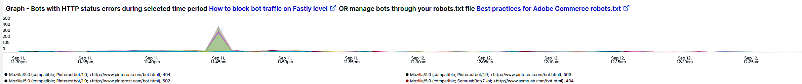のベストプラクティス

**[!UICONTROL Graph - Bots with HTTP status errors during selected time period How to block bot traffic on Fastly level OR manage bots through your robots.txt file Best practices for Adobe Commerce robots.txt]** グラフには、[!DNL bots]のエラーが表示され、「リクエストユーザーエージェント」フィールドで自分自身を宣言します。 これは、必ずしも、[!DNL bot]またはその他のトラフィックからのボリュームが原因でエラーが発生することを意味するものではありません。 エラーは、[!DNL bot]が存在しない情報を要求しているか、リクエストに別の問題がある可能性があります。

サイトの不安定性または障害時にIP アドレスにエラーが急増した場合、サイトの問題が疑われる可能性があります。

## [!UICONTROL Table - IPs that do not identify as bots]

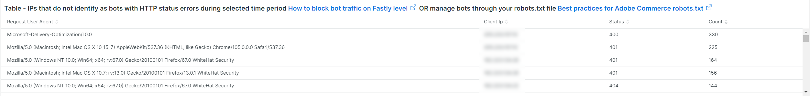のベストプラクティス

**[!UICONTROL Table - IPs that do not identify as bots with HTTP status errors during selected time period How to block bot traffic on Fastly level OR manage bots through your robots.txt file Best practices for Adobe Commerce robots.txt]** テーブルには、200以外のhttp ステータスコードを持つIP リクエストが表示されます。このコードは、リクエストユーザーエージェントフィールドに[!DNL bots]として自己識別されません。 これらのIP アドレスは、特に選択した期間のカウントが多い場合、悪意のあるIP アドレスになる可能性があります。

200以外のhttp ステータスコード数が少なく、IP アドレス範囲が類似していない場合は、アドレスがサイトの問題に貢献していない可能性があります。

## [!UICONTROL Table – Cache Status 'ERROR']

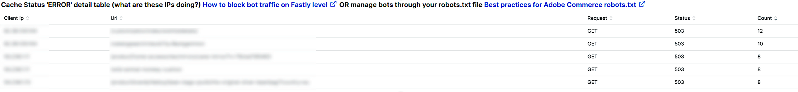のベストプラクティス

IP アドレスが頻繁にエラーを生成している場合は、その原因を突き止めます。 **[!UICONTROL Table – Cache Status 'ERROR' detail table (what are these IPs doing?) How to block bot traffic on Fastly level OR manage bots through your robots.txt file Best practices for Adobe Commerce robots.txt]** テーブルには、リクエストされたURLと、キャッシュステータス [!UICONTROL ERROR]値を持つリクエストのHTTP ステータス値が表示されます。 頻度はURLによってファセットされるので、カウントは低くなる可能性があります。 選択した期間にIP アドレスが数千のリクエストを行っている可能性があることを忘れないでください。 これは、時間枠（レコード表示制限）の間に最大2000件のリクエストに対するビューです。

## [!UICONTROL Show 5XX status distribution]

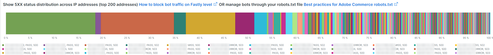のベストプラクティス

**[!UICONTROL Show 5XX status distribution across IP addresses (top 200 addresses) How to block bot traffic on Fastly level OR manage bots through your robots.txt file Best practices for Adobe Commerce robots.txt]** フレームは強力です。 選択した期間中に5XX個のhttp ステータスコードを持つIP アドレスが表示されます。 IP アドレスが大量のリクエストを行っていて、サイトがトラフィックを処理できない時点に影響を受ける場合、リクエストの頻度が最も高いIP アドレスは、通常、エラーの量が最も多くなります。 通常、5XX個のhttp ステータスコードは、リクエストへの対応に苦慮しているサイトを示しています。

バーが広いほど、IP アドレスがその期間中の合計5xx エラー数に含まれるエラーの割合が大きくなります。 注：IP アドレスに複数のhttp ステータスコードがある場合、グラフに複数のセグメントがある場合があります（例：502と503 http ステータス）。

典型的な分布は、IP アドレスが幅が同じバーの右側に示されるか、非常に低いカウントを持つ幅のバーがいくつかあります。

バーセグメントにカーソルを合わせると、選択した期間内に示されたエラーの数が表示されます。

## [!UICONTROL IP cache status (MISS, PASS, ERROR) and HTTP status]

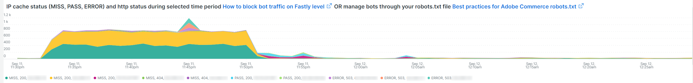のベストプラクティス

この&#x200B;**[!UICONTROL IP cache status (MISS, PASS, ERROR) and HTTP status during selected time period How to block bot traffic on Fastly level OR manage bots through your robots.txt file Best practices for Adobe Commerce robots.txt]** フレームには、選択した時間枠のIP別のHTTPS ステータスコード数とキャッシュされていないリクエストが表示されます。 これは、各IP アドレスからの比例的な負荷と合計ボリュームを示します。 最もリクエスト数の多いIP アドレスが表示されます。

## [!UICONTROL Fastly Cache Summary for selected time period]

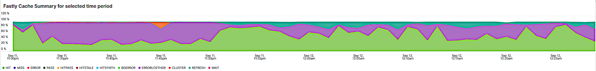

下のグラフの[!UICONTROL Error] アイコンをクリックすると、最後の2つのグラフを比較できます。 これは、負荷がサイトの問題に貢献する場所を示すのに役立ちます。

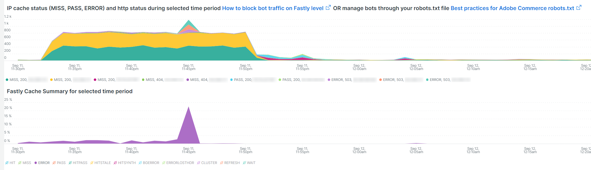

## [!UICONTROL Graph - IPs that do not identify as bots]

選択した時間帯にエラーなくボットとして識別されない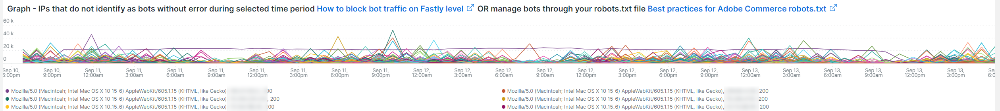のベストプラクティス

**[!UICONTROL Graph - IPs that do not identify as bots without error during selected time period How to block bot traffic on Fastly level OR manage bots through your robots.txt file Best practices for Adobe Commerce robots.txt]** フレームには、リクエストユーザーエージェントフィールド、[!DNL bot]を示さないリクエストのリクエストユーザーエージェントフィールド、IP アドレス、およびステータスコードが表示されます。 このフレームは、任意のIP アドレスからの高頻度リクエストを表示できますが、特にサイトに問題がある場合は、高頻度リクエストに注意を払います。

## [!UICONTROL Graph - Suspicious Non-Bot traffic]

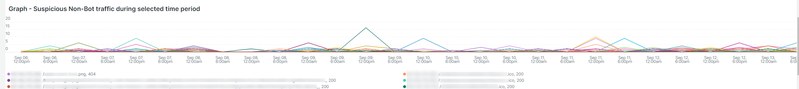

**[!UICONTROL Graph - Suspicious Non-Bot traffic during selected time period]** グラフは、Go-http-clientのリクエストユーザーエージェント値を探しますが、他の疑わしいリクエストユーザーエージェント値を調べるように拡張されます。 このリクエストユーザーエージェントの値は、サービスからの接続にサイトで使用され、有効である可能性がありますが、悪意のある[!DNL bots]でも使用されます。

## [!UICONTROL Graph - Bot traffic by Bot name]

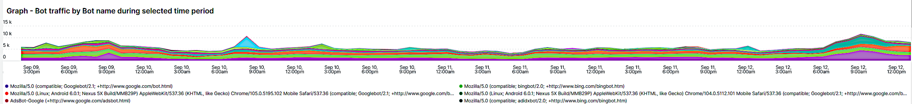

**[!UICONTROL Graph - Bot traffic by Bot name during selected time period]** フレームは、タブの上部にある選択した期間テーブルの間に[!DNL Bot]名で合計ボットトラフィックと同じデータを表示しています。 タイムラインを介してデータを表示し、[!DNL bots]によるリクエストがいつ行われ、その配布が行われているのかを確認できます。

## [!UICONTROL Graph - Top 250 Bot Names and IP addresses]

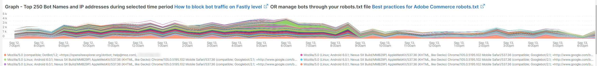

**[!UICONTROL Graph - Top 250 Bot Names and IP addresses during selected time period How to block bot traffic on Fastly level OR manage bots through your robots.txt file Best practices for Adobe Commerce robots.txt]** フレームは、タブの上部にある選択した期間テーブルの間に、ボット名/IP アドレスによる合計[!DNL Bot] トラフィックと同じデータを表示しています。 タイムラインを通じてデータを表示し、IP アドレスでファセット化しています。 これは、[!DNL bots]によるリクエストが行われた場合、どのIPがリクエストを行っているのか、およびリクエストの配布が表示されます。

## [!UICONTROL Blocked Bot name / IP addresses (in Fastly)]

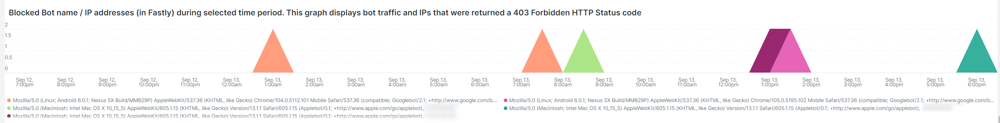が返されたボットトラフィックとIPが表示されます

**[!UICONTROL Blocked Bot name / IP addresses (in Fastly) during selected time period. This graph displays bot traffic and IPs that were returned a 403 Forbidden HTTP Status code]** フレームには、ブロックされているボット名とIP アドレスが表示されます。 このグラフでは、今後[!DNL Fastly]ですべてのリクエストがどのようにブロックされるかを確認できます。

## [!UICONTROL Blocked non-Bot name / IP addresses (in Fastly)]

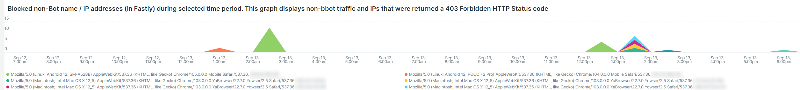が返された非ボットトラフィックおよびIPが表示されます

**[!UICONTROL Blocked non-Bot name / IP addresses (in Fastly) during selected time period graph displays non-bot traffic and IPs that were returned a 403 Forbidden HTTP Status code]** フレームには、[!DNL Fastly]を通じてブロックされた[!DNL bot]として識別されないIP アドレスが表示されます。

## [!UICONTROL This table shows the number of user agents per IP address, number of successful, unsuccessful and blocked requests:]

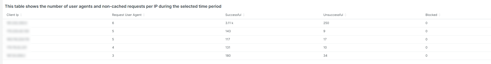

悪意のある[!DNL bots]は、多くの場合、[!UICONTROL Request User Agent] フィールドの値を介して他の[!DNL bots]をスプーフィングします。 この表は、IP アドレスがそのフィールドに持つ一意の値の数を示しています。 [!UICONTROL Request User Agent] フィールドの値が高いほど、IP アドレスが疑わしいものになります。

## [!UICONTROL IP with non-200 status errors]

200以外のステータスエラーを含む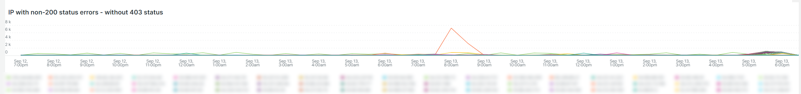

**[!UICONTROL IP with non-200 status errors – without 403 status]** フレームは、200以外のHTTP ステータス コードを持つIP アドレスの選択した期間での分布を示しています。 単一のIP アドレスまたはIP アドレスのグループでより高い値が表示される場合は、さらに調査する必要があります。

## [!UICONTROL IP with 403 status codes:]

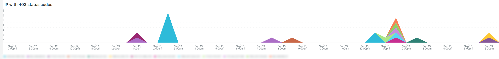）

**[!UICONTROL IP with 403 status codes]** フレームには、HTTP ステータスが403の[!UICONTROL cache_status=ERROR]を持たないキャッシュされていないリクエストが表示されます。 これは、オリジンサーバーが[!DNL Fastly]のブロックではなく、403 （不正）のソースであることを示している可能性があります。

## [!UICONTROL Top 5 with non-200 status codes]

200以外のステータスコードがcache_status: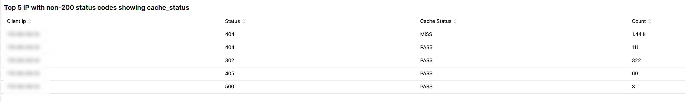を示す上位5件

**[!UICONTROL Top 5 with non-200 status codes showing cache_status]** テーブルには、IP / ステータスレベルで、[!UICONTROL cache_status]値を持つそれぞれのカウントが表示されています。

## [!UICONTROL Pageview Latency will show as spikes]

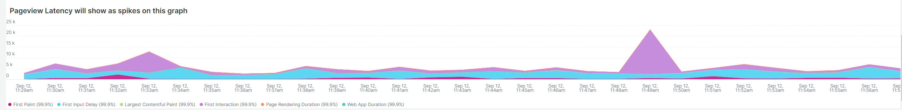

**[!UICONTROL Pageview Latency will show as spikes on this graph:]** フレームには、[!DNL bot] トラフィックに一致している可能性のあるページ読み込み/API応答の遅延が表示されます。
