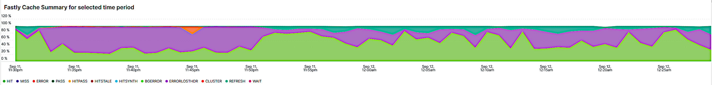

# 「[!UICONTROL bots]」タブ

このタブには、サイトの問題を引き起こしているかどうかと、その原因を特定す [!DNL bots] 方法を説明する情報が表示されます。

## [!DNL bots] の概要：

* [!DNL bot] は、繰り返し自動化されたタスクを実行するソフトウェアです。 人工知能と機械学習の進化により、[!DNL bots] ーザーのタスク、方法、やり取りは変化しています。 サイトをクロールしてインターネット検索エンジンに追加すると、サイトに利益をもたらす *良い*[!DNL bots] があります。 その結果、インターネットユーザーは検索エンジンの結果を通じてサイトに誘導されます。 通常 *良い*[!DNL bot] は、`robots.txt` ファイルまたは検索エンジン コンソールの設定によって [!DNL bot] ージに配置された境界を尊重します。 境界は、サイトまたはサイトの一部へのアクセスを制限できます。
* 悪意のある [!DNL bots] が `robots.txt` ファイルを無視するか、HTTP 要求データの要求ユーザーエージェントフィールドを介して良 [!DNL bot] を偽装する可能性があります。 悪意のある [!DNL bots] ーザーが実行する操作の一部：
   * サイトに負荷を追加して、サイトへの正規のユーザーのアクセスを拒否します。
   * 許可なくコンテンツを削除して再利用します。
   * 偽のアカウントを登録して、メールサービスやアドレスをあふれさせるか、他のサイト（[!DNL SPAM bots]）にリダイレクトさせる。
   * フェイクビュー（[!DNL Viewbots]）を作成します。
   * 商品またはチケットを購入する（[!DNL Focused bots]）。
* [!DNL bots] の管理
   * [!DNL Observation for Adobe Commerce] には、[!DNL bot] トラフィックのビューがあります。
      * キャッシュされていない [!DNL bot] アクティビティの合計を表示します。このアクティビティでは、[!DNL bot] ーザーがサイトに追加している読み込みと、その読み込みが行われている時間が表示されます。
      * エラーが発生している [!DNL bots] が表示されます。 通常、サイトの問題を引き起こす負荷を [!DNL bot] ーザーが追加している場合、その [!DNL bot] または IP アドレスのエラーの頻度が最も高くなります。
      * [!DNL bot] 名（リクエストユーザーエージェントフィールドの値）と、管理対象の IP アドレスが表示されます。
         * [!DNL Fastly] （IP アドレス、範囲または [!DNL bots] を名前値でブロックするレート制限または [!DNL VCLs]）。
         * サイトへのアクセス率を制限または制限するために、適切な [!DNL bot] 情報を `robots.txt field` に追加します。
         * 検索エンジンコンソールによる [!DNL Bing] または [!DNL Google bots] の管理。

## [!UICONTROL Experimental Potential Malicious Bots frame]

**[!UICONTROL Experimental Potential Malicious Bots frame]** フレームは、12 個の個別の複雑なクエリで構成されます。 悪意のある IP リクエストのシグネチャを検出し、結果を集計し、合計して、降順でカウント別に並べ替えます。 クエリには、CVE の悪用やその他の悪意のあるリクエストの多数のデータ署名が含まれています。 悪用がセキュリティ修正/パッチによってブロックされ、サイトに対する脅威ではない場合でも、リクエストは Web サイトで処理する必要があります。 リクエストの量は、短期間にかなり多くなる可能性があります。 このフレームには、IP アドレスからのリクエストの合計ではなく、リクエストに疑わしい意図があることを示すシグナルを持つリクエストが表示されます。

トラフィックが疑わしく、[!DNL Content Distributed Network] （CDN）アドレスから発信されたものではないこと、また有効なリクエストを配信している可能性があることを確認します。 リクエストが CDN IP アドレスからのものであると判断した場合は、そのサービスの提供者に連絡して、ネットワークを通過する疑わしいトラフィックをブロックするように依頼してください。 アドレスまたはリクエスト URL をブロックする必要がある場合は、Adobe Commerce サポートナレッジベースの [Adobe Commerceの悪意のあるトラフィックのブロック  [!DNL Fastly]  レベル ](https://experienceleague.adobe.com/docs/commerce-knowledge-base/kb/how-to/block-malicious-traffic-for-magento-commerce-on-fastly-level.html) を参照してください。

## [!UICONTROL Rate of HTTP request per second (top 25) during requested time period]

**[!UICONTROL Rate of HTTP request per second (top 25) during requested time period]** フレームには、選択した時間枠内の 1 秒あたりの IP アドレスあたりの最大リクエスト数が表示されます。 これらのアドレスが上記の表にも含まれている場合は、CDN アドレスと悪意がないことを確認し、[!DNL Fastly] 経由でブロックします。

## [!UICONTROL Total Bot traffic by bot name]:

**[!UICONTROL Total Bot traffic by bot name during selected time period]** テーブルには、[!UICONTROL request_user_agent] フィールドの値に [!DNL bots] の文字列が含まれている、キャッシュされていない要求の集計数が含まれています。 [!UICONTROL request_user_agent] フィールド値はスプーフィングされる可能性があるので、これは名前付き [!DNL bot] である場合もあれば、そうでない場合もあります。 [!UICONTROL Count] 列の値が最も重要です。

## [!UICONTROL Total Bot Traffic by Bot name/IP address]

**[!UICONTROL Total Bot Traffic by Bot name/IP address during selected time period How to block bot traffic on Fastly level OR manage bots through your robots.txt file Best practices for Adobe Commerce robots.txt]** のテーブルには、前のテーブルと同じデータが表示されますが、指定された [!DNL bot] ーザーの代わりにリクエストを行う IP アドレスが追加されます。 悪意のある [!DNL bots] 偽の良 [!DNL bots] として、IP アドレスは、悪用される IP アドレスを識別する Web サイト、または *whois* サービスまたは [!DNL DNS lookups] を通じて検証する必要があります。 例えば、[!DNL Google] は [[!DNL googlebot] IP アドレス ](https://developers.google.com/search/apis/ipranges/googlebot.json) を公開し、[!DNL Microsoft] には [[!DNL Bingbots]](https://www.bing.com/webmasters/help/Verify-Bingbot-2195837f) の検証ツールがあります。

## [!UICONTROL Graph - Bots with HTTP status errors]

**[!UICONTROL Graph - Bots with HTTP status errors during selected time period How to block bot traffic on Fastly level OR manage bots through your robots.txt file Best practices for Adobe Commerce robots.txt]** のグラフは、リクエストユーザーエージェント フィールドで自身を宣言する [!DNL bots] に関するエラーを示します。 これは、必ずしもエラーが [!DNL bot] または他のトラフィックからのボリュームによって引き起こされることを意味しません。 エラーは、[!DNL bot] が存在しない情報を要求しているか、要求に別の問題がある可能性があります。

サイトの不安定または停止中に IP アドレスでエラーのスパイクが発生した場合は、サイトの問題の疑いがある可能性があります。

## [!UICONTROL Table - IPs that do not identify as bots]

 のベストプラクティス

**[!UICONTROL Table - IPs that do not identify as bots with HTTP status errors during selected time period How to block bot traffic on Fastly level OR manage bots through your robots.txt file Best practices for Adobe Commerce robots.txt]** の表は、リクエストユーザーエージェントフィールドで [!DNL bots] のように自己識別されない 200 以外の HTTP ステータスコードを持つ IP リクエストを表示します。 特に、選択した期間にカウントが多い場合、これらの IP アドレスは悪意のある IP アドレスである可能性があります。

200 以外の HTTP ステータスコードの数が少なく、IP アドレスの範囲が似ていない場合、アドレスがサイトの問題に貢献していない可能性があります。

## [!UICONTROL Table – Cache Status 'ERROR']

IP アドレスで頻繁にエラーが発生する場合は、何をしているのかを問い合わせます。 **[!UICONTROL Table – Cache Status 'ERROR' detail table (what are these IPs doing?) How to block bot traffic on Fastly level OR manage bots through your robots.txt file Best practices for Adobe Commerce robots.txt]** テーブルには、リクエストされた URL と、キャッシュステータスの値が指定されたリクエストの HTTP ステータス [!UICONTROL ERROR] が表示されます。 頻度は URL でファセット化されるので、カウントが少ない場合があります。 選択した期間に、IP アドレスが何千ものリクエストを行う可能性があることに注意してください。 これは、期間中の最大 2000 件のリクエストに対する表示です（レコードの表示制限）。

## [!UICONTROL Show 5XX status distribution]

**[!UICONTROL Show 5XX status distribution across IP addresses (top 200 addresses) How to block bot traffic on Fastly level OR manage bots through your robots.txt file Best practices for Adobe Commerce robots.txt]** のフレームは強力です。 選択した期間の 5XX HTTP ステータスコードを持つ IP アドレスが表示されます。 IP アドレスが大量のリクエストを行い、トラフィックを処理できないほどサイトに影響が及ぶ場合、通常、リクエストの頻度が最も高い IP アドレスのエラーは最も高くなります。 5XX の http ステータスコードは、通常、リクエストに応答するのが困難なサイトを示します。

バーが広いほど、その期間中の合計 5xx エラー数のうち、IP アドレスに含まれるエラーの割合が大きくなります。 メモ：複数の http ステータスコード（例：502 および 503 http ステータス）がある場合、1 つの IP アドレスにグラフ内の複数のセグメントが含まれる可能性があります。

標準的な分布は、IP アドレスの幅が等しいバーの右側に示されるか、カウントが非常に少ない幅の広いバーがいくつかあります。

棒グラフのセグメントの上にマウスポインターを置くと、選択した期間における示されたエラーの数が表示されます。

## [!UICONTROL IP cache status (MISS, PASS, ERROR) and HTTP status]

この **[!UICONTROL IP cache status (MISS, PASS, ERROR) and HTTP status during selected time period How to block bot traffic on Fastly level OR manage bots through your robots.txt file Best practices for Adobe Commerce robots.txt]** フレームには、選択した期間の HTTPS ステータスコード数と、IP ごとのキャッシュされていないリクエストが表示されます。 これは、各 IP アドレスからの比例負荷とボリュームの合計を示します。 リクエスト数が最も多い IP アドレスが表示されます。

## [!UICONTROL Fastly Cache Summary for selected time period]

下のグラフの [!UICONTROL Error] のアイコンをクリックすると、最後の 2 つのグラフを相互に比較できます。 これは、負荷がサイトの問題の原因となっている場所を示すのに役立ちます。

## [!UICONTROL Graph - IPs that do not identify as bots]

**[!UICONTROL Graph - IPs that do not identify as bots without error during selected time period How to block bot traffic on Fastly level OR manage bots through your robots.txt file Best practices for Adobe Commerce robots.txt]** のフレームには、リクエストユーザーエージェントフィールド、IP アドレス、リクエストのステータスコードが表示されますが、リクエストユーザーエージェントフィールドには [!DNL bot] が表示されません。 このフレームには、任意の IP アドレスからの高頻度のリクエストが表示される場合がありますが、特にサイトで問題が発生する可能性がある期間は、高頻度のリクエストに注意が払われます。

## [!UICONTROL Graph - Suspicious Non-Bot traffic]

**[!UICONTROL Graph - Suspicious Non-Bot traffic during selected time period]** グラフは、Go-http-client のリクエストユーザーエージェント値を探しますが、他の疑わしいリクエストユーザーエージェント値を探すように拡張されます。 この要求ユーザーエージェントの値は、サイトがサービスから接続するために使用します。この値は有効である可能性がありますが、悪意のある [!DNL bots] によっても使用されています。

## [!UICONTROL Graph - Bot traffic by Bot name]

この **[!UICONTROL Graph - Bot traffic by Bot name during selected time period]** フレームには、タブ上部の選択した期間テーブル [!DNL Bot] の名前による合計ボットトラフィックと同じデータが表示されます。 タイムラインを介してデータを表示することで、[!DNL bots] ーザーによるリクエストが行われているタイミングと配布を確認できます。

## [!UICONTROL Graph - Top 250 Bot Names and IP addresses]

**[!UICONTROL Graph - Top 250 Bot Names and IP addresses during selected time period How to block bot traffic on Fastly level OR manage bots through your robots.txt file Best practices for Adobe Commerce robots.txt]** フレームには、タブ上部の選択した期間テーブルの間のボット名/IP アドレス別の合計 [!DNL Bot] トラフィックと同じデータが表示されます。 タイムラインを介してデータを表示し、IP アドレスでファセット化しています。 これは、[!DNL bots] ーザーからのリクエストがいつ行われたか、どの IP がリクエストを行っているか、およびリクエストの配分を示します。

## [!UICONTROL Blocked Bot name / IP addresses (in Fastly)]

**[!UICONTROL Blocked Bot name / IP addresses (in Fastly) during selected time period. This graph displays bot traffic and IPs that were returned a 403 Forbidden HTTP Status code]** フレームには、ブロックされたボット名と IP アドレスが表示されます。 このグラフでは、今後、すべてのリクエストがブロックされる [!DNL Fastly] を確認できます。

## [!UICONTROL Blocked non-Bot name / IP addresses (in Fastly)]

 が返されたボット以外のトラフィックと IP を表示します

**[!UICONTROL Blocked non-Bot name / IP addresses (in Fastly) during selected time period graph displays non-bot traffic and IPs that were returned a 403 Forbidden HTTP Status code]** フレームは、[!DNL Fastly] でブロックされた [!DNL bot] として識別されない IP アドレスを示します。

## [!UICONTROL This table shows the number of user agents per IP address, number of successful, unsuccessful and blocked requests:]

悪意のある [!DNL bots] は、[!UICONTROL Request User Agent] フィールドの値を介して他の [!DNL bots] をスプーフィングすることがよくあります。 次の表は、そのフィールドの IP アドレスに含まれる一意の値の数を示しています。 [!UICONTROL Request User Agent] フィールドの値が大きいほど、IP アドレスの疑いが強くなります。

## [!UICONTROL IP with non-200 status errors]

**[!UICONTROL IP with non-200 status errors – without 403 status]** フレームは、HTTP ステータスコードが 200 以外の IP アドレスについて、選択した期間の配信を示します。 1 つの IP アドレスまたは IP アドレスのグループで値が大きい場合は、さらに調査する必要があります。

## [!UICONTROL IP with 403 status codes:]

**[!UICONTROL IP with 403 status codes]** フレームは、HTTP ステータスが 403 の [!UICONTROL cache_status=ERROR] を持たない、キャッシュされていないリクエストを示します。 これは、オリジンサーバーが [!DNL Fastly] からのブロックではなく、403 （未認証）のソースであることを示している場合があります。

## [!UICONTROL Top 5 with non-200 status codes]

 を示す非 200 ステータスコードの上位 5

**[!UICONTROL Top 5 with non-200 status codes showing cache_status]** のテーブルは、[!UICONTROL cache_status] の値を持つ各のカウントを IP/ステータスレベルで表示しています。

## [!UICONTROL Pageview Latency will show as spikes]

**[!UICONTROL Pageview Latency will show as spikes on this graph:]** フレームは、[!DNL bot] トラフィックに合わせてページの読み込み/API 応答の待ち時間を示します。
