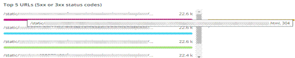

# 「[!UICONTROL CDN]」タブ

このタブには、[!DNL content delivery network (CDN)] に焦点を当てた情報があります。 Adobe Commerce Cloud の場合、これは [!DNL Fastly] サービスです。

## [!UICONTROL HIT rate]

**[!UICONTROL HIT rate]** フレームには、直前の [!UICONTROL HITS] ラーにつながったキャッシュ可能なリクエストの数が表示されます。 これは、キャッシュが成功したことを示します。 右側の矢印は、1 週間前の同じ時刻を上下に表す割合を示します。

## [!UICONTROL HIT Processing]

この **[!UICONTROL HIT processing]** ボックスには、1 週間に [!UICONTROL HITS] ストが発生したキャッシュ可能なリクエストの数が表示されます。

## [!UICONTROL MISS rate]

この **[!UICONTROL MISS rate]** ボックスには、最後の 1 分間にキャッシュ可能なリクエストが失敗した回数が表示されます。 ミスとは、リクエストがキャッシュされておらず、コンテンツを提供するためにリクエストをオリジンサーバーに渡す必要がある場合です。 右側の値は、1 週間前の 1 分あたりの分数と増減の比較です。

## [!UICONTROL MISS time]

## [!UICONTROL HIT Ratio]

## [!UICONTROL Error Percentage]

**[!UICONTROL Error Percentage]** のボックスには、リクエストのエラー率の値と、1 週間前の同じ時刻と比較した相対的な増減が表示されます。

## [!UICONTROL Total Requests]

## [!UICONTROL ERROR rate]

## [!UICONTROL Fastly Cache Average Response for selected time period in seconds]

このフレームは、キャッシュ可能なリクエストの期間を秒単位で表示します。つまり、`cache_response` が [!UICONTROL MISS] の場合は、選択した時間にキャッシュされた応答が欠落している平均が表示されます。

## [!UICONTROL Fastly Cache Average Response for selected time period in seconds, faceted by POP]

*POP* とは、このコンテキストでは、キャッシュストレージのプールとして機能するように設定された POP （Point of Presence）を指します。 [ プレゼンスポイント ](https://developer.fastly.com/learning/concepts/pop/) を参照してください。

## [!UICONTROL Total Bandwidth (All POPs) during the selected timeframe, compared with 1 week ago (% increase/decrease)]

## [!UICONTROL Requests – Since selected timeframe compared with one week ago]

このフレームは、上部の [!UICONTROL Total Requests] の概要ボックスに似ていますが、前の週のリクエスト数を表示します。 これらは、キャッシュ可能なリクエスト（`is_cacheable` が true の場合）だけでなく、すべてのリクエストです。

## [!UICONTROL Response Count]

## [!UICONTROL Bandwidth by POP]

## [!UICONTROL Top 5 URLs (5xx or 3xx status codes)]

**[!UICONTROL Top 5 URLs]** ビューには、5xx または 3xx のエラー応答が発生している上位 5 つの URL が表示されます。 スペースの制約により、URL の上にマウスポインターを置いて、その URL に関連付けられた特定のエラーコードを表示する必要があります。 （上の図の赤いボックスの例）。

## [!UICONTROL Top 25 URLs (200 status)]

**[!UICONTROL Top 25 URLs]** のフレームには、選択した期間にカウント別に 200 ステータスを返した URL が表示されます。

## [!UICONTROL Duration by Response Status]

**[!UICONTROL Duration by Response Status]** グラフには、選択した期間のエラー応答がカウント別に表示されます。このカウントは、エラーステータスコードで切り替えられます。

## [!UICONTROL Duration by Response Status, top 25 urls]

**[!UICONTROL Duration by Response Status, top 25 URLs]** のグラフには、応答期間別の上位 25 個の URL が秒単位で表示されます。 パス全体を表示するには、URL の上にマウスを置く必要がある場合があります。 また、1 つの URL 以外をすべて削除するには、その URL をクリックします。 その後、他の URL を個別にクリックして、追加し直すことができます。 個々の URL を削除する場合は、キーを押したまま各 URL をクリックすると、グラフから削除できます。

## [!UICONTROL Duration by Response Status, top 25 non-200 status]

**[!UICONTROL Duration by Response Status, top 25 non-200 status]** グラフは最後のグラフと似ていますが、フォーカスが 200 以外のステータスコードまたはエラーステータスコードにある点が異なります。 エラーコードと URL が表示されます。 パス全体を表示するには、URL の上にマウスを置く必要がある場合があります。 また、1 つの URL 以外をすべて削除するには、その URL をクリックします。 その後、他の URL を個別にクリックして、追加し直すことができます。 個々の URL を削除する場合は、キーを押したまま各 URL をクリックすると、グラフから削除できます。

## [!UICONTROL Error Count by POP timeline]

**[!UICONTROL Error Count by POP timeline]** グラフには、選択した期間タイムラインに沿ったエラーステータスの数が、エラーコードでファセットされて表示されます。

## [!UICONTROL Duration by Response status, top 25 client IP, non-200 status]

**[!UICONTROL Duration by Response status, top 25 client IP, non 200 status]** のグラフは、ステータスエラーコードが存在した場合に、選択した時間枠での平均期間別に IP アドレスを表示します。

## [!UICONTROL IP Frequency]

**[!UICONTROL IP Frequency]** フレームは、[!DNL Fastly] ログから各 IP の（「MISS」および「PASS」）ステータスをカウントします。 これらのステータスを持つ web リクエストは、接触チャネルサーバーに到達し、サーバーに負荷を追加します。 これは、頻度の上位 20 件のアドレスを表示します。 このフレームは、Web サイトに対する IP 攻撃や高負荷のソースを検出するために使用できます。 このグラフは「概要」タブにも表示され、このタブに表示される [!DNL Fastly] ログ情報の詳細と簡単に比較できるように、ここに配置されています。
