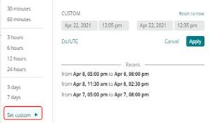
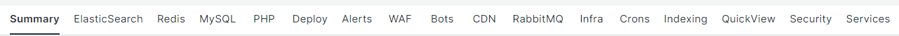

# [!UICONTROL focus]個のタブを選択中

[!DNL Observation for Adobe Commerce]の力は、同じタイムライン上で膨大な量の異なるデータビューを整列させることから生まれます。 [!DNL Observation for Adobe Commerce]は、収集されたデータ サンプルと、システムとアプリケーション ログの視覚的なビューを[!DNL New Relic] エージェントに提示できます。 複雑な問題のトラブルシューティングを考える場合、データを半分に分割することが常に重要です。 タイムライン上の問題を見ると、最初の質問は「いつこれが発生しましたか？」です。 当面の懸念は、その瞬間の前に起こったことすべてです。 タイムライン上で問題が発生した正確な時間を把握している場合は、問題の直前にタイムラインを選択できます。 問題の詳細については、サイトの動作が遅い、または低下している以外では把握できない場合があります。 Adobe Commerceでは、コンポーネントサービス、リソースレベル、実行中のプロセス数などが疑われる可能性があります。

**[!UICONTROL focus]** タブには、問題の原因または原因となる領域に焦点を当てるのに役立つ情報が表示されます。 データ シグナルを[!DNL Observation for Adobe Commerce]に継続的に追加することもできます。 データシグナルには、[!DNL New Relic]件の収集データ、重要フェーズのカウント、またはログからのエラーメッセージを使用できます。 エラーメッセージがサイトの問題に関連していることが識別されると、重要な情報の表示を改善するために[!DNL Observation for Adobe Commerce] クエリに追加できます。

