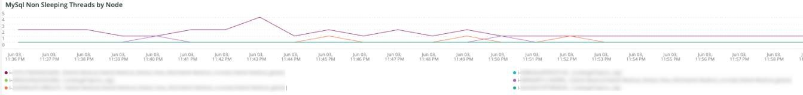

# The [!DNL Cron] タブ

このタブでは、 [!DNL cron] 問題。

## [!UICONTROL Cron transaction duration in seconds]

The **[!UICONTROL Cron transaction duration in seconds]** フレーム表示 [!DNL crons] トランザクションの期間（秒）。 これは、長いランタイムを持つトランザクションを表示します。 APM を詳しく調べると、トランザクション/操作が実行されている可能性のあるクエリの詳細が表示されます。

## [!UICONTROL MySQL Non-Sleeping Threads by Node]

The **[!UICONTROL MySQL Non-Sleeping Threads by Node]** frame は、選択した期間の MySQL 非スリープスレッドをノード別に表示します。

## [!UICONTROL SQL Trace count by path]

The **[!UICONTROL SQL Trace count by path]** frame は、パス別に MySQL トレース数を調べます。これは、選択した期間にわたって SQL 文をトレースするのに役立ちます。

## [!UICONTROL Cron database call]

The **[!UICONTROL Cron database call]** フレームは、 [!DNL crons] 選択した期間にわたるデータベースへの呼び出し。

## [!UICONTROL Cron schedule table locks]

The **[!UICONTROL Cron schedule table locks]** フレームが見る [!DNL cron] スケジュールテーブルは、選択した期間でロックされます。

## [!UICONTROL Cron schedule clean cron fired]

The **[!UICONTROL Cron schedule clean cron fired]** フレームは、 [!DNL crons] 選択した期間でクリーンアップされました。 このフレームにデータが表示されない場合は、 [!DNL crons] が正しく実行されている。 次の場合、 [!DNL cron] ジョブスケジュールはクリーンアップされません。 [!DNL crons] が最適に実行されず、実行に時間がかかる場合があります。

## [!UICONTROL Cron schedule clean records details table]

The **[!UICONTROL Cron schedule clean records details table]** テーブルには、レコードをクリーンアップするジョブの詳細が表示されます `cron_schedule` 選択した期間のテーブル。

## [!UICONTROL cron_schedule table updates]

The **[!UICONTROL cron_schedule table updates]** フレームは、 [!DNL cron] スケジュール済みテーブルが、選択した期間に更新されます。 このテーブルの削除または更新での高いアクティビティは、 [!DNL crons]. また、 [!DNL crons] 実行および完了時にこのテーブルを更新します。このテーブルにアクティビティがなく、アクティビティがなく、 [!DNL crons] 設定済みの場合は、 [!DNL crons].

## [!UICONTROL Datastore Operations Tables]

The **[!UICONTROL Datastore Operations Tables]** データベーステーブルの操作を参照します。次の操作が含まれます。 `SELECT`, `DELETE`、および `UPDATE` 選択した期間をまたいで。 このフレームは、操作頻度が最も高いデータベーステーブルを表示します。
