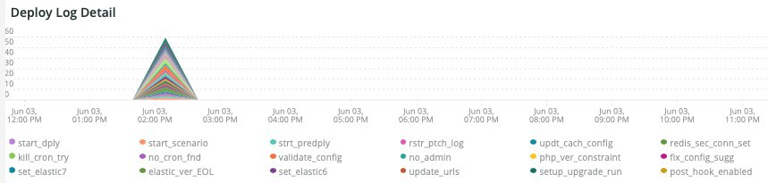

# この [!UICONTROL Deploy] タブ

このタブでは、デプロイメントの問題の問題と原因をすばやく特定します。

## [!UICONTROL Deploy log Deployment Troubleshooter]

この **[!UICONTROL Deploy log Deployment Troubleshooter]** frame は、選択した期間に発生したデプロイログイベントの数を示します。 目的は、デプロイメントアクティビティを一目で確認し、デプロイメントの複雑さをカウントで判断することです。 ログに記録されるメッセージが多いほど、デプロイメントは通常より複雑になります。

## [!UICONTROL Deploy State]

この **[!UICONTROL Deploy State]** frame は、選択した期間に発生したデプロイイベントを示します。 このフレームのパーサーは、次の特定のシグナルを探します。

* &#39;%NOTICE:生成コマンド%&#39;を&#39;start_gen&#39;として開始します
* &#39;%git apply /app/vendor/magento/ece-tools/patches%&#39;)&#39;apply_patches&#39;
* &#39;%Set フラグ：.static_content_deploy%) を&#39;SCD&#39;として
* &#39;%NOTICE:「gen_compl」として「コマンド完了%」を生成 )
* &#39;%NOTICE:デプロイを開始しています。%) を&#39;start_deploy&#39;として
* &#39;%NOTICE:デプロイメント完了%) を&#39;deploy_compl&#39;として
* &#39;%NOTICE:デプロイ後に開始します。%) を&#39;start_pdeploy&#39;として
* &#39;%NOTICE:デプロイ後の処理は完了%) を「デプロイ」として
* &#39;%deploy-complete%&#39;) を&#39;cl_deploy_compl&#39;として

## [!UICONTROL Deploy Log Detail]

この **[!UICONTROL Deploy Log Detail]** frame は、選択した期間内に発生したログメッセージの概要の詳細を示します。 フレームは、デプロイメントログ内の次の文字列を解析中です。

* &#39;%NOTICE:デプロイを開始しています。%) を&#39;start_dply&#39;として
* &#39;%INFO:開始シナリオ：scenario/deploy.xml%&#39;) を&#39;start_scenario&#39;として
* &#39;%NOTICE:プリデプロイ%) を&#39;strt_predply&#39;として開始しています
* &#39;%情報：パッチログファイル%&#39;を&#39;rstr_ptch_log&#39;として復元しています
* &#39;%INFO:キャッシュ設定を更新しています。%&#39;) を&#39;updt_cach_config&#39;として
* &#39;%INFO:Redis スレーブ接続%) を&#39;redis_sec_conn_set&#39;に設定
* &#39;%INFO:静的コンテンツのデプロイメントは、ビルドフック中に実行され、古いコンテンツをクリーニング%&#39;) は&#39;scd_build_hk&#39;として実行されました。
* &#39;%INFO:pub/static%&#39;を&#39;clr_pub_static&#39;としてクリア中
* &#39;%NFO:redis キャッシュをクリアしています：%&#39;) （&#39;clr_redis_cach&#39;として）
* &#39;%INFO:var/cache directory%) を&#39;clr_var_cach&#39;としてクリアしています
* &#39;%のお知らせ：メンテナンスモード%) を&#39;enable_maint_mode&#39;として有効化
* &#39;%INFO:（cron%を無効にする）を「disable_cron」として無効にする
* &#39;%INFO:実行中の cron ジョブとコンシューマー processes%) を&#39;kill_cron_try&#39;として強制終了しようとしています。
* &#39;%INFO:Magentocron およびコンシューマープロセスが見つかりませんでした。%&#39;) を&#39;no_cron_fnd&#39;として、
* %お知らせ：設定%) を&#39;validate_config&#39;として検証中
* &#39;%初期インストール中に管理者ユーザーを作成するには、次の管理者データが必要です%&#39;) (&#39;no_admin&#39;)
* &#39;%recommended PHP version comstraint%&#39;) を&#39;php_ver_constraint&#39;として満たしています
* &#39;%WARNING:指定された候補 (%) を&#39;fix_config_sugg&#39;として設定を修正
* &#39;%WARNING: [2003 年] エラーレポートのディレクトリネストレベルの値が設定されていません。%&#39;) を&#39;nest_err_reporting&#39;として
* &#39;%NOTICE:検証終了%) を&#39;end_validation&#39;として
* &#39;%NOTICE:更新を開始しています。%) を&#39;start_update&#39;として
* &#39;%INFO:env.php を更新しています。%&#39;) を&#39;update_php_env&#39;として
* &#39;%INFO:env.php DB 接続設定を更新しています。%&#39;) を&#39;update_php_env_db&#39;として
* &#39;%INFO:env.php AMQP configuration%) を「update_php_env_amqp」として更新しています
* &#39;%INFO:検索エンジンの設定先：elasticsearch7%) を&#39;set_elastic7&#39;として
* &#39;%elasticsearch 6.5.4 は EOL%&#39;) を&#39;elastic_ver_EOL&#39;として渡しました
* &#39;%INFO:検索エンジンの設定先：elasticsearch6%) を&#39;set_elastic6&#39;として
* &#39;%INFO:セキュア URL と非セキュア URL の更新%) を&#39;update_urls&#39;として
* &#39;%INFO:セットアップのアップグレードを実行しています。%&#39;) を&#39;setup_upgrade_run&#39;として
* &#39;%INFO:デプロイ後のフックが有効になっています。 Cron の有効化、キャッシュのクリーニングおよび事前ワーミングの処理は延期%) を「post_hook_enabled」に変更
* &#39;%NOTICE:メンテナンスモードが無効です。%&#39;) を&#39;maint_mode_disabled&#39;として
* &#39;%INFO:シナリオが完了%) （「scenario_finished」として）
* &#39;%WARNING:コマンドのメンテナンス：有効化が完了しました。エラーが発生しました。 maintenanceflag file%&#39;の作成 ) を&#39;enable_maintenance_fail&#39;として
* &#39;%MySQL サーバが消去されました%&#39;) （&#39;MySQL_has_gone_away&#39;として）

## [!UICONTROL Post Deploy Log Detail]

この **[!UICONTROL Post Deploy Log Detail]** frame は、選択した期間に発生したデプロイ後のログの詳細を示します。 このフレームは、次の文字列を含む特定のログメッセージに焦点を当てています。

* &#39;%無効なメンテナンスモード%&#39;) (&#39;disabled_maint_mode&#39;)
* &#39;%INFO:開始シナリオ：scenario/post-deploy.xml%&#39;) を&#39;start_pstdply_scenario&#39;として
* &#39;%のお知らせ：設定%) を&#39;val_config&#39;として検証中
* &#39;%のお知らせ：検証終了%) を&#39;end_val_config&#39;として
* &#39;%INFO:cron%を有効化 ) を&#39;cron_enabled&#39;として有効化
* &#39;%情報：重要なファイルのバックアップを作成します。%&#39;) を&#39;file_backup&#39;として
* &#39;%INFO:backup%&#39;が正常に作成されました ) を&#39;file_backup_success&#39;として
* &#39;%INFO:（%のウォームアップを開始中）を&#39;pg_warmup_start&#39;として
* &#39;%INFO:(%) を「wormed_up_pg」として
* &#39;%ERROR:ウォーミングアップに失敗しました： %&#39;) を&#39;warm_up_pg_err&#39;として
* &#39;%情報：シナリオが完了%) （「scenario_finished」として）

## [!UICONTROL Cloud Log Detail]

この **[!UICONTROL Cloud Log Detail]** frame は、選択した期間に発生したクラウドログの詳細を示します。 次の文字列が解析され、以下の「AS」ラベルで返されます。

* &#39;%DEBUG:/bin/bash -c &quot;set -o pipefail;php./bin/magento setup:upgrade%) を「start_update」として
* &#39;%スキーマの作成/更新：%&#39;) を&#39;schema_updates&#39;として
* &#39;%何も読み込みません。%&#39;) を&#39;mod_import_finish&#39;として
* &#39;%NOTICE:更新の終了。%) を&#39;update_finished&#39;として
* &#39;%DEBUG:実行中のステップ：deploy-static-content%) を&#39;scd_run&#39;として
* &#39;%のお知らせ：静的コンテンツの展開をスキップしています。 SCD オンデマンドが有効になっている。%) を&#39;scd_ondemand&#39;として
* &#39;%INFO:&#39;clr_dirs&#39;として%&#39;をクリア中
* &#39;%DEBUG:「scd_finished」としての手順「deploy-static-content」 finished%」)
* &#39;%NOTICE:静的コンテンツ圧縮をスキップします。 SCD オンデマンドが有効になっている。%&#39;) を&#39;scd_compression_run&#39;として
* &#39;%INFO:var/cache directory%) を&#39;clr_var_cach&#39;としてクリアしています
* &#39;%DEBUG:&#39;scd_compression_finished&#39;として&quot;compress-static-content&quot; finished%&quot;) の手順
* &#39;%DEBUG:実行中のステップ：deploy_complete%) を&#39;deploy_finished&#39;として
* &#39;%INFO:デプロイ後のフックが有効になっています。 Cron の有効化、キャッシュのクリーニング、ウォーミング前の操作は、デプロイ後の段階に延期されました。%) を&#39;Post_deploy_hook_enabled&#39;として
* &#39;%NOTICE:メンテナンスモードが無効です。%&#39;) を&#39;maint_mode_disabled&#39;として
* &#39;%INFO:シナリオが完了%) （「scenario_finished」として）
* &#39;%post-deploy.xml%&#39;) を&#39;post_deploy_start&#39;として
* &#39;%NOTICE:設定%) を&#39;validate_config&#39;として検証中
* &#39;%WARNING: [2003 年] エラーレポートのディレクトリネストレベルの値が設定されていません。%&#39;) を&#39;nest_err_reporting&#39;として
* &#39;%NOTICE:検証終了%) を&#39;end_validation&#39;として
* &#39;%INFO:（cron%を有効にする）を「enable_cron」として有効化
* &#39;%INFO:重要なファイルのバックアップを作成する%) を&#39;create_backup&#39;として作成する
* &#39;%DEBUG:ステップ&quot;backup&quot; finished%&#39;) を&#39;backup_finished&#39;として
* &#39;%INFO:（%のウォーミングアップを開始中）を「wormup_start」として
* &#39;%ERROR:ウォーミングアップに失敗しました： %&#39;) を&#39;warm_up_fail&#39;として
* &#39;%DEBUG:&quot;ウォームアップ&quot;完了%&quot;) を&#39;wormup_finished&#39;としてステップ
* &#39;% DEBUG:「ttfb_finished」としてのステップ「time-to-first-byte」が完了%」)
* &#39;%INFO:シナリオが完了%) （「post_deploy_finished」として）
* &#39;%DEBUG:実行中のステップ：prebuild%) を&#39;run_pre-build&#39;として
* &#39;%DEBUG:&#39;scd_flag_del&#39;としてのフラグ.static_content_deploy は既に削除されています%&#39;)
* &#39;%DEBUG:手順&quot;pre-build&quot; finished%&quot;) を&#39;pre-build_completed&#39;として
* &#39;%NOTICE:パッチの適用%) を&#39;apply_patches&#39;として適用する
* &#39;%applied%&#39;) を&#39;patches_applied&#39;として適用しました
* &#39;%DEBUG:&#39;apply_patches_complete&#39;として&quot;apply-patches&quot; finished%&#39;)
* &#39;%クイック戦略を使用したデプロイ%&#39;) を&#39;quick_strategy_deploy&#39;として&#39;
* &#39;%のお知らせ：DI コンパイル%&#39;を実行 ) を&#39;di_compliation_start&#39;として実行する
* &#39;%NOTICE:DI コンパイルの終了%) を&#39;di_compliation_finished&#39;として実行
* &#39;%NOTICE:新しい静的コンテンツの生成%) を&#39;gen_frsh_static_content&#39;として生成
* &#39;%magento セットアップ:static-content:デプロイ%) を&#39;scd_executing&#39;として
* &#39;%NOTICE:新しい静的コンテンツの生成の終了%) を「gen_frsh_static_cont_finished」として
* &#39;%INFO:開始シナリオ：scenario/build/transfer.xml%&#39;) を&#39;start_transferxml&#39;として
* &#39;%INFO:実行中の cron ジョブを強制終了しようとしています (%) を&#39;kill_crons&#39;として
* &#39;%INFO:Redis キャッシュのクリア： %&#39;) を&#39;clear_redis_cache&#39;として
* &#39;%INFO:db が存在し、hastables%) が&#39;db_check&#39;であるかどうかの確認
* &#39;%WARNING: [2010 年] Elasticsearchサービスはインフラストラクチャ層にインストールされていますが、検索エンジンとしては使用されていません。%&#39;) as&#39;es_not_used&#39;
* &#39;%NOTICE:更新を開始しています。%) を&#39;starting_update&#39;として
* &#39;%INFO:検索エンジンの設定先：mysql%) を&#39;mysql_search&#39;として
* &#39;%SQLSTATE[HY000] [2006] MySQL サーバは&#39;mysql_gone&#39;として使用されなくなりました%&#39;)

## [!UICONTROL Count of modules imported during deploy]

この **[!UICONTROL Count of modules imported during deploy]** frame は、選択した期間にデプロイメント中にインポートされたモジュールの数を示します。

## [!UICONTROL Deployed module list]

この **[!UICONTROL Deployed module list]** frame は、選択した期間にデプロイされたモジュールを表示します。

