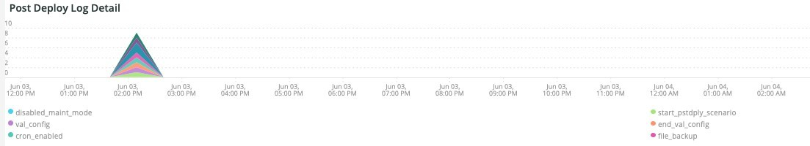
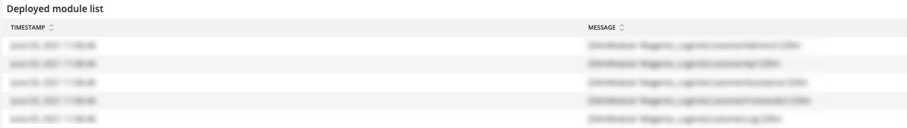

# The [!UICONTROL Deploy] タブ

このタブでは、デプロイメントの問題の問題と原因をすばやく特定します。

## [!UICONTROL Deploy log Deployment Troubleshooter]

The **[!UICONTROL Deploy log Deployment Troubleshooter]** frame は、選択した期間に発生したデプロイログイベントの数を示します。 目的は、デプロイメントアクティビティを一目で確認し、デプロイメントの複雑さをカウントで判断することです。 ログに記録されるメッセージが多いほど、デプロイメントは通常より複雑になります。

## [!UICONTROL Deploy State]

The **[!UICONTROL Deploy State]** frame は、選択した期間に発生したデプロイイベントを示します。 このフレームのパーサーは、次の特定のシグナルを探します。

* &#39;`%NOTICE: Starting generate command%`&#39;) は&#39;`start_gen`&#39;
* &#39;`%git apply /app/vendor/magento/ece-tools/patches%`&#39;) は&#39;`apply_patches`&#39;
* &#39;`%Set flag: .static_content_deploy%`&#39;) は&#39;`SCD`&#39;
* &#39;`%NOTICE: Generate command completed%`&#39;) は&#39;`gen_compl`&#39;
* &#39;`%NOTICE: Starting deploy.%`&#39;) は&#39;`start_deploy`&#39;
* &#39;`%NOTICE: Deployment completed%`&#39;) は&#39;`deploy_compl`&#39;
* &#39;`%NOTICE: Starting post-deploy.%`&#39;) は&#39;`start_pdeploy`&#39;
* &#39;`%NOTICE: Post-deploy is complete%`&#39;) は&#39;`pdeploy`&#39;
* &#39;`%deploy-complete%`&#39;) は&#39;`cl_deploy_compl`&#39;

## [!UICONTROL Deploy Log Detail]

The **[!UICONTROL Deploy Log Detail]** frame は、選択した期間内に発生したログメッセージの概要の詳細を示します。 フレームは、デプロイメントログ内の次の文字列を解析中です。

* &#39;`%NOTICE: Starting deploy.%`&#39;) は&#39;`start_dply`&#39;
* &#39;`%INFO: Starting scenario(s): scenario/deploy.xml%`&#39;) は&#39;`start_scenario`&#39;
* &#39;`%NOTICE: Starting pre-deploy%`&#39;) は&#39;`strt_predply`&#39;
* &#39;`%INFO: Restoring patch log file%`&#39;) は&#39;`rstr_ptch_log`&#39;
* &#39;`%INFO: Updating cache configuration.%`&#39;) は&#39;`updt_cach_config`&#39;
* &#39;`%INFO: Set Redis slave connection%`&#39;) は&#39;`redis_sec_conn_set`&#39;
* &#39;`%INFO: Static content deployment was performed during build hook, cleaning old content%`&#39;) は&#39;`scd_build_hk`&#39;
* &#39;`%INFO: Clearing pub/static%`&#39;) は&#39;`clr_pub_static`&#39;
* &#39;`%NFO: Clearing redis cache:%`&#39;) は&#39;`clr_redis_cach`&#39;
* &#39;`%INFO: Clearing var/cache directory%`&#39;) は&#39;`clr_var_cach`&#39;
* &#39;`%NOTICE: Enabling Maintenance mode%`&#39;) は&#39;`enable_maint_mode`&#39;
* &#39;`%INFO: Disable cron%`&#39;) は&#39;`disable_cron`&#39;
* &#39;`%INFO: Trying to kill running cron jobs and consumers processes%`&#39;) は&#39;`kill_cron_try`&#39;
* &#39;`%INFO: Running Adobe Commerce cron and consumers processes were not found.%`&#39;) は&#39;`no_cron_fnd`&#39;
* &#39;`%NOTICE: Validating configuration%`&#39;) は&#39;`validate_config`&#39;
* &#39;`%The following admin data is required to create an admin user during initial installation%`&#39;) は&#39;`no_admin`&#39;
* &#39;`%recommended PHP version satisfying the constraint%`&#39;) は&#39;`php_ver_constraint`&#39;
* &#39;`%WARNING: Fix configuration with given suggestions:%`&#39;) は&#39;`fix_config_sugg`&#39;
* &#39;`%WARNING: [2003] The directory nesting level value for error reporting has not been configured.%`&#39;) は&#39;`nest_err_reporting`&#39;
* &#39;`%NOTICE: End of validation%`&#39;) は&#39;`end_validation`&#39;
* &#39;`%NOTICE: Starting update.%`&#39;) は&#39;`start_update`&#39;
* &#39;`%INFO: Updating env.php.%`&#39;) は&#39;`update_php_env`&#39;
* &#39;`%INFO: Updating env.php DB connection configuration.%`&#39;) は&#39;`update_php_env_db`&#39;
* &#39;`%INFO: Updating env.php AMQP configuration%`&#39;) は&#39;`update_php_env_amqp`&#39;
* &#39;`%INFO: Set search engine to: elasticsearch7%`&#39;) は&#39;`set_elastic7`&#39;
* &#39;`%elasticsearch 6.5.4 has passed EOL%`&#39;) は&#39;`elastic_ver_EOL`&#39;
* &#39;`%INFO: Set search engine to: elasticsearch6%`&#39;) は&#39;`set_elastic6`&#39;
* &#39;`%INFO: Updating secure and unsecure URLs%`&#39;) は&#39;`update_urls`&#39;
* &#39;`%INFO: Running setup upgrade.%`&#39;) は&#39;`setup_upgrade_run`&#39;
* &#39;`%INFO: Post-deploy hook enabled. Cron enabling, cache cleaning, and pre-warming operations are postponed%`&#39;) は&#39;`post_hook_enabled`&#39;
* &#39;`%NOTICE: Maintenance mode is disabled.%`&#39;) は&#39;`maint_mode_disabled`&#39;
* &#39;`%INFO: Scenario(s) finished%`&#39;) は&#39;`scenario_finished`&#39;
* &#39;`%WARNING: Command maintenance:enable finished with an error. Creating a maintenance flag file%`&#39;) は&#39;`enable_maintenance_fail`&#39;
* &#39;`%MySQL server has gone away%`&#39;) は&#39;`MySQL_has_gone_away`&#39;

## [!UICONTROL Post Deploy Log Detail]

The **[!UICONTROL Post Deploy Log Detail]** frame は、選択した期間に発生したデプロイ後のログの詳細を示します。 このフレームは、次の文字列を含む特定のログメッセージに焦点を当てています。

* &#39;`%Disabled maintenance mode%`&#39;) は&#39;`disabled_maint_mode`&#39;
* &#39;`%INFO: Starting scenario(s): scenario/post-deploy.xml%`&#39;) は&#39;`start_pstdply_scenario`&#39;
* &#39;`%NOTICE: Validating configuration%`&#39;) は&#39;`val_config`&#39;
* &#39;`%NOTICE: End of validation%`&#39;) は&#39;`end_val_config`&#39;
* &#39;`%INFO: Enable cron%`&#39;) は&#39;`cron_enabled`&#39;
* &#39;`%INFO: Create backup of important files.%`&#39;) は&#39;`file_backup`&#39;
* &#39;`%INFO: Successfully created backup%`&#39;) は&#39;`file_backup_success`&#39;
* &#39;`%INFO: Starting page warming up%`&#39;) は&#39;`pg_warmup_start`&#39;
* &#39;`%INFO: Warmed up page:%`&#39;) は&#39;`warmed_up_pg`&#39;
* &#39;`%ERROR: Warming up failed:%`&#39;) は&#39;`warm_up_pg_err`&#39;
* &#39;`%INFO: Scenario(s) finished%`&#39;) は&#39;`scenario_finished`&#39;

## [!UICONTROL Cloud Log Detail]

The **[!UICONTROL Cloud Log Detail]** frame は、選択した期間に発生したクラウドログの詳細を示します。 次の文字列が解析され、以下の「AS」ラベルで返されます。

* &#39;`%DEBUG: /bin/bash -c "set -o pipefail; php ./bin/magento setup:upgrade%`&#39;) は&#39;`start_update`&#39;
* &#39;`%Schema creation/updates:%`&#39;) は&#39;`schema_updates`&#39;
* &#39;`%Nothing to import.%`&#39;) は&#39;`mod_import_finish`&#39;
* &#39;`%NOTICE: End of update.%`&#39;) は&#39;`update_finished`&#39;
* &#39;`%DEBUG: Running step: deploy-static-content%`&#39;) は&#39;`scd_run`&#39;
* &#39;`%NOTICE: Skipping static content deploy. SCD on demand is enabled.%`&#39;) は&#39;`scd_ondemand`&#39;
* &#39;`%INFO: Clearing%`&#39;) は&#39;`clr_dirs`&#39;
* &#39;`%DEBUG: Step "deploy-static-content" finished%`&#39;) は&#39;`scd_finished`&#39;
* &#39;`%NOTICE: Skipping static content compression. SCD on demand is enabled.%`&#39;) は&#39;`scd_compression_run`&#39;
* &#39;`%INFO: Clearing var/cache directory%`&#39;) は&#39;`clr_var_cach`&#39;
* &#39;`%DEBUG: Step "compress-static-content" finished%`&#39;) は&#39;`scd_compression_finished`&#39;
* &#39;`%DEBUG: Running step: deploy-complete%`&#39;) は&#39;`deploy_finished`&#39;
* &#39;`%INFO: Post-deploy hook enabled. Cron enabling, cache cleaning, and pre-warming operations are postponed to post-deploy stage.%`&#39;) は&#39;`Post_deploy_hook_enabled`&#39;
* &#39;`%NOTICE: Maintenance mode is disabled.%`&#39;) は&#39;`maint_mode_disabled`&#39;
* &#39;`%INFO: Scenario(s) finished%`&#39;) は&#39;`scenario_finished`&#39;
* &#39;`%post-deploy.xml%`&#39;) は&#39;`post_deploy_start`&#39;
* &#39;`%NOTICE: Validating configuration%`&#39;) は&#39;`validate_config`&#39;
* &#39;`%WARNING: [2003] The directory nesting level value for error reporting has not been configured.%`&#39;) は&#39;`nest_err_reporting`&#39;
* &#39;`%NOTICE: End of validation%`&#39;) は&#39;`end_validation`&#39;
* &#39;`%INFO: Enable cron%`&#39;) は&#39;`enable_cron`&#39;
* &#39;`%INFO: Create backup of important files%`&#39;) は&#39;`create_backup`&#39;
* &#39;`%DEBUG: Step "backup" finished%`&#39;) は&#39;`backup_finished`&#39;
* &#39;`%INFO: Starting page warming up%`&#39;) は&#39;`warmup_start`&#39;
* &#39;`%ERROR: Warming up failed:%`&#39;) は&#39;`warm_up_fail`&#39;
* &#39;`%DEBUG: Step "warm-up" finished%`&#39;) は&#39;`warmup_finished`&#39;
* &#39;`%DEBUG: Step "time-to-first-byte" finished%`&#39;) は&#39;`ttfb_finished`&#39;
* &#39;`%INFO: Scenario(s) finished%`&#39;) は&#39;`post_deploy_finished`&#39;
* &#39;`%DEBUG: Running step: pre-build%`&#39;) は&#39;`run_pre-build`&#39;
* &#39;`%DEBUG: Flag .static_content_deploy has already been deleted%`&#39;) は&#39;`scd_flag_del`&#39;
* &#39;`%DEBUG: Step "pre-build" finished%`&#39;) は&#39;`pre-build_completed`&#39;
* &#39;`%NOTICE: Applying patches%`&#39;) は&#39;`apply_patches`&#39;
* &#39;`%has been applied%`&#39;) は&#39;`patches_applied`&#39;
* &#39;`%DEBUG: Step "apply-patches" finished%`&#39;) は&#39;`apply_patches_complete`&#39;
* &#39;`%Deploy using quick strategy%`&#39;) は&#39;`quick_strategy_deploy`&#39;
* &#39;`%NOTICE: Running DI compilation%`&#39;) は&#39;`di_compliation_start`&#39;
* &#39;`%NOTICE: End of running DI compilation%`&#39;) は&#39;`di_compliation_finished`&#39;
* &#39;`%NOTICE: Generating fresh static content%`&#39;) は&#39;`gen_frsh_static_content`&#39;
* &#39;`%magento setup:static-content:deploy%`&#39;) は&#39;`scd_executing`&#39;
* &#39;`%NOTICE: End of generating fresh static content%`&#39;) は&#39;`gen_frsh_static_cont_finished`&#39;
* &#39;`%INFO: Starting scenario(s): scenario/build/transfer.xml%`&#39;) は&#39;`start_transferxml`&#39;
* &#39;`%INFO: Trying to kill running cron jobs%`&#39;) は&#39;`kill_crons`&#39;
* &#39;`%INFO: Clearing redis cache:%`&#39;) は&#39;`clear_redis_cache`&#39;
* &#39;`%INFO: Checking if db exists and has tables%`&#39;) は&#39;`db_check`&#39;
* &#39;`%WARNING: [2010] Elasticsearch service is installed at infrastructure layer, but is not used as a search engine.%`) は&#39;`es_not_used`&#39;
* &#39;`%NOTICE: Starting update.%`&#39;) は&#39;`starting_update`&#39;
* &#39;`%INFO: Set search engine to: mysql%`&#39;) は&#39;`mysql_search`&#39;
* &#39;`%SQLSTATE[HY000] [2006] MySQL server has gone away%`&#39;) は&#39;`mysql_gone`&#39;

## [!UICONTROL Count of modules imported during deploy]

The **[!UICONTROL Count of modules imported during deploy]** frame は、選択した期間にデプロイメント中にインポートされたモジュールの数を示します。

## [!UICONTROL Deployed module list]

The **[!UICONTROL Deployed module list]** frame は、選択した期間にデプロイされたモジュールを表示します。
