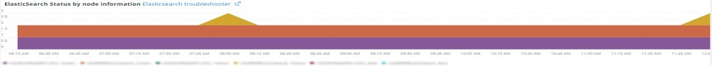

# この [!UICONTROL Elasticsearch] タブ

## [!UICONTROL Cluster Status Summary]:

選択した期間に、 **[!UICONTROL Cluster Status Summary]** フレームには、 [!DNL Elasticsearch] クラスターが通過しました。 この例では、選択した期間で、クラスターのステータスが緑色に 1 回、選択した期間で黄色に 1 回となっていました。

## [!UICONTROL Active Primary Shards]

この **[!UICONTROL Active Primary Shards]** frame は、選択したアカウントのアクティブなプライマリシャードの数に応じて異なる数を表示します [!DNL Elasticsearch] サービス。

送信者 [!DNL Elasticsearch]:最終的なガイド [2.x]:

「In [動的に更新可能なインデックス](https://www.elastic.co/guide/en/elasticsearch/guide/2.x/dynamic-indices.html)では、シャードは Lucene インデックスで、 [!DNL Elasticsearch] index はシャードのコレクションです。 アプリケーションはインデックスと通信し、 [!DNL Elasticsearch] リクエストを適切なシャードにルーティングします。 シャードはスケールの単位です。 最も小さいインデックスは、1 つのシャードを持つインデックスです。 これは、1 つのシャードが多くのデータを保持できるので、ニーズに十分な量を超える場合がありますが、拡張する能力が制限されます。」

インデックスを作成すると、そのインデックスを使用して複数のシャードが作成されます。 デフォルトでは、5 つのプライマリシャードが各新しいインデックスに割り当てられます。つまり、インデックスは 5 つのノード（ノードごとに 1 つのシャード）に分散できます。 レプリカ・シャードもあります。 主にフェールオーバー用です。 レプリカシャードは、読み取り要求に対応できます。

## [!UICONTROL Active Shards in Cluster]

この **[!UICONTROL Active Shards in Cluster]** frame は、 [!DNL Elasticsearch] クラスター。

## [!UICONTROL Index health - this will show the index name and color status]

このフレームは、インデックス名とインデックスの色の状態数を示します。 表を下にスクロールすると、同じインデックス名が黄色と赤色のステータスで表示されます。 27 インデックス名の後に続く数値は、ステータスの色の数です。 0 の場合、選択した期間では、その色のステータスのインデックスのインスタンスは存在しませんでした。

## [!UICONTROL Elasticsearch Status by node information]

この **[!UICONTROL Elasticsearch Status by node information]** frame は、 [!DNL Elasticsearch] 色別およびノード別のクラスターステータス。 これは、 [!DNL Elasticsearch] クラスターは、選択した期間中のステータスを返します。

## [!UICONTROL Elasticsearch index information]

この **[!UICONTROL Elasticsearch index information]** この表には、インデックス名、インデックス化されたドキュメントのノード、インデックス化されたドキュメントの数、インデックスの正常性、特定の時点でのインデックスのサイズ（MB 単位）が表示されます。

## [!UICONTROL Elasticsearch process CPU %]

この **[!UICONTROL Elasticsearch process CPU %]** frame は、CPU の割合を [!DNL Elasticsearch] 選択した期間で処理します。

## [!UICONTROL Elasticsearch Memory garbage collection]

[!DNL Elasticsearch] は Java プロセスです。 割り当て済みメモリが少ない場合は、メモリを解放するガベージコレクションが開始されます。 ガベージコレクションが頻繁に発生する場合、割り当てられたメモリに対してインデックスやシャードが多すぎる可能性があることを示しています。 インデックスやシャードをクリーンアップする機会があるか、 [!DNL Elasticsearch] メモリを増やす必要がある場合があります。

## [!UICONTROL Elasticsearch Index information]

インデックスが作成および更新されると、インデックスの正常性が変わる場合があります。

## [!UICONTROL Elasticsearch Index Size]

この **[!UICONTROL Elasticsearch Index Size]** frame は、選択した期間のインデックス名とサイズを示します。 サイトのインデックス作成方法に問題がある可能性があります。

## [!UICONTROL Elasticsearch Errors]

この **[!UICONTROL Elasticsearch Errors]** frame はエラーを表示します [!DNL Elasticsearch] 空き領域が不足した場合、黄から赤に切り替える場合、すべてのシャードが失敗した場合、検索に関するパラメータの問題が発生した場合、バージョンエラー、すべてのノードが使用できない場合。

## [!UICONTROL Elasticsearch Unassigned Shards]:

未割り当てのシャードは、クラスタを緑色のステータスから黄色のステータスに移動させます。
