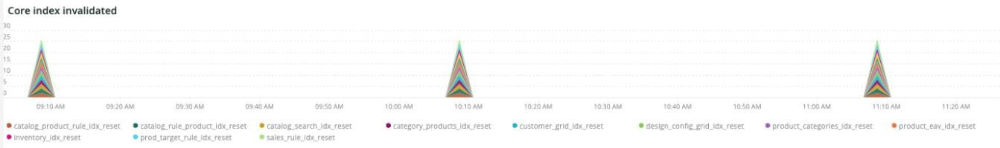
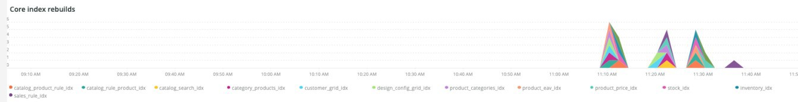
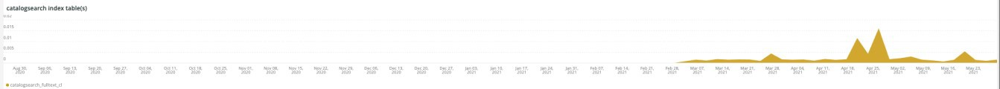
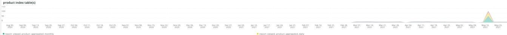

# 「[!UICONTROL Indexing]」タブ

「**[!UICONTROL Indexing]**」タブは、インデックス作成に関する問題を説明し、潜在的な原因を特定しようとします。

## [!UICONTROL Core index invalidated]

**[!UICONTROL Core index invalidated]** フレームは、選択した期間のインデックス無効化を確認します。 他のリソースを多く使用する[!DNL crons]と同時にインデックス作成を行う場合、サイト リソースに大きな負荷がかかります。

* `%Catalog Product Rule indexer has been invalidated%`）を`catalog_product_rule_idx_reset`として
* `%Catalog Rule Product indexer has been invalidated%`）を`catalog_rule_product_idx_reset`として
* `%Catalog Search indexer has been invalidated%`）を`catalog_search_idx_reset`として
* `%Category Products indexer has been invalidated%`）を`category_products_idx_reset`として
* `%Customer Grid indexer has been invalidated%`）を`customer_grid_idx_reset`として
* `%Design Config Grid indexer has been invalidated%`）を`design_config_grid_idx_`として
* `%Product Categories indexer has been invalidated%`）を`product_categories_idx_reset`として
* `%Product EAV indexer has been invalidated%`）を`product_eav_idx_reset`として
* `%Product Price indexer has been invalidated%`）を`product_price_idx_reset`として
* `%Stock indexer has been invalidated%`）を`stock_idx_reset`として
* `%Inventory indexer has been invalidated%`）を`inventory_idx_reset`として
* `%Inventory indexer has been invalidated%`）を`inventory_idx_reset`として
* `%Sales Rule indexer has been invalidated%`）を`sales_rule_idx_reset`として

## [!UICONTROL Core index rebuilds]

**[!UICONTROL Core index rebuilds]** フレームは、選択した時間枠でコアインデックスの再構築を確認します。 インデックスの再構築の完了を示すために、ログから解析される文字列を以下に示します。

* `%Catalog Product Rule index has been rebuilt%`）を`catalog_product_rule_idx`として
* `%Catalog Rule Product index has been rebuilt%`）を`catalog_rule_product_idx`として
* `%Catalog Search index has been rebuilt%`）を`catalog_search_idx`として
* `%Category Products index has been rebuilt successfully%`）を`category_products_idx`として
* `%Customer Grid index has been rebuilt%`）を`customer_grid_idx`として
* `%Design Config Grid index has been rebuilt%`）を`design_config_grid_idx`として
* `%Product Categories index has been rebuilt%`）を`product_categories_idx`として
* `%Product EAV index has been rebuilt%`）を`product_eav_idx`として
* `%Product Price index has been rebuilt%`）を`product_price_idx`として
* `%Stock index has been rebuilt%`）を`stock_idx`として
* `%Inventory index has been rebuilt successfully%`）を`inventory_idx`として
* `%Product/Target Rule index has been rebuilt successfully%`）を`prod_target_rule_idx`として
* `%Sales Rule index has been rebuilt successfully%`）を`sales_rule_idx`として

## [!UICONTROL catalogsearch index table(s)]

**[!UICONTROL catalogsearch index table(s)]** フレームは、選択した時間枠のカタログ検索インデックス テーブルを参照します。 このクエリは、テーブル名に`%catalogsearch%`が含まれるテーブルに対するデータストア操作の期間を調べています。

## [!UICONTROL product index table(s)]

**[!UICONTROL product index table(s)]** フレームは、選択した期間の製品インデックステーブルを参照します。 このクエリは、テーブル名に`%product%`が含まれるテーブルに対するデータストア操作の期間を調べています。
