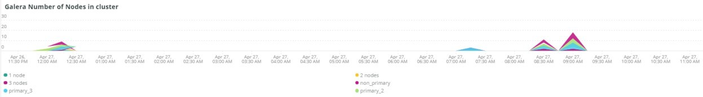

# この [!UICONTROL MySQL] タブ

## [!UICONTROL MySQL% free storage by node]

多くの問題は、MySQL が MySQL に割り当てられたストレージ内でストレージが不足しているために発生します（`datadir` MySQL 設定（デフォルトは） `/data/mysql`）または `tmpdir` 領域が不足しています。 デフォルト `tmpdir` （MySQL 設定）は `/tmp`. この **[!UICONTROL MySQL% free storage by node]** フレームはを確認します `/, /tmp` （個別のマウントとして定義する場合）と `/data/mysql` 空きストレージの割合。 MySQL バージョン 5.7 （MariaDB バージョン 10.2）以降、非圧縮 `tmp` テーブルは、 `tmp` テーブル領域 `/data/mysql` ファイル（ibtmp1）のディレクトリ。 このファイルは、デフォルトで無制限に自動的に展開されます。 テーブルスペースであるため、サイズが減少せず、MySQL の再起動時に 12 MB にリセットされます。

## [!UICONTROL MySQL Connections by Node]

この **[!UICONTROL MySQL Connections by Node]** フレームは、データベース・ノードの停止期間または大量の接続を示します。

## [!UICONTROL MySQL Node Summary]

この **[!UICONTROL MySQL Node Summary]** 表には、ソフトウェア・バージョンやインスタンス・タイプ（サイズ）など、データベース・ノードの詳細が表示されます。

## [!UICONTROL Galera Number of Nodes in cluster]

この **[!UICONTROL Galera Number of Nodes in cluster]** フレームには、MySQL ログの情報が表示されます。 ノードがクラスターに結合してを離れると、選択した期間のメッセージのみが表示されます。 期間の前にノードがクラスターを離れた場合、その期間中はメッセージは存在しません。 データベースのノードが不足していると思われる場合は、期間を長く展開して、追加情報が表示されるかどうかを確認します。 期間中に、内のすべてのノードよりも少ないことを示す情報がある場合 [!DNL Galera] クラスター。期間を展開して、ノードがクラスターをいつ離れたかを確認できます。

## [!UICONTROL MySQL shutdowns and starts]

この **[!UICONTROL MySQL shutdowns and starts]** フレームは、ノードがシャットダウンされたことを検出します。 この [!DNL Galera] ノードが削除され、から自動的に削除されます [!DNL Galera] ノード。 これにより、通常は MySQL サービスが再起動されます。

## [!UICONTROL Galera log]

この **[!UICONTROL Galera log]** フレームは、次に関する MySQL ログからの特定のシグナルのカウントを表示します [!DNL Galera] ノード、ノードの状態、ノードの状態変更 [!DNL Galera] クラスター。

* &#39;%1047 WSREP はまだアプリケーションの使用 %&#39;用のノードを準備していません）。&#39;node_not_prep_for_use&#39;
* &#39;%\[ERROR\] WSREP: wsrep_sst_xtrabackup-v2%&#39;）から&#39;xtrabackup_read_fail&#39;として読み取れませんでした
* &#39;%\[ERROR\] WSREP: プロセスが完了しましたが、エラーが発生しました：wsrep_sst_xtrabackup-v2 %&#39;） as &#39;xtrabackup_compl_w_err&#39;
* &#39;%\[ERROR\] WSREP: rbr write fail%&#39;） as &#39;rbr_write_fail&#39;
* &#39;%self-leave%&#39;）を&#39;susp_node&#39;
* &#39;%members = 3/3 （結合/合計） %&#39;） as&#39;3of3&#39;
* &#39;%members = 2/3 （結合/合計） %&#39;） as&#39;2of3&#39;
* &#39;%members = 2/2%&#39;）を&#39;2of2&#39;として使用します
* &#39;%members = 1/2%&#39;）を&#39;1of2&#39;として使用します
* &#39;%members = 1/3%&#39;）を&#39;1of3&#39;として使用します
* &#39;%members = 1/1%&#39;）を&#39;1of1&#39;として使用します
* &#39;%\[ 注意\] /usr/sbin/mysqld （mysqld 10.%&#39;） as&#39;sql_restart&#39;
* &#39;%Quorum：完全な状態を持つノードがありません：%&#39;） （&#39;no_node_count&#39;として）
* &#39;%WSREP: メンバー 0%&#39;）を&#39;mem_0&#39;として使用します
* &#39;%WSREP: メンバ 1.0%&#39;）を&#39;mem_1&#39;として使用します
* &#39;%WSREP: メンバ 2%&#39;）を&#39;mem2&#39;として使用します
* &#39;%WSREP: グループと同期されました。接続の準備が完了しました %&#39;）。&#39;準備完了&#39;です。
* &#39;%/usr/sbin/mysqld, Version:%&#39;）を&#39;mysql_restart_mysql.slow&#39;として使用します
* &#39;%\[Note\] WSREP: New cluster view: global state:%&#39;）を&#39;galera_cluster_view_chng&#39;として使用

## [!UICONTROL Galera Log by Host]

この **[!UICONTROL Galera Log by Host]** フレームは **[!UICONTROL Galera log]** フレーム（トラブルシューティングに役立つようにノード別に分割されることを除く）。

## [!UICONTROL Database performance]

この **[!UICONTROL Database performance]** フレームは、特定のリクエスト中のデータベースのパフォーマンスを示します。 グラフの下の色付きアイコンでクリックすると、各指標を確認できます。 で呼び出される指標の多く [New Relicを使用した MySQL データベースパフォーマンスの監視](https://newrelic.com/blog/how-to-relic/how-to-monitor-mysql) このフレームにあります。

* average （query.queriesPerSecond）
* average （query.slowQueriesPerSecond）
* average （db.createdTmpDiskTablesPerSecond）
* average （db.createdTmpFilesPerSecond）
* average （db.tablesLocksWaitedPerSecond）
* average （db.innodb.rowLockTimeAvg）
* average （db.innodb.rowLockWaitsPerSecond）

## [!UICONTROL Transaction Database Call Count]

この **[!UICONTROL Transaction Database Call Count]** フレームは、各トランザクションファセットによって実行されたデータベース呼び出しの数を示します。 これは、行に焦点を当てており、ステートメントではないようです。

## [!UICONTROL Cron_schedule table updates]

この **[!UICONTROL Cron_schedule table updates]** frame は、選択した期間の cron_schedule 表に対するデータベース更新の最大期間を表示します。

## [!UICONTROL Slow Query Traces]

この **[!UICONTROL Slow Query Traces]** フレームには、低速なクエリ・トレースが存在するテーブルとリクエスト・タイプが表示されます。 所要時間が 5 秒を超えるクエリトランザクションには、低速のクエリトレースが作成されます。 このフレームで重要なのは、更新クエリです。 テーブルが更新者の場合 `UPDATE`, `DELETE`、および `INSERT` 文を使用すると、一定期間テーブルをロックできます。

偶数 `SELECT` 文は、FOR UPDATE とともに使用されると、ローをロックできます。

## [!UICONTROL Datastore Operations tables]

## [!UICONTROL Cron table change]

この **[!UICONTROL Cron table change]** frame は「could not acquire lock for cron job:」エラーメッセージと特定の PHP メモリエラーを探し、 `cron_schedule` テーブル。 次の場合 `cron_schedule` テーブルがロックされている（によってロックされているなど） `DELETE` クエリが実行されている場合）は、他の cron の実行をブロックします。

## [!UICONTROL Deadlocks]

この **[!UICONTROL Deadlocks]** フレームは、MySQL ログから解析された次の文字列を調べます。

* &#39;%PHP 致命的なエラー：メモリサイズが %&#39;）を php_mem_error として使用できます
* &#39;%get lock; トランザクションを再起動してみてください。クエリは次のとおりです：DELETEFROM \&#39;cron_schedule%&#39;）を cron_sched_lock_del として指定します
* cron ジョブの「% ロック : indexer_reindex_all_invalid%」） as &#39;lock_indexer_reindex_all_invalid%&#39;
* cron ジョブの「% lock : cron_schedule%」） as &#39;lock_cron_schedule&#39;
* &#39;% lock for cron job:%&#39;） as &#39;total_cron_lock&#39;
* &#39;% 一般エラー：1205 ロック待機タイムアウトを超えました %&#39;）を&#39;sql_1205_lock&#39;として返します
* &#39;%ERROR 1213 （40001）: &#39;sql_1213_lock&#39;としてロック %&#39;を取得しようとしているときにデッドロックが見つかりました
* &#39;%SQLSTATE[40001]: シリアル化エラー：1213 Deadlock found%） as &#39;sql_1213_lock2&#39;
* cron ジョブの「% lock : indexer_update_all_views%」） as &#39;lock_indexer_update_all_views&#39;
* cron ジョブの&#39;% lock: sales_grid_order_invoice_async_insert%&#39;）を&#39;lock_sales_grid_order_invoice_async_insert&#39;,
* cron ジョブの「% ロック : staging_remove_updates%」）
* cron ジョブの&#39;% lock: sales_grid_order_shipment_async_insert%&#39;）を&#39;lock_sales_grid_order_shipment_async_insert&#39;として設定します
* cron ジョブの&#39;% lock: amazon_payments_process_queued_refunds%&#39;）を&#39;lock_amazon_payments_process_queued_refunds&#39;として設定します
* cron ジョブの「% lock : sales_send_order_shipment_emails%」） as &#39;lock_sales_send_order_shipment_emails&#39;
* cron ジョブの「% ロック : staging_synchronize_entities_period%」）
* cron ジョブの&#39;% lock : indexer_clean_all_changelogs%&#39;）を&#39;lock_indexer_clean_all_changelogs&#39;として設定
* cron ジョブの&#39;% ロック : magento_targetrule_index_reindex%&#39;）を&#39;lock_magento_targetrule_index_reindex&#39;
* cron ジョブのロック「%」（newsletter_send_all%） : 「lock_newsletter_send_all」
* cron ジョブのロック「%」（newsletter_send_all%） : 「lock_newsletter_send_all」
* cron ジョブの「% lock : sales_send_order_emails%」） as &#39;lock_sales_send_order_emails&#39;
* cron ジョブの&#39;% lock: sales_send_order_creditmemo_emails%&#39;） as &#39;lock_sales_send_order_creditmemo_emails&#39;
* cron ジョブの&#39;% lock: sales_grid_order_creditmemo_async_insert%&#39;）を&#39;lock_sales_grid_order_creditmemo_async_insert&#39;として設定します
* cron ジョブの「% ロック : bulk_cleanup%」）
* cron ジョブの&#39;% lock : flush_preview_quotas%&#39;） as &#39;lock_flush_preview_quotas&#39;
* cron ジョブの「% lock : sales_send_order_invoice_emails%」） as &#39;lock_sales_send_order_invoice_emails&#39;
* cron ジョブの「% lock : sales_send_order_invoice_emails%」） as &#39;lock_sales_send_order_invoice_emails&#39;
* cron ジョブの「% ロック : captcha_delete_expired_images%」） as &#39;lock_captcha_delete_expired_images&#39;
* cron ジョブ : magento_newrelicreporting_cron%）の&#39;% ロック : &#39;lock_magento_newrelicreporting_cron&#39;
* cron ジョブのロック「%」：古い_authentication_failures_cleanup%）を「lock_outdated_authentication_failures_cleanup」として使用
* cron ジョブで「% lock : send_notification%」） as &#39;lock_send_notification&#39;
* cron ジョブの&#39;% lock : magento_giftcardaccount_generage_codes_pool%&#39;） as &#39;lock_magento_giftcardaccount_generage_codes_pool&#39;
* cron ジョブの「% ロック : catalog_product_frontend_actions_flush%」） as &#39;lock_catalog_product_frontend_actions_flush&#39;
* cron ジョブの&#39;% lock: mysqlmq_clean_messages%&#39;） as &#39;mysqlmq_clean_messages&#39;
* cron ジョブの「% ロック : catalog_product_attribute_value_synchronize%」） as &#39;lock_catalog_product_attribute_value_synchronize&#39;
* cron ジョブの「% lock : ddg_automation_importer%」）を「lock_ddg_automation_importer」として設定
* cron ジョブの&#39;% lock: ddg_automation_reviews_and_wishlist%&#39;）を&#39;lock_ddg_automation_reviews_and_wishlist&#39;として設定します
* cron ジョブの「% ロック : captcha_delete_old_attempts%」）
* cron ジョブの「% ロック : catalog_product_outdated_price_values_cleanup%」） as &#39;lock_catalog_product_outdated_price_values_cleanup&#39;
* cron ジョブ用の「% ロック : consumers_runner%」）
* cron ジョブのロック「%」:ddg_automation_customer_subscriber_guest_sync%） as &#39;lock_ddg_automation_customer_subscriber_guest_sync&#39;
* &#39;% lock for cron job: get_amazon_capture_updates%&#39;） as &#39;lock_get_amazon_capture_updates&#39;
* cron ジョブの&#39;% lock: get_amazon_authorization_updates%&#39;） as &#39;lock_send_get_amazon_authorization_updates&#39;
* cron ジョブの&#39;% ロック : temando_process_platform_events%&#39;）を&#39;lock_temando_process_platform_events&#39;として設定する
* cron ジョブの「% lock : ddg_automation_status%」） as &#39;lock_ddg_automation_status&#39;
* cron ジョブの「% lock : ddg_automation_status%」） as &#39;lock_ddg_automation_status&#39;
* cron ジョブの「% lock : sales_clean_orders%」） as &#39;lock_sales_clean_orders&#39;
* cron ジョブの「% ロック : catalog_index_refresh_price%」） as &#39;lock_catalog_index_refresh_price&#39;
* cron ジョブの&#39;% ロック : magento_reward_balance_warning_notification%&#39;）を&#39;lock_magento_reward_balance_warning_notification&#39;
* cron ジョブの「% ロック : analytics_update%」） as &#39;lock_analytics_update&#39;
* cron ジョブの&#39;% lock: messagequeue_clean_outdated_locks%&#39;）を&#39;lock_messagequeue_clean_outdated_locks&#39;として使用
* cron ジョブの&#39;% lock: messagequeue_clean_outdated_locks%&#39;）を&#39;lock_messagequeue_clean_outdated_locks&#39;として使用
* cron ジョブの「% ロック : staging_apply_version%」） as &#39;lock_staging_apply_version&#39;
* cron ジョブの「% ロック : magento_reward_expire_points%」） as &#39;lock_magento_reward_expire_points&#39;
* cron ジョブの「% lock : yotpo_yotpo_orders_sync%」） as &#39;lock_yotpo_yotpo_orders_sync&#39;
* cron ジョブの「% lock : catalog_event_status_checker%」）を「lock_catalog_event_status_checker」として設定
* cron ジョブのロック「%」:ddg_automation_campaign%） as &#39;lock_ddg_automation_campaign&#39;
* cron ジョブの「% ロック : visitor_clean%」） : 「lock_visitor_clean」
* cron ジョブの&#39;% lock: scconnector_verify_website%&#39;）を&#39;lock_scconnector_verify_website&#39;
* cron ジョブ用の&#39;% ロック : ddg_automation_email_templates%&#39;） as &#39;lock_ddg_automation_email_templates&#39;
* cron ジョブの&#39;% lock: aggregate_sales_report_order_data%&#39;） as &#39;lock_aggregate_sales_report_order_data&#39;
* cron ジョブ用の「% ロック : ddg_automation_catalog_sync%」） as &#39;lock_ddg_automation

## [!UICONTROL DB Statistics]

この **[!UICONTROL DB Statistics]** フレームには、1 秒あたりに削除、書き込み、読み取り、更新、低速クエリが表示されます。

## [!UICONTROL Request frequency]

## [!UICONTROL Database Errors]

この **[!UICONTROL Database Errors]** フレームは様々なデータベースを表示します [警告とエラー](https://mariadb.com/kb/en/mariadb-error-codes/):

* 一時テーブルに割り当てられた&#39;% メモリサイズが、&#39;temp_tbl_buff_pool&#39;として innodb_buffer_pool_size%&#39;の 20% を超えています
* &#39;%\[ERROR\] WSREP: rbr write fail%&#39;） as &#39;rbr_write_fail&#39;
* &#39;%mysqld: Disk full%&#39;）を&#39;disk_full&#39;として使用します
* &#39;% エラー番号 28%&#39;）は&#39;err_28&#39;です。
* &#39;%rollback%&#39;）を&#39;rollback&#39;として使用します
* &#39;%Foreign key constraint failes for table%&#39;） as &#39;foreign_key_constraint&#39;
* &#39;%Error_code: 1114%&#39;）を&#39;sql_1114_full&quot;%CRITICAL: SQLSTATE[000 HY] [2006] MySQL server has gone away%&#39;）を&#39;sql_gone&#39;として設定します
* &#39;%SQLSTATE[000 HY] [1040] 「sql_1040」として設定された接続が多すぎます（%）
* &#39;%CRITICAL: SQLSTATE[000 HY] [2002]%&#39;） as &#39;sql_2002&#39;
* &#39;%SQLSTATE[08S01]:%&#39;） as &#39;sql_1047&#39;
* &#39;%[警告] 接続 %&#39;）を&#39;aborted_conn&#39;として中止しました
* &#39;%SQLSTATE[23000]：整合性制約違反：%&#39;）を「sql_23000」として使用しました
* &#39;%1205 ロック待機タイムアウト %&#39;）を&#39;sql_1205&#39;として使用します
* &#39;%SQLSTATE[000 HY] [1049] Unknown database%&#39;） as &#39;sql_1049&#39;
* &#39;%SQLSTATE[42S02]: ベース テーブルまたはビューが見つかりません：%&#39;） （&#39;sql_42S02&#39;）
* &#39;% 一般エラー：1114%&#39;）を&#39;sql_1114&#39;として返します
* &#39;%SQLSTATE[40001]%&#39;） as &#39;sql_1213&#39;
* &#39;%SQLSTATE[42S22]：列が見つかりません：1054 不明な列 %） （「sq1_1054」として）
* &#39;%SQLSTATE[42000]：構文エラーまたはアクセス違反：%&#39;） as&#39;sql_42000&#39;
* &#39;%SQLSTATE[21000]: カーディナリティ違反：%&#39;）を「sql_1241」として使用します
* &#39;%SQLSTATE[22003]:%&#39;） as &#39;sql_22003&#39;
* &#39;%SQLSTATE[000 HY] [9000] IP アドレスが %）のクライアントを&#39;sql_9000&#39;として設定します
* &#39;%SQLSTATE[000 HY]：一般エラー：2014%）が「sql_2014」として返されます
* &#39;%1927 接続が切断されました %&#39;）を&#39;sql_1927&#39;として使用しました
* &#39;%1062 \[ERROR\] InnoDB:%&#39;）を&#39;sql_1062_e&#39;として使用します
* “ %[注意] WSREP: メモリ マップをディスクにフラッシュしています…%&#39;）を&#39;mem_map_flush&#39;として使用しています
* &#39;% 内部 MariaDB エラーコード：1146%&#39;）を&#39;sql_1146&#39;として返します
* &#39;% 内部 MariaDB エラーコード：1062%&#39;）を&#39;sql_1062&#39; * &#39;%1062 [警告] InnoDB:%&#39;）を&#39;sql_1062_w&#39;として使用します
* &#39;% 内部 MariaDB エラーコード：1064%&#39;）を&#39;sql_1064&#39;として返します
* &#39;%InnoDB: ファイル %&#39;）で&#39;assertion_err&#39;としてアサーションに失敗しました
* &#39;%mysqld_safe 現在実行中のプロセスの数：0%&#39;）を&#39;mysql_oom&#39;として返します。
* &#39;%\[ERROR\] mysqld は&#39;mysql_sigterm&#39;として signal%&#39;）を取得しました
* &#39;%1452%&#39;）を&#39;sql_1452&#39;として追加できません
* &#39;%ERROR 1698%&#39;）を&#39;sql_1698&#39;として返します
* &#39;%SQLSTATE[000 HY]：一般的なエラー：3%）を「cnt_wrt_tmp」として使用する
* &#39;% 一般エラー：1 %&#39;）を&#39;sql_syntax&#39;として使用します
* &#39;%42S22%&#39;）を&#39;sql_42S22&#39;として使用します
* &#39;%InnoDB: エラー（キーの重複） %&#39;）が&#39;innodb_dup_key&#39; FROM Log TIMESERIES として発生しました

## [!UICONTROL DB Error Table]

この **[!UICONTROL DB Error Table]** フレームには、 **[!UICONTROL Database Errors]** フレームですが、ノード別およびテーブル形式で確認できます。 参照： [MariaDB エラーコード](https://mariadb.com/kb/en/mariadb-error-codes/) を参照してください。

## [!UICONTROL Database Traces]

この **[!UICONTROL Database Traces]** フレームには、選択したタイムライン全体でタイプ別にデータベースのトレースが表示されます。

## [!UICONTROL Database processes]

この **[!UICONTROL Database processes]** フレームには、データベース・プロセス、環境、ノード識別子が表示されます。

## [!UICONTROL MySQL Non-Sleeping Threads by Node]

この **[!UICONTROL MySQL Non-Sleeping Threads by Node]** フレームは、データベースへの接続スレッドを示します。 このフレームには、アクティブなスレッドが表示されます。

## [!UICONTROL MySQL Running and Sleeping Threads by environment]

この **[!UICONTROL MySQL Running and Sleeping Threads by environment]** フレームには、データベースへのアクティブな接続とスリープ状態の接続の両方が表示されます。 低速クエリがスリープ状態になったデータベースへの接続がある場合は、スリープ状態の接続が存在します。 スリープ中の接続は、ロックされた行またはテーブルによってブロックされるデータベース クエリの場合があります。 これらのスリープ状態の接続は、PHP ワーカーの接続も保持しています。

## [!UICONTROL MySQL mem used by node]

この **[!UICONTROL MySQL mem used by node]** フレームは、MySQL によるメモリのノード使用量を示します。 より大きなサイトでは、このフレームは GB 分のメモリを使用した連続したバーである場合があります。

## [!UICONTROL Database mysql-slow.log]

この **[!UICONTROL Database mysql-slow.log]** フレームは、内にあったクエリステートメントのタイプを示します。 `mysql-slow.log` 選択した期間のファイル。
