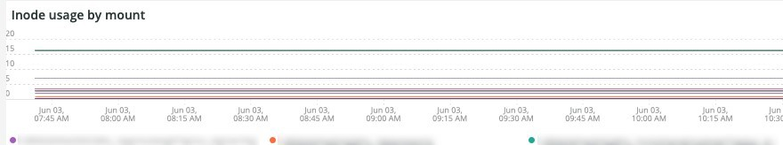

# 「[!DNL Infra]」タブ

「**[!DNL Infra]**」タブでは、インフラストラクチャの問題の問題と原因を分離します。 さらに、タブに表示されるフレームについて説明します。

## [!UICONTROL Service Alerts – Infrastructure Alerts by Application name]

**[!UICONTROL Service Alerts – Infrastructure Alerts by Application name]** のグラフは、[!DNL New Relic] インフラストラクチャ エージェントによって収集されたサービス アラートを示します。 これにより、サービスの再起動が表示され、多くはデプロイメントに関連しています。

## [!UICONTROL Inode usage by mount]

**[!UICONTROL Inode usage by mount]** のフレームは、選択 [!DNL inode] た期間におけるマウントによる使用状況を示しています。 ストレージの空き容量が多い場合でも、ノードの [!DNL inodes] き容量が不足すると、使用可能なストレージが不足することが示されます。 ファイル（特に小さいファイル）を削除すると、両方の領域が解放され、[!DNL inodes] が使用可能になります。

## [!UICONTROL vCPU tier view over timeline GREATER 2 weeks]

**[!UICONTROL vCPU tier view over timeline GREATER 2 weeks]** フレームには、選択した期間（2 週間を超える）の vCPU 層ビューが表示されます。 このフレームでは、表示される [!DNL New Relic] アプリケーション名に割り当てられた vCPU の数を確認します。

## [!UICONTROL vCPU tier view over timeline]

**[!UICONTROL vCPU tier view over timeline]** フレームには、選択した期間（24 時間以上）の vCPU 層ビューが表示されます。 このフレームでは、表示される [!DNL New Relic] アプリケーション名に割り当てられた vCPU の数を確認します。 クラスターのアップサイズとダウンサイズの両方が表示されます。

## [!UICONTROL vCPU tier view over timeline BY NODE]

**[!UICONTROL vCPU tier view over timeline BY NODE]** フレームには、選択した期間の vCPU 層ビューがノード別に表示されます。 このフレームは、ノードの損失を検出する場合や、ノードがアップサイズまたはダウンサイズされる場合に役立ちます。 ノード別のタイムラインの vCPU 階層ビューは、24 時間未満のタイムラインを表示する必要があります。

## [!UICONTROL Instance details]

**[!UICONTROL Instance details]** の表に、各 [!DNL New Relic] アプリケーションのインスタンスの詳細を示します。

## [!UICONTROL Logging, if there is a broken line for a node, it indicates non-responsive node during that time period]

**[!UICONTROL Logging, if there is a broken line for a node, it indicates non-responsive node during that time period]** フレームには、一定期間にわたって応答しないノードが表示されます。
