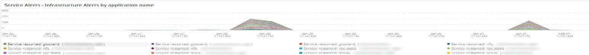
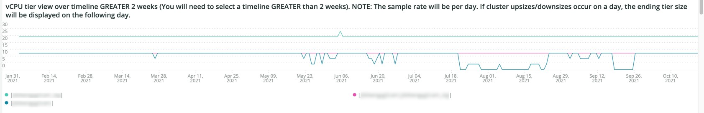
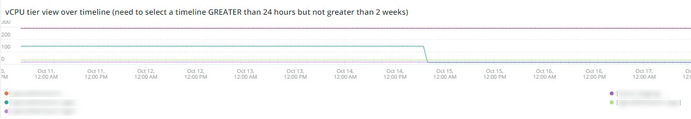
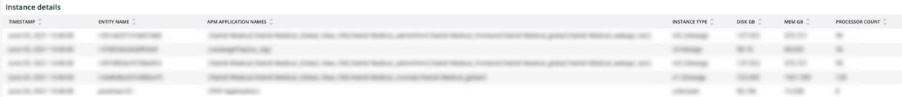
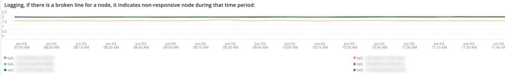

# 「[!DNL Infra]」タブ

「**[!DNL Infra]**」タブには、インフラストラクチャの問題と原因が表示されます。 さらに、タブに表示されるフレームについて説明します。

## [!UICONTROL Service Alerts – Infrastructure Alerts by Application name]

**[!UICONTROL Service Alerts – Infrastructure Alerts by Application name]** グラフには、[!DNL New Relic] インフラストラクチャ エージェントによって収集されたサービス アラートが表示されます。 これにより、デプロイメントに関連する多くのサービスの再起動が表示されます。

## [!UICONTROL Inode usage by mount]

マウント ](../../assets/tools/observation-for-adobe-commerce/inode-usage-mount.jpg)による![Inodeの使用状況

**[!UICONTROL Inode usage by mount]** フレームには、選択した時間枠でのマウントによる[!DNL inode]の使用状況が表示されます。 ストレージの空き容量が多い場合でも、ノードが[!DNL inodes]不足している場合、利用可能なストレージが不足していることがわかります。 ファイル （特に小さいファイル）を削除すると、両方の領域が解放され、[!DNL inodes]を利用できるようになります。

## [!UICONTROL vCPU tier view over timeline GREATER 2 weeks]

タイムライン上の

**[!UICONTROL vCPU tier view over timeline GREATER 2 weeks]** フレームには、選択した期間が2週間を超えるvCPU階層ビューが表示されます。 このフレームは、表示されている[!DNL New Relic] アプリケーション名に割り当てられたvCPUの数を調べます。

## [!UICONTROL vCPU tier view over timeline]

タイムライン上の

**[!UICONTROL vCPU tier view over timeline]** フレームには、選択した24時間以上の時間枠にわたってvCPU層ビューが表示されます。 このフレームは、表示されている[!DNL New Relic] アプリケーション名に割り当てられたvCPUの数を調べます。 クラスターのアップサイズとダウンサイズの両方が表示されます。

## [!UICONTROL vCPU tier view over timeline BY NODE]

ノード ](../../assets/tools/observation-for-adobe-commerce/infra_by_node.png)によるタイムライン上の![vCPU層ビュー

**[!UICONTROL vCPU tier view over timeline BY NODE]** フレームには、選択した時間枠のvCPU階層ビューがノードごとに表示されます。 このフレームは、ノードの損失を検出したり、ノードのサイズを変更したり縮小したりする場合に役立ちます。 ノード別のタイムラインのvCPU層ビューは、24時間未満のタイムラインを見る必要があります。

## [!UICONTROL Instance details]

**[!UICONTROL Instance details]** テーブルには、各[!DNL New Relic] アプリケーションのインスタンスの詳細が表示されます。

## [!UICONTROL Logging, if there is a broken line for a node, it indicates non-responsive node during that time period]

**[!UICONTROL Logging, if there is a broken line for a node, it indicates non-responsive node during that time period]** フレームには、期間にわたって応答しないノードが表示されます。
