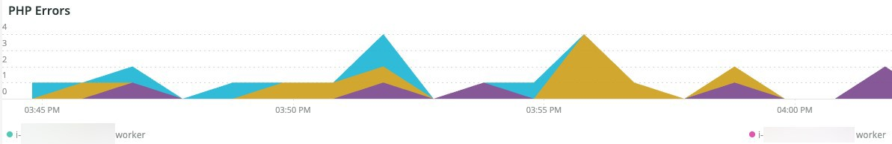
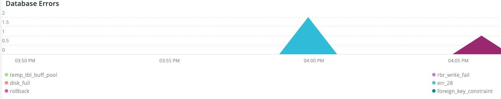

# この [!UICONTROL PHP] タブ

この **PHP** タブには、PHP の問題に関するより深い分析を提供するための PHP プロセスの問題が表示されます。

## [!UICONTROL PHP active process details]

この **[!UICONTROL PHP active process details]** frame は、選択した期間の PHP プロセス（php-fpm を含む）を示します。

## [!UICONTROL PHP process load (# of PHP processes and % of CPU load)]

この **[!UICONTROL PHP process load (# of PHP processes and % of CPU load)]** frame は、選択した期間の PHP-FPM プロセスからの CPU 負荷を示します。

## [!UICONTROL PHP Memory detail]

この **[!UICONTROL PHP Memory detail]** frame は、選択した期間における PHP プロセスのメモリ使用量を示します。

## [!UICONTROL PHP CPU Utilization]

この **[!UICONTROL PHP CPU Utilization]** frame は、選択した期間における PHP プロセスの CPU 使用率を示します。

## [!UICONTROL PHP Process states]

この **[!UICONTROL PHP Process states]** frame は、選択した期間の PHP プロセスの状態を示します。 PHP プロセスが終了し、再起動すると表示されます。 再起動を表示しない終了した PHP プロセスには注意が必要です。

* &#39;%NOTICE:終了中…%&#39;) を&#39;php_term&#39;として
* &#39;%のお知らせ：退出、バイバイ！%&#39;) を&#39;php_exit&#39;として
* &#39;%のお知らせ：fpm が実行中、pid%) が「fpm_start」として設定されている
* &#39;%NOTICE:接続を処理する準備ができました%) を&#39;php_ready&#39;として

## [!UICONTROL PHP Errors]

この **[!UICONTROL PHP Errors]** frame は、選択した期間内の PHP ワーカーエラーの数を示します。 解析および表示されるエラーメッセージには、次のものが含まれます。

* &#39;%worker_connections not not sourt %&#39;) as &#39;worker&#39;
* &#39;%PHP 致命的なエラー：許可されているメモリサイズです。%&#39;) を&#39;mem_size&#39;として
* &#39;%exit on signal 11 (SIGSEGV)%&#39;) as &#39;sig_11&#39;
* &#39;%exit on signal 7 (SIGBUS)%&#39;) as &#39;sig_7&#39;
* &#39;%increase pm.start_servers%&#39;) を&#39;pmstart_serv&#39;として
* &#39;%max_children%&#39;) を&#39;max_children_cnt&#39;として
* &#39;%PHP 致命的なエラー：許可されるメモリサイズ (%) は&#39;mem_exhst_coun&#39;として
* &#39;%pool%&#39;のメモリを割り当てられません ) (opc_mem_count&#39;)
* &#39;%Warning Interned String buffer overflow%&#39;) を&#39;opc_str_buf&#39;として
* &#39;%不正な文字列オフセット%&#39;) （&#39;opc_sv_comments&#39;として）
* &#39;%PHP 致命的なエラー：RedisException がキャッチされていません：&#39;php_exc&#39;としての読み取りエラー%)

## [!UICONTROL PHP processes count]

この **[!UICONTROL PHP processes count]** frame は、選択した期間の PHP プロセスの数を示します。

## [!UICONTROL Database Errors]

この **[!UICONTROL Database Errors]** frame は、選択した期間でのデータベースエラーを表示します。 解析されたエラーは次のとおりです。

* &#39;%一時テーブルに割り当てられたメモリサイズが innodb_buffer_pool_size%&#39;の 20%を超えています ) （&#39;temp_tbl_buff_pool&#39;として）
* &#39;%\[ERROR\] WSREP:rbr write fail%) を&#39;rbr_write_fail&#39;として
* &#39;%mysqld:ディスク容量超過%) （&#39;disk_full&#39;として）
* &#39;%エラー番号 28%&#39;) (&#39;err_28&#39;)
* &#39;%rollback%&#39;は&#39;rollback&#39;として
* &#39;%外部キー制約がテーブル%&#39;に対して失敗しました ) (&#39;foreign_key_constraint&#39;)
* &#39;%Error_code:1114%&#39;) を&#39;sql_1114_full&#39;として
* &#39;%CRITICAL:SQLSTATE[HY000] [2006] MySQL サーバが&#39;sql_gone&#39;として消えました%&#39;)
* &#39;%SQLSTATE[HY000] [1040] 接続数が多すぎます (%) (&#39;sql_1040&#39;)
* &#39;%CRITICAL:SQLSTATE[HY000] [2002 年]%) を&#39;sql_2002&#39;として
* &#39;%SQLSTATE[08S01]:%&#39;) を&#39;sql_1047&#39;として
* &#39;%[警告] 「aborted_conn」として接続%を中止しました
* &#39;%SQLSTATE[23000]:整合性制約違反： %&#39;) (&#39;sql_23000&#39;として )
* &#39;%1205 ロック待機タイムアウト%&#39;) (&#39;sql_1205&#39;)
* &#39;%SQLSTATE[HY000] [1049] 不明なデータベース%) （&#39;sql_1049&#39;として）
* &#39;%SQLSTATE[42S02]:「sql_42S02」としてのベーステーブルまたはビューが見つかりません：%」)
* &#39;%一般エラー：1114%&#39;) を&#39;sql_1114&#39;として
* &#39;%SQLSTATE[40001]%) を&#39;sql_1213&#39;として
* &#39;%SQLSTATE[42S22]:列が見つかりません：1054 不明な列%) （&#39;sq1_1054&#39;として）
* &#39;%SQLSTATE[42000]:構文エラーまたはアクセス違反： %&#39;) が&#39;sql_42000&#39;として
* &#39;%SQLSTATE[21000]:基数違反： %&#39;) （&#39;sql_1241&#39;として）
* &#39;%SQLSTATE[22003]:%&#39;) を&#39;sql_22003&#39;として
* &#39;%SQLSTATE[HY000] [9000] IP アドレス%&#39;のクライアント ) を&#39;sql_9000&#39;として
* &#39;%SQLSTATE[HY000]:一般エラー：2014%&#39;) を&#39;sql_2014&#39;として
* &#39;%1927 接続が強制終了されました%&#39;) （&#39;sql_1927&#39;として）
* &#39;%1062 \[ERROR\] InnoDB:%&#39;) (&#39;sql_1062_e&#39;)
* &#39;%[注意] WSREP:メモリマップをディスクにフラッシュしています…%&#39;) を&#39;mem_map_flush&#39;として
* &#39;%Internal MariaDB エラーコード：1146%) を&#39;sql_1146&#39;として
* &#39;%Internal MariaDB エラーコード：1062%) (&#39;sql_1062&#39; * &#39;%1062) [警告] InnoDB:%&#39;) を&#39;sql_1062_w&#39;として
* &#39;%Internal MariaDB エラーコード：1064%) を&#39;sql_1064&#39;として
* &#39;%InnoDB:&#39;assertion_err&#39;としてのアサーションエラー (file%&#39;)
* &#39;%mysqld_safe 現在実行中のプロセスの数：0%) を&#39;mysql_oom&#39;として
* &#39;%\[ERROR\] mysqld は&#39;mysql_sigterm&#39;としてシグナル%&#39;を取得しました
* &#39;%1452%&#39;を&#39;sql_1452&#39;として追加できません
* &#39;%ERROR 1698%&#39;) （&#39;sql_1698&#39;として）
* &#39;%SQLSTATE[HY000]:一般エラー：3%) を&#39;cnt_wrt_tmp&#39;として
* &#39;%一般エラー：1 %) を&#39;sql_syntax&#39;として
* &#39;%42S22%&#39;) （&#39;sql_42S22&#39;として）
* &#39;%InnoDB:エラー（重複キー）%&#39;) が&#39;innodb_dup_key&#39;として発生しました

## [!UICONTROL Database traces]

この **[!UICONTROL Database traces]** frame は、データベーストレース情報を表示します。 このフレームは、選択したタイムラインの APM トランザクション概要ビューに合わせて配置されます。

## [!UICONTROL Database mysql-slow.log]

この **[!UICONTROL Database mysql-slow.log]** frame は、 `mysql-slow.log` ファイルの数を指定できます。
