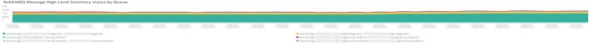

# この [!UICONTROL RabbitMQ] タブ

この **[!UICONTROL RabbitMQ]** タブには、 [!DNL RabbitMQ] シグナル。

## [!UICONTROL RabbitMQ Infrastructure events]

この **[!UICONTROL RabbitMQ Infrastructure events]** frame は、 [!DNL RabbitMQ] 選択した期間内に発生した

* %Response [エラー] ノードの場合 [rabbit@host1]:%&#39;からの予期しない http 応答 ) （&#39;unexpected_resp_node1&#39;として）
* &#39;%応答 [エラー] ノードの場合 [rabbit@host2]:%&#39;からの予期しない http 応答 ) (&#39;unexpected_resp_node2&#39;)
* &#39;%応答 [エラー] ノードの場合 [rabbit@host3]:%&#39;からの予期しない http 応答 ) (&#39;unexpected_resp_node3&#39;)
* &#39;%応答 [エラー] ノードの場合 [rabbit@host3]:Get &quot;http://localhost:15672/api/healthchecks/node/rabbit@host3&quot;:「node3_timeout_exceeded」としてのコンテキストデッドライン超過%)
* &#39;%応答 [エラー] ノードの場合 [rabbit@host1]:Get &quot;http://localhost:15672/api/healthchecks/node/rabbit@host1&quot;:「node1_timeout_exceeded」としてのコンテキストのデッドラインが%を超えました
* &#39;%応答 [エラー] ノードの場合 [rabbit@host2]:Get &quot;http://localhost:15672/api/healthchecks/node/rabbit@host2&quot;:「node2_timeout_exceeded」としてのコンテキストデッドライン超過%)
* &#39;%401 Unauthorized%&#39;) (&#39;401_unauth&#39;)
* &#39;%401 Unauthorized%&#39;) (&#39;401_unauth&#39;)
* %サービスが再開されました：rabbitmq-server%) を&#39;rmq_service_restart&#39;として
* &#39;%応答 [失敗] ノードの場合 [rabbit@host1]:nodedown%) を&#39;rmq_node1_down&#39;として
* &#39;%応答 [失敗] ノードの場合 [rabbit@host2]:nodedown%) を&#39;rmq_node2_down&#39;として
* &#39;%応答 [失敗] ノードの場合 [rabbit@host2]:nodedown%) を&#39;rmq_node2_down&#39;として
* &#39;%Entity が変更されました：exchange/bindings.destination%&#39;) を&#39;rmq_entity_modified&#39;として使用する
* &#39;%Entity が変更されました：exchange/bindings.destination%&#39;) を&#39;rmq_entity_modified&#39;として使用する
* &#39;%Entity が変更されました：queue/exclusive%) を&#39;rmq_entity_created_q_exclusive&quot;%エンティティが変更されました：queue/auto_delete%) を&#39;rmq_entity_q_delete&#39;として
* &#39;%Entity が変更されました：queue/durable%) を&#39;rmq_entity_modified_q_durable&#39;として
* &#39;%Entity が変更されました：version/management%) を&#39;rmq_entity_modified_ver_mgt&#39;として
* &#39;%Entity が変更されました：version/management%) を&#39;rmq_entity_modified_ver_mgt&#39;として

## [!UICONTROL RabbitMQ service start/stop signals]

このフレームには [!DNL RabbitMQ] 選択した期間に発生したサービス開始/停止シグナル：

* &#39;%RabbitMQ が停止を要求されました…%&#39;) を&#39;rabbitmq_stop&#39;として
* &#39;%RabbitMQ%&#39;を&#39;rabbitmq_start&#39;として開始中&#39;

## [!UICONTROL RabbitMQ errors]

このフレームには [!DNL RabbitMQ] 選択した期間中に発生したエラー：

* &#39;%exit （理由 {case_clause,timeout}、stacktrace {rabbit_mgmt_wm_healthchecks%}）を&#39;exit_timeout&#39;として&#39;
* &#39;%client は予期せず TCP 接続を閉じました%&#39;) （&#39;client_closed_tcp_conn&#39;として）
* &#39;%at 未定義の終了です。理由は、context shutdown_error%&#39;でシャットダウンされています )&#39;undef_exit&#39;として&#39;
* &#39;%Connection attempt from disallowed node%&#39;) as &#39;disallowed_node&#39;
* &#39;%closing AMQP connection%&#39;) を&#39;rmq_err_amqp_conn&#39;として

## [!UICONTROL RabbitMQ node status]

* &#39;%rabbit on node rabbit@host1 down%&#39;) を&#39;rmq_node1_down&#39;として&#39;
* &#39;%rabbit on node rabbit@host2 down%&#39;)&#39;rmq_node2_down&#39;
* &#39;%rabbit on node rabbit@host3 down%&#39;)&#39;rmq_node3_down&#39;
* &#39;%rabbit on node rabbit@host1 up%&#39;) を&#39;rmq_node1_up&#39;として&#39;&#39;
* &#39;%rabbit on node rabbit@host2 up%&#39;) を&#39;rmq_node2_up&#39;として&#39;
* &#39;%rabbit on node rabbit@host3 up%&#39;) を&#39;rmq_node3_up&#39;として&#39;

## [!UICONTROL RabbitMQ Message High-Level Summary status by Queue]

この **[!UICONTROL RabbitMQ Message High-Level Summary status by Queue]** グラフには、 [!DNL RabbitMQ] 選択した期間のキュー。

## [!UICONTROL RabbitMQ Message Detail Summary]

* &#39;%report.ERROR:Cron ジョブ consumer_runner にエラーがあります：NOT_FOUND - queue%なし ) を&#39;queue_err&#39;として
* &#39;%report.ERROR:Cron ジョブ consumer_runner にエラーがあります：NOT_FOUND - queue%なし ) を&#39;queue_err&#39;として
* &#39;%authenticated and granted access to vhost%&#39;) (&#39;auth&#39;)
* &#39;%closing AMQP connection%&#39;) を&#39;close_conn&#39;として

## [!UICONTROL RabbitMQ Queue Consumption MB]

この **[!UICONTROL RabbitMQ Queue Consumption MB]** グラフは、それぞれの [!DNL RabbitMQ] 選択した期間にキューを追加します。

## [!UICONTROL RabbitMQ Published Messages by Queue]

この **[!UICONTROL RabbitMQ Published Messages by Queue]** グラフは、それぞれの [!DNL RabbitMQ] 選択した期間にキューを追加します。

## [!UICONTROL RabbitMQ Published Message Throughput by Queue]

この **[!UICONTROL RabbitMQ Published Message Throughput by Queue]** グラフには、1 秒あたりの平均公開済みメッセージ数が表示されます [!DNL RabbitMQ] 選択した期間にキューを追加します。

## [!UICONTROL RabbitMQ Total Message Throughput by Queue]

この **[!UICONTROL RabbitMQ Total Message Throughput by Queue]** グラフは、1 秒あたりの平均メッセージ総数を示します [!DNL RabbitMQ] 選択した期間にキューを追加します。

## [!UICONTROL RabbitMQ Consumers by Queue]

この **[!UICONTROL RabbitMQ Consumers by Queue]** グラフは、それぞれの平均消費者総数を示します [!DNL RabbitMQ] 選択した期間にキューを追加します。
