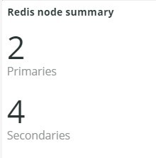
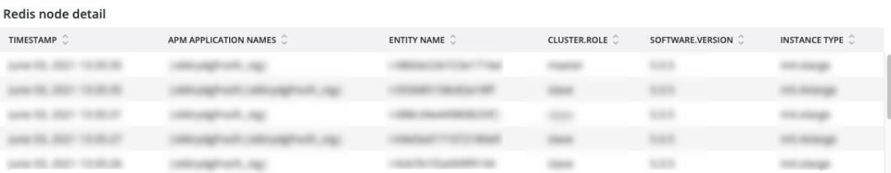
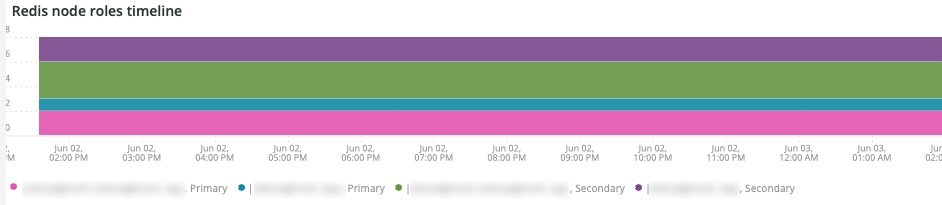
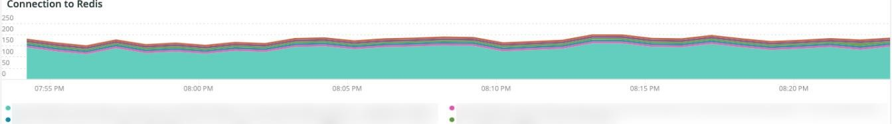
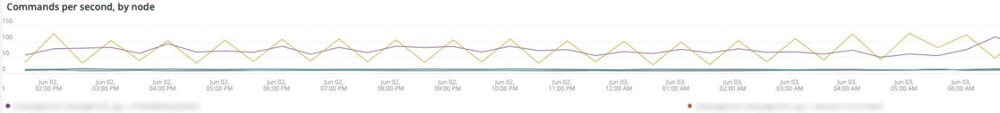
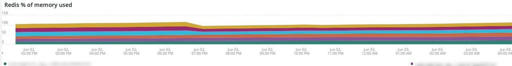
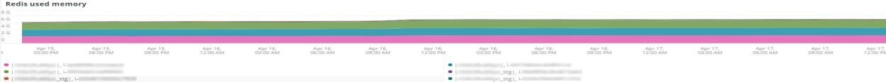
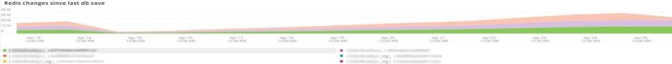
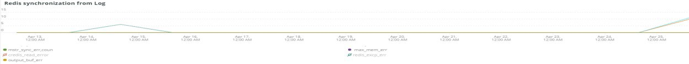

# 「[!DNL Redis]」タブ

## [!UICONTROL Redis Node summary]

**[!UICONTROL Redis Node summary]**&#x200B;には、環境内のすべてのノードが含まれます。 上記の例には、共有ステージング用のノードが含まれます。 実稼動には1つのプライマリおよび2つのセカンダリがあり、ステージングにも1つのプライマリおよび2つのセカンダリがあります。

## [!UICONTROL Redis node detail]

**[!UICONTROL Redis node detail]** フレームは、環境、[!DNL Redis]の役割、ソフトウェア バージョン、およびノード サイズを示します。

## [!UICONTROL Redis node roles timeline]

**[!UICONTROL Redis node roles timeline]** フレームは、特定の役割で[!DNL Redis] サービスが失われたことを示します。 行がディップした場合、その行が表す特定の役割がノードまたはノードを失ったことを示します。

## [!UICONTROL Connection to Redis]

**[!UICONTROL Connection to Redis]** フレームには、[!DNL New Relic Redis] サンプルデータのnet.connectedClients値が表示されます。 [!DNL New Relic] アプリケーション （環境）とノードによる接続数が表示されます。

## [!UICONTROL Commands per second by node]

**[!UICONTROL Commands per second by node]** フレームには、選択した時間枠に対する1秒あたりのノード別の[!DNL Redis] コマンドが表示されます。

## [!UICONTROL Redis % of memory used]

**[!UICONTROL Redis % of memory used]** フレームは、[!DNL Redis] サーバーが使用している最大メモリの割合を示します。

## [!UICONTROL Redis used memory]

**[!UICONTROL Redis used memory]** フレームは、メモリのノード使用率をGB/MB単位で示しています。

## [!UICONTROL Redis changes since last db save]

[!DNL Redis]はメモリ常駐者で、情報をストレージに保存します。 **[!UICONTROL Redis changes since last db save]** フレームは、前回のデータベースがストレージに保存されてから発生したメモリの変更回数を示します。 [!DNL Redis's]の永続性について詳しくは、[Redisの永続性](https://redis.io/docs/latest/operate/oss_and_stack/management/persistence/)を参照してください。

## [!UICONTROL Redis synchronization from Log]

**[!UICONTROL Redis synchronization from Log]** フレームは、[!DNL Redis]の同期中に発生したエラーまたは同期の問題が原因で発生したエラーに焦点を当てています。 [!DNL Redis]について詳しくは、[[!DNL Redis]  ドキュメント ](https://redis.io/docs/)を参照してください。
