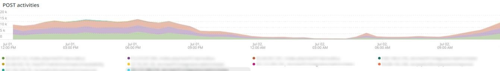
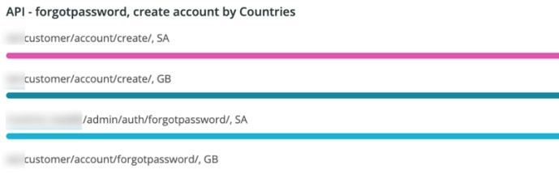

# 「[!UICONTROL Security]」タブ

「**[!UICONTROL Security]**」タブでは、セキュリティ上の問題を説明し、潜在的な原因を分離します。 さらに、タブのフレームを記述する。

## [!UICONTROL API calls by IP, details by URL]

**[!UICONTROL API calls by IP, details by URL]** フレームには、選択した期間における IP による API 呼び出し数が表示されます。 このフレームには、IP アドレスと、その IP アドレスによってアクセスされた API URL が表示されます。

## [!UICONTROL Forgot Password]

**[!UICONTROL Forgot Password]** アクセスフレームには、選択した期間にパスワードを忘れた場合の試行回数が表示されます。 IP アドレスに対するアクティビティが高いと、サイトが攻撃される可能性があります。

## [!UICONTROL Create Account access]

**[!UICONTROL Create Account access]** のフレームには、選択した期間における新しいアカウントアクティビティの数が表示されます。 単一の IP アドレスからのアクティビティが多い場合は、攻撃が行われている可能性があります。

## [!UICONTROL POST activities]

**[!UICONTROL POST activities]** のフレームは、`POST` のログの `client_ip` にファセットされた、サイトの [!DNL Fastly] のアクティビティを表示します。 また、IP アドレスによってアクセスされる URL も表示されます。

## [!UICONTROL POST activities summary table]

**[!UICONTROL POST activities summary table]** のフレームは、サイトの `POST` アクティビティの要約を、`client_ip` のログの [!DNL Fastly] にファセットで表示します。 また、IP アドレスによってアクセスされる URL の数も表示されます。 選択した期間のカウントが表示されます。

## [!UICONTROL POST activities details table]

**[!UICONTROL POST activities details table]** のフレームは、`POST` のログからのサイトの [!DNL Fastly] のアクティビティを示します。 また、これらのリクエストに関する [!DNL Fastly] ログのすべての詳細も表示されます。 過去 2000 件のリクエストに制限されています。

## [!UICONTROL Guest Carts activities]

**[!UICONTROL Guest Carts activities]** のフレームは、選択した期間におけるゲストの買い物かごアクティビティ数を、IP アドレスとアクセスした URL を使用してファセット表示します。 ゲストの買い物かごは、カード攻撃で使用される場合があります。 このフレームには、ゲストカートの URL にアクセスしたリクエストの合計数が表示されます。

## [!UICONTROL API – forgot password, create account by Countries]

**[!UICONTROL API – forgot password, create account by Countries]** のフレームには、作成されたアカウント数と、選択した期間でパスワードを忘れた場合のリセットのリクエストが表示されます。 リクエストの原産国も示すようにファセットされています。 このフレームは、リクエストの原産国に焦点を当てています。

## [!UICONTROL API - forgot password, create account by Countries and IP address]

**[!UICONTROL API - forgot password, create account by Countries and IP address]** のフレームには、作成されたアカウント数と、選択した期間でパスワードを忘れた場合のリセットのリクエストが表示されます。 リクエストの IP アドレス、アクセスした URL、および起源の国も表示するようにファセットされています。 このフレームは、IP の数に焦点を当てています。

## [!UICONTROL Guest cart activities by IP]

**[!UICONTROL Guest cart activities by IP]** のフレームには、選択した期間の IP 別のゲストの買い物かごアクティビティが表示されます。

## [!UICONTROL Guest cart activities by Countries]

**[!UICONTROL Guest cart activities by Countries]** のフレームには、選択した期間における国ごとのゲストの買い物かごアクティビティが表示されます。

