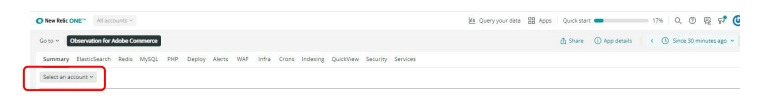

# アカウントと期間の選択：

[!UICONTROL Observation for Adobe Commerce] のアイコンをクリックすると、[!DNL Observation for Adobe Commerce] のナードレットが開きます。

1. **アカウントを選択** ドロップダウンをクリックします。 **アカウントを選択** ドロップダウンが表示されない場合は、アクセス権がない可能性があります。 アクセスをリクエストするには、[ ここ ](https://adobe.sharepoint.com/sites/MG/it/IT%20Services%20Wiki/Requesting%20access%20to%20Magento%20Commerce%20New%20Relic.aspx) をクリックします。

   

1. project_id を貼り付けたり、[!DNL New Relic] アカウント番号またはアカウント名を入力したり、アカウントのリストを参照したりできます。

   

1. 時計アイコンが表示されている **ライトブルー** ドロップダウンメニュー（ナードレットウィンドウの右上方向）をクリックします。

   

1. チケットの日時より前の時間を設定して、先行するイベント/データがあるかどうかを確認します。 左側のプリセット期間を使用するか、「**カスタムを設定**」を選択してカスタム期間を設定できます。
