# 「[!UICONTROL Summary]」タブ

[!DNL Observation for Adobe Commerce]の「[!UICONTROL Summary]」タブでは、サイトで発生した問題の一部をすばやく確認して、サイトの問題の潜在的な根本原因を自動解決または特定できます。 追加のタブでは、コンポーネントサービス、データベース、インフラストラクチャ、プロセスの状態に関する詳細な情報を提供します。

## [!UICONTROL Transaction Overview]

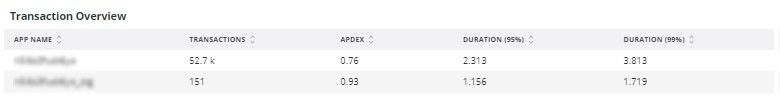

### トランザクションとは？

[&#x200B; トランザクションとは何ですか？](https://docs.newrelic.com/docs/apm/transactions/intro-transactions/transactions-new-relic-apm/#:%7E:text=transactions%20are%20reported.-,What%20is%20a%20transaction%3F,work%20in%20a%20software%20application.&text=For%20APM%2C%20it%20will%20often,when%20the%20response%20is%20sent)

「[!DNL New Relic]では、トランザクションはソフトウェアアプリケーションの作業の1つの論理単位として定義されます。 具体的には、その作業単位を構成する関数呼び出しとメソッド呼び出しを指します。 多くの場合、web トランザクションを指します。これは、アプリケーションがweb リクエストを受信してから応答が送信されるまでのアクティビティを表します。」

### 取引の種類：

**Web:** Web トランザクションは、HTTP リクエストで開始されます。 多くの企業にとって、これらは顧客中心のインタラクションを表すため、監視すべき最も重要なトランザクションです。

**Web以外：** Web以外のトランザクションは、Web リクエストで開始されません。 これには、web以外のワーカープロセス、バックグラウンドプロセス、スクリプト、メッセージキューアクティビティ、その他のタスクが含まれます。

上記の&#x200B;**[!UICONTROL Transaction Overview]** フレームを見ると、APDEXの平均スコアが0.76で、約53,000件のトランザクションがあり、それらのトランザクションの95%が2.313秒以内に発生しました。 これは、短い期間にAPDEX ヒットが発生した場合、よりタイトな期間がその現在の平均からの偏差を示す可能性があるフレームになります。

## [!UICONTROL 404 page errors frame]

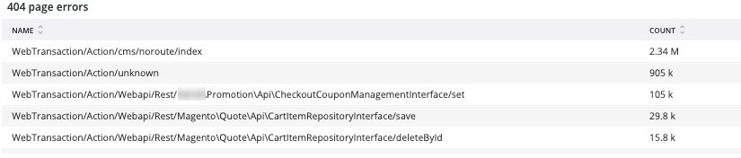

**[!UICONTROL 404 page errors]** フレームには、選択した期間の[URI](https://en.wikipedia.org/wiki/Uniform_Resource_Identifier)と404 ページエラーの数が一覧表示されます。

## [!UICONTROL % of Storage Free frame]

使用可能なディスク容量の割合を表示する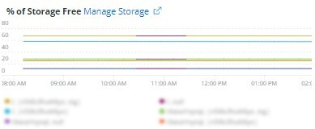

**[!UICONTROL % of Storage Free]** フレームには、クラスターのすべてのノードに対するストレージ マウントの平均空き率が表示されます。 例えば、3つのノードクラスターがある場合、フレームには\&lt; マウントポイント\>、\&lt;環境名\>が表示されます。 このフレームは、3つのノード間に分散がある場合、詐欺的になる可能性があります。 分散の例としては、`/data/mysql` マウントポイント空き値が3つのノードクラスター全体で異なる値である場合があります。 「[!UICONTROL MySQL]」タブの下には、各ノードで空いている`/data/mysql` ストレージが実際に何であるかを正確に確認するために、マウントポイントをノード名でファセットするフレームがあります。

## [!UICONTROL % of system memory that is free frame]

使用可能なRAMの割合を示す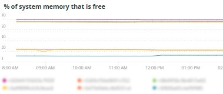

空き&#x200B;**フレームのシステム メモリの**%は、各ノードで空いているシステム メモリの量をノードごとに表示します。

## [!UICONTROL Swap memory free in bytes]

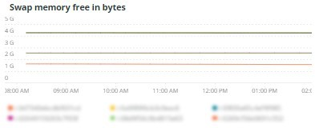

**[!UICONTROL Swap memory free in bytes]** フレームには、ノード上で空いているSWAP メモリの量がノードごとに表示されます。

## [!UICONTROL CPU % by host]

ホスト別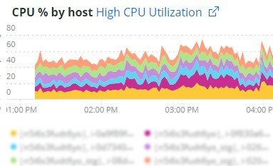

すべての環境とノードの集計が&#x200B;**[!UICONTROL CPU % by host]** フレームに表示されます。 実稼動以外の環境の選択を解除する必要があります。 実稼動環境用のすべてのノードが存在しない場合も注意してください。 CPUの使用率の向上に関するヒントについては、[Adobe CommerceでのNew Relicを使用したパフォーマンスのトラブルシューティング &#x200B;](https://experienceleague.adobe.com/docs/commerce-knowledge-base/kb/troubleshooting/miscellaneous/troubleshoot-performance-using-new-relic-on-magento-commerce.html)を参照してください。

## [!UICONTROL Alerts during timeframe]

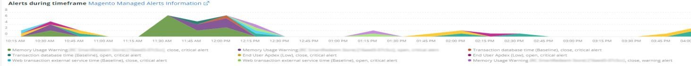

**[!UICONTROL Alerts during timeframe]**&#x200B;には、Adobe Commerce サポートによって追加された[!UICONTROL Managed Alerts]を含むすべてのアラートが表示されます。

## [!UICONTROL CPU Usage]

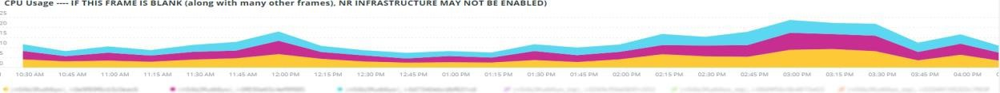

**[!UICONTROL CPU Usage]** フレームが空白の場合は、[!DNL New Relic]のインフラストラクチャ アプリケーションが有効になっていないことを示します。 サイトがスターターにある場合、この情報は表示されません。 サイトがProを利用している場合は、[&#x200B; サポートチケット &#x200B;](https://experienceleague.adobe.com/docs/commerce-knowledge-base/kb/help-center-guide/magento-help-center-user-guide.html)を開いて、サイトで[!DNL New Relic Infrastructure]を有効にします。

## [!UICONTROL Average Response Time]

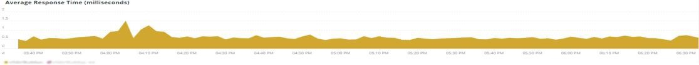

**[!UICONTROL Average Response Time]** グラフには、トランザクション （webおよびその他）の平均応答時間が表示されます。

## [!UICONTROL Long duration cron_schedule updates]

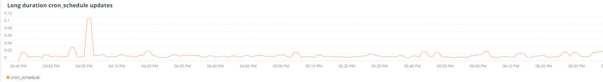の長い期間

**[!UICONTROL cron_schedule]** テーブルは、cron ジョブの開始時と終了時に書き込まれます。 cron ジョブが長い場合、このテーブルの更新に遅延が発生している可能性があります。これにより、cronのスタックアップまたはcronのスケジュール方法に関する問題が発生している可能性があります。

## [!UICONTROL Response Code]

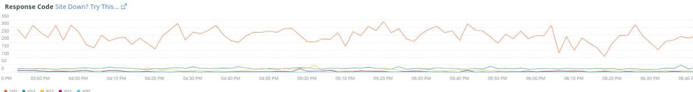

**[!UICONTROL Response Code]** フレームは、web トラフィックとリクエストの応答コードを示す良い指標です。 これは[!DNL New Relic's] トランザクション データであり、返された`httpResponseCode`によってファセットされています。

## [!UICONTROL Web Traffic volume compared with one week ago Magento Managed Alerts Information]

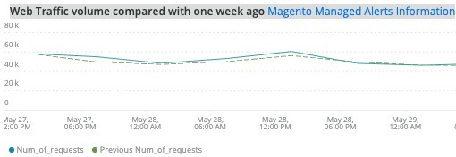

このフレームには、過去1週間と今週の比較web トラフィック量が表示されます。

## [!UICONTROL Deployment Log Entries]

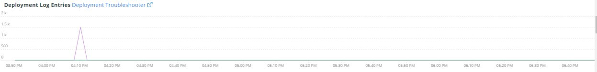

**[!UICONTROL Deployment Log Entries]** フレームには、デプロイメントとクラウドログのエントリの数が表示され、カウントはデプロイメントログ名でファセットされます。

## [!UICONTROL Deployment State]

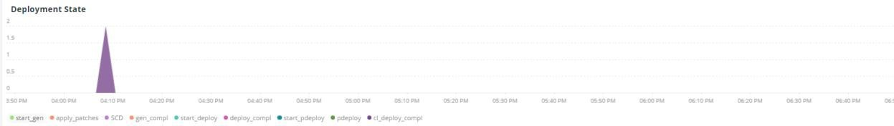

**[!UICONTROL Deployment State]** フレームのファセットは、デプロイログの特定のデプロイメントフェーズを示します。 ログにカウントされるフェーズとファセット名の例を次に示します。

**デプロイメント ログ フェーズ：**

* &#39;%Starting generate command%&#39;） as &#39;start_gen&#39;
* &#39;%git apply /app/vendor/magento/ece-tools/patches%&#39;） as &#39;apply_patches&#39;
* &#39;%Set フラグ：.static_content_deploy%&#39;） as &#39;SCD&#39;
* &#39;%NOTICE: Generate command completed%&#39;） as &#39;gen_compl&#39;
* &#39;%NOTICE: Deployment completed%&#39;）を&#39;deploy_compl&#39;として指定します
* &#39;%NOTICE: postdeployを開始しています。%&#39;） as &#39;start_pdeploy&#39;
* &#39;%NOTICE: Post-deploy is complete%&#39;） as &#39;pdeploy&#39;
* &#39;%deploy-complete%&#39;）を&#39;cl_deploy_compl&#39;として指定します

## [!UICONTROL IP Frequency]

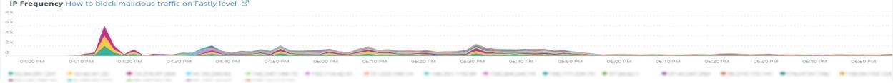

**[!UICONTROL IP Frequency]** フレームは、[!DNL Fastly] ログから各IPの（&#39;MISS&#39;および&#39;PASS&#39;） ステータスをカウントします。 これらのステータスを持つweb リクエストは、オリジンサーバーに到達し、サーバーにロードを追加します。 上位20個のアドレスが頻度で表示されます。 このフレームは、web サイト上のIP攻撃や負荷の高いソースを検出するために使用できます。

## [!UICONTROL IP Response – top 20 URLs in duration]

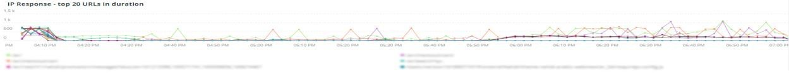

**[!UICONTROL IP Response – top 20 URLs in duration]** フレームには、応答の長さが最も長いURLが表示されます。 これは、長い応答時間を持つ大きな画像ファイルまたはページ、APIまたはページを示す場合があります。

## [!UICONTROL API Calls by IP]

ip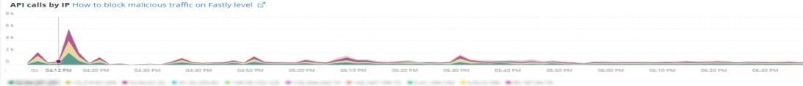によるapi呼び出し

**[!UICONTROL API Calls by IP]** フレームは、APIと、API URLからリクエストを行うIP アドレスに対する大量のトラフィックを識別するのに役立ちます。

## [!UICONTROL API Calls by IP, details by URL]

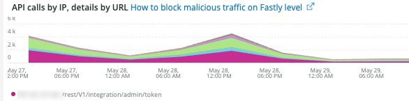

**[!UICONTROL API Calls by IP, details by URL]** フレームには、APIに対するトラフィック量の詳細と、リクエストを行うURLの詳細が表示されます。

## [!UICONTROL IP Frequency Rate per minute]

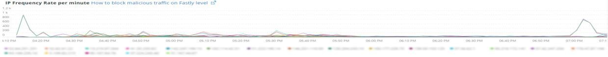

他のフレームで最もリクエストが多いIP アドレスを判断するのが難しい場合があります。 **[!UICONTROL IP Frequency Rate per minute]** フレームは、IP アドレスごとの1分あたりのレートを示します。

## [!UICONTROL Potential Bots]

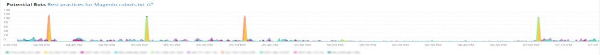

**[!UICONTROL Potential Bots]** フレームは、NULLまたは&#39;%bot%&#39;のようなrequest_user_agent名を持つリクエストを参照します。 通常、&#39;%bot%&#39; request_user_agentは、`robots.txt` ファイルのポリシー設定に従います。

## [!UICONTROL Transaction Errors]

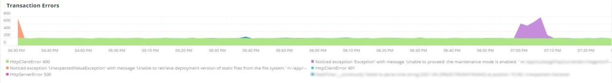

**[!UICONTROL Transaction Errors]** フレームには、[!DNL New Relic]からのトランザクションエラーの数が表示されます。

## [!UICONTROL Nginx access by node]

ノード 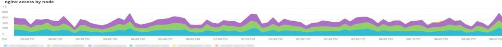によるnginx アクセス

**[!UICONTROL Nginx access by node]** フレームは、`access.log` ノードからのカウントを調べます。 負荷が均等に分散されているかどうかを確認すると便利です。 ノードがドロップする場合によく表示されます。 フレームには、サイト全体の負荷も表示されます。

## [!UICONTROL Galera Log]

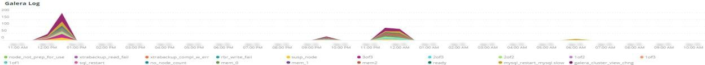

[[!DNL Galera]](https://galeracluster.com/library/galera-documentation.pdf)はデータベース クラスターに使用されています。 このフレームは、[!UICONTROL Galera] クラスターからの特定の信号に焦点を当てています。 信号は、クラスターに出入りするノードに焦点を当てています。これは、データベースデータの整合性を維持するための通常の動作です。 ノードは、[!UICONTROL Galera] クラスター状態の変更に伴って同期されます。

**状態の変更[!UICONTROL Galera]のリスト：**

* &#39;%1047 WSREPはまだアプリケーション用にノードを準備していません%&#39;）。&#39;node_not_prep_for_use&#39;として
* &#39;%\[ERROR\] WSREP: Wsrep_sst_xtrabackup-v2%&#39;）を「xtrabackup_read_fail」として読み取れませんでした
* &#39;%\[ERROR\] WSREP: プロセスが完了しました。エラー：wsrep_sst_xtrabackup-v2 %&#39;） as &#39;xtrabackup_compl_w_err&#39;
* &#39;%\[ERROR\] WSREP: rbr write fail%） as &#39;rbr_write_fail&#39;
* &#39;%self-leave%&#39;） as &#39;susp_node&#39;
* &#39;%members = 3/3 （joined/total） %&#39;） as &#39;3of3&#39;
* &#39;%members = 2/3 （joined/total） %&#39;） as &#39;2of3&#39;
* &#39;%members = 2/2%&#39;） as &#39;2of2&#39; * &#39;%members = 1/2%&#39;） as &#39;1of2&#39; * &#39;%members = 1/3%&#39;） as &#39;1of3&#39;
* &#39;%members = 1/1%&#39;） as &#39;1of1&#39;
* &#39;%\[Note\] /usr/sbin/mysqld （mysqld 10.%&#39;）を「sql_restart」として使用
* &#39;%Quorum: No node with complete state:%&#39;） as &#39;no_node_count&#39;
* &#39;%WSREP: Member 0%&#39;）を&#39;mem_0&#39;として指定します
* &#39;%WSREP: Member 1.0%&#39;） as &#39;mem_1&#39;
* &#39;%WSREP: Member 2%&#39;）を&#39;mem2&#39;として使用します
* &#39;%WSREP: Synchronized with group, ready for connections%&#39;） as &#39;ready&#39;
* &#39;%/usr/sbin/mysqld, Version:%&#39;）を「mysql_restart_mysql.slow」として使用します。
* &#39;%\[Note\] WSREP：新しいクラスタービュー：グローバル状態：%&#39;）を「galera_cluster_view_chng」として

これらのシグナルは、状態が頻繁に変化する場合、ストレージ、メモリ、またはクエリの問題を示している可能性があります。

## [!UICONTROL Database errors]

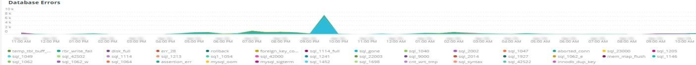

**検出されたデータベース エラーまたはメッセージのリスト：**

* &#39;%一時テーブルに割り当てられたメモリ サイズは、&#39;temp_tbl_buff_pool&#39;としてinnodb_buffer_pool_size%&#39;の20%を超えています
* &#39;%\[ERROR\] WSREP: rbr write fail%） as &#39;rbr_write_fail&#39;
* &#39;%mysqld: Disk full%&#39;） as &#39;disk_full&#39;
* &#39;%Error number 28%&#39;） as &#39;err_28&#39;
* &#39;%rollback%&#39;）を&#39;rollback&#39;として使用します
* &#39;%Foreign key constraint failed for table%&#39;） as &#39;foreign_key_constraint&#39;
* &#39;%Error_code: 1114%&#39;） as &#39;sql_1114_full&#39;
* &#39;%CRITICAL: SQLSTATE\[HY000\] \[2006\] MySQL Server has gone away%&#39;） as &#39;sql_gone&#39;
* &#39;%SQLSTATE\[HY000\] \[1040\]接続が多すぎます%&#39;） as &#39;sql_1040&#39;
* &#39;%CRITICAL: SQLSTATE\[HY000\] \[2002\]%&#39;） as &#39;sql_2002&#39;
* &#39;%SQLSTATE\[08S01\]:%&#39;）を&#39;sql_1047&#39;として使用しています
* &#39;%\[Warning\] Aborted connection%&#39;）を&#39;aborted_conn&#39;として使用しました
* &#39;%SQLSTATE\[23000\]: Integrity constraint violation:%&#39;）を&#39;sql_23000&#39;として返します
* &#39;%1205 Lock wait timeout%&#39;） as &#39;sql_1205&#39;
* &#39;%SQLSTATE\[HY000\] \[1049\]不明なdatabase%&#39;）を&#39;sql_1049&#39;として使用します
* &#39;%SQLSTATE\[42S02\]：基本テーブルまたはビューが見つかりません：%&#39;） as &#39;sql_42S02&#39;
* &#39;%General error: 1114%&#39;）を&#39;sql_1114&#39;として返します
* &#39;%SQLSTATE\[40001\]%&#39;） as &#39;sql_1213&#39;
* &#39;%SQLSTATE\[42S22\]：列が見つかりません：1054不明な列%&#39;） as &#39;sq1_1054&#39;
* &#39;%SQLSTATE\[42000\]：構文エラーまたはアクセス違反：%&#39;）を&#39;sql_42000&#39;として返します
* &#39;%SQLSTATE\[21000\]: カーディナリティ違反：%&#39;） as &#39;sql_1241&#39;
* &#39;%SQLSTATE\[22003\]:%&#39;）を&#39;sql_22003&#39;として使用します
* &#39;%SQLSTATE\[HY000\] \[9000\] Client with IP address%&#39;） as &#39;sql_9000&#39;
* &#39;%SQLSTATE\[HY000\]：一般エラー：2014%&#39;） as &#39;sql_2014&#39;
* &#39;%1927 Connection was killed%&#39;） as &#39;sql_1927&#39;
* &#39;%1062 \[\ERROR\] InnoDB:%&#39;）を&#39;sql_1062_e&#39;として使用します
* &#39;%\[Note\] WSREP: メモリ マップをディスクにフラッシュしています…%&#39;） as &#39;mem_map_flush&#39;
* &#39;%Internal MariaDB エラーコード：1146%&#39;） as &#39;sql_1146&#39;
* &#39;%Internal MariaDB エラーコード：1062%&#39;） as &#39;sql_1062&#39; * &#39;%1062 \[Warning\] InnoDB:%&#39;） as &#39;sql_1062_w&#39;
* &#39;%Internal MariaDB エラーコード：1064%&#39;） as &#39;sql_1064&#39;
* &#39;%InnoDB: アサーションエラー（ファイル %）） as &#39;assertion_err&#39;
* &#39;%mysqld_safe現在実行中のプロセスの数：0%） as &#39;mysql_oom&#39;
* &#39;%\[ERROR\] mysqld got signal%&#39;）を&#39;mysql_sigterm&#39;として返します
* &#39;%1452 Cannot add%&#39;） as &#39;sql_1452&#39;
* &#39;%ERROR 1698%&#39;） as &#39;sql_1698&#39;
* &#39;%SQLSTATE\[HY000\]：一般エラー：3%&#39;） as &#39;cnt_wrt_tmp&#39;
* &#39;%一般エラー：1 %&#39;）を&#39;sql_syntax&#39;として返します
* &#39;%42S22%&#39;） as &#39;sql_42S22&#39;
* &#39;%InnoDB: エラー（キーが重複） %&#39;） as &#39;innodb_dup_key&#39;

## [!UICONTROL Database traces]

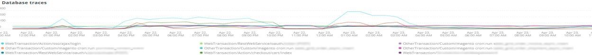

**[!UICONTROL Database traces]** フレームは、[!DNL New Relic]の[sql trace](https://docs.newrelic.com/docs/apm/transactions/transaction-traces/transaction-traces-database-queries-page/) エンティティからのデータを参照し、トレースのパスを返します。

## [!UICONTROL Database mysql-slow.log]

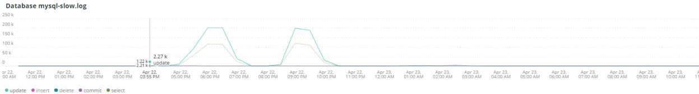

**[!UICONTROL Database mysql-slow.log]** フレームは、[mysql-slow.log](https://dev.mysql.com/doc/refman/5.7/en/slow-query-log.html)のエントリをクエリ要求タイプ別にカウントします。 mysql-slow.log （スロークエリログ）に関心を持つ可能性のあるタイムフレームを視覚的に分離します。 インデックスのないテーブルのクエリや、大きなテーブルを更新するクエリは、他のクエリをブロックする場合があります。

## [!UICONTROL Redis synchronization from Log]

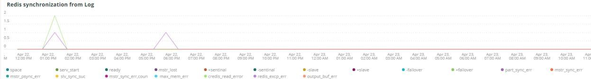

[[!DNL Redis]](https://redis.io/about/)は、データベース、キャッシュ、メッセージブローカーとして使用されるオープンソース（BSD ライセンス）のメモリ内データ構造ストアです。 設定されている場合は、データベースとセッションのキャッシュを実行できます。 **[!UICONTROL Redis synchronization from Log]** フレームは、[[!DNL Redis] 同期](https://redis.io/docs/latest/operate/oss_and_stack/management/replication/)に焦点を当てています。 [!DNL Redis] データセットが大きいほど、同期に問題が発生する可能性が高くなります（同期を維持するデータが多くなります）。

**[!DNL Redis]個のエラーとメッセージ：**

* &#39;%SLAVE同期：デバイスに空き領域が残っていません%&#39;） as &#39;space&#39;
* &#39;%Server started, Redis version%&#39;） as &#39;serv_start&#39;
* &#39;%The server is now ready to accept connections%&#39;） as &#39;ready&#39;
* &#39;% マスターとの接続が失われました。%&#39;） as &#39;mstr_lost&#39;
* &#39;%+sdown sentinel%&#39;） as &#39;+sentinal&#39;
* &#39;%-sdown sentinel%&#39;） as &#39;-sentinal&#39;
* &#39;%-sdown slave%&#39;） as &#39;-slave&#39;, &#39;%+sdown slave%&#39;） as &#39;+slave&#39;
* &#39;%-failover-abort-not-elected master mymaster%&#39;） as &#39;-failover&#39;
* &#39;%+failover-abort-not-elected master mymaster%&#39;） as &#39;+failover&#39;
* &#39;%部分再同期できません（キャッシュ マスターなし） %&#39;）。&#39;part_sync_err&#39;として
* &#39;%マスターはレプリケーションを中止しました。エラー：ERR Can%&#39;）は&#39;mstr_sync_err&#39;です
* &#39;%マスターはPSYNCをサポートしていないか、エラー状態%&#39;）を&#39;mstr_psync_err&#39;として指定しています
* &#39;%SLAVE sync: Finished with success%&#39;） as &#39; slv_sync_suc&#39;
* &#39;%マスターがレプリケーションを中止しました。エラー：ERR Can%&#39;）は&#39;mstr_sync_err,coun&#39;です
* &#39;%OOM コマンドは使用メモリ %&#39;）を&#39; max_mem_err&#39;として使用できません
* &#39;%CredisException （コード：0）：接続の読み取りエラー%&#39;）を&#39;credis_read_error&#39;として返します
* &#39;%Uncaught RedisException:%&#39;）を&#39;redis_excp_err&#39;として使用します
* &#39;%psyncは、出力バッファ %&#39;を克服するためにASAPを閉じるようにスケジュールされています）。&#39;output_buf_err&#39;として

## [!UICONTROL PHP process states]

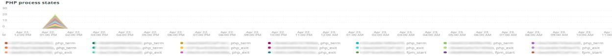

PHP プロセスの動作は、[設定](https://www.php.net/manual/en/install.fpm.configuration.php)によって異なります。 設定は複雑で、多くの変数とオプションがあります。 **[!UICONTROL PHP process states]** フレームは、PHP プロセスがいつ終了して再起動したかを理解するのに役立ちます。

### [!UICONTROL PHP errors]

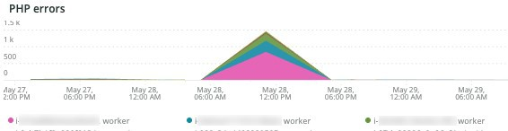

**[!UICONTROL PHP errors]** フレームには、選択した期間におけるワーカーのPHP エラー数が表示されます。 詳しくは、[Adobe Commerce PHP settings](../../installation/prerequisites/php-settings.md)を参照してください。

**PHP エラーとメッセージ：**

* &#39;%worker_connections are not enough%&#39;） as &#39;worker&#39;
* &#39;%PHP Fatal error: Allowed memory size!%&#39;） as &#39;mem_size&#39;
* &#39;%exited on signal 11 （SIGSEGV） %&#39;） as &#39;sig_11&#39;
* &#39;%exited on signal 7 （SIGBUS） %&#39;） as &#39;sig_7&#39;
* &#39;%increase pm.start_servers%&#39;） as &#39;pmstart_serv&#39;
* &#39;%max_children%&#39;） as &#39;max_children_cnt&#39;
* &#39;%PHP Fatal error: Allowed memory size of%&#39;） as &#39;mem_exhst_coun&#39;
* &#39;%Unable to allocate memory for pool%&#39;） as &#39;opc_mem_count&#39;
* &#39;%Warning Interned string buffer overflow%&#39;） as &#39;opc_str_buf&#39;
* &#39;%Illegal string offsetl%&#39;） as &#39;opc_sv_comments&#39;
* &#39;%PHP Fatal error: Uncaught RedisException: read error on connection%&#39;） as &#39;php_exc&#39;

## [!UICONTROL PHP processes]

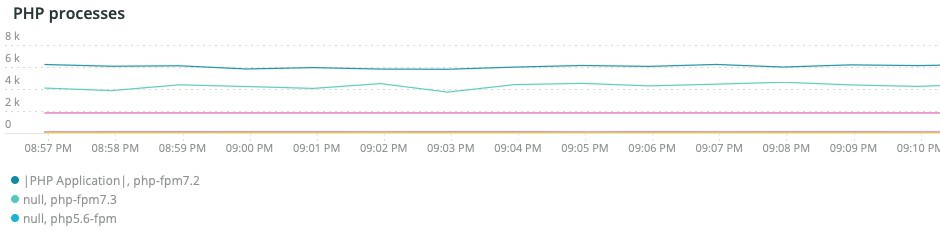

[PHP-FPM](https://php-fpm.org/)は[!DNL Nginx]が使用している[!UICONTROL FastCGI Process Manager]です。 必要システム構成について詳しくは、[Adobe Commerce バージョンにマッピングされたPHP バージョン構成](../../installation/system-requirements.md)を参照してください。 **[!UICONTROL PHP processes]** フレームには、選択したタイムライン内の特定の時間に実行されているPHP プロセスの数が表示されます。

## [!UICONTROL Secondary processes]

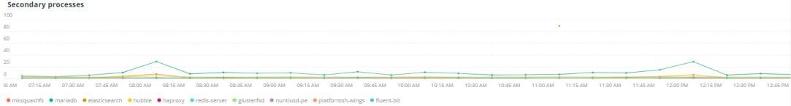

セカンダリなプロセスがサイトの対応に影響を与える可能性があります。 **[!UICONTROL Secondary processes]** フレームは、サイトに負荷を追加している可能性のあるプロセスを示します。 データベースは主にセカンダリプロセスが実行されています。

## [!UICONTROL Traffic vs Week Ago]

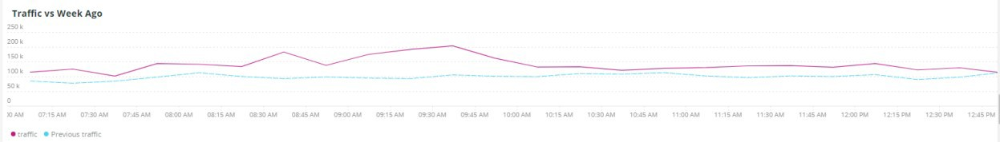

**[!UICONTROL Traffic vs Week Ago]** フレームは、（&#39;MISS&#39;, &#39;PASS&#39;） キャッシュ ステータスを持つ[!DNL Fastly] ログからのweb サイト トラフィック （リクエスト）を調べます。 これらのリクエストは、オリジンサーバーに負荷を追加します。 このフレームには、同じ期間の現在の週と過去1週間前の比較web リクエスト量が表示されます。

## [!UICONTROL Fastly Cache]

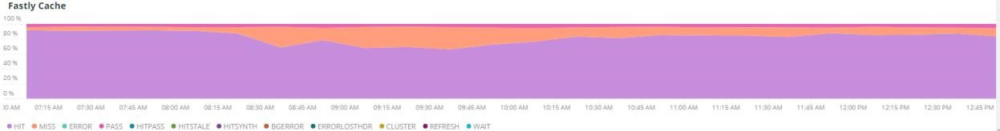

**[!UICONTROL Fastly Cache]** フレームには、[!DNL Fastly] ログからのリクエストのキャッシュ状態の集計表示が表示されます。 「エラー」を選択すると、リクエストのエラーの割合が表示されます。 通常、これは、オリジンサーバーがページリクエストに十分に迅速に応答しない場合に増加します。

## [!UICONTROL Page Rendering]

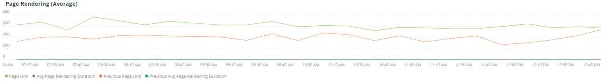

**[!UICONTROL Page Rendering]** フレームには、同じ期間の前週と比較して、ページビューソース [!DNL New Relic]の今週の平均ページレンダリング期間が表示されます。

## [!UICONTROL Page loading detail]

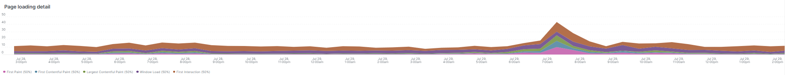

**[!UICONTROL Page loading detail]** フレームは、ページ読み込みイベントを説明します。 これらのファセットの意味を詳しく説明します。 このフレームに対して実行されるクエリは次のとおりです。

`SELECT percentile(timeToResponseStart, 50) AS 'first byte', percentile(firstPaint, 50) as 'First paint', percentile(firstContentfulPaint, 50) as 'First contentful paint', percentile(timeToDomContentLoadedEventEnd, 50) AS 'DOM content loaded', percentile(duration, 50) AS 'Window load + AJAX' FROM BrowserInteraction TIMESERIES`

## [!UICONTROL Transactions – Avg, Max, Min]

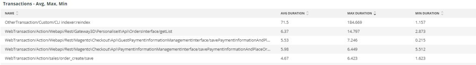

トランザクション期間は秒単位です。 トランザクションによっては、長時間実行されている場合、他のトランザクションに影響を与える可能性があります。 名前と期間の下にリストされているトランザクションは、特定の期間のものです。 問題の期間が簡潔な場合は、[!DNL Observation for Adobe Commerce]の日時セレクターをその狭い期間に変更します。

## [!UICONTROL Admin Activities]

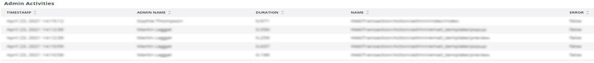

**[!UICONTROL Admin Activities]** フレームは、管理者ユーザーとのトランザクションを識別します。

## [!UICONTROL Order transactions (default?)]

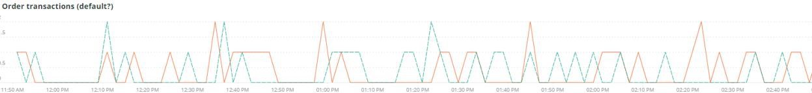

**[!UICONTROL Order transactions (default?)]** フレームは、トランザクション `request.headers.host`をトランザクションから検索します。トランザクション名は`WebTransaction/Action/checkout/onepage/success`です。 注文成功URLが異なる場合、このフレームにはデータは含まれません。

## [!UICONTROL Elasticsearch Index information]

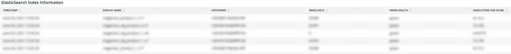

**[Elasticsearchのステータス：](https://www.elastic.co/guide/en/elasticsearch/reference/current/cluster-health.html)**

* 緑：すべてのシャードが割り当てられます。
* 黄色：すべてのプライマリシャードが割り当てられていますが、1つ以上のレプリカシャードが割り当てられていません。 クラスター内のノードが失敗した場合、そのノードが修復されるまで、一部のデータが利用できない可能性があります。
* 赤：1つ以上のプライマリシャードが割り当てられていないため、一部のデータが利用できません。 これは、プライマリシャードが割り当てられるため、クラスターの起動中に簡単に発生する可能性があります。

## [!UICONTROL Elasticsearch Errors]

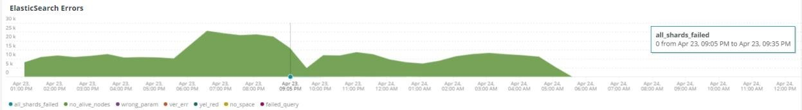

**[!DNL Elasticsearch]エラー：**

* &#39;%all shards failed%&#39; as &#39;all_shards_failed&#39;
* &#39;%NoNodesAvailableException%&#39; as &#39;no_alive_nodes&#39;
* &#39;%PHP Fatal error: Uncaught Error: Wrong parameters for Elasticsearch%&#39; as &#39;wrong_param&#39;
* &#39;%この問題を解決するには、Magento Cloud インフラストラクチャのElasticsearch サービスを「ver_err」としてversion%にアップグレードします
* &#39;%clusterのヘルスステータスが\[YELLOW\]から\[RED\]に変更されました（理由：%&#39;は&#39;yel_red&#39;です）
* &#39;%No space left on device%&#39; as &#39;no_space&#39;
* &#39;% &lbrack;SearchRequest&lbrace;searchType=%&#39;を&#39;failed_query&#39;として実行できませんでした

## [!UICONTROL Cron view]

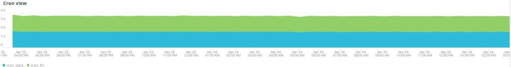

**[!UICONTROL Cron view]** フレームは、クローンログを参照して、開始したクローン数と終了したクローン数のバランスを確認します。

## [!UICONTROL Cron error]

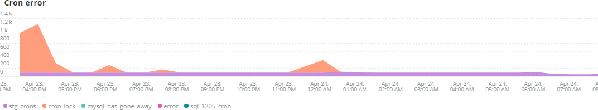

cron.log:**からの** Cron エラー

* &#39;%_stg%&#39; as &#39;stg_crons&#39;
* &#39;%Could not acquire lock for cron job%&#39; as &#39;cron_lock&#39;
* &#39;%General error: 2006 MySQL server has gone away%&#39; as &#39;mysql_has_gone_away&#39;
* &#39;%error%&#39; as &#39;error&#39;
* &#39;%General error: 1205 Lock wait timeout exceeded%&#39; as sql_1205_cron

## [!UICONTROL cron_schedule table updates]

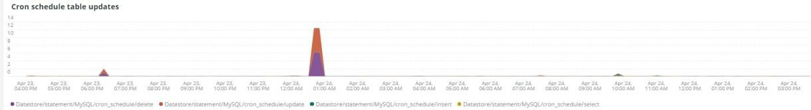

**[!UICONTROL cron_schedule table updates]** フレームは、データストア操作の更新にcron_schedule テーブルが含まれる最大期間を秒単位で調べます。 これは、SQL リクエストタイプに対してファセットされます。

## [!UICONTROL Datastore Operations Tables]

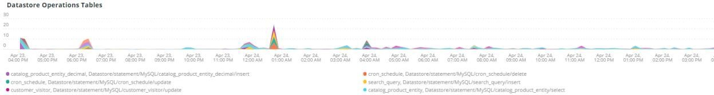

この&#x200B;**[!UICONTROL Datastore Operations Tables]** フレームには、期間、テーブル名、SQL リクエストタイプ別の上位25の操作が表示されます。 スパイクにカーソルを合わせると、どのテーブルにアクセスされているのか、どのリクエストタイプによってアクセスされているのかを詳細に確認できます。

## [!UICONTROL Cache Flush]

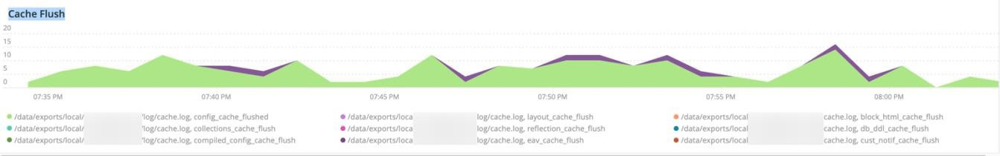

**キャッシュフラッシュが検出されました：**

* &#39;%config%&#39; as &#39;config_cache_flushed&#39;
* &#39;%layout%&#39; as &#39;layout_cache_flush&#39;
* &#39;%block_html%&#39; as &#39;block_html_cache_flush&#39;
* &#39;%collections%&#39; as &#39;collections_cache_flush&#39;
* &#39;%reflection%&#39; as &#39;reflection_cache_flush&#39;
* &#39;%db_ddl%&#39; as &#39;db_ddl_cache_flush&#39;
* &#39;%compiled_config%&#39; as &#39;compiled_config_cache_flush&#39;
* &#39;%eav%&#39; as &#39;eav_cache_flush&#39;
* &#39;%customer_notification%&#39; as &#39;cust_notif_cache_flush&#39;
* &#39;%config_integration%&#39;を&#39;config_integ_cache_flush&#39;として使用します
* &#39;%config_integration_api%&#39;として&#39;config_integ_api_cache_flush&#39;
* &#39;%full_page%&#39; as &#39;full_page_cache_flush&#39;
* &#39;%config_webservice%&#39; as &#39;config_webserv_cache_flush&#39;
* &#39;%translate%&#39; as &#39;translate_cache_flush&#39;
