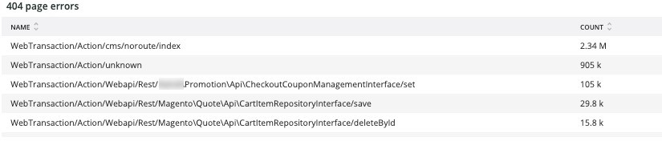

# この [!UICONTROL Summary] タブ

この [!UICONTROL Summary] タブ / [!DNL Observation for Adobe Commerce] は、サイトで発生する問題のいくつかを素早く確認し、サイトの問題の潜在的な根本原因を自動解決または特定することを目的としています。 追加のタブでは、コンポーネント・サービス、データベース、インフラストラクチャ、プロセスの状態に関する詳細な情報を提供します。

## [!UICONTROL Transaction Overview]

### [トランザクションとは](https://docs.newrelic.com/docs/apm/transactions/intro-transactions/transactions-new-relic-apm/#:%7E:text=transactions%20are%20reported.-,What%20is%20a%20transaction%3F,work%20in%20a%20software%20application.&amp;text=For%20APM%2C%20it%20will%20often, when%20the%20response%20is%20sent)

「に [!DNL New Relic]トランザクションは、ソフトウェアアプリケーション内の 1 つの作業論理単位として定義されます。 具体的には、その作業単位を構成する関数呼び出しとメソッド呼び出しを指します。 多くの場合、web トランザクションを指します。これは、アプリケーションが web リクエストを受信したときから応答が送信されたときに発生するアクティビティを表します。」

### トランザクションのタイプ：

**Web:** Web トランザクションは、HTTP リクエストで開始されます。 ほとんどの組織では、これらは顧客中心のインタラクションを表しているので、監視が最も重要なトランザクションです。

**Web 以外：** Web 以外のトランザクションは、web リクエストでは開始されません。 Web ワーカー以外のプロセス、バックグラウンドプロセス、スクリプト、メッセージキューアクティビティなどのタスクが含まれます。

次の項目を見ると、 **[!UICONTROL Transaction Overview]** 上記のフレームでは、平均 APDEX スコアが 0.76 のトランザクションがほぼ 53,000 件あり、これらのトランザクションの 95% は 2.313 秒未満で発生しました。 これは、短い時間枠で APDEX がヒットした場合、より厳密な時間枠では現在の平均からの偏差が表示されるフレームです。

## [!UICONTROL 404 page errors frame]

この **[!UICONTROL 404 page errors]** フレーム リスト [URI](https://en.wikipedia.org/wiki/Uniform_Resource_Identifier) 選択した期間の 404 ページエラーの数。

## [!UICONTROL % of Storage Free frame]

この **[!UICONTROL % of Storage Free]** フレームには、クラスタのすべてのノードにわたるストレージ・マウントの平均空き率が表示されます。 例えば、3 つのノードクラスターがある場合、フレームには\&lt;mount point=&quot;&quot;>, \&lt;environment name=&quot;&quot;>. このフレームは、3 つのノード間に相違がある場合に偽装される可能性があります。 分散の例として、次のようになります。 `/data/mysql` マウントポイントの解放は、3 つのノードクラスタ間で異なる値でした。 の下にフレームがあります [!UICONTROL MySQL] マウントポイントをノード名でファセットするタブで、 `/data/mysql` 各ノードのストレージ空き容量は、実際にはです。

## [!UICONTROL % of system memory that is free frame]

この **システムメモリの空き容量（%）** フレームは、各ノード上の空きシステムメモリの量をノードごとに表示します。

## [!UICONTROL Swap memory free in bytes]

この **[!UICONTROL Swap memory free in bytes]** フレームは、ノード上で空いている SWAP メモリの量をノードごとに表示します。

## [!UICONTROL CPU % by host]

すべての環境およびノードの集計が「」に表示されます **[!UICONTROL CPU % by host]** フレーム。 非実稼動環境の選択を解除する必要があります。 また、実稼動環境のすべてのノードが存在しないインスタンスも注目してください。 CPU 高使用率に関するその他のヒントについては、を参照してください。 [Adobe CommerceのNew Relicを使用したパフォーマンスのトラブルシューティング](https://experienceleague.adobe.com/docs/commerce-knowledge-base/kb/troubleshooting/miscellaneous/troubleshoot-performance-using-new-relic-on-magento-commerce.html).

## [!UICONTROL Alerts during timeframe]

この **[!UICONTROL Alerts during timeframe]** を含むすべてのアラートを表示します [!UICONTROL Managed Alerts] Adobe Commerce サポートによって追加されました。

## [!UICONTROL CPU Usage]

次の場合 **[!UICONTROL CPU Usage]** フレームが空白の場合、インフラストラクチャのアプリケーションが [!DNL New Relic] が有効になっていません。 サイトが Starter 上にある場合、この情報は表示されません。 サイトがプロ仕様の場合は、 [サポートチケット](https://experienceleague.adobe.com/docs/commerce-knowledge-base/kb/help-center-guide/magento-help-center-user-guide.html) 持つ [!DNL New Relic Infrastructure] サイトに対して有効にしました。

## [!UICONTROL Average Response Time]

この **[!UICONTROL Average Response Time]** グラフは、トランザクション（web など）の平均応答時間を示します。

## [!UICONTROL Long duration cron_schedule updates]

この **[!UICONTROL cron_schedule]** cron ジョブの開始と終了の際にテーブルが書き込まれます。 所要時間が長い cron ジョブでは、このテーブルの更新に遅延が生じる可能性があります。これは、cron スタックアップまたは cron のスケジュール方法に関する問題を示す場合があります。

## [!UICONTROL Response Code]

この **[!UICONTROL Response Code]** フレームは、web トラフィックとリクエストの応答コードを示す優れた指標です。 このプロパティは [!DNL New Relic's] トランザクションデータが含まれ、 `httpResponseCode` 返されます。

## [!UICONTROL Web Traffic volume compared with one week ago Magento Managed Alerts Information]

このフレームには、過去 1 週間と現在 1 週間の web トラフィックの比較量が表示されます。

## [!UICONTROL Deployment Log Entries]

この **[!UICONTROL Deployment Log Entries]** フレームには、デプロイメントエントリとクラウドログエントリの数が表示され、デプロイメントログ名を基準にしてカウントがファセットされます。

## [!UICONTROL Deployment State]

この **[!UICONTROL Deployment State]** デプロイメントログのフレームファセット特定のデプロイメントフェーズ 次に、ログにカウントされるフェーズとファセット名の例を示します。

**デプロイメントログフェーズ：**

* &#39;%Starting generate command%&#39;） as &#39;start_gen&#39;
* &#39;%git apply /app/vendor/magento/ece-tools/patches%&#39;） as &#39;apply_patches&#39;
* &#39;%Set フラグ：.static_content_deploy%&#39;）を&#39;SCD&#39;として設定
* &#39;% 注意：コマンド生成が完了しました %&#39;）を&#39;gen_compl&#39;として生成します
* &#39;%NOTICE: Deployment completed%&#39;）を&#39;deploy_compl&#39;として設定します
* &#39;%NOTICE: ポスト デプロイを開始しています。%&#39;） as &#39;start_pdeploy&#39;
* &#39;%NOTICE: Post-deploy is complete%&#39;） as &#39;pdeploy&#39;
* &#39;%deploy-complete%&#39;）を&#39;cl_deploy_compl&#39;として使用します。

## [!UICONTROL IP Frequency]

この **[!UICONTROL IP Frequency]** フレームは、から各 IP の（「ミス」および「パス」）ステータスをカウントします。 [!DNL Fastly] ログ。 これらのステータスを持つ web リクエストは接触チャネルサーバーに到達し、サーバーに読み込みを追加します。 これは、頻度の上位 20 件のアドレスを表示します。 このフレームは、Web サイトに対する IP 攻撃や高負荷のソースを検出するために使用できます。

## [!UICONTROL IP Response – top 20 URLs in duration]

この **[!UICONTROL IP Response – top 20 URLs in duration]** フレームは、応答時間が最も長い URL を表示します。 サイズの大きい画像ファイルまたはページ、API または応答時間が最長のページを示す場合があります。

## [!UICONTROL API Calls by IP]

この **[!UICONTROL API Calls by IP]** フレームは、API に対する大量のトラフィックや、API の URL からリクエストを送信する IP アドレスを特定するのに役立ちます。

## [!UICONTROL API Calls by IP, details by URL]

この **[!UICONTROL API Calls by IP, details by URL]** フレームは、API に対する大量のトラフィックの詳細と、リクエストを送信する URL の詳細を提供します。

## [!UICONTROL IP Frequency Rate per minute]

他のフレームで最も多くのリクエストがどの IP アドレスに割り当てられているかを判断するのが難しい場合があります。 この **[!UICONTROL IP Frequency Rate per minute]** フレームは、IP アドレスごとの 1 分あたりのレートを示します。

## [!UICONTROL Potential Bots]

この **[!UICONTROL Potential Bots]** frame は、NULL や&#39;%bot%&#39;などの request_user_agent 名を持つリクエストを調べます。 通常、「%bot%」 request_user_agent は、のポリシー設定に従います `robots.txt` ファイル。

## [!UICONTROL Transaction Errors]

この **[!UICONTROL Transaction Errors]** フレームには、次のトランザクション エラー数が表示されます [!DNL New Relic].

## [!UICONTROL Nginx access by node]

この **[!UICONTROL Nginx access by node]** フレームは、からのカウントを調べます `access.log` ノード別 負荷が均等に分散されているかどうかを確認すると便利です。 多くの場合、ノードがドロップしたときに表示されます。 また、このフレームには、サイト全体の負荷も表示されます。

## [!UICONTROL Galera Log]

[[!DNL Galera]](https://galeracluster.com/library/galera-documentation.pdf) は、データベースクラスターに使用されます。 このフレームは、 [!UICONTROL Galera] クラスター。 シグナルは、クラスターに入るノードとクラスターから出るノードに焦点を当てます。これは、データベースのデータ整合性を維持する通常の動作です。 ノードは、として同期されます。 [!UICONTROL Galera] クラスターの状態が変更されました。

**リスト [!UICONTROL Galera] 状態の変更：**

* &#39;%1047 WSREP はまだアプリケーションの使用 %&#39;用のノードを準備していません）。&#39;node_not_prep_for_use&#39;
* &#39;%\[ERROR\] WSREP: wsrep_sst_xtrabackup-v2%&#39;）から&#39;xtrabackup_read_fail&#39;として読み取れませんでした
* &#39;%\[ERROR\] WSREP: プロセスが完了しましたが、エラーが発生しました：wsrep_sst_xtrabackup-v2 %&#39;） as &#39;xtrabackup_compl_w_err&#39;
* &#39;%\[ERROR\] WSREP: rbr write fail%&#39;） as &#39;rbr_write_fail&#39;
* &#39;%self-leave%&#39;）を&#39;susp_node&#39;
* &#39;%members = 3/3 （結合/合計） %&#39;）を&#39;3of3&#39;として使用
* &#39;%members = 2/3 （結合/合計） %&#39;）を&#39;2of3&#39;として使用
* &#39;%members = 2/2%&#39;）を&#39;2of2&#39;として* &#39;%members = 1/2%&#39;）を&#39;1of2&#39;として* &#39;%members = 1/3%&#39;）を&#39;1of3&#39;として
* &#39;%members = 1/1%&#39;）を&#39;1of1&#39;として使用します
* &#39;%\[ 注意\] /usr/sbin/mysqld （mysqld 10.%&#39;） as &#39;sql_restart&#39;
* &#39;%Quorum：完全な状態を持つノードがありません：%&#39;） （&#39;no_node_count&#39;として）
* &#39;%WSREP: メンバー 0%&#39;）を&#39;mem_0&#39;として使用します
* &#39;%WSREP: メンバ 1.0%&#39;）を&#39;mem_1&#39;として使用します
* &#39;%WSREP: メンバ 2%&#39;）を&#39;mem2&#39;として使用します
* &#39;%WSREP: グループと同期されました。接続の準備が完了しました %&#39;）。&#39;準備完了&#39;です。
* &#39;%/usr/sbin/mysqld, Version:%&#39;）を&#39;mysql_restart_mysql.slow&#39;として使用します
* &#39;%\[Note\] WSREP: New cluster view: global state:%&#39;）を&#39;galera_cluster_view_chng&#39;として使用

状態が頻繁に変更される場合、これらのシグナルは、ストレージ、メモリ、またはクエリの問題を示している可能性があります。

## [!UICONTROL Database errors]

**データベース エラーまたは検出されたメッセージの一覧：**

* &#39;% 一時テーブルに割り当てられたメモリサイズが innodb_buffer_pool_size%&#39;）の 20% を超えています（「temp_tbl_buff_pool」として）
* &#39;%\[ERROR\] WSREP: rbr write fail%&#39;） as &#39;rbr_write_fail&#39;
* &#39;%mysqld: Disk full%&#39;）を&#39;disk_full&#39;として使用します
* &#39;% エラー番号 28%&#39;）は&#39;err_28&#39;です。
* &#39;%rollback%&#39;）を&#39;rollback&#39;として使用します
* &#39;%Foreign key constraint failes for table%&#39;） as &#39;foreign_key_constraint&#39;
* &#39;%Error_code: 1114%&#39;） as &#39;sql_1114_full&#39;
* &#39;%CRITICAL: SQLSTATE\[HY000\] \[2006\] MySQL server has gone away%&#39;）を&#39;sql_gone&#39;として使用します
* &#39;%SQLSTATE\[HY000\] \[1040\] Too many connections%&#39;）を&#39;sql_1040&#39;として指定します
* &#39;%CRITICAL: SQLSTATE\[HY000\] \[2002\]%&#39;）を&#39;sql_2002&#39;として使用します
* &#39;%SQLSTATE\[08S01\]:%&#39;）を&#39;sql_1047&#39;として使用します
* &#39;%\[ 警告\] は&#39;aborted_conn&#39;として接続を中止しました %&#39;）
* &#39;%SQLSTATE\[23000\]：整合性制約違反：%&#39;）を&#39;sql_23000&#39;として使用します
* &#39;%1205 ロック待機タイムアウト %&#39;）を&#39;sql_1205&#39;として使用します
* &#39;%SQLSTATE\[HY000\] \[1049\] 不明なデータベース %&#39;）を&#39;sql_1049&#39;として使用します
* &#39;%SQLSTATE\[42S02\]: ベース テーブルまたはビューが見つかりません：%&#39;）を&#39;sql_42S02&#39;として使用します
* &#39;% 一般エラー：1114%&#39;）を&#39;sql_1114&#39;として返します
* &#39;%SQLSTATE\[40001\]%&#39;）を&#39;sql_1213&#39;として使用します
* &#39;%SQLSTATE\[42S22\]：列が見つかりません：1054 不明な列 %&#39;）を&#39;sq1_1054&#39;として
* &#39;%SQLSTATE\[42000\]：構文エラーまたはアクセス違反：%&#39;）を&#39;sql_42000&#39;として返します
* &#39;%SQLSTATE\[21000\]: カーディナリティ違反：%&#39;）を&#39;sql_1241&#39;として返します
* &#39;%SQLSTATE\[22003\]:%&#39;）を&#39;sql_22003&#39;として使用します
* &#39;%SQLSTATE\[HY000\] \[9000\] クライアント （IP アドレスが %&#39;）を&#39;sql_9000&#39;として使用
* &#39;%SQLSTATE\[HY000\]：一般エラー：2014%&#39;）を&#39;sql_2014&#39;として返します
* &#39;%1927 接続が切断されました %&#39;）を&#39;sql_1927&#39;として使用しました
* &#39;%1062 \[\ERROR\] InnoDB:%&#39;）を&#39;sql_1062_e&#39;として使用します
* &#39;%\[Note\] WSREP: メモリ マップをディスクにフラッシュしています…%&#39;） （&#39;mem_map_flush&#39;として）
* &#39;% 内部 MariaDB エラーコード：1146%&#39;）を&#39;sql_1146&#39;として返します
* &#39;%Internal MariaDB エラーコード：1062%&#39;）を&#39;sql_1062&#39; * &#39;%1062 \[ 警告\] InnoDB:%&#39;）を&#39;sql_1062_w&#39;として設定します
* &#39;% 内部 MariaDB エラーコード：1064%&#39;）を&#39;sql_1064&#39;として返します
* &#39;%InnoDB: ファイル %&#39;）で&#39;assertion_err&#39;としてアサーションに失敗しました
* &#39;%mysqld_safe 現在実行中のプロセスの数：0%&#39;）を&#39;mysql_oom&#39;として返します。
* &#39;%\[ERROR\] mysqld は&#39;mysql_sigterm&#39;として signal%&#39;）を取得しました
* &#39;%1452%&#39;）を&#39;sql_1452&#39;として追加できません
* &#39;%ERROR 1698%&#39;）を&#39;sql_1698&#39;として返します
* &#39;%SQLSTATE\[HY000\]：一般エラー：3%&#39;）を&#39;cnt_wrt_tmp&#39;として使用します
* &#39;% 一般エラー：1 %&#39;）を&#39;sql_syntax&#39;として使用します
* &#39;%42S22%&#39;）を&#39;sql_42S22&#39;として使用します
* &#39;%InnoDB: エラー（キーの重複） %&#39;）を&#39;innodb_dup_key&#39;として返します

## [!UICONTROL Database traces]

この **[!UICONTROL Database traces]** フレームは、からのデータを調べます [sql トレース](https://docs.newrelic.com/docs/apm/transactions/transaction-traces/transaction-traces-database-queries-page/) エンティティ [!DNL New Relic] トレースのパスを返します。

## [!UICONTROL Database mysql-slow.log]

この **[!UICONTROL Database mysql-slow.log]** フレームは、 [mysql-slow.log](https://dev.mysql.com/doc/refman/5.7/en/slow-query-log.html) クエリリリクエストタイプ別。 mysql-slow.log （低速クエリログ）に記録される可能性のある期間が視覚的に分離されます。 インデックスのないテーブルのクエリや、大きなテーブルを更新するクエリは、他のクエリをブロックする場合があります。

## [!UICONTROL Redis synchronization from Log]

[[!DNL Redis]](https://redis.io/docs/about/) は、データベース、キャッシュ、およびメッセージブローカとして使用されるオープンソース（BSD ライセンス）のメモリ内データ構造ストアです。 データベースおよびセッションのキャッシュが可能です（設定されている場合）。 この **[!UICONTROL Redis synchronization from Log]** フレームが焦点を合わせる [[!DNL Redis] 同期](https://redis.io/docs/latest/operate/oss_and_stack/management/replication/). 大きい [!DNL Redis] データセットがある場合、同期で問題が発生する可能性が高くなります（同期を維持するデータが増えます）。

**[!DNL Redis]エラーとメッセージ：**

* &#39;%SLAVE 同期：デバイス %&#39;）に&#39;スペース&#39;として残っているスペースがありません
* &#39;%Server started, Redis version%&#39;）を&#39;serv_start&#39;として設定します。
* &#39;% サーバーは接続を受け付ける準備ができました。%&#39;） &#39;準備完了&#39;
* &#39;% マスターとの接続が失われました。%&#39;） as &#39;mstr_lost&#39;
* &#39;%+sentinel%&#39;）を&#39;+sentinal&#39;として保存します
* &#39;%-sdown sentinel%&#39;）を&#39;-sentinal&#39;として使用します
* &#39;%-sdown slave%&#39;）は&#39;-slave&#39;、&#39;%+sdown slave%&#39;）は&#39;+slave&#39;
* &#39;%-failover-abort-not-elected master mymaster%&#39;） as &#39;-failover&#39;
* &#39;%+failover-abort-not-elected master mymaster%&#39;） as &#39;+failover&#39;
* &#39;part_sync_err&#39;として&#39;% 部分的な再同期はできません（キャッシュされたマスタがありません） %&#39;）
* &#39;%マスターはレプリケーションを中止しました。エラー：ERR Can%&#39;）は&#39;mstr_sync_err&#39;です
* &#39;%マスターは PSYNC をサポートしないか、エラー状態 %&#39;）が&#39;mstr_psync_err&#39;です。
* &#39;%SLAVE 同期：成功 %&#39;で終了しました） &#39; slv_sync_suc&#39;
* &#39;%マスターはレプリケーションを中止しました。エラー：ERR Can%&#39;）は&#39;mstr_sync_err,coun&#39;です
* &#39;%OOM コマンドは、使用されたメモリ %&#39;）が&#39; max_mem_err&#39;の場合は使用できません。
* &#39;%CredisException （コード：0）：接続 %&#39;の読み取りエラーは&#39;credis_read_error&#39;です。
* &#39;%Uncaught RedisException:%&#39;）を&#39;redis_excp_err&#39;として検出しました
* &#39;%psync は、出力バッファを克服するために可能な限り早く閉じるようにスケジュールされました。&#39;%&#39;） as &#39;output_buf_err&#39;

## [!UICONTROL PHP process states]

PHP のプロセスの動作は、 [設定](https://www.php.net/manual/en/install.fpm.configuration.php). 設定は複雑で、多くの変数とオプションがあります。 この **[!UICONTROL PHP process states]** frame は、PHP のプロセスがいつ終了し、再起動するかを理解するのに役立ちます。

### [!UICONTROL PHP errors]

この **[!UICONTROL PHP errors]** フレームは、選択した期間におけるワーカーの PHP エラー数を表示します。 詳しくは、次を参照してください。 [Adobe Commerce PHP の設定](../../installation/prerequisites/php-settings.md).

**PHP のエラーとメッセージ：**

* &#39;%worker_connections は十分ではありません %&#39;） （&#39;worker&#39;として）
* &#39;%PHP 致命的なエラー：許可されたメモリ サイズ！%&#39;） as &#39;mem_size&#39;
* &#39;%exited on signal 11 （SIGSEGV） %&#39;） as &#39;sig_11&#39;
* &#39;% はシグナル 7 （SIGBUS） %&#39;）で&#39;sig_7&#39;として終了しました
* &#39;%increase pm.start_servers%&#39;）を&#39;pmstart_serv&#39;として使用します
* &#39;%max_children%&#39;）を&#39;max_children_cnt&#39;として使用
* &#39;%PHP 致命的なエラー：メモリ サイズが %&#39;）を&#39;mem_exhst_count&#39;として許可しました
* &#39;%pool%&#39;のメモリを割り当てることができません）。&#39;opc_mem_count&#39;
* &#39;%Warning Interned string buffer overflow%&#39;）を&#39;opc_str_buf&#39;として設定します
* &#39;% 無効な文字列 offsetl%&#39;）を&#39;opc_sv_comments&#39;として使用します
* &#39;%PHP Fatal error: Uncaught RedisException: read error on connection%&#39;） as &#39;php_exc&#39;

## [!UICONTROL PHP processes]

[PHP-FPM](https://php-fpm.org/) が [!UICONTROL FastCGI Process Manager] 使用者 [!DNL Nginx]. システム要件については、を参照してください。 [Adobe Commerce バージョンにマッピングされる PHP バージョン要件](../../installation/system-requirements.md). この **[!UICONTROL PHP processes]** フレームは、選択したタイムラインの特定の時点で実行されている PHP プロセスの数を示します。

## [!UICONTROL Secondary processes]

セカンダリプロセスは、サイトの反応に影響を与える可能性があります。 この **[!UICONTROL Secondary processes]** フレームは、サイトに負荷を追加している可能性のある 1 つまたは複数のプロセスを示します。 データベースには、主に実行されているセカンダリ・プロセスが多く含まれています。

## [!UICONTROL Traffic vs Week Ago]

この **[!UICONTROL Traffic vs Week Ago]** フレームは、からの web サイトトラフィック（リクエスト）を調べます。 [!DNL Fastly] （「MISS」、「PASS」）キャッシュステータスを含んだログ。 これらのリクエストにより、接触チャネルサーバーに負荷が追加されます。 このフレームには、同じ期間内の現在の週と過去 1 週間前の web リクエストの量の比較が表示されます。

## [!UICONTROL Fastly Cache]

この **[!UICONTROL Fastly Cache]** フレームは、からのリクエストのキャッシュステータスの集計ビューを表示します。 [!DNL Fastly] ログ。 「エラー」を選択すると、リクエストのエラーの割合が表示されます。 これは通常、接触チャネルサーバーがページリクエストに十分な速さで応答しない場合に増加します。

## [!UICONTROL Page Rendering]

この **[!UICONTROL Page Rendering]** フレームには、次のページビューソースからの今週の平均ページレンダリング時間が表示されます [!DNL New Relic] 同じ期間の前の週と比較。

## [!UICONTROL Page loading detail]

この **[!UICONTROL Page loading detail]** フレームは、ページ読み込みイベントを表します。 これらの側面の意味を詳しく述べている。 このフレームに対して実行されるクエリは次のとおりです。

`SELECT percentile(timeToResponseStart, 50) AS 'first byte', percentile(firstPaint, 50) as 'First paint', percentile(firstContentfulPaint, 50) as 'First contentful paint', percentile(timeToDomContentLoadedEventEnd, 50) AS 'DOM content loaded', percentile(duration, 50) AS 'Window load + AJAX' FROM BrowserInteraction TIMESERIES`

## [!UICONTROL Transactions – Avg, Max, Min]

トランザクション期間は秒単位です。 トランザクションによっては、長時間実行されると他のトランザクションに影響を与える可能性があります。 「名前」と「期間」の下にリストされるトランザクションは、特定の期間のものです。 簡潔な問題の期間がある場合は、のサイズを変更します [!DNL Observation for Adobe Commerce] 期間を絞り込むための日付/時間のセレクター。

## [!UICONTROL Admin Activities]

この **[!UICONTROL Admin Activities]** フレームは、管理者ユーザーとのトランザクションを識別します。

## [!UICONTROL Order transactions (default?)]

この **[!UICONTROL Order transactions (default?)]** フレームはトランザクションを検索します `request.headers.host` トランザクションから。ここで、名前= `WebTransaction/Action/checkout/onepage/success`. 注文成功 URL が異なる場合、このフレームにはデータがありません。

## [!UICONTROL Elasticsearch Index information]

**[Elasticsearchの状態：](https://www.elastic.co/guide/en/elasticsearch/reference/current/cluster-health.html)**

* 緑：すべてのシャードが割り当てられます。
* 黄：すべてのプライマリ・シャードが割り当てられているが、1 つ以上のレプリカ・シャードが未割り当てである。 クラスター内のノードに障害が発生した場合、そのノードが修復されるまで、一部のデータが使用できなくなる可能性があります。
* 赤：1 つ以上のプライマリシャードの割り当てが解除されており、一部のデータが使用できない。 これは、主シャードが割り当てられているときに、クラスタの起動時に短時間だけ発生する場合があります。

## [!UICONTROL Elasticsearch Errors]

**[!DNL Elasticsearch]エラー：**

* 「all_shards_failed」として「%all shards failed%」
* &#39;%NoNodesAvailableException%&#39;を&#39;no_alive_nodes&#39;として
* &#39;%PHP Fatal error: Uncaught Error: Elasticsearch%&#39;のパラメータが間違っています
* &#39;% この問題を解決するには、Magento クラウド インフラストラクチャのElasticsearch サービスを&#39;ver_err&#39;として version%&#39;にアップグレードします
* &#39;%cluster の正常性状態が\[YELLOW\] から\[RED\] に変更されました（理由：%&#39;が&#39;yel_red&#39;です）
* &#39;%No space on device%&#39; as &#39;no_space&#39;
* &#39;% は、&#39;failed_query&#39;として [SearchRequest{searchType=%&#39;を実行できませんでした

## [!UICONTROL Cron view]

この **[!UICONTROL Cron view]** frame は cron ログを参照して、開始した cron 数と終了した cron 数のバランスを確認します。

## [!UICONTROL Cron error]

**cron.log からの Cron エラー：**

* &#39;%_stg%&#39; as &#39;stg_cron&#39;
* &#39;%cron job%&#39;のロックを&#39;cron_lock&#39;として取得できませんでした
* &#39;% 一般エラー：2006 MySQL server has gone away%&#39; as &#39;mysql_has_gone_away&#39;
* 「%error%」が「エラー」として表示される
* &#39;% 一般エラー：sql_1205_cron として 1205 ロック待機タイムアウト超過 %&#39;

## [!UICONTROL cron_schedule table updates]

この **[!UICONTROL cron_schedule table updates]** フレームは、データストア操作の更新に cron_schedule テーブルが関与する最大期間（秒単位）を調べます。 これは、SQL リクエストタイプでファセットされます。

## [!UICONTROL Datastore Operations Tables]

この **[!UICONTROL Datastore Operations Tables]** フレームには、期間、テーブル名、および SQL 要求タイプ別の上位 25 の操作が表示されます。 スパイクにカーソルを合わせると、アクセスされているテーブルとリクエストタイプの詳細が表示されます。

## [!UICONTROL Cache Flush]

**キャッシュのフラッシュが検出されました：**

* &#39;%config%&#39;を&#39;config_cache_flushed&#39;として設定
* &#39;layout_cache_flush&#39;としての&#39;%layout%&#39;
* &#39;%block_html%&#39; as &#39;block_html_cache_flush&#39;
* &#39;%collections%&#39;が&#39;collections_cache_flush&#39;として設定されました
* &#39;%reflection%&#39; as &#39;reflection_cache_flush&#39;
* &#39;%db_ddl%&#39; as &#39;db_ddl_cache_flush&#39;
* &#39;%compiled_config%&#39; as &#39;compiled_config_cache_flush&#39;
* &#39;%eav%&#39; as &#39;eav_cache_flush&#39;
* &#39;cust_notif_cache_flush&#39;としての&#39;%customer_notification%&#39;
* &#39;%config_integration%&#39; as &#39;config_integ_cache_flush&#39;
* &#39;%config_integration_api%&#39; as &#39;config_integ_api_cache_flush&#39;
* &#39;%full_page%&#39; as &#39;full_page_cache_flush&#39;
* &#39;%config_webservice%&#39; as &#39;config_webserv_cache_flush&#39;
* &#39;%translate%&#39; as &#39;translate_cache_flush&#39;
