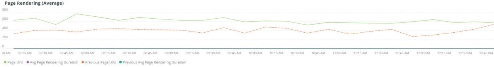
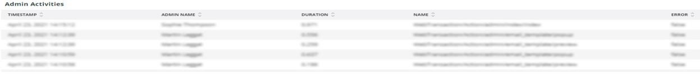

# この [!UICONTROL Summary] タブ

この [!UICONTROL Summary] タブ [!DNL Observation for Adobe Commerce] は、サイトで発生した問題の一部をすばやく確認して、サイトの問題の潜在的な根本原因を自動解決または特定するのに役立つようにすることを目的としています。 追加のタブでは、コンポーネントサービス、データベース、インフラストラクチャ、プロセスの状態に関する詳細な情報を提供します。

## [!UICONTROL Transaction Overview]

### [トランザクションとは](https://docs.newrelic.com/docs/apm/transactions/intro-transactions/transactions-new-relic-apm/#:%7E:text=transactions%20are%20reported.-,What%20is%20a%20transaction%3F,work%20in%20a%20software%20application.&amp;text=For%20APM%2C%20it%20will%20fortue,when%20the%20response%20is%20sent)

「 [!DNL New Relic]の場合、トランザクションは、ソフトウェアアプリケーションの作業の 1 つの論理単位として定義されます。 特に、この作業単位を構成する関数呼び出しとメソッド呼び出しを指します。 多くの場合、Web トランザクションを指します。これは、アプリケーションが Web リクエストを受信したときから応答が送信されたときまでに発生するアクティビティを表します。」

### トランザクションのタイプ：

**Web:** Web トランザクションは、HTTP リクエストで開始されます。 ほとんどの組織では、これらは顧客中心のインタラクションを表すので、監視する最も重要なトランザクションとなります。

**非 Web:** Web リクエストでは、Web 以外のトランザクションは開始されません。 これには、非 Web ワーカープロセス、バックグラウンドプロセス、スクリプト、メッセージキューアクティビティ、その他のタスクを含めることができます。

を見ると **[!UICONTROL Transaction Overview]** 上のフレームでは、平均 APDEX スコアが 0.76 の約 53,000 件のトランザクションが発生し、その 95%が 2.313 秒未満で発生していました。 これは、短い期間に APDEX ヒットが発生した場合に、より厳しい期間が現在の平均からの偏差を示す可能性があるフレームです。

## [!UICONTROL 404 page errors frame]

この **[!UICONTROL 404 page errors]** フレームリスト [URI](https://en.wikipedia.org/wiki/Uniform_Resource_Identifier) および選択した期間で発生した 404 ページのエラー数。

## [!UICONTROL % of Storage Free frame]

この **[!UICONTROL % of Storage Free]** frame は、クラスタのすべてのノードにわたるストレージマウントの平均空き率を表示します。 例えば、3 つのノードクラスタがある場合、フレームには\&lt;mount point=&quot;&quot;>, \&lt;environment name=&quot;&quot;>. 3 つのノード間で分散が生じる場合、このフレームはごまかしになる可能性があります。 平方偏差の例は、 `/data/mysql` 3 つのノードクラスタでは、マウントポイントフリーの値が異なりました。 下に枠がある [!UICONTROL MySQL] マウントポイントをノード名でファセット化し、より正確に `/data/mysql` 各ノード上のストレージは、実際には空きです。

## [!UICONTROL % of system memory that is free frame]

この **空きのシステムメモリの割合 (%)** frame は、各ノードで空きメモリの量をノードごとに表示します。

## [!UICONTROL Swap memory free in bytes]

この **[!UICONTROL Swap memory free in bytes]** frame は、ノード上で空き SWAP メモリの量をノードごとに表示します。

## [!UICONTROL CPU % by host]

すべての環境とノードの集計がに表示されます。 **[!UICONTROL CPU % by host]** フレーム 実稼動以外の環境の選択を解除する必要があります。 また、実稼動環境のすべてのノードが存在しない場合も注意してください。 CPU 使用率の高さに関するヒントについては、 [New Relic on Adobe Commerceを使用したパフォーマンスのトラブルシューティング](https://experienceleague.adobe.com/docs/commerce-knowledge-base/kb/troubleshooting/miscellaneous/troubleshoot-performance-using-new-relic-on-magento-commerce.html).

## [!UICONTROL Alerts during timeframe]

この **[!UICONTROL Alerts during timeframe]** を含むすべてのアラートを表示します。 [!UICONTROL Managed Alerts] Adobe Commerceサポートによって追加されました。

## [!UICONTROL CPU Usage]

この **[!UICONTROL CPU Usage]** フレームが空白の場合は、 [!DNL New Relic] が有効になっていません。 サイトがスターターにある場合、この情報は表示されません。 サイトが Pro 上にある場合は、 [サポートチケット](https://experienceleague.corp.adobe.com/docs/commerce-knowledge-base/kb/help-center-guide/magento-help-center-user-guide.html?lang=en) 持っている [!DNL New Relic Infrastructure] を有効にします。

## [!UICONTROL Average Response Time]

この **[!UICONTROL Average Response Time]** グラフは、トランザクション（Web など）の平均応答時間を示します。

## [!UICONTROL Long duration cron_schedule updates]

この **[!UICONTROL cron_schedule]** テーブルは cron ジョブの開始時と終了時に書き込まれます。 長時間の cron ジョブは、このテーブルの更新に待ち時間を示す場合があります。これは、cron スタックアップや、cron のスケジュール方法に関する問題を示す場合があります。

## [!UICONTROL Response Code]

この **[!UICONTROL Response Code]** frame は、web トラフィックとリクエストの応答コードを示す適切な指標です。 これは [!DNL New Relic's] 取引データを取り扱い、それは次のように切り取られます。 `httpResponseCode` と答えた。

## [!UICONTROL Web Traffic volume compared with one week ago Magento Managed Alerts Information]

このフレームには、過去 1 週間と現在の週の比較対象のウェブトラフィック量が表示されます。

## [!UICONTROL Deployment Log Entries]

この **[!UICONTROL Deployment Log Entries]** frame には、デプロイメントの数と、デプロイメントログ名によるカウントのファセットが表示されます。

## [!UICONTROL Deployment State]

この **[!UICONTROL Deployment State]** フレームファセット：デプロイログからの特定のデプロイメントフェーズ。 次に、ログおよびファセット名にカウントされるフェーズの例を示します。

**デプロイメントログのフェーズ：**

* &#39;%generate command%&#39;を&#39;start_gen&#39;として開始中&#39;
* &#39;%git apply /app/vendor/magento/ece-tools/patches%&#39;)&#39;apply_patches&#39;
* &#39;%Set フラグ：.static_content_deploy%) を&#39;SCD&#39;として
* &#39;%NOTICE:「gen_compl」として「コマンド完了%」を生成 )
* &#39;%NOTICE:デプロイメント完了%) を&#39;deploy_compl&#39;として
* &#39;%NOTICE:デプロイ後に開始します。%) を&#39;start_pdeploy&#39;として
* &#39;%NOTICE:デプロイ後の処理は完了%) を「デプロイ」として
* &#39;%deploy-complete%&#39;) を&#39;cl_deploy_compl&#39;として

## [!UICONTROL IP Frequency]

この **[!UICONTROL IP Frequency]** フレームは、各 IP に対するステータス（「MISS」および「PASS」）を [!DNL Fastly] ログ。 これらのステータスの Web リクエストはオリジンサーバーに到達し、サーバーに読み込みが追加されます。 頻度の上位 20 件のアドレスが表示されます。 このフレームは、Web サイト上の IP 攻撃や大量の負荷の発生元を検出するために使用できます。

## [!UICONTROL IP Response – top 20 URLs in duration]

この **[!UICONTROL IP Response – top 20 URLs in duration]** frame は、応答時間が最も長い URL を表示します。 応答時間が最も長い大きな画像ファイルやページ、API、またはページを示す場合があります。

## [!UICONTROL API Calls by IP]

この **[!UICONTROL API Calls by IP]** フレームは、API と IP アドレスに対する大量のトラフィックを識別し、API URL からリクエストを送信するのに役立ちます。

## [!UICONTROL API Calls by IP, details by URL]

この **[!UICONTROL API Calls by IP, details by URL]** フレームには、API に対する大量のトラフィックの詳細と、リクエストをおこなう URL の詳細が表示されます。

## [!UICONTROL IP Frequency Rate per minute]

他のフレームでどの IP アドレスが最もリクエストを持っているかを判断するのが困難な場合があります。 この **[!UICONTROL IP Frequency Rate per minute]** frame は、IP アドレスあたりの 1 分あたりのレートを示します。

## [!UICONTROL Potential Bots]

この **[!UICONTROL Potential Bots]** frame は、NULL または&#39;%bot%&#39;のような request_user_agent 名を持つリクエストを調べます。 通常、&#39;%bot%&#39; request_user_agent は、 `robots.txt` ファイル。

## [!UICONTROL Transaction Errors]

この **[!UICONTROL Transaction Errors]** frame は、次のトランザクションエラーの数を表示します： [!DNL New Relic].

## [!UICONTROL Nginx access by node]

この **[!UICONTROL Nginx access by node]** frame は、 `access.log` ノード別。 負荷が均等に分布しているかどうかを確認すると便利です。 多くの場合、ノードがドロップしたときに表示されます。 また、サイト全体の負荷も表示されます。

## [!UICONTROL Galera Log]

[[!DNL Galera]](https://galeracluster.com/library/galera-documentation.pdf) は、データベースクラスタに使用されます。 このフレームは、 [!UICONTROL Galera] クラスター。 このシグナルは、クラスターに入るノードとクラスターから出るノードに焦点を当てます。これは、データベースのデータの整合性を維持する通常の動作です。 ノードは、 [!UICONTROL Galera] クラスターの状態の変更。

**リスト [!UICONTROL Galera] 状態の変更：**

* &#39;%1047 WSREP は、&#39;node_not_prep_for_use&#39;として、アプリケーション使用用のノードをまだ準備していません%&#39;)
* &#39;%\[ERROR\] WSREP:次の読み取りに失敗しました：wsrep_sst_xtrabackup-v2%) を&#39;xtrabackup_read_fail&#39;として使用する
* &#39;%\[ERROR\] WSREP:次のエラーでプロセスが完了しました：wsrep_sst_xtrabackup-v2 %) を&#39;xtrabackup_compl_w_err&#39;として設定する
* &#39;%\[ERROR\] WSREP:rbr write fail%) を&#39;rbr_write_fail&#39;として
* &#39;%self-leave%&#39;) を&#39;susp_node&#39;として
* &#39;%members = 3/3 （結合/合計%&#39;） （&#39;3of3&#39;として）
* &#39;%members = 2/3 （結合/合計%&#39;） (&#39;2of3&#39;)
* &#39;%members = 2/2%&#39;) （&#39;2of2&#39;として） * &#39;%members = 1/2%&#39;) （&#39;1of2&#39;として） * &#39;%members = 1/3%&#39;) （&#39;1of3&#39;として）
* &#39;%members = 1/1%&#39;) を&#39;1of1&#39;として&#39;
* &#39;%\[ 注意\] /usr/sbin/mysqld (mysqld 10.%) を&#39;sql_restart&#39;として
* &#39;%Quorum:「no_node_count」として、完全な状態：%」を持つノードがありません
* &#39;%WSREP:&#39;mem_0&#39;としてのメンバ 0%&#39;)
* &#39;%WSREP:Member 1.0%) を&#39;mem_1&#39;として
* &#39;%WSREP:メンバ 2%) を&#39;mem2&#39;として
* &#39;%WSREP:グループと同期（接続の準備完了%）を「準備完了」として
* &#39;%/usr/sbin/mysqld, Version:%&#39;) を&#39;mysql_restart_mysql.slow&#39;として
* &#39;%\[ 注記\] WSREP:新しいクラスタービュー：「galera_cluster_view_chng」としてのグローバル状態：%&#39;)

状態が頻繁に変化する場合、これらのシグナルは、ストレージ、メモリ、またはクエリの問題を示す可能性があります。

## [!UICONTROL Database errors]

**検出されたデータベースエラーまたはメッセージのリスト：**

* &#39;%一時テーブルに割り当てられたメモリサイズが innodb_buffer_pool_size%&#39;の 20%を超えています ) （&#39;temp_tbl_buff_pool&#39;として）
* &#39;%\[ERROR\] WSREP:rbr write fail%) を&#39;rbr_write_fail&#39;として
* &#39;%mysqld:ディスク容量超過%) （&#39;disk_full&#39;として）
* &#39;%エラー番号 28%&#39;) (&#39;err_28&#39;)
* &#39;%rollback%&#39;は&#39;rollback&#39;として
* &#39;%外部キー制約がテーブル%&#39;に対して失敗しました ) (&#39;foreign_key_constraint&#39;)
* &#39;%Error_code:1114%&#39;) を&#39;sql_1114_full&#39;として
* &#39;%CRITICAL:SQLSTATE\[HY000\] \[2006\] MySQL サーバは&#39;sql_gone&#39;として使用されなくなりました%&#39;)
* &#39;%SQLSTATE\[HY000\] \[1040\] 接続数が多すぎます%&#39;) (&#39;sql_1040&#39;)
* &#39;%CRITICAL:SQLSTATE\[HY000\] \[2002\]%&#39;) を&#39;sql_2002&#39;として
* &#39;%SQLSTATE\[08S01\]:%&#39;) (&#39;sql_1047&#39;)
* &#39;%\[ 警告\] 接続%&#39;を中止しました ) （&#39;aborted_conn&#39;として）
* &#39;%SQLSTATE\[23000\]:整合性制約違反： %&#39;) (&#39;sql_23000&#39;として )
* &#39;%1205 ロック待機タイムアウト%&#39;) (&#39;sql_1205&#39;)
* &#39;%SQLSTATE\[HY000\] \[1049\] 不明なデータベース%&#39;) (&#39;sql_1049&#39;)
* &#39;%SQLSTATE\[42S02\]:「sql_42S02」としてのベーステーブルまたはビューが見つかりません：%」)
* &#39;%一般エラー：1114%&#39;) を&#39;sql_1114&#39;として
* &#39;%SQLSTATE\[40001\]%&#39;) （&#39;sql_1213&#39;として）
* &#39;%SQLSTATE\[42S22\]:列が見つかりません：1054 不明な列%) （&#39;sq1_1054&#39;として）
* &#39;%SQLSTATE\[42000\]:構文エラーまたはアクセス違反： %&#39;) が&#39;sql_42000&#39;として
* &#39;%SQLSTATE\[21000\]:基数違反： %&#39;) （&#39;sql_1241&#39;として）
* &#39;%SQLSTATE\[22003\]:%&#39;) を&#39;sql_22003&#39;として
* &#39;%SQLSTATE\[HY000\] \[9000\] IP アドレス%のクライアント ) を&#39;sql_9000&#39;として
* &#39;%SQLSTATE\[HY000\]:一般エラー：2014%&#39;) を&#39;sql_2014&#39;として
* &#39;%1927 接続が強制終了されました%&#39;) （&#39;sql_1927&#39;として）
* &#39;%1062 \[\ERROR\] InnoDB:%&#39;) (&#39;sql_1062_e&#39;)
* &#39;%\[ 注記\] WSREP:メモリマップをディスクにフラッシュしています…%&#39;) を&#39;mem_map_flush&#39;として
* &#39;%Internal MariaDB エラーコード：1146%) を&#39;sql_1146&#39;として
* &#39;%Internal MariaDB エラーコード：1062%) を&#39;sql_1062&#39;として* &#39;%1062 \[ 警告\] InnoDB:%&#39;) を&#39;sql_1062_w&#39;として
* &#39;%Internal MariaDB エラーコード：1064%) を&#39;sql_1064&#39;として
* &#39;%InnoDB:&#39;assertion_err&#39;としてのアサーションエラー (file%&#39;)
* &#39;%mysqld_safe 現在実行中のプロセスの数：0%) を&#39;mysql_oom&#39;として
* &#39;%\[ERROR\] mysqld は&#39;mysql_sigterm&#39;としてシグナル%&#39;を取得しました
* &#39;%1452%&#39;を&#39;sql_1452&#39;として追加できません
* &#39;%ERROR 1698%&#39;) （&#39;sql_1698&#39;として）
* &#39;%SQLSTATE\[HY000\]:一般エラー：3%) を&#39;cnt_wrt_tmp&#39;として
* &#39;%一般エラー：1 %) を&#39;sql_syntax&#39;として
* &#39;%42S22%&#39;) （&#39;sql_42S22&#39;として）
* &#39;%InnoDB:エラー（重複キー）%&#39;) が&#39;innodb_dup_key&#39;として発生しました

## [!UICONTROL Database traces]

この **[!UICONTROL Database traces]** フレームは、 [sql trace](https://docs.newrelic.com/docs/apm/transactions/transaction-traces/transaction-traces-database-queries-page/) エンティティ [!DNL New Relic] トレースのパスを返します。

## [!UICONTROL Database mysql-slow.log]

この **[!UICONTROL Database mysql-slow.log]** frame は、 [mysql-slow.log](https://dev.mysql.com/doc/refman/5.7/en/slow-query-log.html) クエリリクエストタイプ別。 mysql-slow.log（遅いクエリログ）に関心のある可能性のあるタイムフレームを視覚的に分離します。 大きなテーブルを更新するインデックスやクエリを持たないテーブルのクエリは、他のクエリをブロックする可能性があります。

## [!UICONTROL Redis synchronization from Log]

[[!DNL Redis]](https://redis.io/docs/about/) は、データベース、キャッシュ、およびメッセージブローカとして使用されるオープンソース（BSD ライセンス）のメモリ内データ構造ストアです。 設定に応じて、データベースおよびセッションのキャッシュを実行できます。 この **[!UICONTROL Redis synchronization from Log]** 枠が～に焦点を合わせる [[!DNL Redis] 同期](https://redis.io/docs/manual/replication/). が [!DNL Redis] データセットに含まれる場合は、同期に問題が発生する可能性が高くなります（同期を維持するデータが多くなります）。

**[!DNL Redis]エラーとメッセージ：**

* &#39;%SLAVE 同期：デバイス%&#39;にスペースが残っていません ) （スペース）
* &#39;%Server started, Redis version%&#39;) as &#39;serv_start&#39;
* &#39;%サーバーは接続を受け入れる準備ができました%&#39;) (&#39;準備完了&#39;
* &#39;%マスターとの接続が失われました。%) を&#39;mstr_lost&#39;として
* &#39;%+sdown sentinel%&#39;)&#39;+sentinal&#39;
* &#39;%-sdown sentinel%&#39;) を&#39;-sentinal&#39;として
* &#39;%sdown slave%&#39;) (&#39;-slave&#39;、&#39;%+sdown slave%&#39;) (&#39;+slave&#39;)
* &#39;%-failover-abort-not-selected master mymaster%&#39;) を&#39;-failover&#39;として
* &#39;%+failover-abort-not-selected master mymaster%&#39;) を&#39;+failover&#39;として
* &#39;%部分的な再同期はできません（キャッシュされたマスターなし）%&#39;) (part_sync_err&#39;)
* &#39;%マスターは次のエラーによりレプリケーションを中止しました：ERR Can%&#39;) as &#39;mstr_sync_err&#39;
* &#39;%マスターは PSYNC をサポートしていないか、エラー状態%&#39;) （&#39;mstr_psync_err&#39;として）
* &#39;%SLAVE 同期：success%&#39;で終了 ) を&#39;slv_sync_suc&#39;として
* &#39;%マスターは次のエラーによりレプリケーションを中止しました：ERR Can%&#39;) as &#39;mstr_sync_err,coun&#39;
* &#39;%OOM コマンドは、メモリ%&#39;を&#39; max_mem_err&#39;として使用する場合は許可されません。
* &#39;%CredisException( コード：0):接続%&#39;での読み取りエラー ) を&#39;credis_read_error&#39;として
* &#39;%Uncaught RedisException:%&#39;) を&#39;redis_excp_err&#39;として
* &#39;%psync は出力バッファの克服のために ASAP を閉じるようにスケジュールされました%&#39;) を&#39;output_buf_err&#39;として

## [!UICONTROL PHP process states]

PHP プロセスの動作は、 [設定](https://www.php.net/manual/en/install.fpm.configuration.php). 設定は複雑で、多くの変数とオプションがあります。 この **[!UICONTROL PHP process states]** frame を使用すると、PHP プロセスが終了して再起動されるタイミングを把握できます。

### [!UICONTROL PHP errors]

この **[!UICONTROL PHP errors]** frame は、選択した期間内のワーカーに対する PHP エラーの数を示します。 詳しくは、 [Adobe Commerce PHP 設定](../../installation/prerequisites/php-settings.md).

**PHP のエラーとメッセージ：**

* &#39;%worker_connections not not sourt %&#39;) as &#39;worker&#39;
* &#39;%PHP 致命的なエラー：許可されているメモリサイズです。%&#39;) を&#39;mem_size&#39;として
* &#39;%exit on signal 11 (SIGSEGV)%&#39;) as &#39;sig_11&#39;
* &#39;%exit on signal 7 (SIGBUS)%&#39;) as &#39;sig_7&#39;
* &#39;%increase pm.start_servers%&#39;) を&#39;pmstart_serv&#39;として
* &#39;%max_children%&#39;) を&#39;max_children_cnt&#39;として
* &#39;%PHP 致命的なエラー：許可されるメモリサイズ (%) は&#39;mem_exhst_coun&#39;として
* &#39;%pool%&#39;のメモリを割り当てられません ) (opc_mem_count&#39;)
* &#39;%Warning Interned String buffer overflow%&#39;) を&#39;opc_str_buf&#39;として
* &#39;%不正な文字列オフセット%&#39;) （&#39;opc_sv_comments&#39;として）
* &#39;%PHP 致命的なエラー：RedisException がキャッチされていません：&#39;php_exc&#39;としての読み取りエラー%)

## [!UICONTROL PHP processes]

[PHP-FPM](https://php-fpm.org/) は [!UICONTROL FastCGI Process Manager] 使用者 [!DNL Nginx]. 必要システム構成については、 [Adobe Commerceバージョンにマッピングされた PHP バージョンの要件](../../installation/system-requirements.md). この **[!UICONTROL PHP processes]** frame は、選択したタイムラインの特定の時点で実行されている PHP プロセスの数を示します。

## [!UICONTROL Secondary processes]

セカンダリのプロセスは、サイトの応答に影響を与える可能性があります。 この **[!UICONTROL Secondary processes]** frame は、サイトに負荷を追加する可能性のあるプロセスを示します。 データベースは主に、最も多くのセカンダリ・プロセスを実行しています。

## [!UICONTROL Traffic vs Week Ago]

この **[!UICONTROL Traffic vs Week Ago]** frame は、 [!DNL Fastly] (「MISS」、「PASS」) キャッシュステータスのログ。 これらのリクエストは、接触チャネルサーバーに負荷を追加します。 このフレームは、現在の週と過去 1 週間の同じ期間の比較 Web リクエスト量を表示します。

## [!UICONTROL Fastly Cache]

この **[!UICONTROL Fastly Cache]** frame は、 [!DNL Fastly] ログ。 「エラー」を選択した場合は、リクエスト内のエラーの割合が表示されます。 これは、通常、オリジンサーバーがページリクエストに対して十分な速さで応答しない場合に増加します。

## [!UICONTROL Page Rendering]

この **[!UICONTROL Page Rendering]** frame は、 [!DNL New Relic] を同じ期間の前の週と比較します。

## [!UICONTROL Page loading detail]

この **[!UICONTROL Page loading detail]** frame は、ページの読み込みイベントを示します。 これらのファセットの意味を詳しく述べた。 次に、このフレームに対して実行されるクエリを示します。

`SELECT percentile(timeToResponseStart, 50) AS 'first byte', percentile(firstPaint, 50) as 'First paint', percentile(firstContentfulPaint, 50) as 'First contentful paint', percentile(timeToDomContentLoadedEventEnd, 50) AS 'DOM content loaded', percentile(duration, 50) AS 'Window load + AJAX' FROM BrowserInteraction TIMESERIES`

## [!UICONTROL Transactions – Avg, Max, Min]

トランザクションの期間は秒単位です。 トランザクションが長時間実行されている場合、トランザクションによっては他のトランザクションに影響を与える可能性があります。 名前と期間の下に一覧表示されるトランザクションは、特定の期間のものです。 簡潔な問題の期間がある場合は、 [!DNL Observation for Adobe Commerce] その狭い期間に対する日付/時間セレクター。

## [!UICONTROL Admin Activities]

この **[!UICONTROL Admin Activities]** frame は、管理者ユーザーとのトランザクションを識別します。

## [!UICONTROL Order transactions (default?)]

この **[!UICONTROL Order transactions (default?)]** フレームがトランザクションを検索 `request.headers.host` 取引から。name = `WebTransaction/Action/checkout/onepage/success`. 注文の成功 URL が異なる場合、このフレームにはデータが含まれません。

## [!UICONTROL Elasticsearch Index information]

**[Elasticsearchステータス：](https://www.elastic.co/guide/en/elasticsearch/reference/current/cluster-health.html)**

* 緑：すべてのシャードが割り当てられます。
* 黄：すべてのプライマリシャードが割り当てられていますが、1 つ以上のレプリカシャードが割り当てられていません。 クラスタ内のノードに障害が発生した場合、そのノードが修復されるまで、一部のデータが使用できない可能性があります。
* 赤：1 つ以上のプライマリシャードが割り当てられていないので、一部のデータは使用できません。 これは、主シャードが割り当てられるので、クラスターの起動中に短時間発生する可能性があります。

## [!UICONTROL Elasticsearch Errors]

**[!DNL Elasticsearch]エラー：**

* &#39;%all shards_failed&#39;は&#39;all_shards_failed&#39;です
* &#39;%NoNodesAvailableException%&#39;を&#39;no_alive_nodes&#39;として
* &#39;%PHP 致命的なエラー：キャッチできないエラー：Elasticsearch%&#39;のパラメータが&#39;wrong_param&#39;として正しくありません
* &#39;%この問題は、MagentoクラウドインフラストラクチャのElasticsearchサービスを version%&#39;にアップグレードして、&#39;ver_err&#39;として修正できます
* &#39;%cluster ヘルスステータスが\[YELLOW\] から\[RED\] に変更されました ( 理由： %&#39;が&#39;yel_red&#39;として&#39;
* &#39;%デバイス%&#39;に空き領域が残っていません。&#39;no_space&#39;
* &#39;% [SearchRequest{searchType=%&#39;を&#39;failed_query&#39;として実行できませんでした

## [!UICONTROL Cron view]

この **[!UICONTROL Cron view]** frame は cron ログを調べ、開始した cron の数と終了した cron の数のバランスを調べます。

## [!UICONTROL Cron error]

**cron.log からの Cron エラー：**

* &#39;%_stg%&#39;を&#39;stg_crons&#39;として&#39;%_stg%&#39;
* &#39;%cron ジョブ%&#39;のロックを&#39;cron_lock&#39;として取得できませんでした
* &#39;%一般エラー：2006 MySQL サーバは&#39;mysql_has_gone_away&#39;として使用されなくなりました%&#39;
* &#39;%error%&#39;は&#39;error&#39;です
* &#39;%一般エラー：1205 sql_1205_cron のため、ロック待機のタイムアウトが%&#39;を超えました

## [!UICONTROL cron_schedule table updates]

この **[!UICONTROL cron_schedule table updates]** frame は、データストア操作の更新に cron_schedule テーブルが含まれる最大期間を秒単位で調べます。 SQL リクエストタイプではファセット化されています。

## [!UICONTROL Datastore Operations Tables]

この **[!UICONTROL Datastore Operations Tables]** frame は、期間、テーブル名および SQL リクエストタイプ別の上位 25 件の操作を表示します。 スパイクの上にマウスポインターを置くと、アクセスされたテーブルとリクエストのタイプの詳細が表示されます。

## [!UICONTROL Cache Flush]

**キャッシュフラッシュが検出されました：**

* &#39;%config%&#39;は&#39;config_cache_flushed&#39;として&#39;
* &#39;%layout%&#39; (&#39;layout_cache_flush&#39;)
* &#39;%block_html_cache_flush&#39;として&#39;%block_html%&#39;
* &#39;%collections%&#39;を&#39;collections_cache_flush&#39;として&#39;%collections%&#39;
* &#39;%reflection%&#39;は&#39;reflection_cache_flush&#39;として&#39;%reflection%&#39;
* &#39;%db_ddl_cache_flush&#39;として&#39;%db_ddl%&#39;を設定
* &#39;%compiled_config%&#39; (&#39;compiled_config_cache_flush&#39;)
* &#39;%eav%&#39;を&#39;eav_cache_flush&#39;として
* &#39;%customer_notification%&#39; （&#39;cust_notif_cache_flush&#39;として）
* &#39;%config_integration%&#39;を&#39;config_integ_cache_flush&#39;として&#39;%config_integration%&#39;
* &#39;%config_integration_api%&#39;を&#39;config_integ_api_cache_flush&#39;として&#39;%config_integration_api%&#39;
* &#39;%full_page%&#39;を&#39;full_page_cache_flush&#39;として
* &#39;%config_webserv_cache_flush&#39;として&#39;%config_webservice%&#39;
* &#39;%translate%&#39;は&#39;translate_cache_flush&#39;として&#39;%translate%&#39;&#39;
