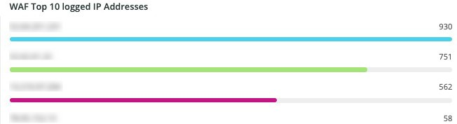

# この [!DNL WAF] タブ

この **[!DNL WAF]** タブには、によって渡されブロックされたトラフィックが表示されます [!DNL firewall].

## [!DNL WAF traffic summary]

この **[!DNL WAF traffic summary]** フレームには、によって渡されたトラフィック、ログに記録されたトラフィック、ブロックされたトラフィック、失敗されたトラフィックの数が表示されます。 [!DNL firewall].

## [!DNL WAF Top 10 blocked IP Addresses]

この **[!DNL WAF Top 10 blocked IP Addresses]** フレームは、によってブロックされた IP アドレスの上位 10 位を表示します [!DNL firewall].

## [!DNL WAF Top 10 countries for blocked requests]

この **[!DNL WAF Top 10 countries for blocked requests]** フレームは、によってブロックされたリクエストの上位 10 に含まれる国に対するブロックされたリクエストの数を表示します [!DNL firewall].

## [!DNL WAF Top 10 logged IP Addresses]

この **[!DNL WAF Top 10 logged IP Addresses]** フレームは、によって記録された上位 10 個の IP アドレスの IP アドレスを示します。 [!DNL firewall].

## [!DNL Top 10 WAF Rules Executed and Logged by IP address]

この **[!DNL Top 10 WAF Rules Executed and Logged by IP address]** フレームは、最も頻繁に一致する上位 10 位の IP アドレスを示します [!DNL firewall] ルール。

## [!DNL WAF Logged Details]

この **[!DNL WAF Logged Details]** フレームには、によって記録されたリクエストが表示されます [!DNL firewall]詳しくは、タイムスタンプ、市区町村、地域、データセンターなどを含みます。

## [!DNL WAF Blocked Details]

この **[!DNL WAF Blocked Details]** フレームには、によってブロックされたリクエストが表示されます [!DNL firewall]詳しくは、タイムスタンプ、市区町村、地域、データセンターなどを含みます。
