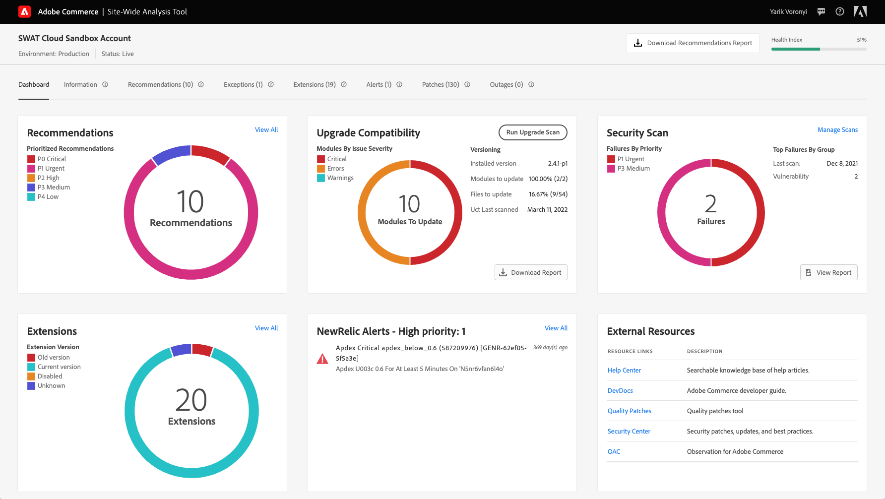
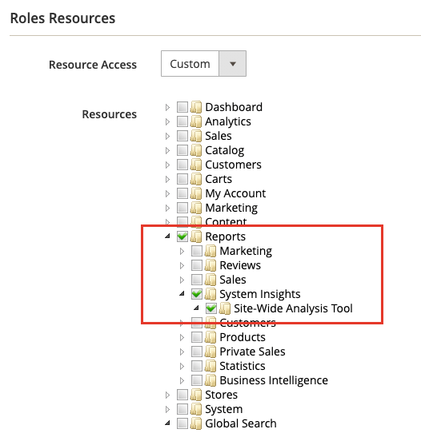
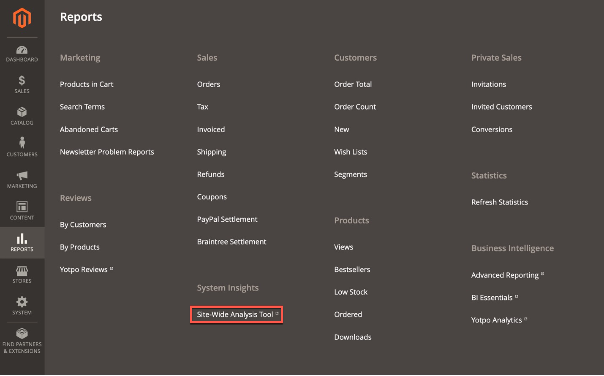
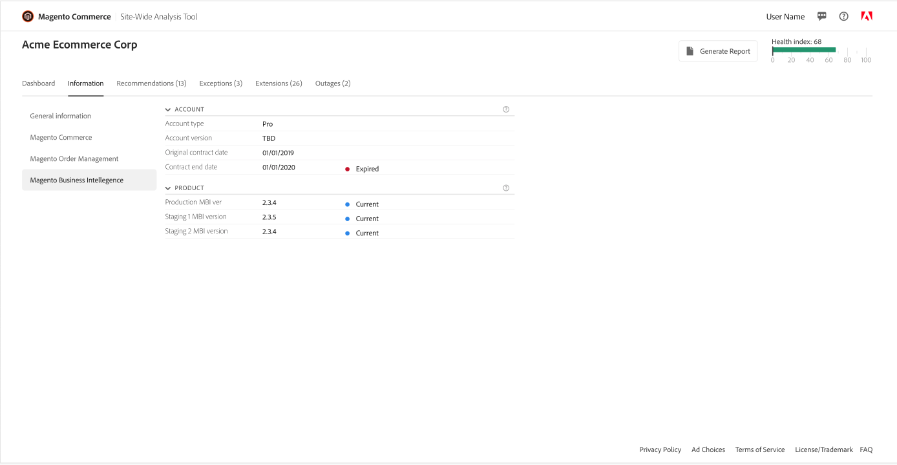
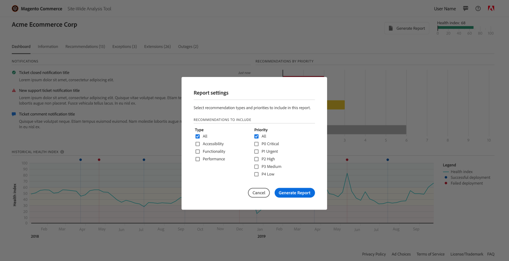

# [!DNL Site-Wide Analysis Tool]へのアクセス方法

ストアの[!UICONTROL Admin Panel]から[!DNL Site-Wide Analysis Tool] ダッシュボードにアクセスできます。

[!DNL Site-Wide Analysis Tool] サービスは、ユーザー[役割リソース ](https://experienceleague.adobe.com/en/docs/commerce-admin/systems/user-accounts/permissions-user-roles)へのアクセス権限を持つ[!UICONTROL Admin] ユーザーの[実稼動モード ](https://experienceleague.adobe.com/en/docs/commerce-admin/systems/tools/developer-tools#operation-modes)で利用できます。

>[!NOTE]
>
>2024年4月23日（PT）をもって、[!DNL Site-Wide Analysis Tool]は廃止され、Adobe Commerce オンプレミスのお客様は使用できなくなります。

*[!DNL Site-Wide Analysis Tool]ダッシュボード*

>[!NOTE]
>
>Site-Wide Analysis Tool （SWAT）にアクセスするには、Adobe Commerce Adminで必要な権限を持っている必要があります。 ブックマークされたリンクを含むSWAT URLへの直接アクセスはサポートされていません。

## ストアの[!UICONTROL Admin Panel]から[!DNL Site-Wide Analysis Tool Dashboard]にログインします

### 手順1：権限の確認

[!UICONTROL Admin] ユーザーアカウントに、[割り当てられたユーザーの役割](https://experienceleague.adobe.com/en/docs/commerce-admin/systems/user-accounts/permissions-user-roles)を通じて[!DNL Site-Wide Analysis Tool]にアクセスする権限があることを確認します。

>[!IMPORTANT]
>
>[!DNL Site-Wide Analysis Tool]の役割リソース （権限）が&#x200B;**not**&#x200B;に自動割り当てされています。 [!UICONTROL Admin]の各ユーザーアカウントに個別に割り当てられたユーザーの役割と役割に対して、このツールをアクティブ化する必要があります。

[!DNL Site-Wide Analysis Tool] アクセスを必要とするカスタム役割の場合は、次の操作を行います。

1. **[!UICONTROL Reports]** > *[!UICONTROL System Insights]* > **[!UICONTROL Site-Wide Analysis Tool]**&#x200B;の役割リソースを選択します。

   
   役割&#x200B;*に*[!DNL Site-Wide Analysis Tool]&#x200B;権限が選択されました

1. **[!UICONTROL Save Role]**&#x200B;をクリックします。

1. その役割が割り当てられているユーザーに[!DNL Admin]からログアウトするように通知し、再度ログインします。

>[!NOTE]
>
>[!UICONTROL Admin]からツールにアクセスしようとすると、ユーザーアカウントに[!DNL Site-Wide Analysis Tool]へのアクセス権があることを確認し、ユーザーに403 エラーが表示された場合、Adobe Commerce on cloud infrastructureのインスタンスでHTTP アクセス制御が有効になっている可能性があります。 HTTP認証が有効になっている場合、[!DNL Site-Wide Analysis Tool] ダッシュボードはサポートされていません。 この問題の解決について詳しくは、[ サポート記事](https://experienceleague.adobe.com/en/docs/commerce-knowledge-base/kb/troubleshooting/miscellaneous/403-errors-when-accessing-site-wide-analysis-tool-on-magento)を参照してください。

### 手順2: [!DNL Site-Wide Analysis Tool]へのアクセス

1. *[!UICONTROL Admin]* サイドバーで、**[!UICONTROL Reports]** > *[!UICONTROL System Insights]* > **[!UICONTROL Site-Wide Analysis Tool]**&#x200B;に移動します。

   
   Adobe Commerce *の[!UICONTROL Admin Panel]にある*[!DNL Site-Wide Analysis Tool]&#x200B;の場所

1. [!DNL Site-Wide Analysis Tool]の&#x200B;*利用条件*&#x200B;をお読みになり、**[!UICONTROL Accept]**&#x200B;をクリックして続行してください。

   各ユーザーは、セッションの利用条件に同意する必要があります。 この手順は、ログインセッションごとに繰り返されます。

1. ダッシュボードの上部で、表示するタブをクリックします。

   
   *[!DNL Site-Wide Analysis Tool]情報*

## [!DNL Site-Wide Analysis Tool Dashboard]からレポートを生成

1. ダッシュボードの右上隅にある「**[!UICONTROL Generate Report]**」をクリックします。

1. レポートに含める各&#x200B;**[!UICONTROL Type]**&#x200B;および&#x200B;**[!UICONTROL Priority]**&#x200B;設定のチェックボックスを選択します。

1. **[!UICONTROL Generate Report]**&#x200B;をクリックします。

   
   *レポート設定*

| タブ | DESCRIPTION |
| --- | --- |
| ダッシュボード | 現在の通知とレコメンデーションの状態を優先度ごとに表示します。 |
| Information | お客様の連絡先情報と現在のチケットの概要、およびインストールされている各Adobe Commerce製品に関する詳細情報を提供します。 |
| 推奨事項 | サイトで検出された問題に対処するためのベストプラクティスにもとづいて、推奨事項のリストを作成します。 |
| 例外 | エラーハンドラーを使用せずに、異常状態によって発生したアプリケーションによってスローされるエラーを一覧表示します。 |
| 拡張機能 | サードパーティの拡張機能とサードパーティライブラリのリストを表示します。 |

>[!NOTE]
>
>レコメンデーションを適用した後、[!DNL Site-Wide Analysis Tool Dashboard]または生成されたレポートでレコメンデーションを更新するには、数日かかる場合があります。
