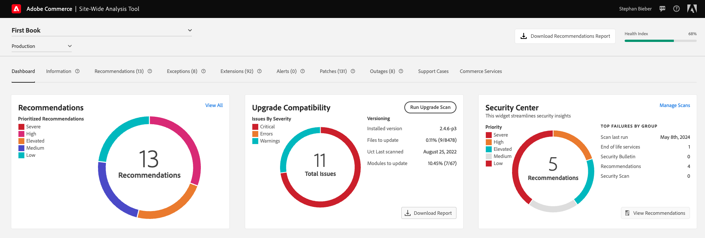

# [!DNL Site-Wide Analysis Tool]

>[!IMPORTANT]
>
>2024年4月23日（PT）をもって、Adobe Commerce オンプレミスのお客様の[!DNL Site-Wide Analysis Tool]は廃止されます。

このガイドでは、[!DNL Site-Wide Analysis Tool]の全体像を説明します。 使用法、インストールの手順、ツールへのアクセス方法について説明します。

## [!DNL Site-Wide Analysis Tool]とは

[!DNL Site-Wide Analysis Tool]は、Adobe Commerce インストールのセキュリティと操作性を確保するための詳細なシステムインサイトと推奨事項を含む、プロアクティブなセルフサービスツールおよび中央リポジトリです。 24時間365日、リアルタイムのパフォーマンスモニタリング、レポート、アドバイスを提供し、潜在的な問題を特定して、サイトの健全性、安全性、アプリケーション設定をより詳細に可視化できます。 問題解決時間を短縮し、サイトの安定性とパフォーマンスを向上させることができます。

>[!NOTE]
>
>レコメンデーションを適用した後、サイト全体の分析ツールダッシュボードまたは生成されたレポートでレコメンデーションを更新するには、数日かかる場合があります。
>
>[!DNL Site-Wide Analysis Tool]はシステム レベルのデータに関するレポートです。 Adobe Commerce製品、セールス、マーケティング、その他のコマースアプリケーションのデータに関するレポートについては、[Adobe Commerce レポート &#x200B;](https://experienceleague.adobe.com/ja/docs/commerce-admin/start/reporting/reports-menu)を参照してください。

{width="700" zoomable="yes"}

詳しくは、[概要ビデオ &#x200B;](https://www.youtube.com/watch?v=KW2R8ki_RG4)を参照してください。

## ツールの概要

- **ダッシュボード**
   - 検出された問題の通知と、優先度ごとの特定の推奨事項により、システムの全体的な健全性を示します。 
また、web サイトの健全性が時間とともにどのように変化するかを追跡するための過去のチャートも含まれます。
   - 次のリソースへのリンクを提供する&#x200B;**[!UICONTROL Security Center Widget]**&#x200B;を表示します。
      - [技術 [!DNL Stack]  バージョンの [!DNL end of life (EOL)]への準拠](https://experienceleague.adobe.com/ja/docs/commerce-operations/installation-guide/system-requirements)
      - [Adobe セキュリティ情報](https://helpx.adobe.com/jp/security/security-bulletin.html)
      - [&#x200B; [!DNL Security Scan Tool]からのおすすめ](https://experienceleague.adobe.com/ja/docs/commerce-admin/systems/security/security-scan)
      - [[!DNL Site-Wide Analysis Tool]のベストプラクティス セキュリティの推奨事項](https://experienceleague.adobe.com/ja/docs/commerce-operations/tools/site-wide-analysis-tool/recommendations)

- **情報** – お客様の連絡先情報と現在のチケットの概要を提供し、各インストール済みAdobe Commerce製品に関する詳細情報を記載します。

- **Recommendations** - サイトの健全性を追跡するための[SWAT Health Index Score](swat-health-index.md)を提供し、サイトで検出された問題に対処するためのベストプラクティスに基づいて推奨事項を一覧表示します。
   - インフラストラクチャの更新が必要な変更については、サポートリクエストを送信してください。
   - アプリケーションの更新が必要な変更については、自分で変更を行います。
   - [&#x200B; コードのデプロイメント &#x200B;](https://experienceleague.adobe.com/ja/docs/commerce-cloud-service/user-guide/architecture/pro-develop-deploy-workflow#deployment-workflow)などの手動による操作が必要な変更については、システム管理者または開発者にサポートを依頼してください。

- **例外** - エラーハンドラーを使用せずに、異常な状態によって引き起こされたアプリケーションによってスローされるエラーを一覧表示します。

- **拡張機能** – すべてのサードパーティの拡張機能とサードパーティのライブラリを一覧表示します。

- **パッチ** - [!DNL Quality Patches Tool]と統合され、Adobe Commerce インスタンスに固有の利用可能なすべてのパッチのリストが表示されます。

## 他のAdobe Commerce サポートツールとの統合

web サイトに関する重要なインサイトを一元的に確認。 [!DNL Site-Wide Analysis Tool]を使用すると、[!UICONTROL Security Center Widget]、[!DNL Upgrade Compatibility Tool]、[!DNL Managed Alerts]から直接アクセスおよび情報を取得できます。

- **[!UICONTROL Security Center Widget]** - サイトのセキュリティ インサイトを表示します。 
セキュリティ情報には、[技術 [!DNL Stack]  バージョンのコンプライアンスに関する [!DNL end of life (EOL)]](https://experienceleague.adobe.com/ja/docs/commerce-operations/installation-guide/system-requirements), [Adobe Security Bulletin](https://helpx.adobe.com/jp/security/security-bulletin.html), [Recommendations from the [!DNL Security Scan Tool]](https://experienceleague.adobe.com/ja/docs/commerce-admin/systems/security/security-scan), and [[!DNL Site-Wide Analysis Tool]  ベストプラクティス セキュリティの推奨事項](https://experienceleague.adobe.com/ja/docs/commerce-operations/tools/site-wide-analysis-tool/recommendations)が含まれています。

  [[!DNL Security Scan Tool]](https://experienceleague.adobe.com/ja/docs/commerce-admin/systems/security/security-scan)は、Adobe CommerceおよびMagento Open-Sourceのお客様に、マルウェアを積極的に検出し、ストアが侵害された場合に警告することにより、ストアのセキュリティ対策に関するリアルタイムのインサイトを提供します。

- **[[!DNL Upgrade Compatibility Tool]](../../upgrade/upgrade-compatibility-tool/overview.md)** - Adobe Commerce インスタンスをアップグレード バージョンと照合し、アップグレード前に修正する重要な問題、エラー、警告をフラグ付けします。 これらの問題に対処することで、アップグレードプロセスが合理化されます。」

- **[[!DNL Managed Alerts]](https://experienceleague.adobe.com/ja/docs/commerce-operations/tools/managed-alerts-for-adobe-commerce/managed-alerts-for-magento-commerce)** – 主要な指標（CPU、アプリケーションパフォーマンス、ディスク、メモリ、データベースの正常性）を監視し、明確なトラブルシューティング手順を提供して、マーチャントが問題に先手を打ち、ダウンタイムを回避できるようにします。

## このガイドは誰のためのものでしょうか？

Adobe Commerceのweb サイトをより詳細に可視化したいマーチャントやパートナー。 これにより、顧客体験を向上させ、ベストプラクティスの推奨事項や基本的な問題について、より緊密に連携できるようになります。

## [!DNL Site-Wide Analysis Tool] デモ

[!DNL Site-Wide Analysis Tool]について詳しくは、このビデオをご覧ください。

>[!VIDEO](https://video.tv.adobe.com/v/344001?quality=12)
