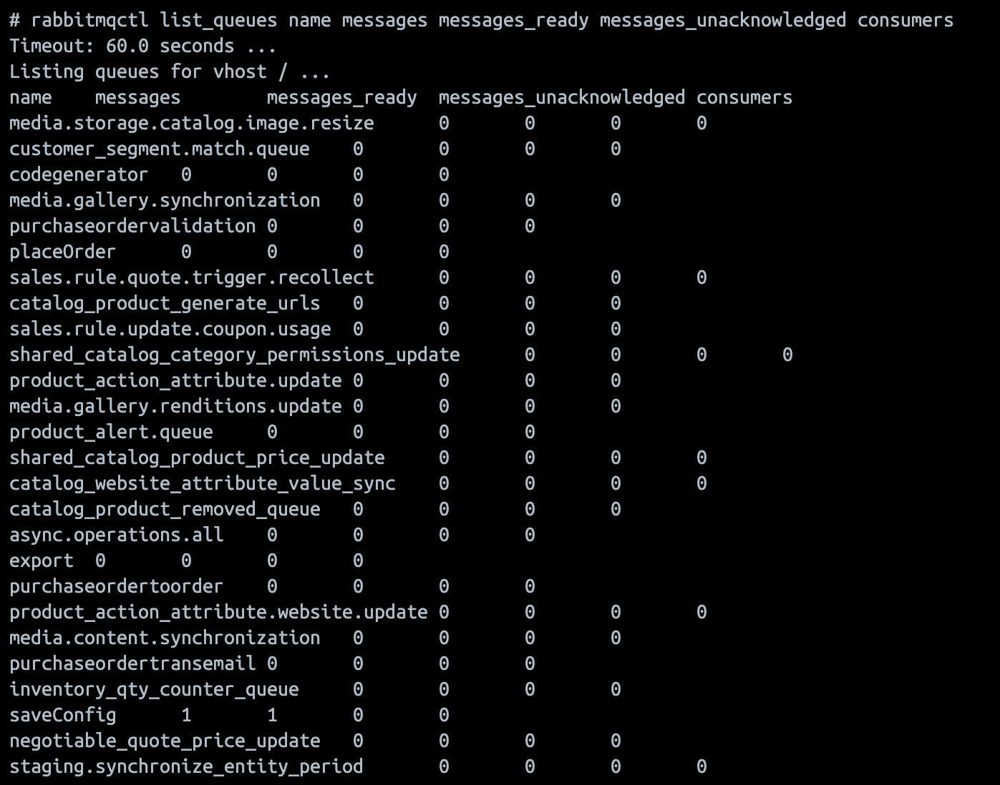

# ActiveMQへの移行

ActiveMQ （Apache ActiveMQ Artemis）は、Adobe Commerceのメッセージキューを処理するRabbitMQの代わりに使用できる、高性能なマルチプロトコルのメッセージブローカーです。

2.4.8-p3、2.4.7-p8、2.4.6-p13および2.4.5-p16の時点で、Adobe CommerceはメッセージキューブローカーとしてActiveMQをサポートしています。 これにより、オンプレミスのインストールで、インフラストラクチャの要件と専門知識に基づいてRabbitMQとActiveMQのどちらかを選択できる柔軟性が向上します。

## 始める前に

移行を開始する前に、次の点を確認してください。

1. `app/etc/env.php`で現在のRabbitMQ設定を確認してください。
1. データベースとコードベースの完全なバックアップを作成します。
1. インストールがActiveMQの必要システム構成を満たしていることを確認します。
1. 移行を完了するためのメンテナンスウィンドウを計画します。

## 移行パス

ActiveMQへの移行は簡単なプロセスですが、ブローカーを切り替える前に、すべての保留中のメッセージが処理されていることを確認することが重要です。

これらの移行手順では、Adobe Commerceがメッセージキューブローカーを使用する唯一のアプリケーションであることを前提としています。

### 手順1：メンテナンスモードでのサイトの配置

1. サイトを[ メンテナンスモード ](../../installation/tutorials/maintenance-mode.md)に配置します。

   ```shell
   bin/magento maintenance:enable
   ```

1. メンテナンスモードが有効になっていることを確認します。

   ```shell
   bin/magento maintenance:status
   ```

### 手順2:RabbitMQ メッセージ数を確認する

続行する前に、RabbitMQのすべてのメッセージが処理されていることを確認してください。 次のいずれかの方法を使用します。

#### 方法A:RabbitMQ管理ダッシュボードの使用

1. `http://<host>:15672`からRabbitMQ管理UIにアクセス
1. 既定の資格情報：`guest/guest`
1. 「**キュー**」タブに移動します
1. すべてのキューに&#x200B;**0件のメッセージが表示されていることを確認します**

   

#### 方法B: rabbitmqctl コマンドラインを使用する

1. すべてのキューとそのメッセージ数を確認します。

   ```shell
   rabbitmqctl list_queues name messages consumers
   ```

   

1. キュー情報の詳細を確認：

   ```shell
   rabbitmqctl list_queues name messages messages_ready messages_unacknowledged consumers
   ```

   

### 手順3：保留中のメッセージの処理

メッセージがキューで保留中の場合は、続行する前に処理してください。

1. 利用可能な消費者のリストを取得します。

   ```shell
   bin/magento queue:consumers:list
   ```

1. 消費者をグループとして、または個々のメッセージキューごとに処理します。

   - **消費者をグループとして処理**

     ```shell
     bin/magento cron:run --group=consumers
     ```

     >[!NOTE]
     >
     >cronが既にシステムで実行されている場合は、`bin/magento cron:run --group=consumers`を手動で実行する必要はありません。 代わりに、手順2のコマンドを使用してメッセージ数を確認し、メッセージが処理されていることを確認します。

   - **特定のメッセージキューを処理**

     ```shell
     bin/magento queue:consumers:start <consumer_name> --max-messages=<number>
     ```

     例えば、非同期操作を処理するには、次の手順を実行します。

     ```shell
     bin/magento queue:consumers:start async.operations.all --max-messages=1000
     ```

     >[!NOTE]
     >
     >`--max-messages` パラメーターは、消費者が停止する前に処理するメッセージの数を制限します。 キューのサイズに基づいてこの値を調整します。

   - **メッセージ処理の監視**

     すべてのキューが空になるまで、メッセージ数を継続的に確認します。

     ```shell
     # Check every few seconds until 0 messages remain
     watch -n 5 "rabbitmqctl list_queues name messages | grep -v '^Listing' | grep -v '0$'"
     ```

### 手順4：すべてのメッセージが処理されていることを確認する

次の手順に進む前に、**すべてのキューに0個のメッセージが表示されていることを確認します**。 手順2の確認コマンドをもう一度実行します。

>[!WARNING]
>
>メッセージが未処理のままになっている場合は、次の手順に進まないでください。 メッセージがまだ保留中の間にブローカーを切り替えると、データが失われる可能性があります。

### ステップ 5：消費者とcron ジョブを停止する

1. 実行中のメッセージキューコンシューマーをすべて停止します。

   ```shell
   # If using supervisor
   supervisorctl stop all
   
   # Or manually kill consumer processes
   pkill -f "queue:consumers:start"
   ```

1. cron ジョブを無効にする：

   ```shell
   bin/magento cron:remove
   ```

1. cron ジョブが削除されていることを確認します。

   ```shell
   crontab -l
   ```

### 手順6：現在の設定をバックアップする

現在の設定のバックアップを作成します。

```shell
cp app/etc/env.php app/etc/env.php.backup.rabbitmq
```

### 手順7：オプションでRabbitMQをアンインストールする

不要になった場合は、RabbitMQをアンインストールできます。

### 手順8:Adobe CommerceでのActiveMQのインストールと設定

STOMP プロトコルの設定や接続の検証など、ActiveMQのインストールおよび設定タスクを完了するには、[ インストールおよび設定ガイド ](../../installation/prerequisites/activemq.md)を参照してください。

### 手順9: cron ジョブの再インストール

1. テストが正常に完了したら、cron ジョブを再インストールします。

   ```shell
   bin/magento cron:install
   ```

1. cron ジョブがスケジュールされていることを確認します。

   ```shell
   crontab -l
   ```

### 手順10: メンテナンスモードを無効にする

1. すべてが正しく機能していることを確認したら、メンテナンスモードを無効にします。

   ```shell
   bin/magento maintenance:disable
   ```

1. メンテナンスモードが無効になっていることを確認します。

   ```shell
   bin/magento maintenance:status
   ```

### 手順11：システムの監視

移行後24～48時間システムを監視して、すべてのキュー操作が正しく機能していることを確認します。

- メッセージのスループットについては、ActiveMQ Web コンソールを定期的に確認してください
- キュー関連のエラーのアプリケーションログの監視
- 非同期操作（設定の保存、書き出しなど）が機能していることを確認します
- cron ログを確認して、消費者が実行されていることを確認します

```shell
# Monitor system logs for queue activity
tail -f var/log/system.log | grep -i queue

# Monitor cron logs
tail -f var/log/cron.log

# Check running consumer processes
ps aux | grep "queue:consumers:start"
```

## ロールバック

移行中または移行後に問題が発生した場合は、RabbitMQにロールバックできます。

1. メンテナンスモードを有効にする：

   ```shell
   bin/magento maintenance:enable
   ```

1. すべてのコンシューマーを停止し、cronを無効にします。

   ```shell
   pkill -f "queue:consumers:start"
   bin/magento cron:remove
   ```

1. 以前の設定を復元します。

   ```shell
   cp app/etc/env.php.backup.rabbitmq app/etc/env.php
   ```

1. RabbitMQを開始（停止した場合）:

   ```shell
   sudo systemctl start rabbitmq-server
   ```

1. キャッシュをクリア：

   ```shell
   bin/magento cache:flush
   ```

1. cronを再インストールします。

   ```shell
   bin/magento cron:install
   ```

1. メンテナンスモードを無効にする：

   ```shell
   bin/magento maintenance:disable
   ```

移行の完了後に設定値を変更する必要はありません。

