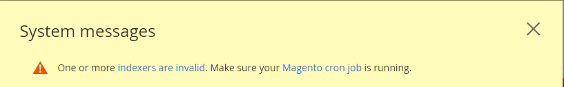
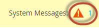

# アップグレードの前提条件を完了

Adobe Commerceを実行するために必要なことを理解することが重要です。 最初に、アップグレードを計画しているバージョンの[必要システム構成](../../installation/system-requirements.md)を確認する必要があります。

システム要件を確認した後、システムをアップグレードする前に次の前提条件を完了する必要があります。

* すべてのソフトウェアを更新
* サポートされている検索エンジンがインストールされていることを確認します
* データベース テーブル形式の変換
* 開いているファイルの制限を設定する
* cron ジョブが実行中であることを確認します
* `DATA_CONVERTER_BATCH_SIZE`を設定
* ファイルシステム権限の確認
* `pub/` ディレクトリのルートを設定
* Composer更新プラグインのインストール

## すべてのソフトウェアを更新

[必要システム構成](../../installation/system-requirements.md)は、Adobe Commerce リリースでテストされたサードパーティ製ソフトウェアのバージョンを正確に示しています。

環境のすべてのシステム要件と依存関係を更新していることを確認してください。 対象のPHP バージョンの[PHP移行の付録](https://www.php.net/manual/en/appendices.php)と[必要なPHP設定](../../installation/prerequisites/php-settings.md#php-settings)を確認してください。

>[!NOTE]
>
>Adobe Commerce on cloud infrastructure Pro プロジェクトの場合、ステージング環境と実稼動環境でサービスをインストールまたは更新するには、[&#x200B; サポート &#x200B;](https://experienceleague.adobe.com/en/docs/support-resources/adobe-support-tools-guide/adobe-commerce-support/adobe-commerce-help-center-user-guide#submit-ticket) チケットを作成する必要があります。 必要なサービス変更を示し、更新した`.magento.app.yaml`および`services.yaml` ファイルとPHP バージョンをチケットに含めます。 クラウドインフラチームがプロジェクトを更新するのに最大48時間かかります。 [&#x200B; サポートされているソフトウェアとサービス &#x200B;](https://experienceleague.adobe.com/en/docs/commerce-on-cloud/user-guide/architecture/cloud-architecture#supported-software-and-services)を参照してください。

## サポートされている検索エンジンがインストールされていることを確認します

Adobe Commerceを使用するには、ElasticsearchまたはOpenSearchをインストールする必要があります。

**2.3.xから2.4**&#x200B;にアップグレードする場合は、MySQL、Elasticsearch、またはサードパーティの拡張機能を2.3.x インスタンスのカタログ検索エンジンとして使用しているかどうかを確認する必要があります。 この結果により、_を2.4にアップグレードする前に_&#x200B;する必要があることが決まります。

**2.3.xまたは2.4.x リリースライン内のパッチリリースをアップグレードする場合**、Elasticsearch 7.xが既にインストールされている場合は、オプションで[OpenSearch](opensearch-migration.md)に移行できます。

コマンドラインまたは管理者を使用して、カタログ検索エンジンを決定できます。

* `bin/magento config:show catalog/search/engine` コマンドを入力します。 このコマンドは、`mysql`、`elasticsearch` （Elasticsearch 2が設定されていることを示す）、`elasticsearch5`、`elasticsearch6`、`elasticsearch7`またはカスタム値の値を返します。これは、サードパーティの検索エンジンがインストールされていることを示します。 2.4.6より前のバージョンの場合は、Elasticsearch 7またはOpenSearch エンジンに`elasticsearch7`値を使用します。 バージョン 2.4.6以降では、OpenSearch エンジンに`opensearch`値を使用します。

* 管理者から、**[!UICONTROL Stores]** > [!UICONTROL Settings] > **[!UICONTROL Configuration]** > **[!UICONTROL Catalog]** > **[!UICONTROL Catalog]** > **[!UICONTROL Catalog Search]** > **[!UICONTROL Search Engine]** フィールドの値を確認します。

次の節では、2.4.0にアップグレードする前に実行する必要があるアクションについて説明します。

### MySQL

2.4以降、MySQLはサポート対象のカタログ検索エンジンではなくなりました。 アップグレードする前に、ElasticsearchまたはOpenSearchをインストールして設定する必要があります。 次のリソースを使用して、このプロセスをガイドします。

* [Elasticsearchのインストールと設定](../../configuration/search/overview-search.md)
* [Elasticsearchのインストール &#x200B;](https://www.elastic.co/docs/deploy-manage/deploy/self-managed/installing-elasticsearch)
* 検索エンジンと連携するように[nginx](../../installation/prerequisites/search-engine/configure-nginx.md)または[Apache](../../installation/prerequisites/search-engine/configure-apache.md)を設定します
* [Elasticsearch](../../configuration/search/configure-search-engine.md)を使用してインデックスを再作成するようにCommerceを構成する

一部のサードパーティカタログ検索エンジンは、Adobe Commerce検索エンジンの上で実行されます。 拡張機能を更新する必要があるかどうかを判断するには、ベンダーにお問い合わせください。

### MySQL 8.4の変更

Adobeは、2.4.8 リリースでMySQL 8.4のサポートを追加しました。
この節では、開発者が認識すべきMySQL 8.4の主な変更点について説明します。

#### 非推奨の非標準キー

非一意または部分的なキーを外部キーとして使用することは非標準であり、MySQL 8.4では推奨されません。MySQL 8.4.0以降では、[`restrict_fk_on_non_standard_key`](https://dev.mysql.com/doc/refman/8.4/en/server-system-variables.html#sysvar_restrict_fk_on_non_standard_key)を`OFF`に設定するか、`--skip-restrict-fk-on-non-standard-key` オプションでサーバーを起動して、そのようなキーを明示的に有効にする必要があります。

#### MySQL 8.0 （または古いバージョン）からMySQL 8.4へのアップグレード

MySQLをバージョン 8.0からバージョン 8.4に適切にアップグレードするには、次の手順に従う必要があります。

1. メンテナンスモードを有効にする：

   ```bash
   bin/magento maintenance:enable
   ```

1. データベースのバックアップを作成します。

   ```bash
   bin/magento setup:backup --db
   ```

1. MySQLをバージョン 8.4にアップグレードします。
1. `restrict_fk_on_non_standard_key` ファイルの`OFF`で`[mysqld]`を`my.cnf`に設定します。

   ```bash
   [mysqld]
   restrict_fk_on_non_standard_key = OFF 
   ```

   >[!WARNING]
   >
   >`restrict_fk_on_non_standard_key`の値を`OFF`に変更しないと、読み込み中に次のエラーが発生します。
   >
   >```sql
   > ERROR 6125 (HY000) at line 2164: Failed to add the foreign key constraint. Missing unique key for constraint 'CAT_PRD_FRONTEND_ACTION_PRD_ID_CAT_PRD_ENTT_ENTT_ID' in the referenced table 'catalog_product_entity'
   >```

1. MySQL サーバーを再起動します。
1. バックアップしたデータをMySQLにインポートします。
1. キャッシュをクリーニングします。

   ```bash
   bin/magento cache:clean
   ```

1. メンテナンスモードを無効にする：

   ```bash
   bin/magento maintenance:disable
   ```

#### MariaDB

{{$include /help/_includes/maria-db-config.md}}

### 検索エンジン

2.4.0にアップグレードする前に、Elasticsearch 7.6以降またはOpenSearch 1.2をインストールして設定する必要があります。Adobeは、Elasticsearch 2.x、5.x、および6.xをサポートしなくなりました。[設定ガイド &#x200B;](../../configuration/search/configure-search-engine.md)の&#x200B;_検索エンジンの設定_&#x200B;では、Elasticsearchをサポート対象のバージョンにアップグレードした後に実行する必要があるタスクについて説明しています。

データのバックアップ、潜在的な移行の問題の検出、実稼動環境にデプロイする前のアップグレードのテストについて詳しくは、[Elasticsearchのアップグレード &#x200B;](https://www.elastic.co/docs/deploy-manage/upgrade/deployment-or-cluster)を参照してください。 現在のバージョンのElasticsearchによっては、クラスター全体の再起動が必要な場合とそうでない場合があります。

Elasticsearchには、Java Development Kit （JDK） 1.8以降が必要です。 [Java Software Development Kit （JDK） &#x200B;](../../installation/prerequisites/search-engine/overview.md#install-the-java-software-development-kit)をインストールして、どのバージョンのJDKがインストールされているかを確認してください。

#### OpenSearch

OpenSearchは、Elasticsearchのライセンス変更に伴うElasticsearch 7.10.2のオープンソースフォークです。 Adobe Commerceの次のリリースでは、OpenSearchのサポートが導入されています。

* 2.4.6 （OpenSearchには別のモジュールと設定があります）
* 2.4.5
* 2.4.4
* 2.4.3-p2
* 2.3.7-p3

ElasticsearchからOpenSearch[に](opensearch-migration.md)移行できるのは、上記のバージョンのAdobe Commerce（またはそれ以上）にアップグレードする場合のみです。

OpenSearchにはJDK 1.8以降が必要です。 [Java Software Development Kit （JDK） &#x200B;](../../installation/prerequisites/search-engine/overview.md#install-the-java-software-development-kit)をインストールして、どのバージョンのJDKがインストールされているかを確認してください。

[検索エンジン設定](../../configuration/search/configure-search-engine.md)は、検索エンジンを変更した後に実行する必要があるタスクについて説明します。

#### Elasticsearchのアップグレード

Elasticsearch 8.xのサポートは、Adobe Commerce 2.4.6で導入されました。次の手順は、Elasticsearchを7.xから8.xにアップグレードする例を示しています。

>[!NOTE]
>
>これらの手順は、Adobe Commerce 2.4.6および2.4.7にのみ適用されます。Adobe Commerce 2.4.8以降では、Elasticsearchはサポートされなくなりました。代わりにOpenSearchを使用してください。

1. Elasticsearch 7.x サーバーを8.xにアップグレードし、インストールが完了していることを確認します。 [Elasticsearchのドキュメント &#x200B;](https://www.elastic.co/docs/deploy-manage/deploy/self-managed/installing-elasticsearch)を参照してください。

1. 次の設定を`id_field_data` ファイルに追加し、Elasticsearch 8.x サービスを再起動して、`elasticsearch.yml` フィールドを有効にします。

   ```yaml
   indices:
     id_field_data:
       enabled: true
   ```

   >[!INFO]
   >
   >Elasticsearch 8.xをサポートするために、Adobe Commerce 2.4.6ではデフォルトで`indices.id_field_data` プロパティが無効になり、`_id` プロパティの`docvalue_fields` フィールドが使用されます。

1. Adobe Commerce プロジェクトのルートディレクトリで、Composerの依存関係を更新して`Magento_Elasticsearch7` モジュールを削除し、`Magento_Elasticsearch8` モジュールをインストールします。

   ```bash
   composer require magento/module-elasticsearch-8 --update-with-all-dependencies
   ```

   `psr/http-message`の依存関係エラーが発生した場合は、クリックして次のトラブルシューティング セクションを展開します。

   +++トラブルシューティング

   Elasticsearch 8のインストール中、特に`psr/http-message`で依存関係の競合が発生した場合は、次の手順に従って解決できます。

   1. まず、他の依存関係を更新せずにElasticsearch 8 モジュールを必要とします。

      ```bash
      composer require magento/module-elasticsearch-8 --no-update
      ```

   1. 次に、Elasticsearch 8 モジュールと`aws/aws-sdk-php` パッケージを更新します。

      ```bash
      composer update magento/module-elasticsearch-8 aws/aws-sdk-php -W
      ```

   このアプローチは、PHP 8.3で2.4.7-p4に対して機能します。この問題は、`aws/aws-sdk-php`が`psr/http-message >= 2.0`を必要としているため、競合が発生する可能性があります。 上記の手順は、これらの依存関係の問題を解決するのに役立ちます。

   +++

1. プロジェクトコンポーネントの更新：

   ```bash
   bin/magento setup:upgrade
   ```

1. [で](../../configuration/search/configure-search-engine.md#configure-your-search-engine-from-the-admin)Elasticsearch[!DNL Admin]を設定します。

1. カタログのインデックスを再作成します。

   ```bash
   bin/magento indexer:reindex catalogsearch_fulltext
   ```

1. 有効なキャッシュタイプからすべての項目を削除します。

   ```bash
   bin/magento cache:clean
   ```

#### Elasticsearchのダウングレード

誤ってサーバー上のElasticsearchのバージョンをアップグレードしたり、他の理由でダウングレードが必要と判断した場合は、Adobe Commerce プロジェクトの依存関係も更新する必要があります。 例えば、Elasticsearch 8.xから7.xにダウングレードするには

1. Elasticsearch 8.x サーバーを7.xにダウングレードし、インストールが完了していることを確認します。 [Elasticsearchのドキュメント &#x200B;](https://www.elastic.co/docs/deploy-manage/deploy/self-managed/installing-elasticsearch)を参照してください。

1. Adobe Commerce プロジェクトのルートディレクトリで、Composerの依存関係を更新して、`Magento_Elasticsearch8` モジュールとそのComposerの依存関係を削除し、`Magento_Elasticsearch7` モジュールをインストールします。

   ```bash
   composer remove magento/module-elasticsearch-8
   ```

1. プロジェクトコンポーネントの更新：

   ```bash
   bin/magento setup:upgrade
   ```

1. [で](../../configuration/search/configure-search-engine.md#configure-your-search-engine-from-the-admin)Elasticsearch[!DNL Admin]を設定します。

1. カタログのインデックスを再作成します。

   ```bash
   bin/magento indexer:reindex catalogsearch_fulltext
   ```

1. 有効なキャッシュタイプからすべての項目を削除します。

   ```bash
   bin/magento cache:clean
   ```

### サードパーティの拡張機能

拡張機能がAdobe Commerce リリースと完全に互換性があるかどうかを判断するには、検索エンジンベンダーに連絡することをお勧めします。

## データベース テーブル形式の変換

すべてのデータベース テーブルの形式を`COMPACT`から`DYNAMIC`に変換する必要があります。 また、ストレージ エンジンの種類を`MyISAM`から`InnoDB`に変換する必要があります。 [&#x200B; ベストプラクティス &#x200B;](../../implementation-playbook/best-practices/maintenance/mariadb-upgrade.md)を参照してください。

## 開いているファイルの制限を設定する

開くファイルの制限（ulimit）を設定すると、長いクエリ文字列の複数回繰り返し呼び出しの失敗や、`bin/magento setup:rollback` コマンドの使用に関する問題を回避できます。 このコマンドは、UNIX シェルごとに異なります。 `ulimit` コマンドの詳細については、個々のフレーバーを参照してください。

Adobeでは、開いているファイル [ulimit](https://www.gnu.org/software/bash/manual/html_node/Bash-Builtins.html#index-ulimit)を`65536`以上の値に設定することをお勧めしていますが、必要に応じて、より大きな値を使用できます。 コマンドラインでulimitを設定するか、ユーザーのシェルの永続的な設定にすることができます。

コマンドラインからulimitを設定するには：

1. [&#x200B; ファイルシステム所有者](../../installation/prerequisites/file-system/overview.md)に切り替えます。
1. ulimitを`65536`に設定します。

   ```bash
   ulimit -n 65536
   ```

Bash シェルで値を設定するには：

1. [&#x200B; ファイルシステム所有者](../../installation/prerequisites/file-system/overview.md)に切り替えます。
1. `/home/<username>/.bashrc`をテキストエディターで開きます。
1. 次の行を追加します。

   ```bash
   ulimit -n 65536
   ```

1. `.bashrc` ファイルに変更を保存し、テキストエディターを終了します。

>[!IMPORTANT]
>
>`pcre.recursion_limit` ファイルの`php.ini` プロパティに値を設定することを避けることをお勧めします。これにより、エラー通知なしで不完全なロールバックが発生する可能性があります。

## cron ジョブが実行中であることを確認します

UNIX タスク スケジューラー`cron`は、Adobe Commerceの日常業務に不可欠です。 インデックス再作成、ニュースレター、電子メール、サイトマップなどのスケジュールを設定できます。 いくつかの機能では、ファイルシステム所有者として実行するcron ジョブが少なくとも1つ必要です。

cron ジョブが正しく設定されていることを確認するには、次のコマンドをファイルシステム所有者として入力してcrontabを確認します。

>[!NOTE]
>
>crontabは、cron ジョブの実行を担当する設定ファイルです。

```bash
crontab -l
```

次のような結果が表示されます。

```cron
#~ MAGENTO START c5f9e5ed71cceaabc4d4fd9b3e827a2b
* * * * * /usr/bin/php /var/www/html/magento2/bin/magento cron:run 2>&1 | grep -v "Ran jobs by schedule" >> /var/www/html/magento2/var/log/magento.cron.log
#~ MAGENTO END c5f9e5ed71cceaabc4d4fd9b3e827a2b
```

cronが実行されないもう1つの症状は、管理者の次のエラーです。



エラーを確認するには、ウィンドウ上部の&#x200B;**システムメッセージ**&#x200B;を次のようにクリックします。



詳しくは、[cron](../../configuration/cli/configure-cron-jobs.md)の設定と実行を参照してください。

## DATA_CONVERTER_BATCH_SIZEを設定

Adobe Commerce 2.4には、シリアル化されたデータをJSONに変換する必要があるセキュリティ機能が強化されています。 この変換はアップグレード中に発生し、データベース内のデータ量によっては長い時間がかかる場合があります。

次の表が最も影響を受けます。

* `catalogrule`
* `core_config_data`
* `magento_reward_history`
* `quote_payment`
* `quote`
* `sales_order_payment`
* `sales_order`
* `salesrule`
* `url_rewrite`

大量のデータがある場合は、環境変数`DATA_CONVERTER_BATCH_SIZE`の値を設定することで、パフォーマンスを向上させることができます。 デフォルトでは、値は`50,000`に設定されています。

環境変数を設定するには：

1. [&#x200B; ファイルシステム所有者](../../installation/prerequisites/file-system/overview.md)に切り替えます。
1. 変数を設定します。

   ```bash
   export DATA_CONVERTER_BATCH_SIZE=100000
   ```

   >[!NOTE]
   >
   > `DATA_CONVERTER_BATCH_SIZE`にはメモリが必要です。最初にテストせずに、大きな値（約1 GB）に設定しないでください。

1. アップグレードが完了したら、変数の設定を解除できます。

   ```bash
   unset DATA_CONVERTER_BATCH_SIZE
   ```

## ファイルシステム権限の確認

セキュリティ上の理由から、Adobe Commerceにはファイルシステムに対する特定の権限が必要です。 権限が&#x200B;_[所有権](../../upgrade/prepare/prerequisites.md#verify-file-system-permissions)_&#x200B;と異なります。 所有権によって、ファイルシステム上でアクションを実行できるユーザーが決まります。権限によって、ユーザーが何をできるかが決まります。

ファイルシステム内のディレクトリは、[&#x200B; ファイルシステム所有者の](../../installation/prerequisites/file-system/overview.md) グループによって書き込み可能である必要があります。

ファイルシステムの権限が適切に設定されていることを確認するには、アプリケーションサーバーにログインするか、ホスティングプロバイダーのファイルマネージャーアプリケーションを使用します。

例えば、アプリケーションが`/var/www/html/magento2`にインストールされている場合は、次のコマンドを入力します。

```bash
ls -l /var/www/html/magento2
```

出力サンプル：

```console
total 1028
drwxrwx---. 12 magento_user apache   4096 Jun  7 07:55 .
drwxr-xr-x.  3 root         root     4096 May 11 14:29 ..
drwxrwx---.  4 magento_user apache   4096 Jun  7 07:53 app
drwxrwx---.  2 magento_user apache   4096 Jun  7 07:53 bin
-rw-rw----.  1 magento_user apache 439792 Apr 27 21:23 CHANGELOG.md
-rw-rw----.  1 magento_user apache   3422 Apr 27 21:23 composer.json
-rw-rw----.  1 magento_user apache 425214 Apr 27 21:27 composer.lock
-rw-rw----.  1 magento_user apache   3425 Apr 27 21:23 CONTRIBUTING.md
-rw-rw----.  1 magento_user apache  10011 Apr 27 21:23 CONTRIBUTOR_LICENSE_AGREEMENT.html
-rw-rw----.  1 magento_user apache    631 Apr 27 21:23 COPYING.txt
drwxrwx---.  4 magento_user apache   4096 Jun  7 07:53 dev
-rw-rw----.  1 magento_user apache   2926 Apr 27 21:23 Gruntfile.js
-rw-rw----.  1 magento_user apache   7592 Apr 27 21:23 .htaccess
-rw-rw----.  1 magento_user apache   6419 Apr 27 21:23 .htaccess.sample
drwxrwx---.  4 magento_user apache   4096 Jun  7 07:53 lib
-rw-rw----.  1 magento_user apache  10376 Apr 27 21:23 LICENSE_AFL.txt
-rw-rw----.  1 magento_user apache  30634 Apr 27 21:23 LICENSE_EE.txt
-rw-rw----.  1 magento_user apache  10364 Apr 27 21:23 LICENSE.txt
-rw-rw----.  1 magento_user apache   4108 Apr 27 21:23 nginx.conf.sample
-rw-rw----.  1 magento_user apache   1427 Apr 27 21:23 package.json
-rw-rw----.  1 magento_user apache   1659 Apr 27 21:23 .php_cs
-rw-rw----.  1 magento_user apache    804 Apr 27 21:23 php.ini.sample
drwxrwx---.  2 magento_user apache   4096 Jun  7 07:53 phpserver
drwxrwx---.  6 magento_user apache   4096 Jun  7 07:53 pub
-rw-rw----.  1 magento_user apache   2207 Apr 27 21:23 README_EE.md
drwxrwx---.  7 magento_user apache   4096 Jun  7 07:53 setup
-rw-rw----.  1 magento_user apache   3731 Apr 27 21:23 .travis.yml
drwxrwx---.  7 magento_user apache   4096 Jun  7 07:53 update
drwxrws---. 11 magento_user apache   4096 Jun 13 16:05 var
drwxrws---. 29 magento_user apache   4096 Jun  7 07:53 vendor
```

サンプル出力の説明については、次を参照してください。

* ほとんどのファイルは`-rw-rw----`です。つまり`660`
* `drwxrwx---` = `770`
* `-rw-rw-rw-` = `666`
* ファイルシステム所有者は`magento_user`です

詳細な情報を取得するには、次のコマンドを入力します。

```bash
ls -la /var/www/html/magento2/pub
```

Adobe Commerceでは静的ファイルアセットが`pub`のサブディレクトリにデプロイされるので、権限と所有権も確認することをお勧めします。

詳しくは、[&#x200B; ファイルシステムの権限と所有権](../../installation/prerequisites/file-system/overview.md)を参照してください。

## `pub/` ディレクトリのルートを設定

詳しくは、[docrootを変更してセキュリティを向上させる](../../installation/tutorials/docroot.md)を参照してください。

## Composer更新プラグインのインストール

[`magento/composer-root-update-plugin`](https://github.com/magento/composer-root-update-plugin) Composer プラグインは、新しい製品要件に更新する前にルートプロジェクト `composer.json` ファイルに加える必要がある変更を解決します。

このプラグインは、依存関係の競合を手動で特定して修正するのではなく、特定して解決できるようにすることで、手動アップグレードを部分的に自動化します。

プラグインをインストールするには：

1. パッケージを`composer.json` ファイルに追加します。

   ```bash
   composer require magento/composer-root-update-plugin ~2.0 --no-update
   ```

1. 依存関係を更新します。

   ```bash
   composer update
   ```

<!-- Last updated from includes: 2025-11-25 11:39:51 -->
