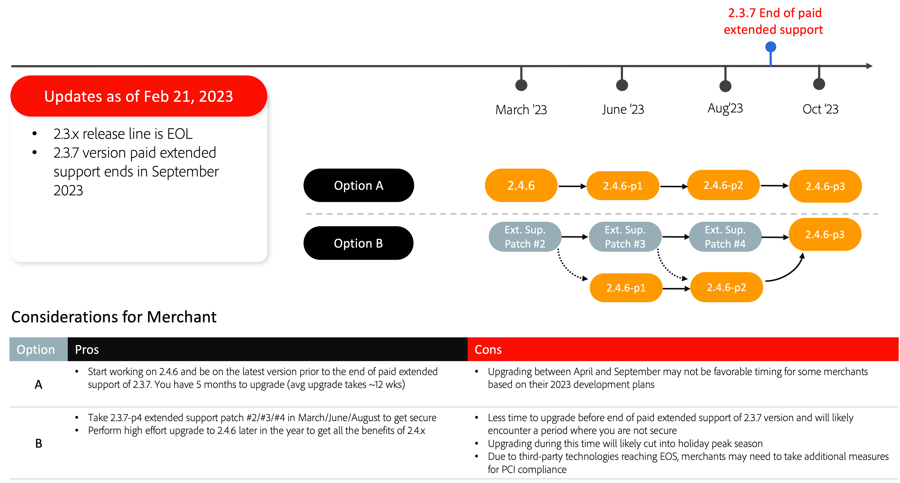

# 推奨されるアップグレードパス

e コマースの実装は進化であり、本当の意味で終わることはありません。 顧客の関心を引き続き高める最新の機能を導入することで、ビジネスはトレンドの一歩先を行く必要があります。 最新バージョンのAdobe Commerceにアップグレードすると、以下を使用してクラス最高のイノベーションを事前に準備し、ビジネスを将来的に保証できます。

- SaaS サービスとして提供される革新的な機能への迅速なアクセス
- 容易でコスト・パフォーマンスに優れたメンテナンスとアップグレード
- 独自のビジネスニーズを満たす継続的な柔軟性とカスタマイズ
- パフォーマンスと拡張性が大幅に向上
- 開発者エクスペリエンスとツールの向上
- 他のAdobe Experience Cloud アプリケーションとより深く統合する機能

販売者がアップグレードを柔軟に計画できるように、最近Adobe Commerce[ リリーススケジュール ](../../release/schedule.md) を更新し、2.3 のサポート終了（EOS）の日付を延長し、一部のバージョンに対して新しい拡張サポートオプションを発表しました。 これらの更新について詳しくは、[Adobe Commerceのサポートの拡張 ](https://business.adobe.com/blog/the-latest/adobe-announces-expanded-support) を参照してください。

以下は、最新バージョンのいずれかにアップグレードする際に、サイトのセキュリティとパフォーマンスを維持するためにAdobe Commerceが推奨するアップグレードパスです。

## 2.3.7 からのアップグレード

## 2.4.0～2.4.3 からのアップグレード

## 2.4.4 および 2.4.5 からのアップグレード

