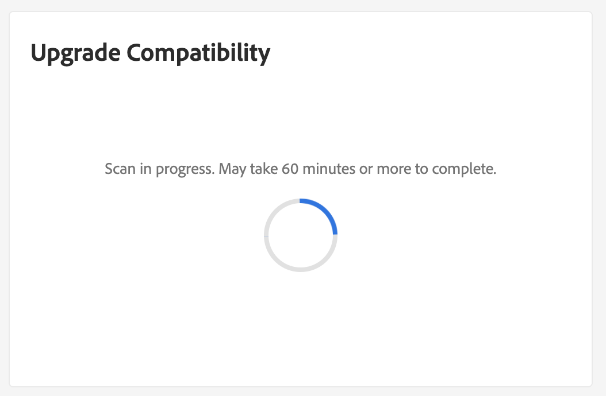

# の統合 [!DNL Site-Wide Analysis Tool]

この [!DNL Site-Wide Analysis Tool] では、Adobe Commerceのインストールに対するセキュリティと操作性を確保するため24/7、リアルタイムでのパフォーマンス監視、レポートおよび推奨事項を提供します。

この [!DNL Upgrade Compatibility Tool] が [!DNL Site-Wide Analysis Tool] 非技術者が [!DNL Upgrade Compatibility Tool] そして、 [HTMLレポート](https://experienceleague.adobe.com/docs/commerce-operations/upgrade-guide/upgrade-compatibility-tool/run.html?lang=en#output) 各ファイルの重大度、エラーコード、エラーの説明を指定する問題のリストが含まれています。

詳しくは、 [[!DNL Site-Wide Analysis Tool] ユーザーガイド](https://docs.magento.com/user-guide/reports/site-wide-analysis-tool.html) を参照してください。

## を実行します。 [!DNL Upgrade Compatibility Tool] SWAT から

次に移動： [!DNL Site-Wide Analysis Tool] プロジェクトのダッシュボードを使用して、 [!DNL Upgrade Compatibility Tool] ウィジェット。

クリック **[!UICONTROL Run Upgrade Scan]**. スキャンは、プロジェクトのサイズによっては時間がかかる場合があります。 スピナーは、スキャンが進行中であることを示します。

スキャンが完了すると、高レベルの結果がウィジェットに表示されます。

クリック **[!UICONTROL Download Report]** を取得する [!DNL Upgrade Compatibility Tool] HTMLレポートを作成し、詳細を確認します。
