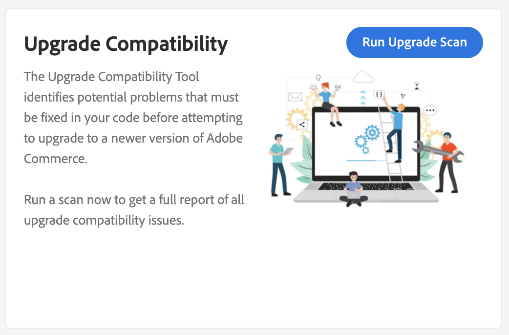
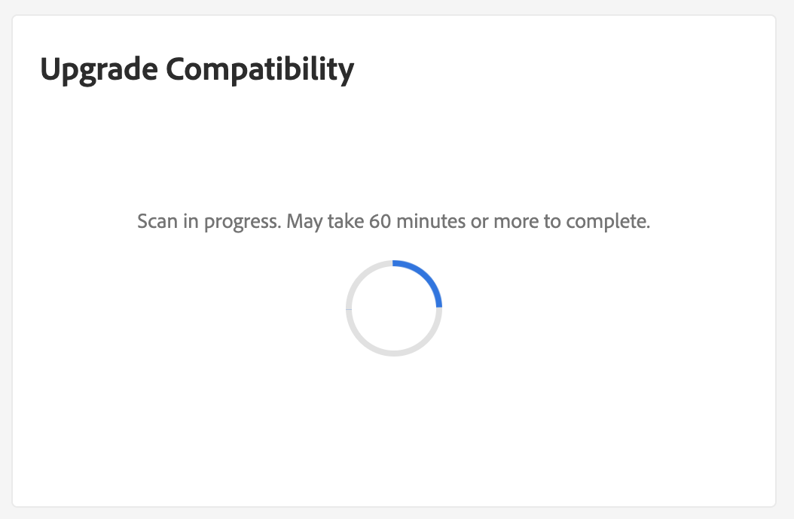
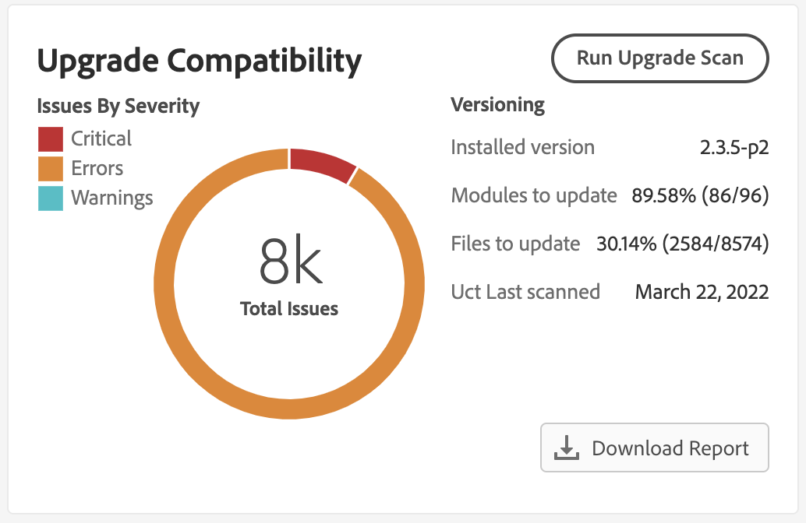

# [!DNL Site-Wide Analysis Tool]を統合

[!DNL Site-Wide Analysis Tool]では、Adobe Commerce インスタンスのセキュリティと操作性を確保するために、24時間年中無休のリアルタイム パフォーマンスのモニタリング、レポート、推奨事項が提供されます。

技術者以外のユーザーが[!DNL Upgrade Compatibility Tool]を実行し、各ファイルの問題のリストを含む[&#x200B; レポート &#x200B;](../upgrade-compatibility-tool/reports.md)を取得する機能を提供するために、[!DNL Upgrade Compatibility Tool]が[!DNL Site-Wide Analysis Tool]と統合されました。

詳しくは、[[!DNL Site-Wide Analysis Tool]  ユーザーガイド &#x200B;](https://experienceleague.adobe.com/en/docs/commerce-operations/tools/site-wide-analysis-tool/access)を参照してください。

## [!DNL Site-Wide Analysis Tool]から[!DNL Upgrade Compatibility Tool]を実行

プロジェクトの[!DNL Site-Wide Analysis Tool] ダッシュボードに移動し、[!DNL Upgrade Compatibility Tool] ウィジェットを見つけます。

**[!UICONTROL Run Upgrade Scan]**&#x200B;をクリックします。 プロジェクトのサイズによっては、スキャンに時間がかかる場合があります。 スピナーは、スキャンが進行中であることを示します。

スキャンが完了すると、上位レベルの結果がウィジェットに表示されます。

**[!UICONTROL Download Report]**&#x200B;をクリックして[!DNL Upgrade Compatibility Tool] [HTML レポート &#x200B;](../upgrade-compatibility-tool/reports.md#html-report)を取得し、詳細を確認します。

>[!NOTE]
>
> [!DNL Upgrade Compatibility Tool]を[!DNL Site-Wide Analysis Tool]で実行すると、結果が最適化され、ターゲットのアップグレードにとって新しく重要な問題に集中できるようになります。 [`--ignore-current-version-compatibility-errors`](run.md#optimize-your-results) オプションを使用し、プロジェクトのバージョンと最新リリースのバージョンを比較する結果を常に表示します。
