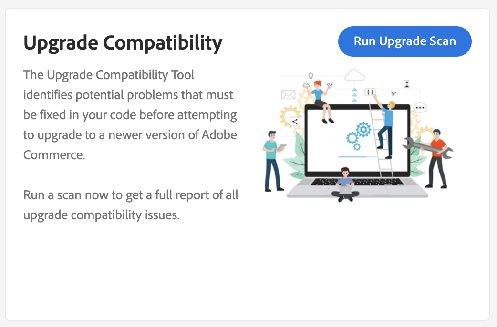

# の統合 [!DNL Site-Wide Analysis Tool]

The [!DNL Site-Wide Analysis Tool] では、Adobe Commerceインスタンスのセキュリティと操作性を確保するため24/7、リアルタイムでのパフォーマンス監視、レポートおよび推奨事項を提供しています。

The [!DNL Upgrade Compatibility Tool] は、 [!DNL Site-Wide Analysis Tool] 非技術者が [!DNL Upgrade Compatibility Tool] そして、 [レポート](../upgrade-compatibility-tool/reports.md) 各ファイルの問題のリストを含んでいます。

詳しくは、 [[!DNL Site-Wide Analysis Tool] ユーザーガイド](https://docs.magento.com/user-guide/reports/site-wide-analysis-tool.html) を参照してください。

## を実行します。 [!DNL Upgrade Compatibility Tool] から [!DNL Site-Wide Analysis Tool]

次に移動： [!DNL Site-Wide Analysis Tool] プロジェクトのダッシュボードを使用して、 [!DNL Upgrade Compatibility Tool] ウィジェット。

クリック **[!UICONTROL Run Upgrade Scan]**. スキャンは、プロジェクトのサイズによっては時間がかかる場合があります。 スピナーは、スキャンが進行中であることを示します。

スキャンが完了すると、高レベルの結果がウィジェットに表示されます。

クリック **[!UICONTROL Download Report]** を取得するには [!DNL Upgrade Compatibility Tool] [HTMLレポート](../upgrade-compatibility-tool/reports.md#html-report) 詳細を確認します。

>[!NOTE]
>
> の実行 [!DNL Upgrade Compatibility Tool] から [!DNL Site-Wide Analysis Tool] により結果が最適化され、target のアップグレードにとって新しく重要な問題に焦点を当てるのに役立ちます。 使用するのは [`--ignore-current-version-compatibility-errors`](run.md#optimize-your-results) 「 」オプションを選択すると、常に、プロジェクトのバージョンと最新のリリースバージョンを比較した結果が表示されます。
