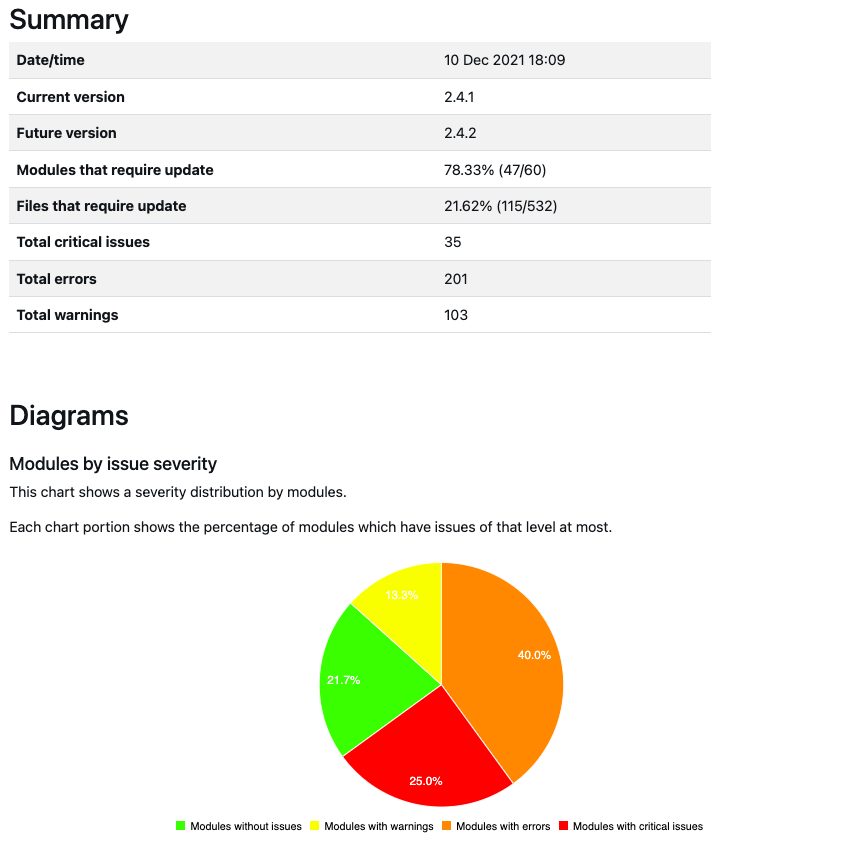
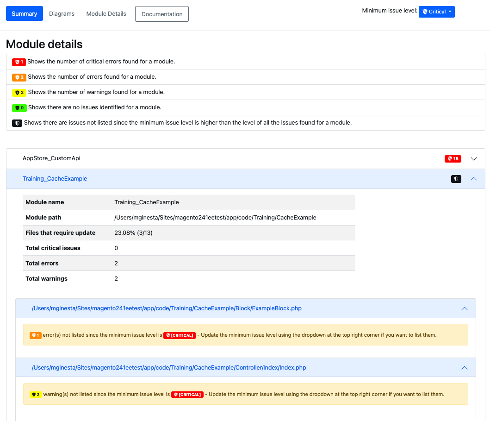

# レポート

{{commerce-only}}

分析の結果、[!DNL Upgrade Compatibility Tool]は、重大度、エラーコード、エラーの説明を指定する各ファイルの問題のリストを含むレポートを書き出すことができます。 [!DNL Upgrade Compatibility Tool]は、レポートを2つの異なる形式で書き出します。

- [JSON ファイル ](reports.md#json-file)。
- [HTML レポート ](reports.md#html-report)。

次のコマンドラインインターフェイスのレポートの例を参照してください。

```text
File: /app/code/Custom/CatalogExtension/Controller/Index/Index.php
------------------------------------------------------------------
 * [WARNING][1131] Line 10: Extending from class 'Magento\Framework\App\Action\Action' that is @deprecated on version '2.4.4'
 * [ERROR][1328] Line 10: Implemented interface 'Magento\Framework\App\Action\HttpGetActionInterface' that is non API on version '2.4.4'
```

このレポートで生成できるさまざまなエラーについて詳しくは、[ エラーメッセージ参照](../upgrade-compatibility-tool/error-messages.md)のトピックを参照してください。

本レポートには、次の項目を示す詳細な要約も含まれています。

- *現在のバージョン*：現在インストールされているバージョン。
- *Target バージョン*：アップグレードするバージョン。
- *実行時間*：分析がレポートを作成するのにかかる時間（mm:ss）。
- *更新が必要なモジュール*：互換性の問題を含み、更新が必要なモジュールの割合。
- *更新が必要なファイル*：互換性の問題を含み、更新が必要なファイルの割合。
- *クリティカル エラーの合計数*：見つかったクリティカル エラーの数。
- *合計エラー*：見つかったエラーの数。
- *合計警告*：見つかった警告の数。
- *メモリのピーク使用量*：実行中に[!DNL Upgrade Compatibility Tool]が達したメモリの最大量。

次のコマンドラインインターフェイスの例を参照してください。

```text
 ----------------------------- ----------------- 
  Current version               2.4.1            
  Target version                2.4.4            
  Execution time                1m:8s            
  Modules that require update   71.67% (43/60)   
  Files that require update     18.05% (96/532)  
  Total critical issues         24               
  Total errors                  159              
  Total warnings                53               
  Memory peak usage             902.00 MB        
 ----------------------------- ----------------- 
```

## JSON ファイル

コマンドラインインターフェイスで[!DNL Upgrade Compatibility Tool]を実行中にJSON ファイル出力を取得できます。 `JSON` ファイルには、[!DNL Upgrade Compatibility Tool]出力に表示されている情報とまったく同じ情報が含まれています。

- 特定された問題のリスト。
- 分析の概要。

発生した問題ごとに、問題の重大度や説明などの詳細な情報がレポートに表示されます。

この`JSON` ファイルを別の出力フォルダーに書き出すには：

```shell
bin/uct upgrade:check <dir> --json-output-path[=JSON-OUTPUT-PATH]
```

引数は次のとおりです。

- `<dir>`: Adobe Commerce インストールディレクトリ。
- `[=JSON-OUTPUT-PATH]`: `JSON`出力ファイルを書き出すパス ディレクトリ。

>[!NOTE]
>
> 出力フォルダーのデフォルトパスは`var/output/[TIME]-results.json`です。

## HTML レポート

HTML レポートは、コマンドライン インターフェイスまたは[!DNL Site-Wide Analysis Tool]を通じてツールを実行中に取得できます。 HTMLレポートには、次の項目も含まれます。

- 特定された問題のリスト。
- 分析の概要。



[!DNL Upgrade Compatibility Tool]分析中に特定された問題を簡単に移動できます。

最小問題レベルに従って、レポートに表示される問題をフィルタリングできます（デフォルト値は`WARNING`）。

右上隅には、別のレベルを選択できるドロップダウンがあります。 特定された問題のリストは、それに応じてフィルタリングされます。



>[!NOTE]
>
> 問題レベルが低い問題は取り除かれますが、モジュールごとに特定された問題を常に認識できるように、通知が届きます。

HTMLレポートには、4つの異なるチャートも含まれています。

- **問題の重大度ごとのモジュール**: モジュールごとの重大度の分布を表示します。
- **問題の重大度によるファイル**: ファイルごとの重大度の分布を表示します。
- **問題の合計数で順序付けされたモジュール**：警告、エラー、重大なエラーを考慮して、最も侵害された10個のモジュールを表示します。
- **相対サイズと問題を持つモジュール**: モジュールに含まれるファイルが多ければ多いほど、その円は大きくなります。 モジュールに含まれる問題が多いほど、その円が赤く表示されます。

これらのグラフを使用すると、最も危険なモジュールと、アップグレードの実行に追加の作業を必要とするモジュールを特定できます。


HTML レポート図も、それに応じて更新されます。ただし、最初に設定された`min-issue-level`で生成された`Modules with relative sizes and issues`は除きます。

`Modules with relative sizes and issues`図に異なる結果を表示するには、`--min-issue-level` オプションに別の値を指定してコマンドを再実行する必要があります。


このHTML レポートを別の出力フォルダーに書き出すには：

```shell
bin/uct upgrade:check <dir> --html-output-path[=HTML-OUTPUT-PATH]
```

引数は次のとおりです。

- `<dir>`: Adobe Commerce インストールディレクトリ。
- `[=HTML-OUTPUT-PATH]`: `.html`出力ファイルを書き出すパス ディレクトリ。

>[!NOTE]
>
> 出力フォルダーのデフォルトパスは`var/output/[TIME]-results.html`です。
